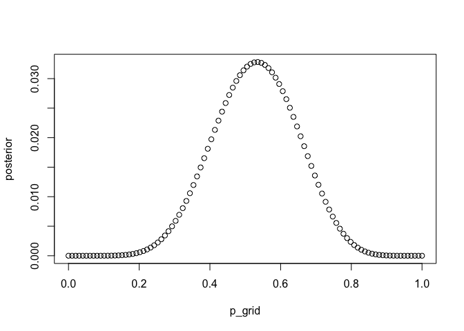
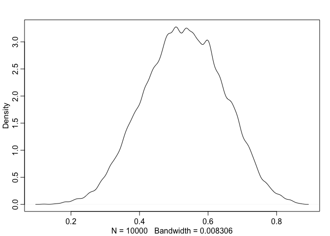

# Statistical Rethinking Chapter 3 problems

__Name:Stacey Harmer__


```r
p_grid <- seq( from=0 , to=1 , length.out=1000 ) 
prior <- rep( 1 , 1000 )
likelihood <- dbinom( 6 , size=9 , prob=p_grid )
posterior <- likelihood * prior
posterior <- posterior / sum(posterior)
set.seed(100)
samples <- sample( p_grid , prob=posterior , size=1e4 , replace=TRUE )
library(rethinking)
```

```
## Loading required package: rstan
```

```
## Warning: package 'rstan' was built under R version 3.2.3
```

```
## Loading required package: ggplot2
```

```
## Warning: package 'ggplot2' was built under R version 3.2.3
```

```
## rstan (Version 2.9.0, packaged: 2016-01-05 16:17:47 UTC, GitRev: 05c3d0058b6a)
## For execution on a local, multicore CPU with excess RAM we recommend calling
## rstan_options(auto_write = TRUE)
## options(mc.cores = parallel::detectCores())
## Loading required package: parallel
## rethinking (Version 1.58)
```

```r
dens(samples)
```

 

## 3E1
#### How much posterior probability lies below p = 0:2?


```r
sum( samples < 0.2 ) / 1e4
```

```
## [1] 5e-04
```
not much! only 5 e-04

## 3E2
#### How much posterior probability lies above p = 0:8?


```r
sum( samples > 0.8) / 1e4
```

```
## [1] 0.1117
```
0.1117

## 3E3
#### How much posterior probability lies between p = 0:2 and p = 0:8?

```r
sum( samples > 0.2 & samples < 0.8 ) / 1e4
```

```
## [1] 0.8878
```
0.8878

## 3E4
#### 20% of the posterior probability lies below which value of p?

```r
quantile(samples, 0.2)
```

```
##       20% 
## 0.5195195
```
0.5195195 

## 3E5
#### 20% of the posterior probability lies above which value of p?

```r
quantile(samples, 0.8)
```

```
##       80% 
## 0.7567568
```
0.7567568

## 3E6
#### Which values of p contain the narrowest interval equal to 66% of the posterior probability?

```r
HPDI(samples, 0.66)
```

```
##     |0.66     0.66| 
## 0.5205205 0.7847848
```
    |0.66     0.66| 
0.5205205 0.7847848 

how similar is this to the PI?

```r
PI(samples, 0.66)
```

```
##       17%       83% 
## 0.5005005 0.7687688
```
      17%       83% 
0.5005005 0.7687688 
 
 pretty close.

## 3E7
#### Which values of p contain 66% of the posterior probability, assuming equal posterior probability both below and above the interval?
As above.

```r
PI(samples, 0.66)
```

```
##       17%       83% 
## 0.5005005 0.7687688
```
      17%       83% 
0.5005005 0.7687688 

## 3M1
#### Suppose the globe tossing data had turned out to be 8 water in 15 tosses. Construct the posterior distribution, using grid approximation. Use the same flat prior as before.


```r
# define grid
p_grid <- seq( from=0 , to=1 , length.out=100 )
# define prior
prior <- rep( 1 , 100 )
# compute likelihood at each value in grid
likelihood <- dbinom( 8 , size=15 , prob=p_grid )
# compute product of likelihood and prior
unstd.posterior <- likelihood * prior
# standardize the posterior, so it sums to 1
posterior <- unstd.posterior / sum(unstd.posterior)

plot(p_grid, posterior, type = "b")
```

 


## 3M2
#### Draw 10,000 samples from the grid approximation from above. Then use the samples to calculate the 90% HPDI for p.


```r
samples <- sample( p_grid , prob=posterior , size=1e4 , replace=TRUE )
dens(samples)
```

 

```r
HPDI(samples, prob = 0.9)
```

```
##      |0.9      0.9| 
## 0.3535354 0.7272727
```
    |0.9      0.9| 
0.3535354 0.7272727 

_STOP AFTER 3M2 FOR 02/25 ASSIGNMENT_

## 3M3

## 3M4

## 3M5

## 3H1

## 3H2

## 3H3

## 3H4

## 3H5
