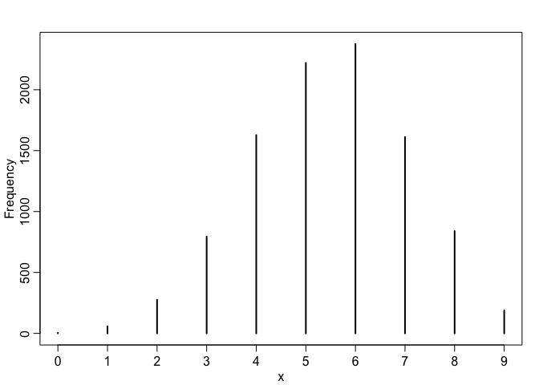

# Ch3_homework_2016-09-20
Stacey Harmer  
September 20, 2016  


First, run code for the easy problems


```r
library(rethinking)
```

```
## Loading required package: rstan
```

```
## Loading required package: ggplot2
```

```
## Loading required package: StanHeaders
```

```
## rstan (Version 2.12.1, packaged: 2016-09-11 13:07:50 UTC, GitRev: 85f7a56811da)
```

```
## For execution on a local, multicore CPU with excess RAM we recommend calling
## rstan_options(auto_write = TRUE)
## options(mc.cores = parallel::detectCores())
```

```
## Loading required package: parallel
```

```
## rethinking (Version 1.59)
```

```r
p_grid <- seq( from=0 , to=1 , length.out=1000 ) 
prior <- rep( 1 , 1000 )
likelihood <- dbinom( 6 , size=9 , prob=p_grid )
posterior <- likelihood * prior
posterior <- posterior / sum(posterior)
set.seed(100)
samples <- sample( p_grid , prob=posterior , size=1e4 , replace=TRUE )

dens(samples) # looks good
```

<!-- -->

## 3E1
How much probability lies below p = 0.2?


```r
sum(samples < 0.2) / 1e4 # 5 e-4 probability mass below p of .2
```

```
## [1] 5e-04
```

## 3E2
How much probability lies above p = 0.8?


```r
sum(samples > 0.8) / 1e4 # 0.1117
```

```
## [1] 0.1117
```

## 3E3
How much posterior probability lies between p = 0.2 and p = 0.8??


```r
sum(samples>0.2 & samples <=0.8) / 1e4 # .8878
```

```
## [1] 0.8878
```

## 3E4
20% of the posterior probability lies below which value of p??


```r
quantile(samples, 0.2) # 0.5195195
```

```
##       20% 
## 0.5195195
```

## 3E5
20% of the posterior probability lies above which value of p?


```r
quantile(samples, 0.8) # above 0.76
```

```
##       80% 
## 0.7567568
```

## 3E6
Which values of p contain the narrowest interval equal to 66% of the posterior probability?


```r
HPDI(samples, p= .66) # 0.5205205   to   0.7847848 
```

```
##     |0.66     0.66| 
## 0.5205205 0.7847848
```

## 3E7
Which values of p contain 66% of the posterior probability, assuming equal posterior probability
both below and above the interval?


```r
PI(samples, p= .66) # 0.5005005    to   0.7687688 
```

```
##       17%       83% 
## 0.5005005 0.7687688
```

## 3M1
Globe tossing, now 8 water in 15 tosses.  Use grid approx to construct posterior distribution (flat prior).


```r
p_grid <- seq( from=0 , to=1 , length.out=1000 ) 
prior <- rep( 1 , 1000 )
likelihood <- dbinom( 8, size=15 , prob=p_grid )
posterior.2 <- likelihood * prior
posterior.2 <- posterior.2 / sum(posterior.2)
set.seed(100)
samples.2 <- sample( p_grid , prob=posterior.2 , size=1e4 , replace=TRUE )

dens(samples.2) # looks good
```

<!-- -->

## 3M2
Draw 10,000 samples from the grid approximation from above. Then use the samples to calculate
the 90% HPDI for p


```r
samples.2 <- sample( p_grid , prob=posterior.2 , size=1e4 , replace=TRUE )
HPDI(samples.2, prob = 0.9)  # 0.3383383 to  0.7317317   
```

```
##      |0.9      0.9| 
## 0.3383383 0.7317317
```

## 3M3
Construct a posterior predictive check for this model and data. This means simulate the distribution
of samples, averaging over the posterior uncertainty in p. What is the probability of observing
8 water in 15 tosses?

To check model, use samples from posterior as range of values for p


```r
test.mod <- rbinom( 1e4 , size=15 , prob=samples.2 )
# now how often is the value 8 observed?
simplehist(test.mod) # it is the most probable outcome
```

<!-- -->

```r
sum(test.mod ==8)/1e4 # but still 0.1428, or 14.3% of time
```

```
## [1] 0.1428
```

## 3M4
Using the posterior distribution constructed from the new (8/15) data, now calculate the probability
of observing 6 water in 9 tosses.


```r
test.6.9 <- rbinom( 1e4 , size=9 , prob=samples.2 )
# now how often is the value 6 observed?
simplehist(test.6.9) # 5 is the most probable outcome
```

<!-- -->

```r
sum(test.6.9 ==6)/1e4  # 17% of the time would see 6
```

```
## [1] 0.1695
```

```r
# keep in mind with fewer tosses, there are fewer possible outcomes than with 15 tosses
```

## 3M5
Start over at 3M1, but now use a prior that is zero below p = 0:5 and a constant above p = 0:5.
This corresponds to prior information that a majority of the Earth’s surface is water. Repeat each
problem above and compare the inferences. What difference does the better prior make? If it helps,
compare inferences (using both priors) to the true value p = 0:7.

```r
p_grid <- seq( from=0 , to=1 , length.out=1000 ) 
prior.m5 <- c(rep( 0, 500 ), rep(1,500))

# first, for 8 waters in 15 tosses
likelihood <- dbinom( 8, size=15 , prob=p_grid )
posterior.m5 <- likelihood * prior.m5
posterior.m5 <- posterior.m5 / sum(posterior.m5)
set.seed(100)
samples.m5 <- sample( p_grid , prob=posterior.m5 , size=1e4 , replace=TRUE )

dens(samples.m5) # looks good
```

<!-- -->

```r
#Draw 10,000 samples from the grid approximation from above. Then use the samples to calculate
#the 90% HPDI for p

HPDI(samples.m5, prob = 0.9)  # 0.5 to  0.71  
```

```
##      |0.9      0.9| 
## 0.5005005 0.7077077
```

```r
# This seems a bit better than with the flat prior (range was 0.5205205   to   0.7847848 )


#Construct a posterior predictive check for this model and data. This means simulate the distribution
#of samples, averaging over the posterior uncertainty in p. What is the probability of observing
#8 water in 15 tosses?

#To check model, use samples from posterior as range of values for p

test.mod.m5 <- rbinom( 1e4 , size=15 , prob=samples.m5 )
# now how often is the value 8 observed?
simplehist(test.mod.m5) # 9 is the most probable outcome
```

<!-- -->

```r
sum(test.mod.m5 ==8)/1e4 # 8 is seen 16% of time
```

```
## [1] 0.1617
```

```r
#Using the posterior distribution constructed from the new (8/15) data, now calculate the probability
#of observing 6 water in 9 tosses.

test.6.9.m5 <- rbinom( 1e4 , size=9 , prob=samples.m5 )
# now how often is the value 6 observed?
simplehist(test.6.9.m5) # 5 is the most probable outcome
```

<!-- -->

```r
sum(test.6.9.m5 ==6)/1e4  # 24% of the time would see 6
```

```
## [1] 0.2376
```

```r
# keep in mind with fewer tosses, there are fewer possible outcomes than with 15 tosses
```

## Hard problems; boys are 1, girls are 0

```r
birth1 <- c(1,0,0,0,1,1,0,1,0,1,0,0,1,1,0,1,1,0,0,0,1,0,0,0,1,0,
0,0,0,1,1,1,0,1,0,1,1,1,0,1,0,1,1,0,1,0,0,1,1,0,1,0,0,0,0,0,0,0,
1,1,0,1,0,0,1,0,0,0,1,0,0,1,1,1,1,0,1,0,1,1,1,1,1,0,0,1,0,1,1,0,
1,0,1,1,1,0,1,1,1,1)
birth2 <- c(0,1,0,1,0,1,1,1,0,0,1,1,1,1,1,0,0,1,1,1,0,0,1,1,1,0,
1,1,1,0,1,1,1,0,1,0,0,1,1,1,1,0,0,1,0,1,1,1,1,1,1,1,1,1,1,1,1,1,
1,1,1,0,1,1,0,1,1,0,1,1,1,0,0,0,0,0,0,1,0,0,0,1,1,0,0,1,0,0,1,1,
0,0,0,1,1,1,0,0,0,0)
library(rethinking)
data(homeworkch3)

# total number of boys
sum(birth1) + sum(birth2)
```

```
## [1] 111
```

## 3H1

Using grid approximation, compute the posterior distribution for the probability of a birth being a boy. Assume a uniform prior probability. Which parameter value maximizes the posterior probability?

I think that this is over the entire dataset, or 200 trials.

```r
p_grid.h1 <- seq( from=0 , to=1 , length.out=1000 ) 
prior.h1 <- rep( 1, 1000)

# first, for 111 boys in 200 births
likelihood.h1 <- dbinom( 111, size=200 , prob=p_grid.h1 )
posterior.h1 <- likelihood.h1 * prior.h1
posterior.h1 <- posterior.h1 / sum(posterior.h1)

# and max value would be
p_grid[ which.max(posterior.h1) ]  # 0.5545546
```

```
## [1] 0.5545546
```

## 3H2
Using the sample function, draw 10,000 random parameter values from the posterior distribution you calculated above. 
Use these samples to estimate the 50%, 89%, and 97% highest posterior
density intervals.


```r
#Draw 10,000 samples from the grid approximation from above. Then use the samples to calculate the 50%, 89%, and 97% for p
set.seed(100)

samples.h1 <- sample( p_grid.h1 , prob=posterior.h1 , size=1e4 , replace=TRUE )

dens(samples.h1) # looks good
```

<!-- -->

```r
HPDI(samples.h1, prob = 0.5)  # 0.53 to  0.57
```

```
##      |0.5      0.5| 
## 0.5315315 0.5765766
```

```r
HPDI(samples.h1, prob = 0.89)  # 0.50 to  0.61
```

```
##     |0.89     0.89| 
## 0.4974975 0.6076076
```

```r
HPDI(samples.h1, prob = 0.97)  # 0.48 to  0.63
```

```
##     |0.97     0.97| 
## 0.4774775 0.6276276
```

## 3H3
Use rbinom to simulate 10,000 replicates of 200 births. You should end up with
10,000 numbers,each one a count of boys out of 200 births. Compare the
distribution of predicted numbers of boys to the actual count in the data (111
boys out of 200 births). There are many good ways to visualize the simulations,
but the dens command (part of the rethinking package) is probably the
easiest way in this case. Does it look like the model fits the data well? That is,
does the distribution of predictions include the actual observation as a central, 
likely outcome?


```r
sim.3h3 <- rbinom( 1e4 , size=200 , prob=samples.h1 )
dens(sim.3h3)
abline(v=111, col = "red")
```

<!-- -->
that looks pretty good.

## 3H4
Now compare 10,000 counts of boys from 100 simulated first borns only to the number of boys
in the first births, birth1. How does the model look in this light?

```r
# I think I'm using the current model still. 
sum(birth1) #51
```

```
## [1] 51
```

```r
sim.3h4 <- rbinom( 1e4 , size=100 , prob=samples.h1 )
dens(sim.3h4)
abline(v=51, col = "red")
```

<!-- -->

```r
# now this is a poor fit!
```

## 3H5
model assumes that sex of first and second births are independent. To check this assumption,
focus now on second births that followed female first borns. Compare 10,000 simulated counts
of boys to only those second births that followed girls. To do this correctly, you need to count the
number of first borns who were girls and simulate that many births, 10,000 times. Compare the
counts of boys in your simulations to the actual observed count of boys following girls. How does the
model look in this light? Any guesses what is going on in these data?

```r
# 49 first borns were girls
sum(birth2) # 40 2nd borns were girls
```

```
## [1] 60
```

```r
all.births <- cbind(birth1, birth2)
all.births <- as.data.frame(all.births)

library(ggplot2)
p <- ggplot(all.births, aes(birth1, birth2))
p + geom_jitter(width = .1)
```

<!-- -->

```r
#looks like if first birth girl, 2nd tends to be boy
# and if first birth boy, 2nd more likely to be boy

# actual counts of boys after girls
girl.1st <- subset(all.births, birth1 == 0)
girl.1st
```

```
##    birth1 birth2
## 2       0      1
## 3       0      0
## 4       0      1
## 7       0      1
## 9       0      0
## 11      0      1
## 12      0      1
## 15      0      1
## 18      0      1
## 19      0      1
## 20      0      1
## 22      0      0
## 23      0      1
## 24      0      1
## 26      0      0
## 27      0      1
## 28      0      1
## 29      0      1
## 33      0      1
## 35      0      1
## 39      0      1
## 41      0      1
## 44      0      1
## 46      0      1
## 47      0      1
## 50      0      1
## 52      0      1
## 53      0      1
## 54      0      1
## 55      0      1
## 56      0      1
## 57      0      1
## 58      0      1
## 61      0      1
## 63      0      1
## 64      0      1
## 66      0      1
## 67      0      1
## 68      0      0
## 70      0      1
## 71      0      1
## 76      0      0
## 78      0      1
## 84      0      0
## 85      0      0
## 87      0      0
## 90      0      1
## 92      0      0
## 96      0      1
```

```r
sum(girl.1st$birth2)  #39 out of th 49!
```

```
## [1] 39
```

```r
# I think that I want to use my current model to simulate # of boys in 49 births
sim.3h5 <- rbinom( 1e4 , size=49 , prob=samples.h1 )
dens(sim.3h5) #weird
abline(v=39, col = "red")
```

<!-- -->

```r
# very poor 
```

