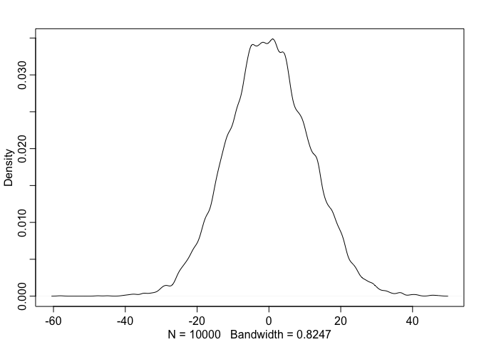
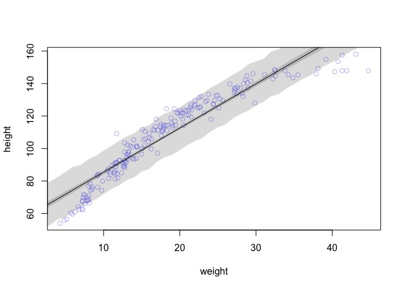
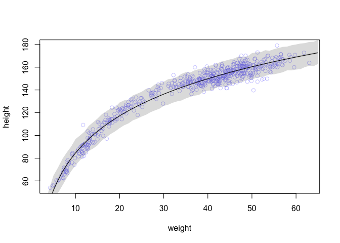

# Statistical Rethinking Chapter 4 problems
#### page 115

Stacey 

```r
library(rethinking)
```

```
## Loading required package: rstan
```

```
## Loading required package: ggplot2
```

```
## Warning: package 'ggplot2' was built under R version 3.2.4
```

```
## rstan (Version 2.9.0-3, packaged: 2016-02-11 15:54:41 UTC, GitRev: 05c3d0058b6a)
```

```
## For execution on a local, multicore CPU with excess RAM we recommend calling
## rstan_options(auto_write = TRUE)
## options(mc.cores = parallel::detectCores())
```

```
## Loading required package: parallel
```

```
## rethinking (Version 1.58)
```

# For 03/17/16

## 4E1
#### which of the below is likelihood?  see page 82
#### I think it is yi ~ Normal(mu, sigma)

## 4E2
#### how many parameters in the above?
#### just two: mu and sigma


## 4E3
#### Using the model definition above, write down the appropriate form 
#### of Bayes’ theorem that includes the proper likelihood and priors.
##### Bayes theorem is: probability of y = likelihood * prior/average likelihood
##### sometimes written as Pr(p|w) = Pr(w|p)Pr(p) / Pr(w)   See page 87 


```r
# (the below seems wrong)
model.list <- alist( 
  y ~ dnorm( mu , sigma ) ,
  mu ~ dnorm( 0 , 10 ) ,
  sigma ~ dunif( 0 , 10 )
)
```
##### I"m stumped here

## 4M1
#### simulate observed heights from the prior (not posterior)
#### what I know:
#### yi ~ Normal(mu; sigma)
#### mu ~ Normal(0; 10)
##### sigma ~ Uniform(0; 10)

```r
# mu ~ dnorm(0,10)
sample.mu <- rnorm(1e4, 0, 10)
sample.sigma <- runif(1e4, 0, 10)
prior.heights <- rnorm(1e4,sample.mu, sample.sigma )
dens(prior.heights)
```




## 4M2
#### Translate the model just above into a map formula. 
#### this is what I did already, I think

```r
model.list <- alist( 
  y ~ dnorm( mu , sigma ) ,
  mu ~ dnorm( 0 , 10 ) ,
  sigma ~ dunif( 0 , 10 )
)
model.sample <- map(model.list, data = D4M2)
precis(model.sample)
# no data, can't run this
```


# For 03/24/16

## 4E4
#### the linear model is:
#### mu = alpha + beta * xi

## 4E5
##### how many parameters?
##### alpha, beta, and sigma, so 3

## 4M3
#####   translate map model into mathematical model

```r
flist <- alist(
y ~ dnorm( mu , sigma ),
mu <- a + b*x,
a ~ dnorm( 0 , 50 ),
b ~ dunif( 0 , 10 ),
sigma ~ dunif( 0 , 50 )
)
```
#### yi ~ Normal(mu, sigma)
#### mui ~ alpha + beta*xi
#### alpha ~ Normal(0, 50)
#### beta ~ Normal(0, 10)
#### sigma ~ Uniform(0, 50)


## 4M4
##### set of students, measured for height each year for 3 years
##### at end, fit linear regression predicting height using year as predictor
##### write mathematical model definition, with priors

#### yi ~ Normal(mu, sigma)
#### mui ~ alpha + beta*xi   (where xi = year)
#### alpha ~ Normal(50, 50)   (alpha is intercept, or starting height; 2nd value is SD and is huge here, making this a weak prior)
#### beta ~ Normal(0.02, 2)   (assuming positive slope - the children won't shrink over time.  SD is big compared to differneces I expect in one year)
#### sigma ~ Uniform(0, 50)

## 4M5
#### average height in first year is 120.  students get taller each year
#### I'll change my alpha prior:
#### alpha ~ Normal(120, 5)  # also reduced SD becuase I have strong info

## 4M6
#### variance among heights for students in year 1 is never more than 64 cm
#### this variance includes my estimates for variance of mu (alpha, beta)
#### and sigma (variance for individdual heights)
#### note variance is hte square of the SD.  So total SD = 8
#### Since I essentially know the mu, I'll re-arrange my SD values to = 8+1 + 2
#### leaving most of SD in sigma

#### yi ~ Normal(mu, sigma)
#### mui ~ alpha + beta*xi   (where xi = year)
#### alpha ~ Normal(120, 1)   (alpha is intercept, or starting height; 2nd value is SD and is huge here, making this a weak prior)
#### beta ~ Normal(0.02, 2)   (assuming positive slope - the children won't shrink over time.  SD is big compared to differneces I expect in one year)
#### sigma ~ Uniform(0, 8)


# For 03/31/16

## 4H1
##### I need to work with the model from the !Kung data
##### to predict heights (and 89% intervals) given various weight

#### first, make the model following the book's method.  Will only consider adults


```r
library(rethinking)
data(Howell1)
d <- Howell1
summary(d)
d2 <- d[ d$age >= 18 , ]
# fit model

m4.3 <- map(
alist(
height ~ dnorm( mu , sigma ) ,
mu <- a + b*weight ,
a ~ dnorm( 156 , 100 ) ,
b ~ dnorm( 0 , 10 ) ,
sigma ~ dunif( 0 , 50 )
) ,
data=d2 )

# page 103?
# I guess that I'll extract samples from my model and then look at HDPI from them

mu.46.95 <- post$a + post$b*46.95
mean(mu.46.95) # 156.1568
HPDI( mu.46.95 , prob=0.89 )
# 155.6345 156.7117 

mu.23.72 <- post$a + post$b*23.72
mean(mu.23.72) # 135
HPDI( mu.23.72 , prob=0.89 )
#  133.3260 136.7359

mu.64.78 <- post$a + post$b*64.78
mean(mu.64.78) # 172.3955
HPDI( mu.64.78 , prob=0.89 )
# 170.8586 174.0841 

mu.32.59 <- post$a + post$b*32.59
mean(mu.32.59) # 143.0784
HPDI( mu.32.59 , prob=0.89 )
# 142.0386 144.1820

mu.54.63 <- post$a + post$b*54.63
mean(mu.54.63) # 163.1514
HPDI( mu.54.63 , prob=0.89 )
# 162.2465 164.0519 
```

## 4H2
#### select only data in Howell with ages less than 18

```r
library(rethinking)
data(Howell1)
d <- Howell1
summary(d)
```

```
##      height           weight            age             male       
##  Min.   : 53.98   Min.   : 4.252   Min.   : 0.00   Min.   :0.0000  
##  1st Qu.:125.09   1st Qu.:22.008   1st Qu.:12.00   1st Qu.:0.0000  
##  Median :148.59   Median :40.058   Median :27.00   Median :0.0000  
##  Mean   :138.26   Mean   :35.611   Mean   :29.34   Mean   :0.4724  
##  3rd Qu.:157.48   3rd Qu.:47.209   3rd Qu.:43.00   3rd Qu.:1.0000  
##  Max.   :179.07   Max.   :62.993   Max.   :88.00   Max.   :1.0000
```

```r
d3 <- d[ d$age < 18 , ]
#
summary(d3)
```

```
##      height           weight            age              male       
##  Min.   : 53.98   Min.   : 4.252   Min.   : 0.000   Min.   :0.0000  
##  1st Qu.: 89.13   1st Qu.:11.708   1st Qu.: 3.000   1st Qu.:0.0000  
##  Median :111.12   Median :16.981   Median : 7.000   Median :0.0000  
##  Mean   :108.32   Mean   :18.414   Mean   : 7.722   Mean   :0.4792  
##  3rd Qu.:127.72   3rd Qu.:23.417   3rd Qu.:12.000   3rd Qu.:1.0000  
##  Max.   :158.12   Max.   :44.736   Max.   :17.000   Max.   :1.0000
```

```r
dim(d3)  #192 rows
```

```
## [1] 192   4
```

```r
#a.  fit a linear regression to these data
map.kids <- map(
alist(
height ~ dnorm( mu , sigma ) ,
mu <- a + b*weight ,
a ~ dnorm( 100 , 100 ) ,
b ~ dnorm( 0 , 10 ) ,
sigma ~ dunif( 0 , 50 )
) ,
data=d3 )
summary(d3)
```

```
##      height           weight            age              male       
##  Min.   : 53.98   Min.   : 4.252   Min.   : 0.000   Min.   :0.0000  
##  1st Qu.: 89.13   1st Qu.:11.708   1st Qu.: 3.000   1st Qu.:0.0000  
##  Median :111.12   Median :16.981   Median : 7.000   Median :0.0000  
##  Mean   :108.32   Mean   :18.414   Mean   : 7.722   Mean   :0.4792  
##  3rd Qu.:127.72   3rd Qu.:23.417   3rd Qu.:12.000   3rd Qu.:1.0000  
##  Max.   :158.12   Max.   :44.736   Max.   :17.000   Max.   :1.0000
```

```r
#b
## now graph it out
plot( height ~ weight , data=d3 , col=col.alpha(rangi2,0.5) )
# use the link function to extract samples from posterior, compute mu
# weights to consider
weight.kids <- seq(from = 0, to = 45, by = 1)

mu.kids <- link(map.kids, data = data.frame(weight = weight.kids))
```

```
## [ 100 / 1000 ]
[ 200 / 1000 ]
[ 300 / 1000 ]
[ 400 / 1000 ]
[ 500 / 1000 ]
[ 600 / 1000 ]
[ 700 / 1000 ]
[ 800 / 1000 ]
[ 900 / 1000 ]
[ 1000 / 1000 ]
```

```r
str(mu.kids)
```

```
##  num [1:1000, 1:46] 57.8 57.6 60.5 58 55.7 ...
```

```r
# summarize the distribution of mu
mu.kids.mean <- apply( mu.kids , 2 , mean )
mu.kids.HPDI <- apply( mu.kids , 2 , HPDI , prob=0.89 )

# plot the MAP line, aka the mean mu for each weight
lines( weight.kids , mu.kids.mean )
# plot a shaded region for 89% HPDI
shade( mu.kids.HPDI , weight.kids )  # not a great fit; would fit better if parabolic
# and add HPDI for predicted height 
sim.kid.height <- sim( map.kids , data=list(weight=weight.kids) )
```

```
## [ 100 / 1000 ]
[ 200 / 1000 ]
[ 300 / 1000 ]
[ 400 / 1000 ]
[ 500 / 1000 ]
[ 600 / 1000 ]
[ 700 / 1000 ]
[ 800 / 1000 ]
[ 900 / 1000 ]
[ 1000 / 1000 ]
```

```r
str(sim.kid.height)
```

```
##  num [1:1000, 1:46] 66.3 46 51.4 68.8 64.8 ...
```

```r
height.kids.PI <- apply( sim.kid.height , 2 , PI , prob=0.89 )
shade( height.kids.PI , weight.kids )  # at least this encompasses almost
```



```r
# all of the data
```

####C
#### aspects that are poor:  height fits at lowest and highest weights
#### I'm guessing a parabolic model would fit better

## 4H3
##### now, model total dataset using natural log of weight vs height


```r
library(rethinking)
data(Howell1)
d <- Howell1
d$log.weight <- log(d$weight)
head(d)
```

```
##    height   weight age male log.weight
## 1 151.765 47.82561  63    1   3.867561
## 2 139.700 36.48581  63    0   3.596923
## 3 136.525 31.86484  65    0   3.461503
## 4 156.845 53.04191  41    1   3.971082
## 5 145.415 41.27687  51    0   3.720302
## 6 163.830 62.99259  35    1   4.143017
```

```r
## fit model using quadratic equation

map.log <- map(
alist(
height ~ dnorm( mu , sigma ) ,
mu <- a + b*log.weight ,
a ~ dnorm( 178 , 100 ) ,
b ~ dnorm( 0 , 100 ) ,
sigma ~ dunif( 0 , 50 )
) ,
data=d )
precis(map.log)  # not very helpful.  plot stuff out
```

```
##         Mean StdDev   5.5%  94.5%
## a     -23.79   1.34 -25.92 -21.65
## b      47.08   0.38  46.46  47.69
## sigma   5.13   0.16   4.89   5.38
```

```r
summary(map.log)
```

```
##         Mean StdDev   5.5%  94.5%
## a     -23.79   1.34 -25.92 -21.65
## b      47.08   0.38  46.46  47.69
## sigma   5.13   0.16   4.89   5.38
```

```r
plot( height ~ weight , data=d , 
col=col.alpha(rangi2,0.4) )

## now superimpose on the plot the:
#  predicted mean height as function of weight
#  97% HPDI for mean
# 97% HPDI for height

weight.all <- seq(from = 0, to = 65, by = 1)

pred.log.data <- list( log.weight=log(weight.all) )
mu.log <- link( map.log , data=pred.log.data )
```

```
## [ 100 / 1000 ]
[ 200 / 1000 ]
[ 300 / 1000 ]
[ 400 / 1000 ]
[ 500 / 1000 ]
[ 600 / 1000 ]
[ 700 / 1000 ]
[ 800 / 1000 ]
[ 900 / 1000 ]
[ 1000 / 1000 ]
```

```r
mu.log.mean <- apply( mu.log , 2 , mean )
mu.PI.log <- apply( mu.log , 2 , PI , prob=0.97 )
sim.height.log <- sim( map.log , data=pred.log.data )
```

```
## [ 100 / 1000 ]
[ 200 / 1000 ]
[ 300 / 1000 ]
[ 400 / 1000 ]
[ 500 / 1000 ]
[ 600 / 1000 ]
[ 700 / 1000 ]
[ 800 / 1000 ]
[ 900 / 1000 ]
[ 1000 / 1000 ]
```

```r
height.PI <- apply( sim.height.log , 2 , PI , prob=0.97 )
# remmember that PI are percentile intervals

plot( height ~ weight , data=d , col=col.alpha(rangi2,0.4) )
lines( weight.all , mu.log.mean ) #nice!
shade( mu.PI.log , weight.all )
shade( height.PI , weight.all )
```


