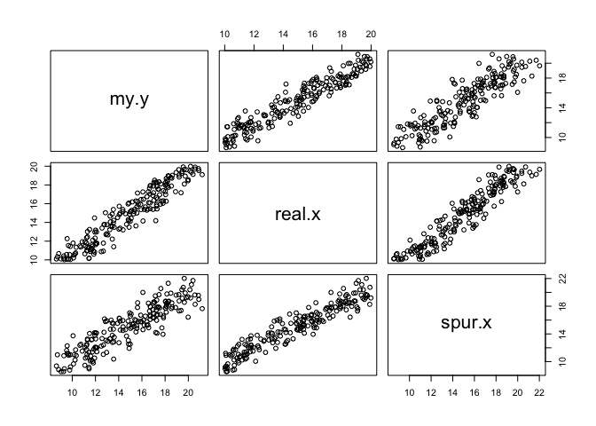
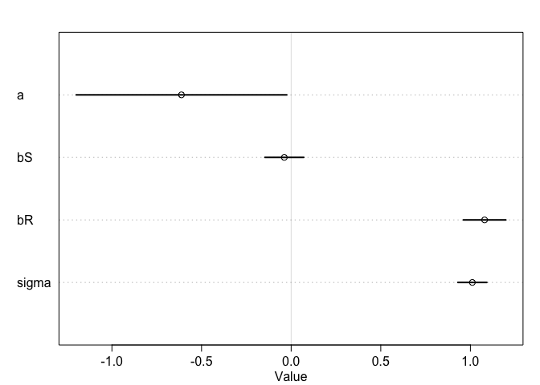
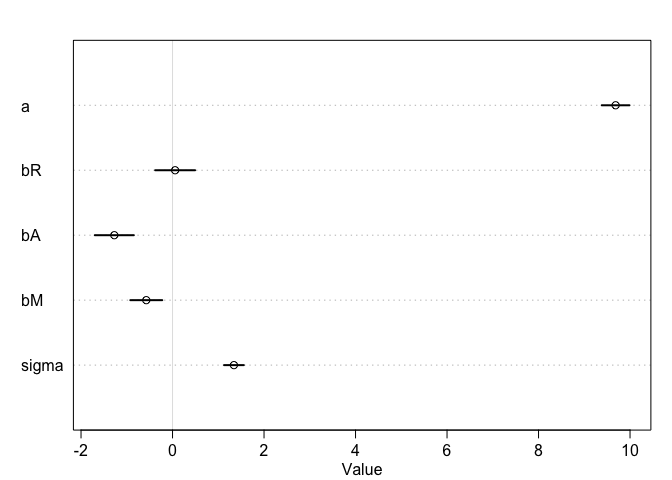

# Statistical Rethinking Chapter 4 problems

__Stacey:__

# For 04/11/2016


```r
library(rethinking)
```

```
## Loading required package: rstan
```

```
## Loading required package: ggplot2
```

```
## Warning: package 'ggplot2' was built under R version 3.2.4
```

```
## rstan (Version 2.9.0-3, packaged: 2016-02-11 15:54:41 UTC, GitRev: 05c3d0058b6a)
```

```
## For execution on a local, multicore CPU with excess RAM we recommend calling
## rstan_options(auto_write = TRUE)
## options(mc.cores = parallel::detectCores())
```

```
## Loading required package: parallel
```

```
## rethinking (Version 1.58)
```


## 5E1
#####  5E1. Which of the linear models below are multiple linear regressions?
#####  (2) mu.i = b.x * x.i + b.z * z.i
#####  (4)  mu.i = a + b.x*x.i + b.z * z.i

#####   (I dont' think 3 qualifies as only one beta here)

## 5E2.   Write down a multiple regression to evaluate the claim: 
## Animal diversity is linearly related to latitude, but only after controlling for plant diversity. 

#####   (  I think it would be:  mu.d = a + b.l * lat + b.p * pl.d
#####   ( where mu.d is mean animal diversity
#####   ( a is intercept
#####   ( b.l is the relationship between latitude and diversity
#####   ( lat is latitude
#####   ( b.p is relatinship between plant divserity and animal diversity
#####   ( pl.d is plant diverstiy


## 5M1.  Invent your own example of a spurious correlation. 
#####  An outcome variable should be correlated with both predictor variables. 
#####  But when both predictors are entered in the same model, 
#####  the correlation between the outcome and one of the predictors 
#####   should mostly vanish (or at least be greatly reduced).

##### well, this is spelled out on p. 135

```r
n <- 200
real.x <- runif(n, min = 10, max = 20)
spur.x <- rnorm(n, real.x)
my.y <- rnorm(n, real.x)
my.d <- data.frame(my.y, real.x, spur.x)
pairs(my.d)
```



```r
summary(my.d)
```

```
##       my.y            real.x          spur.x      
##  Min.   : 8.634   Min.   :10.03   Min.   : 8.552  
##  1st Qu.:11.961   1st Qu.:11.94   1st Qu.:12.393  
##  Median :15.010   Median :15.14   Median :15.288  
##  Mean   :14.861   Mean   :14.87   Mean   :15.047  
##  3rd Qu.:17.395   3rd Qu.:17.32   3rd Qu.:17.722  
##  Max.   :21.195   Max.   :19.98   Max.   :22.023
```

```r
# can I make a linear regression predicting y?
library(rethinking)
my.M1.model <- map(
  alist(
    my.y ~ dnorm (mu, sigma) ,
    mu <- a + bS * spur.x + bR * real.x,
    a ~ dnorm(10, 10) ,
    bS ~ dnorm(0 , 1) ,
    bR ~ dnorm(0 , 1) ,
    sigma ~ dunif(0, 10)
  ), data = my.d
)
precis(my.M1.model)
```

```
##        Mean StdDev  5.5% 94.5%
## a     -0.61   0.37 -1.20 -0.02
## bS    -0.04   0.07 -0.15  0.07
## bR     1.08   0.07  0.96  1.20
## sigma  1.01   0.05  0.93  1.09
```

```r
plot(precis(my.M1.model))
```



```r
#  bS is close to 0, while bR is close to 1.  OK!
```

## 5M3  Consider how a high divorce rate might cause a higher marriage rate. 
##  Can you think of a way to evaluate this relationship, using multiple regression?

##### could imagine that recently divorced people would be eager to marry again.
##### evaulation with multiple regression: As in Fig 4.5?  (p 103)
##### I think I'd model using map function, model being
##### mu <- a + b*divorce.rate
##### then I'd extract samples from the posterior and plot relative to real data
##### as shown on page 102


## 5M4
### Find a list of LDS population by State and use those numbers as a predictor variable, predicting divorce
### rate using marriage rate, median age at marriage, and percent LDS population (possibly standardized).
### You may want to consider transformations of the raw percent LDS variable.

#### found appropriate table on Wikipedia; saved to my hard drive

#### what does he mean by standardized percentile?  Ah, maybe so that it's fraction mormons in US by state?


```r
setwd("~/R /R_club/R_Club_2016/Ch5_2016-04-22")
mormons <- read.csv("mormons_by_state.csv")
head(mormons)
```

```
##        State Membership Population percent.LDS Stakes..6. Districts..6.
## 1    Alabama     36,874  4,858,979        0.75          7            NA
## 2     Alaska     33,649    738,432        4.55          8            NA
## 3    Arizona    418,959  6,828,065        6.13        102            NA
## 4   Arkansas     30,447  2,978,204        1.02          7            NA
## 5 California    773,762 39,144,818        1.97        156            NA
## 6   Colorado    151,580  5,456,574        2.77         34            NA
##   Wards..7. Branches..7. Total.Congregations Missions Temples
## 1        42           33                  77        1       1
## 2        55           28                  86        1       1
## 3       719           86                 844        6       5
## 4        38           26                  67        1      NA
## 5     1,184          164               1,367       19       7
## 6       272           31                 311        4       1
##   Family.History.Centers
## 1                     40
## 2                     15
## 3                     66
## 4                     21
## 5                    183
## 6                     55
```

```r
tail(mormons, n=10)
```

```
##            State Membership Population percent.LDS Stakes..6.
## 42  South Dakota     10,422    858,469        1.21          2
## 43     Tennessee     49,576  6,600,299        0.75         11
## 44         Texas    341,022 27,469,114        1.24         69
## 45          Utah  2,040,178  2,995,919       68.09        579
## 46       Vermont      4,596    626,042        0.73          1
## 47      Virginia     94,528  8,382,993        1.12         20
## 48    Washington    284,631  7,170,351        3.96         59
## 49 West Virginia     16,959  1,844,128        0.91          4
## 50     Wisconsin     26,161  5,771,337        0.45          6
## 51       Wyoming     67,680    586,107       11.54         17
##    Districts..6. Wards..7. Branches..7. Total.Congregations Missions
## 42             1        10           23                  34       NA
## 43            NA        74           28                 105        2
## 44             3       488          132                 635        8
## 45             1     4,589          327               4,971        9
## 46            NA         8            4                  12       NA
## 47            NA       164           33                 197        3
## 48            NA       475           68                 549        7
## 49            NA        25           12                  36        1
## 50            NA        42           26                  68        1
## 51            NA       137           18                 157       NA
##    Temples Family.History.Centers
## 42      NA                     11
## 43       2                     30
## 44       4                    111
## 45      16                    152
## 46      NA                      6
## 47      NA                     36
## 48       3                     79
## 49      NA                     14
## 50      NA                     24
## 51      NA                     37
```

```r
summary(mormons)
```

```
##         State      Membership     Population  percent.LDS    
##  Alabama   : 1   10,422 : 1   1,032,949: 1   Min.   : 0.370  
##  Alaska    : 1   10,966 : 1   1,056,298: 1   1st Qu.: 0.595  
##  Arizona   : 1   11,195 : 1   1,329,328: 1   Median : 0.820  
##  Arkansas  : 1   15,752 : 1   1,330,608: 1   Mean   : 3.484  
##  California: 1   151,580: 1   1,431,603: 1   3rd Qu.: 1.720  
##  Colorado  : 1   152,217: 1   1,654,930: 1   Max.   :68.090  
##  (Other)   :45   (Other):45   (Other)  :45                   
##    Stakes..6.     Districts..6.   Wards..7.   Branches..7.   
##  Min.   :  1.00   Min.   :1.0   111    : 2   Min.   :  1.00  
##  1st Qu.:  6.00   1st Qu.:1.0   28     : 2   1st Qu.: 15.50  
##  Median :  8.00   Median :1.0   42     : 2   Median : 26.00  
##  Mean   : 31.88   Mean   :1.4   55     : 2   Mean   : 38.25  
##  3rd Qu.: 17.00   3rd Qu.:1.0   1,184  : 1   3rd Qu.: 36.00  
##  Max.   :579.00   Max.   :3.0   10     : 1   Max.   :327.00  
##  NA's   :2        NA's   :46    (Other):41                   
##  Total.Congregations    Missions         Temples      
##  12     : 2          Min.   : 1.000   Min.   : 1.000  
##  68     : 2          1st Qu.: 1.000   1st Qu.: 1.000  
##  78     : 2          Median : 2.000   Median : 1.000  
##  1,117  : 1          Mean   : 2.791   Mean   : 2.242  
##  1,367  : 1          3rd Qu.: 3.000   3rd Qu.: 2.000  
##  100    : 1          Max.   :19.000   Max.   :16.000  
##  (Other):42          NA's   :8        NA's   :18      
##  Family.History.Centers
##  Min.   :  1.00        
##  1st Qu.: 15.25        
##  Median : 29.00        
##  Mean   : 37.22        
##  3rd Qu.: 45.00        
##  Max.   :183.00        
##  NA's   :1
```

```r
sum(mormons$percent.LDS)
```

```
## [1] 177.7
```

```r
mormons$percent.std <- mormons$percent.LDS / sum(mormons$percent.LDS)  

# standardize LDS predictor
mormons$percent.LDS.s <- (mormons$percent.LDS - mean(mormons$percent.LDS))/
  sd(mormons$percent.LDS)
dim(mormons)
```

```
## [1] 51 14
```

```r
# now simplify and merge info
mormons.LDS.s <- mormons[, c(1,14)]
head(mormons.LDS.s)
```

```
##        State percent.LDS.s
## 1    Alabama   -0.27143826
## 2     Alaska    0.10579182
## 3    Arizona    0.26264012
## 4   Arkansas   -0.24463507
## 5 California   -0.15032755
## 6   Colorado   -0.07091069
```

```r
data("WaffleDivorce")
divorce <- WaffleDivorce
head(divorce)
```

```
##     Location Loc Population MedianAgeMarriage Marriage Marriage.SE Divorce
## 1    Alabama  AL       4.78              25.3     20.2        1.27    12.7
## 2     Alaska  AK       0.71              25.2     26.0        2.93    12.5
## 3    Arizona  AZ       6.33              25.8     20.3        0.98    10.8
## 4   Arkansas  AR       2.92              24.3     26.4        1.70    13.5
## 5 California  CA      37.25              26.8     19.1        0.39     8.0
## 6   Colorado  CO       5.03              25.7     23.5        1.24    11.6
##   Divorce.SE WaffleHouses South Slaves1860 Population1860 PropSlaves1860
## 1       0.79          128     1     435080         964201           0.45
## 2       2.05            0     0          0              0           0.00
## 3       0.74           18     0          0              0           0.00
## 4       1.22           41     1     111115         435450           0.26
## 5       0.24            0     0          0         379994           0.00
## 6       0.94           11     0          0          34277           0.00
```

```r
divorce <- merge(divorce, mormons.LDS.s, by.x = "Location", by.y = "State")
head(divorce)
```

```
##     Location Loc Population MedianAgeMarriage Marriage Marriage.SE Divorce
## 1    Alabama  AL       4.78              25.3     20.2        1.27    12.7
## 2     Alaska  AK       0.71              25.2     26.0        2.93    12.5
## 3    Arizona  AZ       6.33              25.8     20.3        0.98    10.8
## 4   Arkansas  AR       2.92              24.3     26.4        1.70    13.5
## 5 California  CA      37.25              26.8     19.1        0.39     8.0
## 6   Colorado  CO       5.03              25.7     23.5        1.24    11.6
##   Divorce.SE WaffleHouses South Slaves1860 Population1860 PropSlaves1860
## 1       0.79          128     1     435080         964201           0.45
## 2       2.05            0     0          0              0           0.00
## 3       0.74           18     0          0              0           0.00
## 4       1.22           41     1     111115         435450           0.26
## 5       0.24            0     0          0         379994           0.00
## 6       0.94           11     0          0          34277           0.00
##   percent.LDS.s
## 1   -0.27143826
## 2    0.10579182
## 3    0.26264012
## 4   -0.24463507
## 5   -0.15032755
## 6   -0.07091069
```

```r
divorce$Marriage.s <- (divorce$Marriage - mean(divorce$Marriage))/sd(divorce$Marriage)
divorce$MedianAgeMarriage.s <- (divorce$MedianAgeMarriage-mean(divorce$MedianAgeMarriage))/sd(divorce$MedianAgeMarriage)

### now predict divorce rate with all parameters

m5M4.problem <- map(
  alist(
    Divorce ~ dnorm (mu, sigma) ,
    mu <- a + bR * Marriage.s + bA * MedianAgeMarriage.s + bM * percent.LDS.s,
    a ~ dnorm(10, 10) ,
    bR ~ dnorm(0 , 1) ,
    bA ~ dnorm(0 , 1) ,
    bM ~ dnorm(0 , 1) ,  # just like others .. .
    sigma ~ dunif(0, 10)
  ), data = divorce
)
precis(m5M4.problem)
```

```
##        Mean StdDev  5.5% 94.5%
## a      9.68   0.19  9.38  9.99
## bR     0.06   0.27 -0.38  0.49
## bA    -1.27   0.27 -1.70 -0.85
## bM    -0.57   0.22 -0.92 -0.23
## sigma  1.34   0.13  1.13  1.56
```

```r
plot(precis(m5M4.problem))
```



```r
# Age and LDS both predict less divorce
```
