# Chapter-05-part2-assignment
# Statistical Rethinking Chapter 4 problems

__Stacey__


# For 04/25/2016

## 5M2
***
Invent your own example of a masked relationship. An outcome variable should be correlated
with both predictor variables, but in opposite directions. And the two predictor variables should be
correlated with one another  

cycling speed = outcome variable; predictor.1 = wind resistance and predictor.2 = rpm (pedaling speed)  


## 5H1
##### Fit two bivariate Gaussian regressions, using map: (1) body weight as a linear function of territory
##### size (area), and (2) body weight as a linear function of groupsize. Plot the results of these
##### regressions, displaying the MAP regression line and the 95% interval of the mean. Is either variable
##### important for predicting fox body weight?


```r
library(rethinking)
```

```
## Loading required package: rstan
```

```
## Loading required package: ggplot2
```

```
## Warning: package 'ggplot2' was built under R version 3.2.4
```

```
## rstan (Version 2.9.0-3, packaged: 2016-02-11 15:54:41 UTC, GitRev: 05c3d0058b6a)
```

```
## For execution on a local, multicore CPU with excess RAM we recommend calling
## rstan_options(auto_write = TRUE)
## options(mc.cores = parallel::detectCores())
```

```
## Loading required package: parallel
```

```
## rethinking (Version 1.58)
```

```r
data("foxes")
foxes <- foxes
summary(foxes)
```

```
##      group          avgfood         groupsize          area      
##  Min.   : 1.00   Min.   :0.3700   Min.   :2.000   Min.   :1.090  
##  1st Qu.:11.75   1st Qu.:0.6600   1st Qu.:3.000   1st Qu.:2.590  
##  Median :18.00   Median :0.7350   Median :4.000   Median :3.130  
##  Mean   :17.21   Mean   :0.7517   Mean   :4.345   Mean   :3.169  
##  3rd Qu.:24.00   3rd Qu.:0.8000   3rd Qu.:5.000   3rd Qu.:3.772  
##  Max.   :30.00   Max.   :1.2100   Max.   :8.000   Max.   :5.070  
##      weight     
##  Min.   :1.920  
##  1st Qu.:3.720  
##  Median :4.420  
##  Mean   :4.530  
##  3rd Qu.:5.375  
##  Max.   :7.550
```

```r
# 1.  body weight as linear function of territory size (area)

m.area <- map( 
              alist(
                weight ~ dnorm(mu,sigma),
                mu <- a + b*area  ,
                a ~ dnorm(3,10),  # not sure what reasonable prior is; will try this
                b ~ dnorm(0,10),
                sigma ~ dunif(0,10)
              ),
              data=foxes )
precis(m.area)
```

```
##       Mean StdDev  5.5% 94.5%
## a     4.45   0.39  3.82  5.07
## b     0.03   0.12 -0.16  0.21
## sigma 1.18   0.08  1.06  1.30
```

```r
plot(precis(m.area))  # b not very useful
```

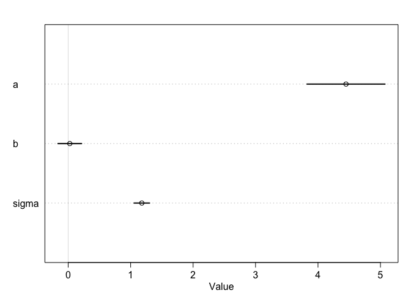

```r
area.seq <- seq(0,6, length.out = 100)
mu.area <- link(m.area, data=data.frame(area=area.seq))
```

```
## [ 100 / 1000 ]
[ 200 / 1000 ]
[ 300 / 1000 ]
[ 400 / 1000 ]
[ 500 / 1000 ]
[ 600 / 1000 ]
[ 700 / 1000 ]
[ 800 / 1000 ]
[ 900 / 1000 ]
[ 1000 / 1000 ]
```

```r
mu.area.HPDI <- apply(mu.area, 2, HPDI, prob=0.95)

plot(weight ~ area, data=foxes, col= rangi2)
abline(m.area)
```

```
## Warning in abline(m.area): only using the first two of 3 regression
## coefficients
```

```r
shade(mu.area.HPDI, area.seq) # not much data within 95% interval
```

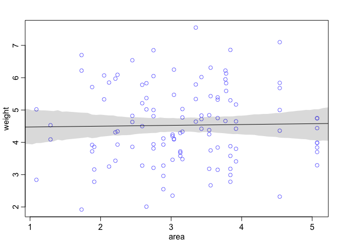

```r
# 2.  body weight as linear function of groupsize

m.size <- map( 
              alist(
                weight ~ dnorm(mu,sigma),
                mu <- a + b*groupsize  ,
                a ~ dnorm(4,10),  # not sure what reasonable prior is; will try this
                b ~ dnorm(0,10),
                sigma ~ dunif(0,10)
              ),
              data=foxes )
precis(m.size) # the bigger the group, the lower the weight
```

```
##        Mean StdDev  5.5% 94.5%
## a      5.07   0.32  4.55  5.59
## b     -0.12   0.07 -0.24 -0.01
## sigma  1.16   0.08  1.04  1.29
```

```r
plot(precis(m.size)) # but effect is quite small
```

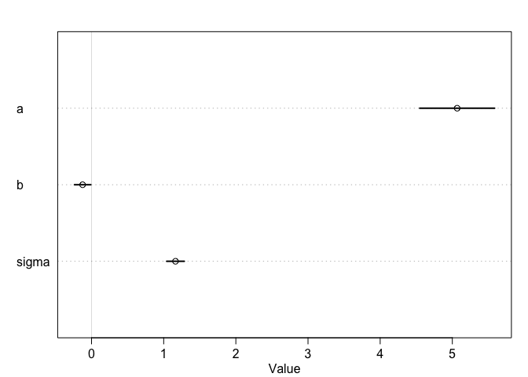

```r
groupsize.seq <- seq(0,10, length.out = 100)
mu.groupsize <- link(m.size, data=data.frame(groupsize=groupsize.seq))
```

```
## [ 100 / 1000 ]
[ 200 / 1000 ]
[ 300 / 1000 ]
[ 400 / 1000 ]
[ 500 / 1000 ]
[ 600 / 1000 ]
[ 700 / 1000 ]
[ 800 / 1000 ]
[ 900 / 1000 ]
[ 1000 / 1000 ]
```

```r
mu.groupsize.HPDI <- apply(mu.groupsize, 2, HPDI, prob=0.95)

plot(weight ~ groupsize, data=foxes, col= rangi2)
abline(m.size)
```

```
## Warning in abline(m.size): only using the first two of 3 regression
## coefficients
```

```r
shade(mu.groupsize.HPDI, groupsize.seq) # not much data within 95% interval
```

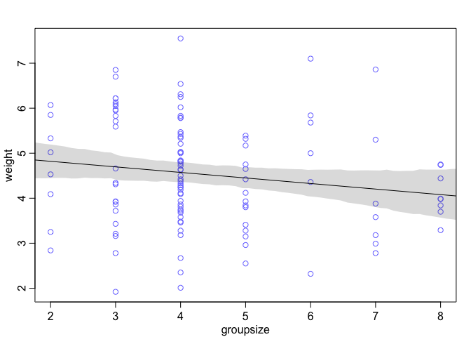

## 5H2
##### Now fit a multiple linear regression with weight as the outcome and both area and groupsize
##### as predictor variables. Plot the predictions of the model for each predictor, holding the other predictor
##### constant at its mean. What does this model say about the importance of each variable? Why do you
##### get different results than you got in the exercise just above?

```r
library(rethinking)
data("foxes")
foxes <- foxes
summary(foxes)
```

```
##      group          avgfood         groupsize          area      
##  Min.   : 1.00   Min.   :0.3700   Min.   :2.000   Min.   :1.090  
##  1st Qu.:11.75   1st Qu.:0.6600   1st Qu.:3.000   1st Qu.:2.590  
##  Median :18.00   Median :0.7350   Median :4.000   Median :3.130  
##  Mean   :17.21   Mean   :0.7517   Mean   :4.345   Mean   :3.169  
##  3rd Qu.:24.00   3rd Qu.:0.8000   3rd Qu.:5.000   3rd Qu.:3.772  
##  Max.   :30.00   Max.   :1.2100   Max.   :8.000   Max.   :5.070  
##      weight     
##  Min.   :1.920  
##  1st Qu.:3.720  
##  Median :4.420  
##  Mean   :4.530  
##  3rd Qu.:5.375  
##  Max.   :7.550
```

```r
#   body weight as linear function of area and groupsize

m.area.size <- map( 
              alist(
                weight ~ dnorm(mu,sigma),
                mu <- a + b.a*area   + b.g*groupsize,
                a ~ dnorm(3,10),  # not sure what reasonable prior is; will try this
                b.a ~ dnorm(0,10),
                b.g ~ dnorm(0,10),
                sigma ~ dunif(0,10)
              ),
              data=foxes )
precis(m.area.size) 
```

```
##        Mean StdDev  5.5% 94.5%
## a      4.45   0.37  3.86  5.04
## b.a    0.62   0.20  0.30  0.94
## b.g   -0.43   0.12 -0.63 -0.24
## sigma  1.12   0.07  1.00  1.24
```

```r
plot(precis(m.area.size))
```

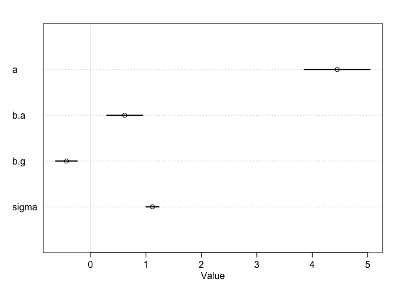

```r
# now see that area has positive, groupsize negative effect on weight
# small but non-zero effects

# plot predictions (counterfactual plots)
# first, vary groupsize
area.mean <- mean(foxes$area)
groupsize.seq <- seq(0,10, length.out = 100)
pred.data.groupsize <- data.frame(groupsize=groupsize.seq, area = area.mean)

# use these data to get mean predicted weights.

mu.weight.pred.groupsize <- link(m.area.size, data=pred.data.groupsize)
```

```
## [ 100 / 1000 ]
[ 200 / 1000 ]
[ 300 / 1000 ]
[ 400 / 1000 ]
[ 500 / 1000 ]
[ 600 / 1000 ]
[ 700 / 1000 ]
[ 800 / 1000 ]
[ 900 / 1000 ]
[ 1000 / 1000 ]
```

```r
mu.weight.pred.groupsize.mean <- apply(mu.weight.pred.groupsize, 2, mean)
mu.weight.pred.groupsize.PI <- apply(mu.weight.pred.groupsize, 2, PI, prob=0.95)

# simulate weight outcomes of model
weight.sim <- sim(m.area.size, data=pred.data.groupsize, n=1e4)
```

```
## [ 1000 / 10000 ]
[ 2000 / 10000 ]
[ 3000 / 10000 ]
[ 4000 / 10000 ]
[ 5000 / 10000 ]
[ 6000 / 10000 ]
[ 7000 / 10000 ]
[ 8000 / 10000 ]
[ 9000 / 10000 ]
[ 10000 / 10000 ]
```

```r
weight.PI <- apply(weight.sim, 2 ,PI)

# display predictions, hiding raw data
plot(weight ~ groupsize, data=foxes, type = "n")
mtext("area = 0")
lines(groupsize.seq, mu.weight.pred.groupsize.mean)
shade(mu.weight.pred.groupsize.PI, groupsize.seq)
shade(weight.PI, groupsize.seq)
```

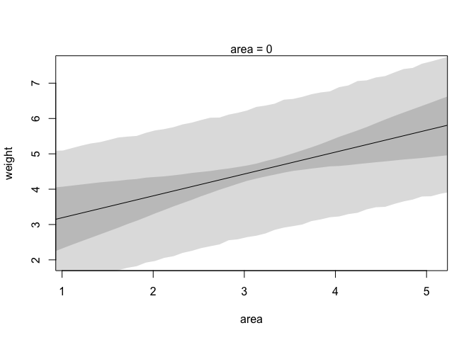

```r
# Now, vary area (leaving groupsize unaltered)
groupsize.mean <- mean(foxes$groupsize)
area.seq <- seq(0,10, length.out = 100)
pred.data.area <- data.frame(groupsize=groupsize.mean, area = area.seq)

# use these data to get mean predicted weights.

mu.weight.pred.area <- link(m.area.size, data=pred.data.area)
```

```
## [ 100 / 1000 ]
[ 200 / 1000 ]
[ 300 / 1000 ]
[ 400 / 1000 ]
[ 500 / 1000 ]
[ 600 / 1000 ]
[ 700 / 1000 ]
[ 800 / 1000 ]
[ 900 / 1000 ]
[ 1000 / 1000 ]
```

```r
mu.weight.pred.area.mean <- apply(mu.weight.pred.area, 2, mean)
mu.weight.pred.area.PI <- apply(mu.weight.pred.area, 2, PI, prob=0.95)

# simulate weight outcomes of model
weight.sim.2 <- sim(m.area.size, data=pred.data.area, n=1e4)
```

```
## [ 1000 / 10000 ]
[ 2000 / 10000 ]
[ 3000 / 10000 ]
[ 4000 / 10000 ]
[ 5000 / 10000 ]
[ 6000 / 10000 ]
[ 7000 / 10000 ]
[ 8000 / 10000 ]
[ 9000 / 10000 ]
[ 10000 / 10000 ]
```

```r
weight.PI.2 <- apply(weight.sim.2, 2 ,PI)

# display predictions, hiding raw data
plot(weight ~ area, data=foxes, type = "n")
mtext("area = 0")
lines(area.seq, mu.weight.pred.area.mean)
shade(mu.weight.pred.area.PI, area.seq)
shade(weight.PI.2, area.seq)
```

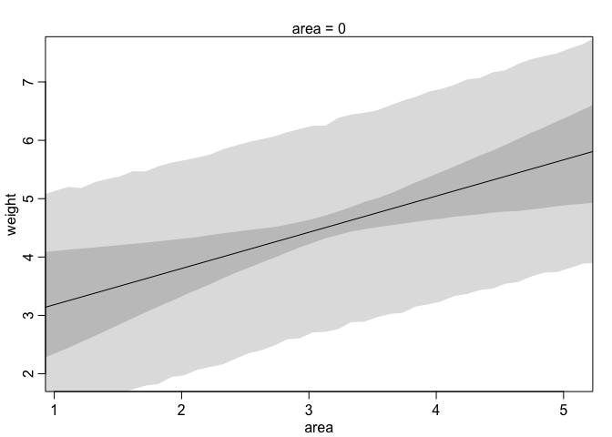
  
  ## 5H3
##### Finally, consider the avgfood variable. Fit two more multiple regressions: (1) body weight
##### as an additive function of avgfood and groupsize, and (2) body weight as an additive function of
##### all three variables, avgfood and groupsize and area. Compare the results of these models to the
##### previous models you’ve fit, in the first two exercises. 


```r
# 1.  weight as function of avgfood and groupsize
m.food.group <- map( 
              alist(
                weight ~ dnorm(mu,sigma),
                mu <- a + b.g*groupsize + b.f*avgfood ,
                a ~ dnorm(4,10),  # not sure what reasonable prior is; will try this
                b.g ~ dnorm(0,10),
                b.f ~ dnorm(0,10),
                sigma ~ dunif(0,10)
              ),
              data=foxes )
precis(m.food.group) # the bigger the group, the lower the weight; the more food, the greater the weight
```

```
##        Mean StdDev  5.5% 94.5%
## a      4.14   0.43  3.45  4.83
## b.g   -0.56   0.16 -0.81 -0.31
## b.f    3.77   1.20  1.84  5.69
## sigma  1.12   0.07  1.00  1.23
```

```r
plot(precis(m.food.group))  # really large SE for food effect
```

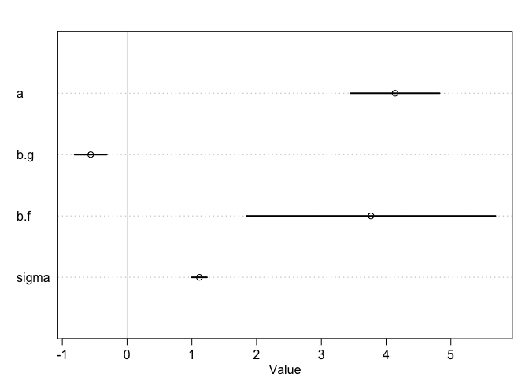

```r
# let's look at the gt beween teh model and hte actual data
mu.food.group <- link(m.food.group)
```

```
## [ 100 / 1000 ]
[ 200 / 1000 ]
[ 300 / 1000 ]
[ 400 / 1000 ]
[ 500 / 1000 ]
[ 600 / 1000 ]
[ 700 / 1000 ]
[ 800 / 1000 ]
[ 900 / 1000 ]
[ 1000 / 1000 ]
```

```r
# summarize samlpes across the cases
mu.food.group.mean <- apply(mu.food.group, 2, mean)
mu.food.group.PI <- apply(mu.food.group, 2, PI, prob=0.95)

# simulate observations, starting from real data
weight.sim.1 <- sim(m.food.group, n = 1e4)
```

```
## [ 1000 / 10000 ]
[ 2000 / 10000 ]
[ 3000 / 10000 ]
[ 4000 / 10000 ]
[ 5000 / 10000 ]
[ 6000 / 10000 ]
[ 7000 / 10000 ]
[ 8000 / 10000 ]
[ 9000 / 10000 ]
[ 10000 / 10000 ]
```

```r
weight.PI.1 <- apply(weight.sim.1, 2, PI, prob = 0.95)

# now plot predictions against observed
plot(foxes$weight ~ mu.food.group.mean  , col = rangi2,
     xlab = "observed weight", ylab= "predicted weight")
abline(a =0, b=1, lty=2)
for (i in 1:nrow(foxes) )
     lines( rep(foxes$weight[i],2) , c(mu.food.group.PI[1, i], mu.food.group.PI[2, i]),
            col=rangi2)
```

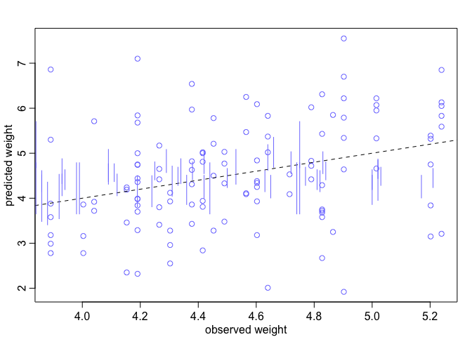

```r
# I messed up these lines. . .

# try computing residuals instead

weight.food.group.resid <- foxes$weight - mu.food.group.mean
# get ordering by weight
w <- order(weight.food.group.resid)
# make the plot
dotchart( weight.food.group.resid[w] , labels=foxes$group[w] ,  cex=0.6 )
abline( v=0 , col=col.alpha("black",0.2) )
for ( i in 1:nrow(foxes) ) {
j <- w[i] # which group in order
lines( foxes$weight[j]-c(mu.food.group.PI[1,j],mu.food.group.PI[2,j]) , rep(i,2) )
points( foxes$weight[j]-c(weight.PI.1[1,j],weight.PI.1[2,j]) , rep(i,2),
pch=3 , cex=0.6 , col="gray" )
}
```

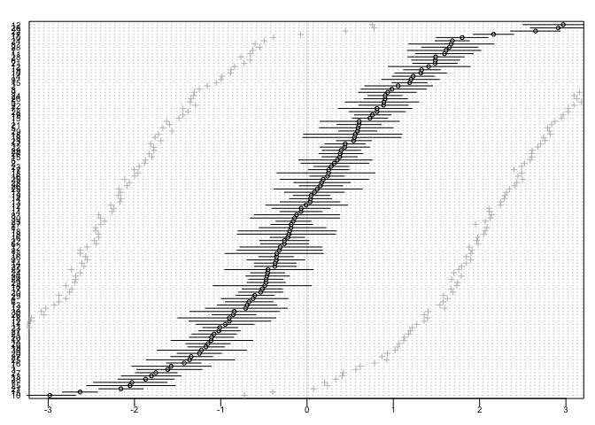

```r
# better
```

##### (a) Is avgfood or area a better predictor of body weight?


```r
# 1.  as above, but replace avgfood with area
m.area.group <- map( 
              alist(
                weight ~ dnorm(mu,sigma),
                mu <- a + b.g*groupsize + b.a*area ,
                a ~ dnorm(4,10),  # not sure what reasonable prior is; will try this
                b.g ~ dnorm(0,10),
                b.a ~ dnorm(0,10),
                sigma ~ dunif(0,10)
              ),
              data=foxes )
precis(m.area.group) # the bigger the group, the lower the weight; the more food, the greater the weight
```

```
##        Mean StdDev  5.5% 94.5%
## a      4.45   0.37  3.86  5.04
## b.g   -0.43   0.12 -0.63 -0.24
## b.a    0.62   0.20  0.30  0.94
## sigma  1.12   0.07  1.00  1.24
```

```r
plot(precis(m.area.group))  # area has smaller effect than avgfood, but SE much smaller.  This is likely better
```

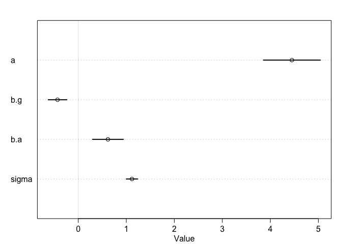

#####  If you had to choose one or the other to include in a model, which would it be? Support your
##### assessment with any tables or plots you choose. (b) When both avgfood or area are in the same
##### model, their effects are reduced (closer to zero) and their standard errors are larger than when they
##### are included in separate models. Can you explain this result?
***
no time to run it, but likely this is because larger area is highly correlated with avgfood


```r
head(foxes)
```

```
##   group avgfood groupsize area weight
## 1     1    0.37         2 1.09   5.02
## 2     1    0.37         2 1.09   2.84
## 3     2    0.53         2 2.05   5.33
## 4     2    0.53         2 2.05   6.07
## 5     3    0.49         2 2.12   5.85
## 6     3    0.49         2 2.12   3.25
```

```r
pairs(foxes)
```

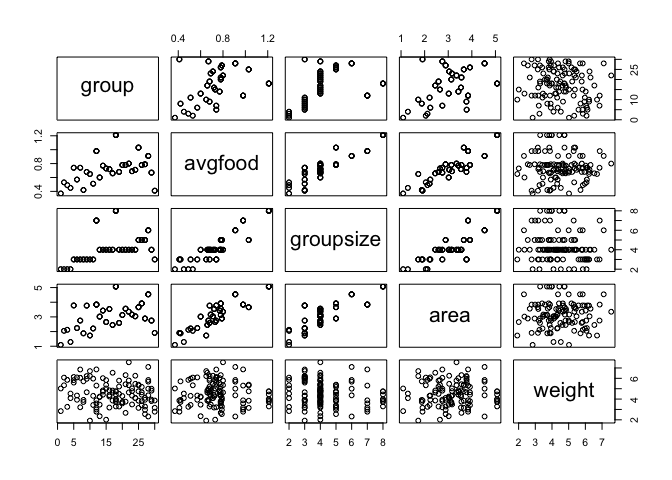

```r
pairs( ~ avgfood + area  ,
   data=foxes , col=rangi2 )
```

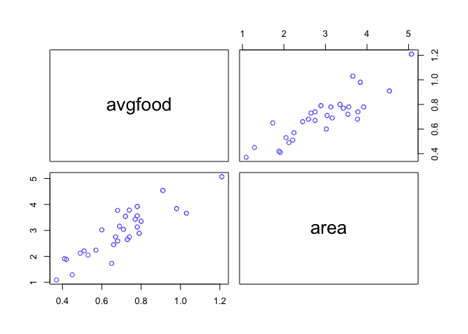

```r
# these look highly correlated
cor(foxes$avgfood, foxes$area)
```

```
## [1] 0.8831038
```

```r
# 0.8831038
```
yes, these values are highly positively corelated.
