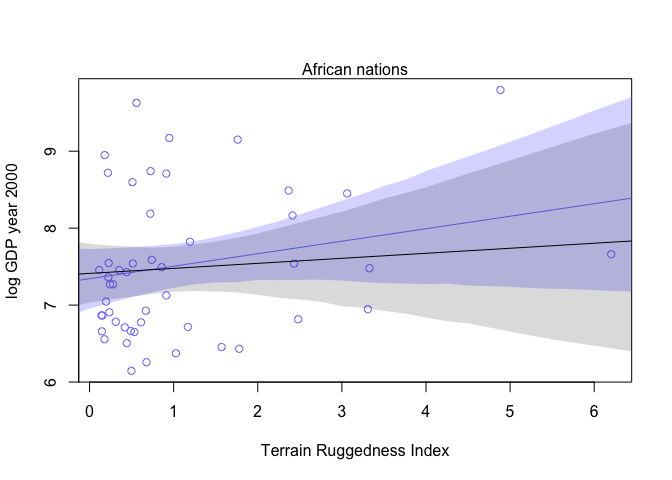
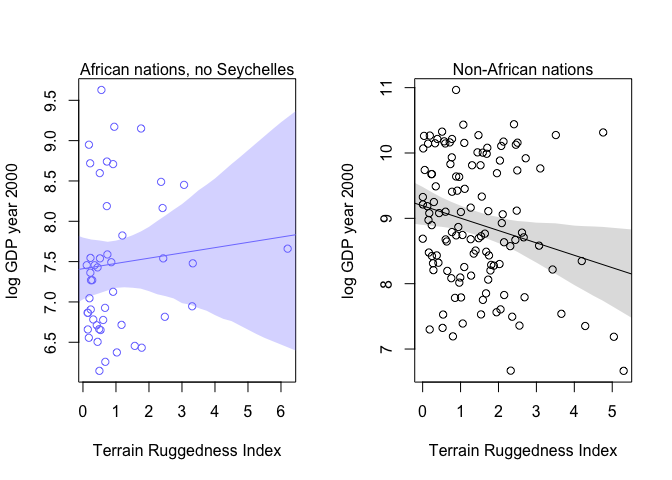
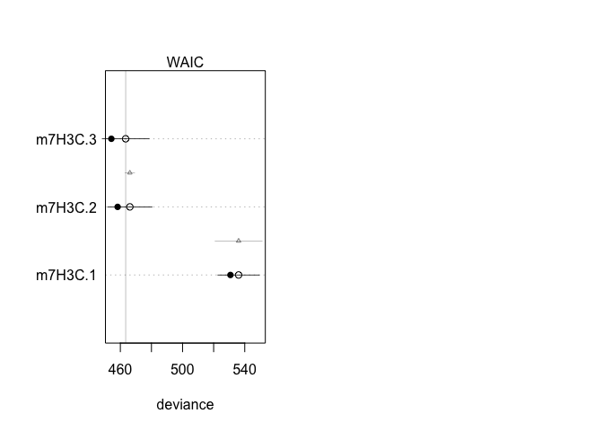

# Chapter7_problems
Stacey Harmer  
June 13, 2016  
Statistical Rethinking, Ch 7
All problems

*7E1.  For each of the causal relationships below, name a hypothetical third variable that would lead
to an interaction effect.
(1) Bread dough rises because of yeast.  
temperature; temperature determines how much effect yeast has on rise

(2) Education leads to higher income.
discipline; engineering would have a larger effect than art history

(3) Gasoline makes a car go.
type of car; distance depends upon whether a truck or a mini

*7E2. Which of the following explanations invokes an interaction?
(1) Caramelizing onions requires cooking over low heat and making sure the onions do not
dry out.

*7E3. For each of the explanations in 7E2, write a linear model that expresses the stated relationship
(1) Caramelizing onions requires cooking over low heat and making sure the onions do not
dry out.
carmelizaiton = alpha + temp + moisture + temp*moisture

(2) A car will go faster when it has more cylinders or when it has a better fuel injector.
rate = alpha + cyl + inj

(3) Most people acquire their political beliefs from their parents, unless they get them instead
from their friends.
belief = alpha + parent + friend

(4) Intelligent animal species tend to be either highly social or have manipulative appendages
(hands, tentacles, etc.).
intelligence = alpha + social + manip

*7M1
Recall the tulips example from the chapter. Suppose another set of treatments adjusted the
temperature in the greenhouse over two levels: cold and hot. The data in the chapter were collected
at the cold temperature. You find none of the plants grown under the hot temperature developed
any blooms at all, regardless of the water and shade levels. Can you explain this result in terms of
interactions between water, shade, and temperature?

So when it is hot, it doesnt matter whether there is water or sun; the plants can't bloom.

*7M2. 
Can you invent a regression equation that would make the bloom size zero, whenever the
temperature is hot?

We need to include 3 interactions, which will give us all of the below:
temp, shade, water, temp*shade, temp*water, shade*water, shade*water*temp

Not sure how to do this properly.  I could easily see that if temp = 0, I can write a term that cancels out

bloom ~ alpha + water*shade*temp  (temp = 0 when hot; alpha = 0 as well)

*7M3.
In parts of North America, ravens depend upon wolves for their food. This is because ravens
are carnivorous but cannot usually kill or open carcasses of prey. Wolves however can and do kill
and tear open animals, and they tolerate ravens co-feeding at their kills. This species relationship
is generally described as a “species interaction.” Can you invent a hypothetical set of data on raven
population size in which this relationship would manifest as a statistical interaction? Do you think
the biological interaction could be linear? Why or why not?


```r
library(rethinking)
```

```
## Loading required package: rstan
```

```
## Loading required package: ggplot2
```

```
## Warning: package 'ggplot2' was built under R version 3.2.4
```

```
## rstan (Version 2.9.0-3, packaged: 2016-02-11 15:54:41 UTC, GitRev: 05c3d0058b6a)
```

```
## For execution on a local, multicore CPU with excess RAM we recommend calling
## rstan_options(auto_write = TRUE)
## options(mc.cores = parallel::detectCores())
```

```
## Loading required package: parallel
```

```
## rethinking (Version 1.58)
```

```r
### let's make up some data
# I think there could be a linear interaction: more wolves = more carcasses = more ravens
# except after a certain point more wolves won't mean more carcasses, so it should level out

wolf.numb <- 0:100
raven.numb <- 0:50
raven.numb <- c(0:50, rep(50, 50))
sim.data <- data.frame(wolf=wolf.numb, raven= raven.numb)
```

### Hard questions

7H1.  Tulip data.  include variable bed as predictor; main effect, no interactions.

```r
library(rethinking)
data(tulips)
d <- tulips

d$shade.c <- d$shade - mean(d$shade)
d$water.c <- d$water - mean(d$water)
# I'm supposed to know how to make the bed an index variable.  
d$bed_id <- coerce_index(d$bed)

m7H1 <- map(
  alist(
    blooms ~ dnorm( mu, sigma) ,
    mu  <- a + bed_id + bW*water.c + bS*shade.c + bWS*water.c*shade.c ,
    a ~ dnorm( 130 , 100 ) ,
    bW ~ dnorm( 0 , 100 ) ,
    bS ~ dnorm( 0 , 100 ) ,
    bWS ~ dnorm( 0 , 100 ) ,
    sigma ~ dunif( 0 , 100 )
  ) ,
  data=d ,
   method="Nelder-Mead" ,
  start=list(a=mean(d$blooms),bW=0,bS=0,bWS=0,sigma=sd(d$blooms))) 
coeftab(m7H1)
```

```
##       m7H1   
## a      127.03
## bW      74.96
## bS     -41.13
## bWS    -51.97
## sigma   44.88
## nobs       27
```

```r
## The above was incorrect.  Looking at Julin's answer:
m7H1.j <- map(
  alist(
    blooms ~ dnorm( mu, sigma) ,
    mu  <- a[bed_id] + bW*water.c + bS*shade.c + bWS*water.c*shade.c ,
    a[bed_id] ~ dnorm( mean(d$bloom), 100 ) ,
    bW ~ dnorm( 0 , 100 ) ,
    bS ~ dnorm( 0 , 100 ) ,
    bWS ~ dnorm( 0 , 100 ) ,
    sigma ~ dunif( 0 , 100 )
  ) ,
  data=d ,
    method="Nelder-Mead" ,
  start=list(bW=0,bS=0,bWS=0,sigma=sd(d$blooms))) 
```

```
## Caution, model may not have converged.
```

```
## Code 1: Maximum iterations reached.
```

```r
coeftab(m7H1.j) #yes, now I see different averages per bed
```

```
## Caution, model may not have converged.
## Code 1: Maximum iterations reached.
```

```
## Caution, model may not have converged.
```

```
## Code 1: Maximum iterations reached.
```

```
##       m7H1.j 
## bW      75.23
## bS     -41.05
## bWS    -52.49
## sigma   39.27
## a[1]    97.82
## a[2]   142.24
## a[3]   147.26
## nobs       27
```

```r
compare(m7H1.j, m7H1)
```

```
##         WAIC pWAIC dWAIC weight    SE dSE
## m7H1   295.5   6.6   0.0   0.51 10.25  NA
## m7H1.j 295.5  10.2   0.1   0.49 10.63 7.9
```


7H2.  compare above to model without bed, using WAIC

```r
library(rethinking)
data(tulips)
d <- tulips

d$shade.c <- d$shade - mean(d$shade)
d$water.c <- d$water - mean(d$water)
# I'm supposed to know how to make the bed an index variable.  
d$bed_id <- coerce_index(d$bed)

m7H1.j <- map(
  alist(
    blooms ~ dnorm( mu, sigma) ,
    mu  <- a[bed_id] + bW*water.c + bS*shade.c + bWS*water.c*shade.c ,
    a[bed_id] ~ dnorm( mean(d$bloom), 50 ) ,
    bW ~ dnorm( 0 , 100 ) ,
    bS ~ dnorm( 0 , 100 ) ,
    bWS ~ dnorm( 0 , 100 ) ,
    sigma ~ dunif( 0 , 100 )
  ) ,
  data=d ,
  method="Nelder-Mead" ,
  start=list(bW=0,bS=0,bWS=0,sigma=sd(d$blooms))) 
```

```
## Caution, model may not have converged.
```

```
## Code 1: Maximum iterations reached.
```

```r
precis(m7H1.j)
```

```
## Caution, model may not have converged.
## Code 1: Maximum iterations reached.
```

```
## 3 vector or matrix parameters omitted in display. Use depth=2 to show them.
```

```
##         Mean StdDev   5.5%  94.5%
## bW     75.86   9.20  61.16  90.56
## bS    -41.60   9.20 -56.29 -26.90
## bWS   -52.53  11.24 -70.49 -34.56
## sigma  39.18   5.34  30.65  47.71
```

```r
m7H2.j <- map(
  alist(
    blooms ~ dnorm( mu, sigma) ,
    mu  <- a + bW*water.c + bS*shade.c + bWS*water.c*shade.c ,
     a ~ dnorm( 130 , 100 ) ,
    bW ~ dnorm( 0 , 100 ) ,
    bS ~ dnorm( 0 , 100 ) ,
    bWS ~ dnorm( 0 , 100 ) ,
    sigma ~ dunif( 0 , 100 )
  ) ,
  data=d ,
   start=list(a=mean(d$blooms),bW=0,bS=0,bWS=0,sigma=sd(d$blooms)))
precis(m7H2.j)
```

```
##         Mean StdDev   5.5%  94.5%
## a     129.01   8.67 115.15 142.87
## bW     74.96  10.60  58.02  91.90
## bS    -41.14  10.60 -58.08 -24.20
## bWS   -51.87  12.95 -72.57 -31.18
## sigma  45.22   6.15  35.39  55.06
```

```r
compare(m7H1.j, m7H2.j)  # some preference for model with the bed info 
```

```
##         WAIC pWAIC dWAIC weight    SE  dSE
## m7H1.j 293.0   8.9   0.0   0.89  9.56   NA
## m7H2.j 297.2   7.2   4.1   0.11 10.93 7.76
```


7H3.  Rugged data, wihtout Seychelles

```r
library(rethinking)
data(rugged)
rugged <- rugged
# extract countries with GDP data
rugged <- rugged[ complete.cases(rugged$rgdppc_2000) , ]

# make log version of outcome
rugged$log_gdp <- log( rugged$rgdppc_2000 )

# drop out the Seychelles
rugged.noS <- rugged[rugged$country!="Seychelles" ,]

# part A - fit map for the interaction model for both datasets

m7H3a.all <- map(
alist(
  log_gdp ~ dnorm( mu , sigma ) ,
  mu <- a + bA*cont_africa + bR*rugged + bAR*rugged*cont_africa  ,
  a ~ dnorm( 8 , 100 ) ,
  bA ~ dnorm( 0 , 1 ) ,
  bR ~ dnorm( 0 , 1 ) ,
  bAR ~ dnorm( 0 , 1 ) ,
  sigma ~ dunif( 0 , 10 )
) ,
data=rugged )


m7H3a.noS <- map(
alist(
  log_gdp ~ dnorm( mu , sigma ) ,
  mu <- a + bA*cont_africa + bR*rugged + bAR*rugged*cont_africa  ,
  a ~ dnorm( 8 , 100 ) ,
  bA ~ dnorm( 0 , 1 ) ,
  bR ~ dnorm( 0 , 1 ) ,
  bAR ~ dnorm( 0 , 1 ) ,
  sigma ~ dunif( 0 , 10 )
) ,
data=rugged.noS )

compare(m7H3a.all, m7H3a.noS)
```

```
## Warning in compare(m7H3a.all, m7H3a.noS): Different numbers of observations found for at least two models.
## Information criteria only valid for comparing models fit to exactly same observations.
## Number of observations for each model:
## m7H3a.all 170 
## m7H3a.noS 169
```

```
## Warning in waic_ptw1 - waic_ptw2: longer object length is not a multiple of
## shorter object length
```

```
##            WAIC pWAIC dWAIC weight    SE  dSE
## m7H3a.noS 463.4   4.6   0.0   0.95 14.96   NA
## m7H3a.all 469.5   5.2   6.1   0.05 15.11 9.98
```

```r
# note the warning about different numbers of observations for the two
# but looks like dropping out Seychelles improved the model considerably (by weight)
precis(m7H3a.all)
```

```
##        Mean StdDev  5.5% 94.5%
## a      9.18   0.14  8.97  9.40
## bA    -1.85   0.22 -2.20 -1.50
## bR    -0.18   0.08 -0.31 -0.06
## bAR    0.35   0.13  0.14  0.55
## sigma  0.93   0.05  0.85  1.01
```

```r
precis(m7H3a.noS)
```

```
##        Mean StdDev  5.5% 94.5%
## a      9.19   0.14  8.97  9.40
## bA    -1.78   0.22 -2.13 -1.43
## bR    -0.19   0.08 -0.31 -0.07
## bAR    0.25   0.14  0.04  0.47
## sigma  0.93   0.05  0.85  1.01
```

```r
# in both cases, bAR has positive value; is larger with Seychelles

# part B - plot predictions of models, with and without Seychelles
# going off code on p 219
 rugged.seq <- seq(from = -1, to = 8, by = 0.25)

mu.Africa.all <- link( m7H3a.all , data=data.frame(cont_africa=1, rugged=rugged.seq) )
```

```
## [ 100 / 1000 ]
[ 200 / 1000 ]
[ 300 / 1000 ]
[ 400 / 1000 ]
[ 500 / 1000 ]
[ 600 / 1000 ]
[ 700 / 1000 ]
[ 800 / 1000 ]
[ 900 / 1000 ]
[ 1000 / 1000 ]
```

```r
mu.Africa.mean.all <- apply( mu.Africa.all , 2 , mean )
mu.Africa.PI.all <- apply( mu.Africa.all , 2 , PI , prob=0.97 )

mu.Africa.noS <- link( m7H3a.noS , data=data.frame(cont_africa=1, rugged=rugged.seq) )
```

```
## [ 100 / 1000 ]
[ 200 / 1000 ]
[ 300 / 1000 ]
[ 400 / 1000 ]
[ 500 / 1000 ]
[ 600 / 1000 ]
[ 700 / 1000 ]
[ 800 / 1000 ]
[ 900 / 1000 ]
[ 1000 / 1000 ]
```

```r
mu.Africa.mean.noS <- apply( mu.Africa.noS , 2 , mean )
mu.Africa.PI.noS <- apply( mu.Africa.noS , 2 , PI , prob=0.97 )

# now plot, only African nations (all)

rugged.A.all <- rugged[rugged$cont_africa==1,]
plot( log(rgdppc_2000) ~ rugged , data=rugged.A.all ,
  col=rangi2 , ylab="log GDP year 2000" ,
  xlab="Terrain Ruggedness Index" )
mtext( "African nations" , 3 )
lines( rugged.seq , mu.Africa.mean.all , col=rangi2 )
shade( mu.Africa.PI.all , rugged.seq , col=col.alpha(rangi2,0.3) )

# plot African nations without Seychelles

lines( rugged.seq , mu.Africa.mean.noS )
shade( mu.Africa.PI.noS , rugged.seq )
```



```r
# grey shading not any better than blue

# I don't think I did this right.  Try again

mu.NotAfrica <- link( m7H3a.noS , data=data.frame(cont_africa=0,rugged=rugged.seq) )
```

```
## [ 100 / 1000 ]
[ 200 / 1000 ]
[ 300 / 1000 ]
[ 400 / 1000 ]
[ 500 / 1000 ]
[ 600 / 1000 ]
[ 700 / 1000 ]
[ 800 / 1000 ]
[ 900 / 1000 ]
[ 1000 / 1000 ]
```

```r
mu.NotAfrica.mean <- apply( mu.NotAfrica , 2 , mean )
mu.NotAfrica.PI <- apply( mu.NotAfrica , 2 , PI , prob=0.97 )

# now plot, only African nations (without Seychelles)
par(mfrow=c(1,2))
rugged.A.noS <- rugged.A.all[rugged.A.all$country!= "Seychelles",]
plot( log(rgdppc_2000) ~ rugged , data=rugged.A.noS ,
  col=rangi2 , ylab="log GDP year 2000" ,
  xlab="Terrain Ruggedness Index" )
mtext( "African nations, no Seychelles" , 3 )
lines( rugged.seq , mu.Africa.mean.noS , col=rangi2 )
shade( mu.Africa.PI.noS , rugged.seq , col=col.alpha(rangi2,0.3) )

# now plot non-African countires from same dataset

rugged.no.A <- rugged[rugged$cont_africa==0,]
plot( log(rgdppc_2000) ~ rugged , data=rugged.no.A ,
col="black" , ylab="log GDP year 2000" ,
xlab="Terrain Ruggedness Index" )
mtext( "Non-African nations" , 3 )
lines( rugged.seq , mu.NotAfrica.mean )
shade( mu.NotAfrica.PI , rugged.seq )
```



```r
# very different, even after removing Seychelles

# part C - fit 3 models to data without Seychelles
# data is rugged.noS

m7H3C.1 <- map(
alist(
  log_gdp ~ dnorm( mu , sigma ) ,
  mu <- a +  bR*rugged   ,
  a ~ dnorm( 8 , 100 ) ,
  bR ~ dnorm( 0 , 1 ) ,
  sigma ~ dunif( 0 , 10 )
) ,
data=rugged.noS )

m7H3C.2 <- map(
alist(
  log_gdp ~ dnorm( mu , sigma ) ,
  mu <- a + bA*cont_africa + bR*rugged  ,
  a ~ dnorm( 8 , 100 ) ,
  bA ~ dnorm( 0 , 1 ) ,
  bR ~ dnorm( 0 , 1 ) ,
  sigma ~ dunif( 0 , 10 )
) ,
data=rugged.noS )

m7H3C.3 <- map(
alist(
  log_gdp ~ dnorm( mu , sigma ) ,
  mu <- a + bA*cont_africa + bR*rugged + bAR*rugged*cont_africa  ,
  a ~ dnorm( 8 , 100 ) ,
  bA ~ dnorm( 0 , 1 ) ,
  bR ~ dnorm( 0 , 1 ) ,
  bAR ~ dnorm( 0 , 1 ) ,
  sigma ~ dunif( 0 , 10 )
) ,
data=rugged.noS )

# first, lets compare
compare(m7H3C.1, m7H3C.2, m7H3C.3) # model 3 is preferred
```

```
##          WAIC pWAIC dWAIC weight    SE   dSE
## m7H3C.3 463.3   4.6   0.0   0.79 15.15    NA
## m7H3C.2 466.0   3.9   2.7   0.21 14.28  3.34
## m7H3C.1 536.5   2.8  73.2   0.00 13.33 15.32
```

```r
# plot model-averaged predictions of this model set.
# I think this is like figure on page 199

plot(compare(m7H3C.1, m7H3C.2, m7H3C.3), SE = T, dSE=T)

# models 2 and 3 are very similar, even though model 3 has much more weight
```



7H4.  evaluate hypothesis that language diverstiy depends on food security.
that is, you can have more languages per capita in places with long growing seasons
Model number of languages per capita as outcome vriable.

```r
library(rethinking)
data(nettle)

net <- nettle
net$lang.per.cap <- net$num.lang/net$k.pop

# make log version of outcome
net$log_lpc <- log( net$lang.per.cap )

# only complete info
net <- net[ complete.cases(net$log_lpc) , ]
# try to evaluate main effects of growing season and its sd on outcome

m7H4.1 <- map(
  alist(
    log_lpc ~ dnorm(mu, sigma),
    mu <- a + bA*log(area) + bG*mean.growing.season , 
    a ~ dnorm(-5, 50) , # since 5 is near mean log_lpc 
    bG ~ dnorm(0 , 1) ,  # weakly regularizing
    bA ~ dnorm(0, 1) ,
    sigma ~ dunif(0, 10)
  ) , 
  data = net)

precis(m7H4.1) # bG positive, meaning that longer season gives more positive mu
```

```
##        Mean StdDev  5.5% 94.5%
## a     -3.91   1.94 -7.01 -0.80
## bG     0.14   0.06  0.06  0.23
## bA    -0.20   0.14 -0.42  0.02
## sigma  1.39   0.11  1.21  1.57
```

```r
# part B.  check if language diversity is neg associated with SD of growing season length

m7H4.2 <- map(
  alist(
    log_lpc ~ dnorm(mu, sigma),
    mu <- a + bA*log(area) + bS*sd.growing.season , 
    a ~ dnorm(-5, 50) , # since 5 is near mean log_lpc 
    bS ~ dnorm(0 , 5) ,  # weakly regularizing
    bA ~ dnorm(0, 5) ,
    sigma ~ dunif(0, 10)
  ) , 
  data = net)

precis(m7H4.2)
```

```
##        Mean StdDev  5.5% 94.5%
## a     -2.01   1.88 -5.01  0.99
## bS    -0.21   0.19 -0.51  0.09
## bA    -0.24   0.16 -0.49  0.01
## sigma  1.44   0.12  1.25  1.63
```

