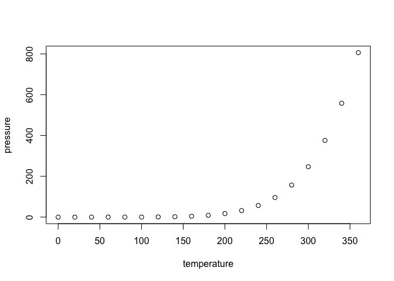

# Chapter7_problems
Stacey Harmer  
June 13, 2016  
Statistical Rethinking, Ch 7
All problems

*7E1.  For each of the causal relationships below, name a hypothetical third variable that would lead
to an interaction effect.
(1) Bread dough rises because of yeast.  
temperature; temperature determines how much effect yeast has on rise

(2) Education leads to higher income.
discipline; engineering would have a larger effect than art history

(3) Gasoline makes a car go.
type of car; distance depends upon whether a truck or a mini

7E2. Which of the following explanations invokes an interaction?
(1) Caramelizing onions requires cooking over low heat and making sure the onions do not
dry out.

7E3. For each of the explanations in 7E2, write a linear model that expresses the stated relationship
(1) Caramelizing onions requires cooking over low heat and making sure the onions do not
dry out.
carmelizaiton = alpha + temp + moisture + temp*moisture

(2) A car will go faster when it has more cylinders or when it has a better fuel injector.
rate = alpha + cyl + inj

(3) Most people acquire their political beliefs from their parents, unless they get them instead
from their friends.
belief = alpha + parent + friend

(4) Intelligent animal species tend to be either highly social or have manipulative appendages
(hands, tentacles, etc.).
intelligence = alpha + social + manip

7M1
Recall the tulips example from the chapter. Suppose another set of treatments adjusted the
temperature in the greenhouse over two levels: cold and hot. The data in the chapter were collected
at the cold temperature. You find none of the plants grown under the hot temperature developed
any blooms at all, regardless of the water and shade levels. Can you explain this result in terms of
interactions between water, shade, and temperature?

So when it is hot, it doesnt matter whether there is water or sun; the plants can't bloom.

7M2. 
Can you invent a regression equation that would make the bloom size zero, whenever the
temperature is hot?

We need to include 3 interactions, which will give us all of the below:
temp, shade, water, temp*shade, temp*water, shade*water, shade*water*temp

Not sure how to do this properly.  I could easily see that if temp = 0, I can write a term that cancels out

bloom ~ alpha + water*shade*temp  (temp = 0 when hot; alpha = 0 as well)

7M3.
In parts of North America, ravens depend upon wolves for their food. This is because ravens
are carnivorous but cannot usually kill or open carcasses of prey. Wolves however can and do kill
and tear open animals, and they tolerate ravens co-feeding at their kills. This species relationship
is generally described as a “species interaction.” Can you invent a hypothetical set of data on raven
population size in which this relationship would manifest as a statistical interaction? Do you think
the biological interaction could be linear? Why or why not?


```r
library(rethinking)
```

```
## Loading required package: rstan
```

```
## Loading required package: ggplot2
```

```
## Warning: package 'ggplot2' was built under R version 3.2.4
```

```
## rstan (Version 2.9.0-3, packaged: 2016-02-11 15:54:41 UTC, GitRev: 05c3d0058b6a)
```

```
## For execution on a local, multicore CPU with excess RAM we recommend calling
## rstan_options(auto_write = TRUE)
## options(mc.cores = parallel::detectCores())
```

```
## Loading required package: parallel
```

```
## rethinking (Version 1.58)
```

```r
### let's make up some data
# I think there could be a linear interaction: more wolves = more carcasses = more ravens
# except after a certain point more wolves won't mean more carcasses, so it should level out

wolf.numb <- 0:100
raven.numb <- 0:50
raven.numb <- c(0:50, rep(50, 50))
sim.data <- data.frame(wolf=wolf.numb, raven= raven.numb)
```

### Hard questions


## R Markdown

This is an R Markdown document. Markdown is a simple formatting syntax for authoring HTML, PDF, and MS Word documents. For more details on using R Markdown see <http://rmarkdown.rstudio.com>.

When you click the **Knit** button a document will be generated that includes both content as well as the output of any embedded R code chunks within the document. You can embed an R code chunk like this:


```r
summary(cars)
```

```
##      speed           dist       
##  Min.   : 4.0   Min.   :  2.00  
##  1st Qu.:12.0   1st Qu.: 26.00  
##  Median :15.0   Median : 36.00  
##  Mean   :15.4   Mean   : 42.98  
##  3rd Qu.:19.0   3rd Qu.: 56.00  
##  Max.   :25.0   Max.   :120.00
```

## Including Plots

You can also embed plots, for example:



Note that the `echo = FALSE` parameter was added to the code chunk to prevent printing of the R code that generated the plot.
