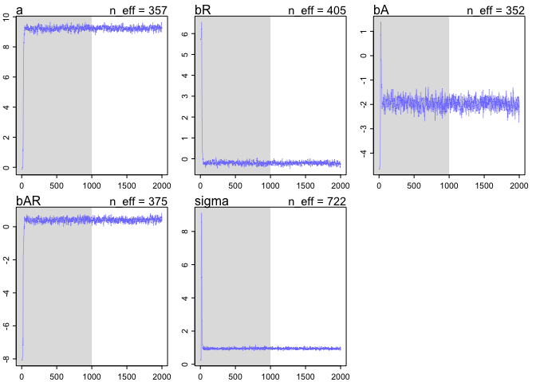
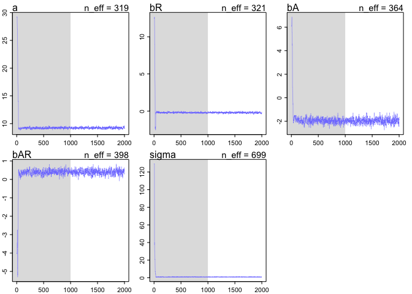

# Chapter 8 problems
Stacey Harmer  
June 17, 2016  

<<<<<<< HEAD
####8E1.  Required of simple Metropolis algorithm:  
3)  The proposal distribution must be symmetric.  (that is, probability of going A to B same as going B to A)

####8E2.  Gibbs sampling efficiency is greater than Metropolitan because it is more efficient at exploring the 
posterior disctribution; the parameter value at one moment helps adjust what the proopsed parameter values will
be.  (conjugate priors).  But maybe you don't want to use conjugate priors.  And Gibbs sampling becomes very 
inefficient when you have hundreds or thousands of parameters.
=======
###8E1.  Required of simple Metropolis algorithm:  
3)  The proposal distribution must be symmetric.  

###8E2.  Gibbs sampling efficiency is greater than Metropolitan because it is more efficient at exploring the 
posterior disctribution; the parameter value at one moment helps adjust what the proopsed parameter values will
be.  (conjugate priors)
>>>>>>> efd61fc6f9062ead1730b4b0921ff1f32704ffe3

####8E3.  HMC can't handle discrete parameters.  this is because it 'glides' through possible parameter values 
and this isn't possible with discrete parameters. 

<<<<<<< HEAD
####8E4.  
The effective number of samples, n_eff, are the effectively independent samples. Markov chains tend to be   
autocorrelated, meaning subsequent samples are not truly independent.

####8E5.  
Rhat should approach 1.00.  This is a 'convergence diagnostic'.  If greater than 1.00, it indicates the chain
has not yet converged.

####8E6.  
I'm not going to try to sketch it out using R.  But good trace plots rapidly go up and down (good mixing) and 
has stationarity (path stays within posterior distribution).  A malfunctioning chain would show spiking and 
wouldn't converge to final values.

####8m1.  
RE-estimate ruggedness model, using uniform prior and exponential prior


```r
## original model
library(rethinking)
```

```
## Loading required package: rstan
```

```
## Loading required package: ggplot2
```

```
## Loading required package: StanHeaders
```

```
## rstan (Version 2.10.1, packaged: 2016-06-24 13:22:16 UTC, GitRev: 85f7a56811da)
```

```
## For execution on a local, multicore CPU with excess RAM we recommend calling
## rstan_options(auto_write = TRUE)
## options(mc.cores = parallel::detectCores())
```

```
## Loading required package: parallel
```

```
## rethinking (Version 1.58)
```

```r
data(rugged)
d <- rugged
d$log_gdp <- log(d$rgdppc_2000)
dd <- d[ complete.cases(d$rgdppc_2000) , ]
dd.trim <- dd[ , c("log_gdp","rugged","cont_africa") ] 

m8.1stan <- map2stan( 
                      alist(
                        log_gdp ~ dnorm( mu , sigma ) ,
                        mu <- a + bR*rugged + bA*cont_africa + bAR*rugged*cont_africa ,
                        a ~ dnorm(0,100),
                        bR ~ dnorm(0,10),
                        bA ~ dnorm(0,10),
                        bAR ~ dnorm(0,10),
                        sigma ~ dcauchy(0,2)
                      ) ,
                      data=dd.trim )
```

```
## 
## SAMPLING FOR MODEL 'log_gdp ~ dnorm(mu, sigma)' NOW (CHAIN 1).
## 
## Chain 1, Iteration:    1 / 2000 [  0%]  (Warmup)
## Chain 1, Iteration:  200 / 2000 [ 10%]  (Warmup)
## Chain 1, Iteration:  400 / 2000 [ 20%]  (Warmup)
## Chain 1, Iteration:  600 / 2000 [ 30%]  (Warmup)
## Chain 1, Iteration:  800 / 2000 [ 40%]  (Warmup)
## Chain 1, Iteration: 1000 / 2000 [ 50%]  (Warmup)
## Chain 1, Iteration: 1001 / 2000 [ 50%]  (Sampling)
## Chain 1, Iteration: 1200 / 2000 [ 60%]  (Sampling)
## Chain 1, Iteration: 1400 / 2000 [ 70%]  (Sampling)
## Chain 1, Iteration: 1600 / 2000 [ 80%]  (Sampling)
## Chain 1, Iteration: 1800 / 2000 [ 90%]  (Sampling)
## Chain 1, Iteration: 2000 / 2000 [100%]  (Sampling)
##  Elapsed Time: 0.149023 seconds (Warm-up)
##                0.142235 seconds (Sampling)
##                0.291258 seconds (Total)
## 
## 
## SAMPLING FOR MODEL 'log_gdp ~ dnorm(mu, sigma)' NOW (CHAIN 1).
## WARNING: No variance estimation is
##          performed for num_warmup < 20
## 
## 
## Chain 1, Iteration: 1 / 1 [100%]  (Sampling)
##  Elapsed Time: 3e-06 seconds (Warm-up)
##                5.5e-05 seconds (Sampling)
##                5.8e-05 seconds (Total)
```

```
## Computing WAIC
```

```
## Constructing posterior predictions
```

```
## [ 100 / 1000 ]
[ 200 / 1000 ]
[ 300 / 1000 ]
[ 400 / 1000 ]
[ 500 / 1000 ]
[ 600 / 1000 ]
[ 700 / 1000 ]
[ 800 / 1000 ]
[ 900 / 1000 ]
[ 1000 / 1000 ]
```

```r
precis(m8.1stan)
```

```
##        Mean StdDev lower 0.89 upper 0.89 n_eff Rhat
## a      9.23   0.14       9.01       9.46   261    1
## bR    -0.20   0.08      -0.33      -0.08   281    1
## bA    -1.94   0.22      -2.29      -1.59   281    1
## bAR    0.39   0.13       0.17       0.59   313    1
## sigma  0.95   0.05       0.87       1.03   527    1
```

```r
# now use uniform prior for sigma
m8.1stan.sig.uni <- map2stan( 
                      alist(
                        log_gdp ~ dnorm( mu , sigma ) ,
                        mu <- a + bR*rugged + bA*cont_africa + bAR*rugged*cont_africa ,
                        a ~ dnorm(0,100),
                        bR ~ dnorm(0,10),
                        bA ~ dnorm(0,10),
                        bAR ~ dnorm(0,10),
                        sigma ~ dunif(0,10)
                      ) ,
                      data=dd.trim )
```

```
## 
## SAMPLING FOR MODEL 'log_gdp ~ dnorm(mu, sigma)' NOW (CHAIN 1).
## 
## Chain 1, Iteration:    1 / 2000 [  0%]  (Warmup)
## Chain 1, Iteration:  200 / 2000 [ 10%]  (Warmup)
## Chain 1, Iteration:  400 / 2000 [ 20%]  (Warmup)
## Chain 1, Iteration:  600 / 2000 [ 30%]  (Warmup)
## Chain 1, Iteration:  800 / 2000 [ 40%]  (Warmup)
## Chain 1, Iteration: 1000 / 2000 [ 50%]  (Warmup)
## Chain 1, Iteration: 1001 / 2000 [ 50%]  (Sampling)
## Chain 1, Iteration: 1200 / 2000 [ 60%]  (Sampling)
## Chain 1, Iteration: 1400 / 2000 [ 70%]  (Sampling)
## Chain 1, Iteration: 1600 / 2000 [ 80%]  (Sampling)
## Chain 1, Iteration: 1800 / 2000 [ 90%]  (Sampling)
## Chain 1, Iteration: 2000 / 2000 [100%]  (Sampling)
##  Elapsed Time: 0.135747 seconds (Warm-up)
##                0.1322 seconds (Sampling)
##                0.267947 seconds (Total)
## 
## 
## SAMPLING FOR MODEL 'log_gdp ~ dnorm(mu, sigma)' NOW (CHAIN 1).
## WARNING: No variance estimation is
##          performed for num_warmup < 20
## 
## 
## Chain 1, Iteration: 1 / 1 [100%]  (Sampling)
##  Elapsed Time: 4e-06 seconds (Warm-up)
##                6e-05 seconds (Sampling)
##                6.4e-05 seconds (Total)
```

```
## Computing WAIC
## Constructing posterior predictions
```

```
## [ 100 / 1000 ]
[ 200 / 1000 ]
[ 300 / 1000 ]
[ 400 / 1000 ]
[ 500 / 1000 ]
[ 600 / 1000 ]
[ 700 / 1000 ]
[ 800 / 1000 ]
[ 900 / 1000 ]
[ 1000 / 1000 ]
```

```r
precis(m8.1stan.sig.uni) # this is pretty much same as above.  maybe because lots of data in dataset?
```

```
##        Mean StdDev lower 0.89 upper 0.89 n_eff Rhat
## a      9.23   0.15       8.99       9.45   316 1.01
## bR    -0.21   0.08      -0.33      -0.07   319 1.01
## bA    -1.94   0.23      -2.34      -1.60   327 1.01
## bAR    0.39   0.13       0.19       0.63   339 1.01
## sigma  0.95   0.05       0.87       1.03   649 1.00
```

```r
dim(dd.trim)
```

```
## [1] 170   3
```

```r
# now use exponential prior for sigma
m8.1stan.sig.exp <- map2stan( 
                      alist(
                        log_gdp ~ dnorm( mu , sigma ) ,
                        mu <- a + bR*rugged + bA*cont_africa + bAR*rugged*cont_africa ,
                        a ~ dnorm(0,100),
                        bR ~ dnorm(0,10),
                        bA ~ dnorm(0,10),
                        bAR ~ dnorm(0,10),
                        sigma ~ dexp(1)
                      ) ,
                      data=dd.trim )
```

```
## 
## SAMPLING FOR MODEL 'log_gdp ~ dnorm(mu, sigma)' NOW (CHAIN 1).
## 
## Chain 1, Iteration:    1 / 2000 [  0%]  (Warmup)
## Chain 1, Iteration:  200 / 2000 [ 10%]  (Warmup)
## Chain 1, Iteration:  400 / 2000 [ 20%]  (Warmup)
## Chain 1, Iteration:  600 / 2000 [ 30%]  (Warmup)
## Chain 1, Iteration:  800 / 2000 [ 40%]  (Warmup)
## Chain 1, Iteration: 1000 / 2000 [ 50%]  (Warmup)
## Chain 1, Iteration: 1001 / 2000 [ 50%]  (Sampling)
## Chain 1, Iteration: 1200 / 2000 [ 60%]  (Sampling)
## Chain 1, Iteration: 1400 / 2000 [ 70%]  (Sampling)
## Chain 1, Iteration: 1600 / 2000 [ 80%]  (Sampling)
## Chain 1, Iteration: 1800 / 2000 [ 90%]  (Sampling)
## Chain 1, Iteration: 2000 / 2000 [100%]  (Sampling)
##  Elapsed Time: 0.155766 seconds (Warm-up)
##                0.140244 seconds (Sampling)
##                0.29601 seconds (Total)
## 
## 
## SAMPLING FOR MODEL 'log_gdp ~ dnorm(mu, sigma)' NOW (CHAIN 1).
## WARNING: No variance estimation is
##          performed for num_warmup < 20
## 
## 
## Chain 1, Iteration: 1 / 1 [100%]  (Sampling)
##  Elapsed Time: 3e-06 seconds (Warm-up)
##                5.4e-05 seconds (Sampling)
##                5.7e-05 seconds (Total)
```

```
## Computing WAIC
## Constructing posterior predictions
```

```
## [ 100 / 1000 ]
[ 200 / 1000 ]
[ 300 / 1000 ]
[ 400 / 1000 ]
[ 500 / 1000 ]
[ 600 / 1000 ]
[ 700 / 1000 ]
[ 800 / 1000 ]
[ 900 / 1000 ]
[ 1000 / 1000 ]
```

```r
precis(m8.1stan.sig.exp) # also about the same; 
```

```
##        Mean StdDev lower 0.89 upper 0.89 n_eff Rhat
## a      9.22   0.14       9.01       9.43   451    1
## bR    -0.20   0.07      -0.32      -0.09   410    1
## bA    -1.95   0.22      -2.28      -1.59   456    1
## bAR    0.39   0.13       0.19       0.59   447    1
## sigma  0.95   0.05       0.87       1.02   710    1
```

```r
compare(m8.1stan, m8.1stan.sig.uni)
```

```
##                   WAIC pWAIC dWAIC weight    SE  dSE
## m8.1stan         469.1     5   0.0   0.51 14.77   NA
## m8.1stan.sig.uni 469.1     5   0.1   0.49 14.62 0.22
```

```r
compare(m8.1stan, m8.1stan.sig.exp) 
```

```
##                   WAIC pWAIC dWAIC weight    SE  dSE
## m8.1stan.sig.exp 468.7   4.8   0.0   0.54 14.82   NA
## m8.1stan         469.1   5.0   0.3   0.46 14.77 0.26
```

```r
compare(m8.1stan.sig.uni, m8.1stan.sig.exp)  
```

```
##                   WAIC pWAIC dWAIC weight    SE  dSE
## m8.1stan.sig.exp 468.7   4.8   0.0   0.55 14.82   NA
## m8.1stan.sig.uni 469.1   5.0   0.4   0.45 14.62 0.36
```

```r
# yes all very similar
```

####8m2.  
Reduce the scale of the Cauchy and exponential priors from terrain model to see how this influences posterior.


```r
## reduce scale Cauchy
m8.1stan.cauchy.scale <- map2stan( 
                      alist(
                        log_gdp ~ dnorm( mu , sigma ) ,
                        mu <- a + bR*rugged + bA*cont_africa + bAR*rugged*cont_africa ,
                        a ~ dnorm(0,100),
                        bR ~ dnorm(0,10),
                        bA ~ dnorm(0,10),
                        bAR ~ dnorm(0,10),
                        sigma ~ dcauchy(0,0.5)
                      ) ,
                      data=dd.trim )
```

```
## 
## SAMPLING FOR MODEL 'log_gdp ~ dnorm(mu, sigma)' NOW (CHAIN 1).
## 
## Chain 1, Iteration:    1 / 2000 [  0%]  (Warmup)
## Chain 1, Iteration:  200 / 2000 [ 10%]  (Warmup)
## Chain 1, Iteration:  400 / 2000 [ 20%]  (Warmup)
## Chain 1, Iteration:  600 / 2000 [ 30%]  (Warmup)
## Chain 1, Iteration:  800 / 2000 [ 40%]  (Warmup)
## Chain 1, Iteration: 1000 / 2000 [ 50%]  (Warmup)
## Chain 1, Iteration: 1001 / 2000 [ 50%]  (Sampling)
## Chain 1, Iteration: 1200 / 2000 [ 60%]  (Sampling)
## Chain 1, Iteration: 1400 / 2000 [ 70%]  (Sampling)
## Chain 1, Iteration: 1600 / 2000 [ 80%]  (Sampling)
## Chain 1, Iteration: 1800 / 2000 [ 90%]  (Sampling)
## Chain 1, Iteration: 2000 / 2000 [100%]  (Sampling)
##  Elapsed Time: 0.161813 seconds (Warm-up)
##                0.138933 seconds (Sampling)
##                0.300746 seconds (Total)
## 
## 
## SAMPLING FOR MODEL 'log_gdp ~ dnorm(mu, sigma)' NOW (CHAIN 1).
## WARNING: No variance estimation is
##          performed for num_warmup < 20
## 
## 
## Chain 1, Iteration: 1 / 1 [100%]  (Sampling)
##  Elapsed Time: 3e-06 seconds (Warm-up)
##                5.4e-05 seconds (Sampling)
##                5.7e-05 seconds (Total)
```

```
## Computing WAIC
```

```
## Constructing posterior predictions
```

```
## [ 100 / 1000 ]
[ 200 / 1000 ]
[ 300 / 1000 ]
[ 400 / 1000 ]
[ 500 / 1000 ]
[ 600 / 1000 ]
[ 700 / 1000 ]
[ 800 / 1000 ]
[ 900 / 1000 ]
[ 1000 / 1000 ]
```

```r
precis(m8.1stan.cauchy.scale)
```

```
##        Mean StdDev lower 0.89 upper 0.89 n_eff Rhat
## a      9.22   0.14       9.01       9.43   346    1
## bR    -0.20   0.08      -0.33      -0.09   352    1
## bA    -1.95   0.22      -2.32      -1.60   355    1
## bAR    0.40   0.13       0.20       0.61   392    1
## sigma  0.94   0.05       0.86       1.02   754    1
```

```r
# looks about the same
plot(m8.1stan.cauchy.scale)

# try with more reduction in scale
m8.1stan.cauchy.scale.less <- map2stan( 
                      alist(
                        log_gdp ~ dnorm( mu , sigma ) ,
                        mu <- a + bR*rugged + bA*cont_africa + bAR*rugged*cont_africa ,
                        a ~ dnorm(0,100),
                        bR ~ dnorm(0,10),
                        bA ~ dnorm(0,10),
                        bAR ~ dnorm(0,10),
                        sigma ~ dcauchy(0,0.05)
                      ) ,
                      data=dd.trim )
```

```
## 
## SAMPLING FOR MODEL 'log_gdp ~ dnorm(mu, sigma)' NOW (CHAIN 1).
## 
## Chain 1, Iteration:    1 / 2000 [  0%]  (Warmup)
## Chain 1, Iteration:  200 / 2000 [ 10%]  (Warmup)
## Chain 1, Iteration:  400 / 2000 [ 20%]  (Warmup)
## Chain 1, Iteration:  600 / 2000 [ 30%]  (Warmup)
## Chain 1, Iteration:  800 / 2000 [ 40%]  (Warmup)
## Chain 1, Iteration: 1000 / 2000 [ 50%]  (Warmup)
## Chain 1, Iteration: 1001 / 2000 [ 50%]  (Sampling)
## Chain 1, Iteration: 1200 / 2000 [ 60%]  (Sampling)
## Chain 1, Iteration: 1400 / 2000 [ 70%]  (Sampling)
## Chain 1, Iteration: 1600 / 2000 [ 80%]  (Sampling)
## Chain 1, Iteration: 1800 / 2000 [ 90%]  (Sampling)
## Chain 1, Iteration: 2000 / 2000 [100%]  (Sampling)
##  Elapsed Time: 0.140842 seconds (Warm-up)
##                0.134021 seconds (Sampling)
##                0.274863 seconds (Total)
## 
## 
## SAMPLING FOR MODEL 'log_gdp ~ dnorm(mu, sigma)' NOW (CHAIN 1).
## WARNING: No variance estimation is
##          performed for num_warmup < 20
## 
## 
## Chain 1, Iteration: 1 / 1 [100%]  (Sampling)
##  Elapsed Time: 4e-06 seconds (Warm-up)
##                5.3e-05 seconds (Sampling)
##                5.7e-05 seconds (Total)
```

```
## Computing WAIC
## Constructing posterior predictions
```

```
## [ 100 / 1000 ]
[ 200 / 1000 ]
[ 300 / 1000 ]
[ 400 / 1000 ]
[ 500 / 1000 ]
[ 600 / 1000 ]
[ 700 / 1000 ]
[ 800 / 1000 ]
[ 900 / 1000 ]
[ 1000 / 1000 ]
```

```r
precis(m8.1stan.cauchy.scale.less)
```

```
##        Mean StdDev lower 0.89 upper 0.89 n_eff Rhat
## a      9.23   0.13       9.04       9.44   349    1
## bR    -0.21   0.07      -0.30      -0.08   318    1
## bA    -1.95   0.22      -2.27      -1.56   531    1
## bAR    0.39   0.12       0.20       0.58   335    1
## sigma  0.94   0.05       0.87       1.03   729    1
```

```r
precis(m8.1stan)
```

```
##        Mean StdDev lower 0.89 upper 0.89 n_eff Rhat
## a      9.23   0.14       9.01       9.46   261    1
## bR    -0.20   0.08      -0.33      -0.08   281    1
## bA    -1.94   0.22      -2.29      -1.59   281    1
## bAR    0.39   0.13       0.17       0.59   313    1
## sigma  0.95   0.05       0.87       1.03   527    1
```

```r
# not much difference
plot(m8.1stan.cauchy.scale.less)
```

<!-- -->

```r
# now do same with dexp

m8.1stan.sig.exp.scale <- map2stan( 
                      alist(
                        log_gdp ~ dnorm( mu , sigma ) ,
                        mu <- a + bR*rugged + bA*cont_africa + bAR*rugged*cont_africa ,
                        a ~ dnorm(0,100),
                        bR ~ dnorm(0,10),
                        bA ~ dnorm(0,10),
                        bAR ~ dnorm(0,10),
                        sigma ~ dexp(0.1)
                      ) ,
                      data=dd.trim )
```

```
## 
## SAMPLING FOR MODEL 'log_gdp ~ dnorm(mu, sigma)' NOW (CHAIN 1).
## 
## Chain 1, Iteration:    1 / 2000 [  0%]  (Warmup)
## Chain 1, Iteration:  200 / 2000 [ 10%]  (Warmup)
## Chain 1, Iteration:  400 / 2000 [ 20%]  (Warmup)
## Chain 1, Iteration:  600 / 2000 [ 30%]  (Warmup)
## Chain 1, Iteration:  800 / 2000 [ 40%]  (Warmup)
## Chain 1, Iteration: 1000 / 2000 [ 50%]  (Warmup)
## Chain 1, Iteration: 1001 / 2000 [ 50%]  (Sampling)
## Chain 1, Iteration: 1200 / 2000 [ 60%]  (Sampling)
## Chain 1, Iteration: 1400 / 2000 [ 70%]  (Sampling)
## Chain 1, Iteration: 1600 / 2000 [ 80%]  (Sampling)
## Chain 1, Iteration: 1800 / 2000 [ 90%]  (Sampling)
## Chain 1, Iteration: 2000 / 2000 [100%]  (Sampling)
##  Elapsed Time: 0.148066 seconds (Warm-up)
##                0.143155 seconds (Sampling)
##                0.291221 seconds (Total)
## 
## 
## SAMPLING FOR MODEL 'log_gdp ~ dnorm(mu, sigma)' NOW (CHAIN 1).
## WARNING: No variance estimation is
##          performed for num_warmup < 20
## 
## 
## Chain 1, Iteration: 1 / 1 [100%]  (Sampling)
##  Elapsed Time: 3e-06 seconds (Warm-up)
##                5.8e-05 seconds (Sampling)
##                6.1e-05 seconds (Total)
```

```
## Computing WAIC
## Constructing posterior predictions
```

```
## [ 100 / 1000 ]
[ 200 / 1000 ]
[ 300 / 1000 ]
[ 400 / 1000 ]
[ 500 / 1000 ]
[ 600 / 1000 ]
[ 700 / 1000 ]
[ 800 / 1000 ]
[ 900 / 1000 ]
[ 1000 / 1000 ]
```

```r
precis(m8.1stan.sig.exp.scale) # note Rhat greater than 1 for bAR
```

```
##        Mean StdDev lower 0.89 upper 0.89 n_eff Rhat
## a      9.24   0.13       9.02       9.45   299 1.00
## bR    -0.21   0.07      -0.33      -0.10   279 1.00
## bA    -1.97   0.22      -2.32      -1.62   326 1.01
## bAR    0.40   0.13       0.19       0.58   274 1.01
## sigma  0.95   0.05       0.87       1.03   534 1.00
```

```r
plot(m8.1stan.sig.exp.scale) # but looks OK
```

<!-- -->

```r
precis(m8.1stan.sig.exp)
```

```
##        Mean StdDev lower 0.89 upper 0.89 n_eff Rhat
## a      9.22   0.14       9.01       9.43   451    1
## bR    -0.20   0.07      -0.32      -0.09   410    1
## bA    -1.95   0.22      -2.28      -1.59   456    1
## bAR    0.39   0.13       0.19       0.59   447    1
## sigma  0.95   0.05       0.87       1.02   710    1
```

```r
compare(m8.1stan.sig.exp, m8.1stan.sig.exp.scale) # not so diff
```

```
##                         WAIC pWAIC dWAIC weight    SE  dSE
## m8.1stan.sig.exp.scale 468.6   4.7   0.0   0.51 14.70   NA
## m8.1stan.sig.exp       468.7   4.8   0.1   0.49 14.82 0.34
```

```r
m8.1stan.sig.exp.scale.less <- map2stan( 
                      alist(
                        log_gdp ~ dnorm( mu , sigma ) ,
                        mu <- a + bR*rugged + bA*cont_africa + bAR*rugged*cont_africa ,
                        a ~ dnorm(0,100),
                        bR ~ dnorm(0,10),
                        bA ~ dnorm(0,10),
                        bAR ~ dnorm(0,10),
                        sigma ~ dexp(0.01)
                      ) ,
                      data=dd.trim )
```

```
## 
## SAMPLING FOR MODEL 'log_gdp ~ dnorm(mu, sigma)' NOW (CHAIN 1).
## 
## Chain 1, Iteration:    1 / 2000 [  0%]  (Warmup)
## Chain 1, Iteration:  200 / 2000 [ 10%]  (Warmup)
## Chain 1, Iteration:  400 / 2000 [ 20%]  (Warmup)
## Chain 1, Iteration:  600 / 2000 [ 30%]  (Warmup)
## Chain 1, Iteration:  800 / 2000 [ 40%]  (Warmup)
## Chain 1, Iteration: 1000 / 2000 [ 50%]  (Warmup)
## Chain 1, Iteration: 1001 / 2000 [ 50%]  (Sampling)
## Chain 1, Iteration: 1200 / 2000 [ 60%]  (Sampling)
## Chain 1, Iteration: 1400 / 2000 [ 70%]  (Sampling)
## Chain 1, Iteration: 1600 / 2000 [ 80%]  (Sampling)
## Chain 1, Iteration: 1800 / 2000 [ 90%]  (Sampling)
## Chain 1, Iteration: 2000 / 2000 [100%]  (Sampling)
##  Elapsed Time: 0.140212 seconds (Warm-up)
##                0.152946 seconds (Sampling)
##                0.293158 seconds (Total)
## 
## 
## SAMPLING FOR MODEL 'log_gdp ~ dnorm(mu, sigma)' NOW (CHAIN 1).
## WARNING: No variance estimation is
##          performed for num_warmup < 20
## 
## 
## Chain 1, Iteration: 1 / 1 [100%]  (Sampling)
##  Elapsed Time: 4e-06 seconds (Warm-up)
##                5.3e-05 seconds (Sampling)
##                5.7e-05 seconds (Total)
```

```
## Computing WAIC
## Constructing posterior predictions
```

```
## [ 100 / 1000 ]
[ 200 / 1000 ]
[ 300 / 1000 ]
[ 400 / 1000 ]
[ 500 / 1000 ]
[ 600 / 1000 ]
[ 700 / 1000 ]
[ 800 / 1000 ]
[ 900 / 1000 ]
[ 1000 / 1000 ]
```

```r
precis(m8.1stan.sig.exp.scale.less) #now Rhat greater than 1 for most
```

```
##        Mean StdDev lower 0.89 upper 0.89 n_eff Rhat
## a      9.22   0.13       8.99       9.40   419    1
## bR    -0.20   0.07      -0.32      -0.08   431    1
## bA    -1.94   0.22      -2.25      -1.55   421    1
## bAR    0.39   0.12       0.19       0.57   436    1
## sigma  0.95   0.05       0.87       1.03   760    1
```

```r
plot(m8.1stan.sig.exp.scale.less) # still looks ok
```

<!-- -->

```r
# reduce even more
m8.1stan.sig.exp.scale.lesser <- map2stan( 
                      alist(
                        log_gdp ~ dnorm( mu , sigma ) ,
                        mu <- a + bR*rugged + bA*cont_africa + bAR*rugged*cont_africa ,
                        a ~ dnorm(0,100),
                        bR ~ dnorm(0,10),
                        bA ~ dnorm(0,10),
                        bAR ~ dnorm(0,10),
                        sigma ~ dexp(0.001)
                      ) ,
                      data=dd.trim )
```

```
## 
## SAMPLING FOR MODEL 'log_gdp ~ dnorm(mu, sigma)' NOW (CHAIN 1).
## 
## Chain 1, Iteration:    1 / 2000 [  0%]  (Warmup)
## Chain 1, Iteration:  200 / 2000 [ 10%]  (Warmup)
## Chain 1, Iteration:  400 / 2000 [ 20%]  (Warmup)
## Chain 1, Iteration:  600 / 2000 [ 30%]  (Warmup)
## Chain 1, Iteration:  800 / 2000 [ 40%]  (Warmup)
## Chain 1, Iteration: 1000 / 2000 [ 50%]  (Warmup)
## Chain 1, Iteration: 1001 / 2000 [ 50%]  (Sampling)
## Chain 1, Iteration: 1200 / 2000 [ 60%]  (Sampling)
## Chain 1, Iteration: 1400 / 2000 [ 70%]  (Sampling)
## Chain 1, Iteration: 1600 / 2000 [ 80%]  (Sampling)
## Chain 1, Iteration: 1800 / 2000 [ 90%]  (Sampling)
## Chain 1, Iteration: 2000 / 2000 [100%]  (Sampling)
##  Elapsed Time: 0.152696 seconds (Warm-up)
##                0.12454 seconds (Sampling)
##                0.277236 seconds (Total)
## 
## 
## SAMPLING FOR MODEL 'log_gdp ~ dnorm(mu, sigma)' NOW (CHAIN 1).
## WARNING: No variance estimation is
##          performed for num_warmup < 20
## 
## 
## Chain 1, Iteration: 1 / 1 [100%]  (Sampling)
##  Elapsed Time: 2e-06 seconds (Warm-up)
##                5.3e-05 seconds (Sampling)
##                5.5e-05 seconds (Total)
```

```
## Computing WAIC
## Constructing posterior predictions
```

```
## [ 100 / 1000 ]
[ 200 / 1000 ]
[ 300 / 1000 ]
[ 400 / 1000 ]
[ 500 / 1000 ]
[ 600 / 1000 ]
[ 700 / 1000 ]
[ 800 / 1000 ]
[ 900 / 1000 ]
[ 1000 / 1000 ]
```

```r
precis(m8.1stan.sig.exp.scale.lesser) #now Rhat greater than 1 for most
```

```
##        Mean StdDev lower 0.89 upper 0.89 n_eff Rhat
## a      9.22   0.14       9.00       9.43   417    1
## bR    -0.20   0.08      -0.32      -0.08   425    1
## bA    -1.94   0.22      -2.28      -1.59   451    1
## bAR    0.39   0.13       0.20       0.60   470    1
## sigma  0.95   0.05       0.87       1.03   771    1
```

```r
plot(m8.1stan.sig.exp.scale.lesser) # 
```

<!-- -->

```r
compare(m8.1stan.sig.exp.scale.lesser, m8.1stan.sig.exp) # pretty similar
```

```
##                                WAIC pWAIC dWAIC weight    SE  dSE
## m8.1stan.sig.exp              468.7   4.8   0.0   0.53 14.82   NA
## m8.1stan.sig.exp.scale.lesser 468.9   4.9   0.2   0.47 14.66 0.26
```

```r
# I guess in this case the choice of prior doesn't really matter that much
```

<!-- -->


####8M3  
Rerun a model with different numbers of warmup iterations


```r
test.1000 <- map2stan( 
                      alist(
                        log_gdp ~ dnorm( mu , sigma ) ,
                        mu <- a + bR*rugged + bA*cont_africa + bAR*rugged*cont_africa ,
                        a ~ dnorm(0,100),
                        bR ~ dnorm(0,10),
                        bA ~ dnorm(0,10),
                        bAR ~ dnorm(0,10),
                        sigma ~ dcauchy(0,2)
                      ) ,
                      data=dd.trim, chains=2 , iter=2000 , warmup=1000  )
```

```
## 
## SAMPLING FOR MODEL 'log_gdp ~ dnorm(mu, sigma)' NOW (CHAIN 1).
## 
## Chain 1, Iteration:    1 / 2000 [  0%]  (Warmup)
## Chain 1, Iteration:  200 / 2000 [ 10%]  (Warmup)
## Chain 1, Iteration:  400 / 2000 [ 20%]  (Warmup)
## Chain 1, Iteration:  600 / 2000 [ 30%]  (Warmup)
## Chain 1, Iteration:  800 / 2000 [ 40%]  (Warmup)
## Chain 1, Iteration: 1000 / 2000 [ 50%]  (Warmup)
## Chain 1, Iteration: 1001 / 2000 [ 50%]  (Sampling)
## Chain 1, Iteration: 1200 / 2000 [ 60%]  (Sampling)
## Chain 1, Iteration: 1400 / 2000 [ 70%]  (Sampling)
## Chain 1, Iteration: 1600 / 2000 [ 80%]  (Sampling)
## Chain 1, Iteration: 1800 / 2000 [ 90%]  (Sampling)
## Chain 1, Iteration: 2000 / 2000 [100%]  (Sampling)
##  Elapsed Time: 0.151986 seconds (Warm-up)
##                0.153073 seconds (Sampling)
##                0.305059 seconds (Total)
## 
## 
## SAMPLING FOR MODEL 'log_gdp ~ dnorm(mu, sigma)' NOW (CHAIN 2).
## 
## Chain 2, Iteration:    1 / 2000 [  0%]  (Warmup)
## Chain 2, Iteration:  200 / 2000 [ 10%]  (Warmup)
## Chain 2, Iteration:  400 / 2000 [ 20%]  (Warmup)
## Chain 2, Iteration:  600 / 2000 [ 30%]  (Warmup)
## Chain 2, Iteration:  800 / 2000 [ 40%]  (Warmup)
## Chain 2, Iteration: 1000 / 2000 [ 50%]  (Warmup)
## Chain 2, Iteration: 1001 / 2000 [ 50%]  (Sampling)
## Chain 2, Iteration: 1200 / 2000 [ 60%]  (Sampling)
## Chain 2, Iteration: 1400 / 2000 [ 70%]  (Sampling)
## Chain 2, Iteration: 1600 / 2000 [ 80%]  (Sampling)
## Chain 2, Iteration: 1800 / 2000 [ 90%]  (Sampling)
## Chain 2, Iteration: 2000 / 2000 [100%]  (Sampling)
##  Elapsed Time: 0.139654 seconds (Warm-up)
##                0.130141 seconds (Sampling)
##                0.269795 seconds (Total)
## 
## 
## SAMPLING FOR MODEL 'log_gdp ~ dnorm(mu, sigma)' NOW (CHAIN 1).
## WARNING: No variance estimation is
##          performed for num_warmup < 20
## 
## 
## Chain 1, Iteration: 1 / 1 [100%]  (Sampling)
##  Elapsed Time: 3e-06 seconds (Warm-up)
##                5.4e-05 seconds (Sampling)
##                5.7e-05 seconds (Total)
```

```
## Computing WAIC
```

```
## Constructing posterior predictions
```

```
## [ 200 / 2000 ]
[ 400 / 2000 ]
[ 600 / 2000 ]
[ 800 / 2000 ]
[ 1000 / 2000 ]
[ 1200 / 2000 ]
[ 1400 / 2000 ]
[ 1600 / 2000 ]
[ 1800 / 2000 ]
[ 2000 / 2000 ]
```

```r
precis(test.1000) # n_eff about 700
```

```
##        Mean StdDev lower 0.89 upper 0.89 n_eff Rhat
## a      9.22   0.14       9.02       9.45   892    1
## bR    -0.20   0.07      -0.32      -0.09   857    1
## bA    -1.94   0.21      -2.29      -1.62   935    1
## bAR    0.39   0.12       0.18       0.57   955    1
## sigma  0.95   0.05       0.87       1.03  1176    1
```

```r
plot(test.1000) # looks good

test.500 <- map2stan( 
                      alist(
                        log_gdp ~ dnorm( mu , sigma ) ,
                        mu <- a + bR*rugged + bA*cont_africa + bAR*rugged*cont_africa ,
                        a ~ dnorm(0,100),
                        bR ~ dnorm(0,10),
                        bA ~ dnorm(0,10),
                        bAR ~ dnorm(0,10),
                        sigma ~ dcauchy(0,2)
                      ) ,
                      data=dd.trim, chains=2 , iter=2000 , warmup=500  )
```

```
## 
## SAMPLING FOR MODEL 'log_gdp ~ dnorm(mu, sigma)' NOW (CHAIN 1).
## 
## Chain 1, Iteration:    1 / 2000 [  0%]  (Warmup)
## Chain 1, Iteration:  200 / 2000 [ 10%]  (Warmup)
## Chain 1, Iteration:  400 / 2000 [ 20%]  (Warmup)
## Chain 1, Iteration:  501 / 2000 [ 25%]  (Sampling)
## Chain 1, Iteration:  700 / 2000 [ 35%]  (Sampling)
## Chain 1, Iteration:  900 / 2000 [ 45%]  (Sampling)
## Chain 1, Iteration: 1100 / 2000 [ 55%]  (Sampling)
## Chain 1, Iteration: 1300 / 2000 [ 65%]  (Sampling)
## Chain 1, Iteration: 1500 / 2000 [ 75%]  (Sampling)
## Chain 1, Iteration: 1700 / 2000 [ 85%]  (Sampling)
## Chain 1, Iteration: 1900 / 2000 [ 95%]  (Sampling)
## Chain 1, Iteration: 2000 / 2000 [100%]  (Sampling)
##  Elapsed Time: 0.090459 seconds (Warm-up)
##                0.234941 seconds (Sampling)
##                0.3254 seconds (Total)
## 
## 
## SAMPLING FOR MODEL 'log_gdp ~ dnorm(mu, sigma)' NOW (CHAIN 2).
## 
## Chain 2, Iteration:    1 / 2000 [  0%]  (Warmup)
## Chain 2, Iteration:  200 / 2000 [ 10%]  (Warmup)
## Chain 2, Iteration:  400 / 2000 [ 20%]  (Warmup)
## Chain 2, Iteration:  501 / 2000 [ 25%]  (Sampling)
## Chain 2, Iteration:  700 / 2000 [ 35%]  (Sampling)
## Chain 2, Iteration:  900 / 2000 [ 45%]  (Sampling)
## Chain 2, Iteration: 1100 / 2000 [ 55%]  (Sampling)
## Chain 2, Iteration: 1300 / 2000 [ 65%]  (Sampling)
## Chain 2, Iteration: 1500 / 2000 [ 75%]  (Sampling)
## Chain 2, Iteration: 1700 / 2000 [ 85%]  (Sampling)
## Chain 2, Iteration: 1900 / 2000 [ 95%]  (Sampling)
## Chain 2, Iteration: 2000 / 2000 [100%]  (Sampling)
##  Elapsed Time: 0.102642 seconds (Warm-up)
##                0.240129 seconds (Sampling)
##                0.342771 seconds (Total)
## 
## 
## SAMPLING FOR MODEL 'log_gdp ~ dnorm(mu, sigma)' NOW (CHAIN 1).
## WARNING: No variance estimation is
##          performed for num_warmup < 20
## 
## 
## Chain 1, Iteration: 1 / 1 [100%]  (Sampling)
##  Elapsed Time: 5e-06 seconds (Warm-up)
##                9e-05 seconds (Sampling)
##                9.5e-05 seconds (Total)
```

```
## Computing WAIC
## Constructing posterior predictions
```

```
## [ 300 / 3000 ]
[ 600 / 3000 ]
[ 900 / 3000 ]
[ 1200 / 3000 ]
[ 1500 / 3000 ]
[ 1800 / 3000 ]
[ 2100 / 3000 ]
[ 2400 / 3000 ]
[ 2700 / 3000 ]
[ 3000 / 3000 ]
```

```r
precis(test.500) # n_eff good; about 900
```

```
##        Mean StdDev lower 0.89 upper 0.89 n_eff Rhat
## a      9.22   0.14       9.01       9.45  1026    1
## bR    -0.21   0.08      -0.34      -0.09  1023    1
## bA    -1.94   0.22      -2.32      -1.60  1072    1
## bAR    0.39   0.13       0.19       0.59  1077    1
## sigma  0.95   0.05       0.87       1.03  1894    1
```

```r
plot(test.500)
```

<!-- -->

```r
test.50 <- map2stan( 
                      alist(
                        log_gdp ~ dnorm( mu , sigma ) ,
                        mu <- a + bR*rugged + bA*cont_africa + bAR*rugged*cont_africa ,
                        a ~ dnorm(0,100),
                        bR ~ dnorm(0,10),
                        bA ~ dnorm(0,10),
                        bAR ~ dnorm(0,10),
                        sigma ~ dcauchy(0,2)
                      ) ,
                      data=dd.trim, chains=2 , iter=2000 , warmup=50  )
```

```
## 
## SAMPLING FOR MODEL 'log_gdp ~ dnorm(mu, sigma)' NOW (CHAIN 1).
## WARNING: The initial buffer, adaptation window, and terminal buffer
##          overflow the total number of warmup iterations.
##          Defaulting to a 15%/75%/10% partition,
##            init_buffer = 7
##            adapt_window = 38
##            term_buffer = 5
## 
## 
## Chain 1, Iteration:    1 / 2000 [  0%]  (Warmup)
## Chain 1, Iteration:   51 / 2000 [  2%]  (Sampling)
## Chain 1, Iteration:  250 / 2000 [ 12%]  (Sampling)
## Chain 1, Iteration:  450 / 2000 [ 22%]  (Sampling)
## Chain 1, Iteration:  650 / 2000 [ 32%]  (Sampling)
## Chain 1, Iteration:  850 / 2000 [ 42%]  (Sampling)
## Chain 1, Iteration: 1050 / 2000 [ 52%]  (Sampling)
## Chain 1, Iteration: 1250 / 2000 [ 62%]  (Sampling)
## Chain 1, Iteration: 1450 / 2000 [ 72%]  (Sampling)
## Chain 1, Iteration: 1650 / 2000 [ 82%]  (Sampling)
## Chain 1, Iteration: 1850 / 2000 [ 92%]  (Sampling)
## Chain 1, Iteration: 2000 / 2000 [100%]  (Sampling)
##  Elapsed Time: 0.019451 seconds (Warm-up)
##                0.318595 seconds (Sampling)
##                0.338046 seconds (Total)
## 
## 
## SAMPLING FOR MODEL 'log_gdp ~ dnorm(mu, sigma)' NOW (CHAIN 2).
## WARNING: The initial buffer, adaptation window, and terminal buffer
##          overflow the total number of warmup iterations.
##          Defaulting to a 15%/75%/10% partition,
##            init_buffer = 7
##            adapt_window = 38
##            term_buffer = 5
## 
## 
## Chain 2, Iteration:    1 / 2000 [  0%]  (Warmup)
## Chain 2, Iteration:   51 / 2000 [  2%]  (Sampling)
## Chain 2, Iteration:  250 / 2000 [ 12%]  (Sampling)
## Chain 2, Iteration:  450 / 2000 [ 22%]  (Sampling)
## Chain 2, Iteration:  650 / 2000 [ 32%]  (Sampling)
## Chain 2, Iteration:  850 / 2000 [ 42%]  (Sampling)
## Chain 2, Iteration: 1050 / 2000 [ 52%]  (Sampling)
## Chain 2, Iteration: 1250 / 2000 [ 62%]  (Sampling)
## Chain 2, Iteration: 1450 / 2000 [ 72%]  (Sampling)
## Chain 2, Iteration: 1650 / 2000 [ 82%]  (Sampling)
## Chain 2, Iteration: 1850 / 2000 [ 92%]  (Sampling)
## Chain 2, Iteration: 2000 / 2000 [100%]  (Sampling)
##  Elapsed Time: 0.036015 seconds (Warm-up)
##                0.259099 seconds (Sampling)
##                0.295114 seconds (Total)
## 
## 
## SAMPLING FOR MODEL 'log_gdp ~ dnorm(mu, sigma)' NOW (CHAIN 1).
## WARNING: No variance estimation is
##          performed for num_warmup < 20
## 
## 
## Chain 1, Iteration: 1 / 1 [100%]  (Sampling)
##  Elapsed Time: 3e-06 seconds (Warm-up)
##                5.4e-05 seconds (Sampling)
##                5.7e-05 seconds (Total)
```

```
## Computing WAIC
## Constructing posterior predictions
```

```
## [ 390 / 3900 ]
[ 780 / 3900 ]
[ 1170 / 3900 ]
[ 1560 / 3900 ]
[ 1950 / 3900 ]
[ 2340 / 3900 ]
[ 2730 / 3900 ]
[ 3120 / 3900 ]
[ 3510 / 3900 ]
[ 3900 / 3900 ]
```

```r
precis(test.50) # about 600 to 1300 neff, still seems OK
```

```
##        Mean StdDev lower 0.89 upper 0.89 n_eff Rhat
## a      9.20   0.40       9.01       9.43   566 1.00
## bR    -0.19   0.19      -0.31      -0.08   594 1.00
## bA    -1.97   0.44      -2.29      -1.62   285 1.01
## bAR    0.41   0.25       0.18       0.59   326 1.01
## sigma  0.97   0.34       0.87       1.04   419 1.00
```

```r
plot(test.50)
```

<!-- -->

```r
test.25 <- map2stan( 
                      alist(
                        log_gdp ~ dnorm( mu , sigma ) ,
                        mu <- a + bR*rugged + bA*cont_africa + bAR*rugged*cont_africa ,
                        a ~ dnorm(0,100),
                        bR ~ dnorm(0,10),
                        bA ~ dnorm(0,10),
                        bAR ~ dnorm(0,10),
                        sigma ~ dcauchy(0,2)
                      ) ,
                      data=dd.trim, chains=2 , iter=2000 , warmup=25  )
```

```
## 
## SAMPLING FOR MODEL 'log_gdp ~ dnorm(mu, sigma)' NOW (CHAIN 1).
## WARNING: The initial buffer, adaptation window, and terminal buffer
##          overflow the total number of warmup iterations.
##          Defaulting to a 15%/75%/10% partition,
##            init_buffer = 3
##            adapt_window = 20
##            term_buffer = 2
## 
## 
## Chain 1, Iteration:    1 / 2000 [  0%]  (Warmup)
## Chain 1, Iteration:   26 / 2000 [  1%]  (Sampling)
## Chain 1, Iteration:  225 / 2000 [ 11%]  (Sampling)
## Chain 1, Iteration:  425 / 2000 [ 21%]  (Sampling)
## Chain 1, Iteration:  625 / 2000 [ 31%]  (Sampling)
## Chain 1, Iteration:  825 / 2000 [ 41%]  (Sampling)
## Chain 1, Iteration: 1025 / 2000 [ 51%]  (Sampling)
## Chain 1, Iteration: 1225 / 2000 [ 61%]  (Sampling)
## Chain 1, Iteration: 1425 / 2000 [ 71%]  (Sampling)
## Chain 1, Iteration: 1625 / 2000 [ 81%]  (Sampling)
## Chain 1, Iteration: 1825 / 2000 [ 91%]  (Sampling)
## Chain 1, Iteration: 2000 / 2000 [100%]  (Sampling)
##  Elapsed Time: 0.005209 seconds (Warm-up)
##                0.326862 seconds (Sampling)
##                0.332071 seconds (Total)
## 
## 
## SAMPLING FOR MODEL 'log_gdp ~ dnorm(mu, sigma)' NOW (CHAIN 2).
## WARNING: The initial buffer, adaptation window, and terminal buffer
##          overflow the total number of warmup iterations.
##          Defaulting to a 15%/75%/10% partition,
##            init_buffer = 3
##            adapt_window = 20
##            term_buffer = 2
## 
## 
## Chain 2, Iteration:    1 / 2000 [  0%]  (Warmup)
## Chain 2, Iteration:   26 / 2000 [  1%]  (Sampling)
## Chain 2, Iteration:  225 / 2000 [ 11%]  (Sampling)
## Chain 2, Iteration:  425 / 2000 [ 21%]  (Sampling)
## Chain 2, Iteration:  625 / 2000 [ 31%]  (Sampling)
## Chain 2, Iteration:  825 / 2000 [ 41%]  (Sampling)
## Chain 2, Iteration: 1025 / 2000 [ 51%]  (Sampling)
## Chain 2, Iteration: 1225 / 2000 [ 61%]  (Sampling)
## Chain 2, Iteration: 1425 / 2000 [ 71%]  (Sampling)
## Chain 2, Iteration: 1625 / 2000 [ 81%]  (Sampling)
## Chain 2, Iteration: 1825 / 2000 [ 91%]  (Sampling)
## Chain 2, Iteration: 2000 / 2000 [100%]  (Sampling)
##  Elapsed Time: 0.010097 seconds (Warm-up)
##                0.388348 seconds (Sampling)
##                0.398445 seconds (Total)
## 
## 
## SAMPLING FOR MODEL 'log_gdp ~ dnorm(mu, sigma)' NOW (CHAIN 1).
## WARNING: No variance estimation is
##          performed for num_warmup < 20
## 
## 
## Chain 1, Iteration: 1 / 1 [100%]  (Sampling)
##  Elapsed Time: 3e-06 seconds (Warm-up)
##                5.3e-05 seconds (Sampling)
##                5.6e-05 seconds (Total)
```

```
## Computing WAIC
## Constructing posterior predictions
```

```
## [ 395 / 3950 ]
[ 790 / 3950 ]
[ 1185 / 3950 ]
[ 1580 / 3950 ]
[ 1975 / 3950 ]
[ 2370 / 3950 ]
[ 2765 / 3950 ]
[ 3160 / 3950 ]
[ 3555 / 3950 ]
[ 3950 / 3950 ]
```

```r
precis(test.25) # Rhat greater tahn 1 for 3 parameters; neff pretty low
```

```
##        Mean StdDev lower 0.89 upper 0.89 n_eff Rhat
## a      9.24   0.73       9.01       9.44   688 1.00
## bR    -0.23   0.55      -0.32      -0.08   178 1.01
## bA    -1.94   0.51      -2.31      -1.61   269 1.01
## bAR    0.39   0.30       0.20       0.61   467 1.00
## sigma  1.05   1.25       0.87       1.03   283 1.00
```

```r
plot(test.25)
```

<!-- -->

```r
compare(test.25, test.500) # big pWAIC differences
```

```
##           WAIC pWAIC dWAIC weight    SE  dSE
## test.500 469.1   5.0   0.0      1 14.78   NA
## test.25  493.6  15.9  24.5      0 14.70 2.34
```

```r
compare(test.50, test.500) # no pWAIC differences
```

```
##           WAIC pWAIC dWAIC weight    SE  dSE
## test.500 469.1   5.0   0.0   0.93 14.78   NA
## test.50  474.3   7.2   5.2   0.07 14.71 0.91
```

```r
## SO looks like 50 warmup iterations are enough, but 25 are not
```

<!-- -->
=======


>>>>>>> efd61fc6f9062ead1730b4b0921ff1f32704ffe3
