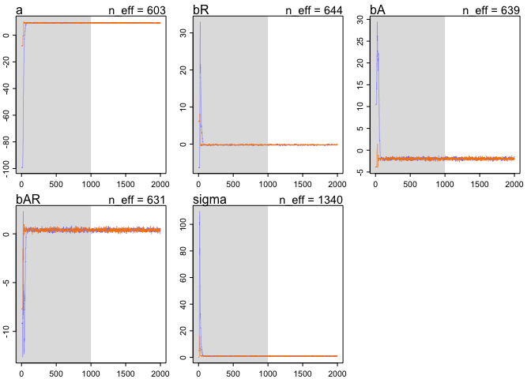

# Chapter 8 problems
Stacey Harmer  
June 17, 2016  

####8E1.  Required of simple Metropolis algorithm:  
3)  The proposal distribution must be symmetric.  (that is, probability of going A to B same as going B to A)

####8E2.  Gibbs sampling efficiency is greater than Metropolitan because it is more efficient at exploring the 
posterior disctribution; the parameter value at one moment helps adjust what the proopsed parameter values will
be.  (conjugate priors).  But maybe you don't want to use conjugate priors.  And Gibbs sampling becomes very 
inefficient when you have hundreds or thousands of parameters.

####8E3.  HMC can't handle discrete parameters.  this is because it 'glides' through possible parameter values 
and this isn't possible with discrete parameters. 

####8E4.  
The effective number of samples, n_eff, are the effectively independent samples. Markov chains tend to be autocorrelated, meaning subsequent samples are not truly independent.

####8E5.  
Rhat should approach 1.00.  This is a 'convergence diagnostic'.  If greater than 1.00, it indicates the chain has not yet converged.

####8E6.  
I'm not going to try to sketch it out using R.  But good trace plots rapidly go up and down (good mixing) and has stationarity (path stays within posterior distribution).  A malfunctioning chain would show spiking and wouldn't converge to final values.

####8m1.  
RE-estimate ruggedness model, using uniform prior and exponential prior


```r
## original model
library(rethinking)
```

```
## Loading required package: rstan
```

```
## Loading required package: ggplot2
```

```
## Loading required package: StanHeaders
```

```
## rstan (Version 2.10.1, packaged: 2016-06-24 13:22:16 UTC, GitRev: 85f7a56811da)
```

```
## For execution on a local, multicore CPU with excess RAM we recommend calling
## rstan_options(auto_write = TRUE)
## options(mc.cores = parallel::detectCores())
```

```
## Loading required package: parallel
```

```
## rethinking (Version 1.58)
```

```r
data(rugged)
d <- rugged
d$log_gdp <- log(d$rgdppc_2000)
dd <- d[ complete.cases(d$rgdppc_2000) , ]
dd.trim <- dd[ , c("log_gdp","rugged","cont_africa") ] 

m8.1stan <- map2stan( 
                      alist(
                        log_gdp ~ dnorm( mu , sigma ) ,
                        mu <- a + bR*rugged + bA*cont_africa + bAR*rugged*cont_africa ,
                        a ~ dnorm(0,100),
                        bR ~ dnorm(0,10),
                        bA ~ dnorm(0,10),
                        bAR ~ dnorm(0,10),
                        sigma ~ dcauchy(0,2)
                      ) ,
                      data=dd.trim )
```

```
## 
## SAMPLING FOR MODEL 'log_gdp ~ dnorm(mu, sigma)' NOW (CHAIN 1).
## 
## Chain 1, Iteration:    1 / 2000 [  0%]  (Warmup)
## Chain 1, Iteration:  200 / 2000 [ 10%]  (Warmup)
## Chain 1, Iteration:  400 / 2000 [ 20%]  (Warmup)
## Chain 1, Iteration:  600 / 2000 [ 30%]  (Warmup)
## Chain 1, Iteration:  800 / 2000 [ 40%]  (Warmup)
## Chain 1, Iteration: 1000 / 2000 [ 50%]  (Warmup)
## Chain 1, Iteration: 1001 / 2000 [ 50%]  (Sampling)
## Chain 1, Iteration: 1200 / 2000 [ 60%]  (Sampling)
## Chain 1, Iteration: 1400 / 2000 [ 70%]  (Sampling)
## Chain 1, Iteration: 1600 / 2000 [ 80%]  (Sampling)
## Chain 1, Iteration: 1800 / 2000 [ 90%]  (Sampling)
## Chain 1, Iteration: 2000 / 2000 [100%]  (Sampling)
##  Elapsed Time: 0.182756 seconds (Warm-up)
##                0.13219 seconds (Sampling)
##                0.314946 seconds (Total)
## 
## 
## SAMPLING FOR MODEL 'log_gdp ~ dnorm(mu, sigma)' NOW (CHAIN 1).
## WARNING: No variance estimation is
##          performed for num_warmup < 20
## 
## 
## Chain 1, Iteration: 1 / 1 [100%]  (Sampling)
##  Elapsed Time: 4e-06 seconds (Warm-up)
##                5.3e-05 seconds (Sampling)
##                5.7e-05 seconds (Total)
```

```
## Computing WAIC
```

```
## Constructing posterior predictions
```

```
## [ 100 / 1000 ]
[ 200 / 1000 ]
[ 300 / 1000 ]
[ 400 / 1000 ]
[ 500 / 1000 ]
[ 600 / 1000 ]
[ 700 / 1000 ]
[ 800 / 1000 ]
[ 900 / 1000 ]
[ 1000 / 1000 ]
```

```r
precis(m8.1stan)
```

```
##        Mean StdDev lower 0.89 upper 0.89 n_eff Rhat
## a      9.23   0.14       9.02       9.43   421    1
## bR    -0.21   0.08      -0.32      -0.08   366    1
## bA    -1.95   0.22      -2.34      -1.63   442    1
## bAR    0.40   0.13       0.21       0.61   400    1
## sigma  0.95   0.05       0.86       1.03   843    1
```

```r
# now use uniform prior for sigma
m8.1stan.sig.uni <- map2stan( 
                      alist(
                        log_gdp ~ dnorm( mu , sigma ) ,
                        mu <- a + bR*rugged + bA*cont_africa + bAR*rugged*cont_africa ,
                        a ~ dnorm(0,100),
                        bR ~ dnorm(0,10),
                        bA ~ dnorm(0,10),
                        bAR ~ dnorm(0,10),
                        sigma ~ dunif(0,10)
                      ) ,
                      data=dd.trim )
```

```
## 
## SAMPLING FOR MODEL 'log_gdp ~ dnorm(mu, sigma)' NOW (CHAIN 1).
## 
## Chain 1, Iteration:    1 / 2000 [  0%]  (Warmup)
## Chain 1, Iteration:  200 / 2000 [ 10%]  (Warmup)
## Chain 1, Iteration:  400 / 2000 [ 20%]  (Warmup)
## Chain 1, Iteration:  600 / 2000 [ 30%]  (Warmup)
## Chain 1, Iteration:  800 / 2000 [ 40%]  (Warmup)
## Chain 1, Iteration: 1000 / 2000 [ 50%]  (Warmup)
## Chain 1, Iteration: 1001 / 2000 [ 50%]  (Sampling)
## Chain 1, Iteration: 1200 / 2000 [ 60%]  (Sampling)
## Chain 1, Iteration: 1400 / 2000 [ 70%]  (Sampling)
## Chain 1, Iteration: 1600 / 2000 [ 80%]  (Sampling)
## Chain 1, Iteration: 1800 / 2000 [ 90%]  (Sampling)
## Chain 1, Iteration: 2000 / 2000 [100%]  (Sampling)
##  Elapsed Time: 0.183227 seconds (Warm-up)
##                0.204622 seconds (Sampling)
##                0.387849 seconds (Total)
## 
## 
## SAMPLING FOR MODEL 'log_gdp ~ dnorm(mu, sigma)' NOW (CHAIN 1).
## WARNING: No variance estimation is
##          performed for num_warmup < 20
## 
## 
## Chain 1, Iteration: 1 / 1 [100%]  (Sampling)
##  Elapsed Time: 2e-06 seconds (Warm-up)
##                5.7e-05 seconds (Sampling)
##                5.9e-05 seconds (Total)
```

```
## Computing WAIC
## Constructing posterior predictions
```

```
## [ 100 / 1000 ]
[ 200 / 1000 ]
[ 300 / 1000 ]
[ 400 / 1000 ]
[ 500 / 1000 ]
[ 600 / 1000 ]
[ 700 / 1000 ]
[ 800 / 1000 ]
[ 900 / 1000 ]
[ 1000 / 1000 ]
```

```r
precis(m8.1stan.sig.uni) # this is pretty much same as above.  maybe because lots of data in dataset?
```

```
##        Mean StdDev lower 0.89 upper 0.89 n_eff Rhat
## a      9.24   0.13       9.03       9.44   346 1.01
## bR    -0.21   0.07      -0.32      -0.09   421 1.00
## bA    -1.97   0.22      -2.26      -1.57   325 1.01
## bAR    0.41   0.12       0.24       0.63   371 1.00
## sigma  0.95   0.05       0.87       1.03   830 1.00
```

```r
dim(dd.trim)
```

```
## [1] 170   3
```

```r
# now use exponential prior for sigma
m8.1stan.sig.exp <- map2stan( 
                      alist(
                        log_gdp ~ dnorm( mu , sigma ) ,
                        mu <- a + bR*rugged + bA*cont_africa + bAR*rugged*cont_africa ,
                        a ~ dnorm(0,100),
                        bR ~ dnorm(0,10),
                        bA ~ dnorm(0,10),
                        bAR ~ dnorm(0,10),
                        sigma ~ dexp(1)
                      ) ,
                      data=dd.trim )
```

```
## 
## SAMPLING FOR MODEL 'log_gdp ~ dnorm(mu, sigma)' NOW (CHAIN 1).
## 
## Chain 1, Iteration:    1 / 2000 [  0%]  (Warmup)
## Chain 1, Iteration:  200 / 2000 [ 10%]  (Warmup)
## Chain 1, Iteration:  400 / 2000 [ 20%]  (Warmup)
## Chain 1, Iteration:  600 / 2000 [ 30%]  (Warmup)
## Chain 1, Iteration:  800 / 2000 [ 40%]  (Warmup)
## Chain 1, Iteration: 1000 / 2000 [ 50%]  (Warmup)
## Chain 1, Iteration: 1001 / 2000 [ 50%]  (Sampling)
## Chain 1, Iteration: 1200 / 2000 [ 60%]  (Sampling)
## Chain 1, Iteration: 1400 / 2000 [ 70%]  (Sampling)
## Chain 1, Iteration: 1600 / 2000 [ 80%]  (Sampling)
## Chain 1, Iteration: 1800 / 2000 [ 90%]  (Sampling)
## Chain 1, Iteration: 2000 / 2000 [100%]  (Sampling)
##  Elapsed Time: 0.154678 seconds (Warm-up)
##                0.14785 seconds (Sampling)
##                0.302528 seconds (Total)
## 
## 
## SAMPLING FOR MODEL 'log_gdp ~ dnorm(mu, sigma)' NOW (CHAIN 1).
## WARNING: No variance estimation is
##          performed for num_warmup < 20
## 
## 
## Chain 1, Iteration: 1 / 1 [100%]  (Sampling)
##  Elapsed Time: 3e-06 seconds (Warm-up)
##                5.3e-05 seconds (Sampling)
##                5.6e-05 seconds (Total)
```

```
## Computing WAIC
## Constructing posterior predictions
```

```
## [ 100 / 1000 ]
[ 200 / 1000 ]
[ 300 / 1000 ]
[ 400 / 1000 ]
[ 500 / 1000 ]
[ 600 / 1000 ]
[ 700 / 1000 ]
[ 800 / 1000 ]
[ 900 / 1000 ]
[ 1000 / 1000 ]
```

```r
precis(m8.1stan.sig.exp) # also about the same; 
```

```
##        Mean StdDev lower 0.89 upper 0.89 n_eff Rhat
## a      9.23   0.13       9.01       9.42   415    1
## bR    -0.21   0.07      -0.33      -0.09   411    1
## bA    -1.95   0.22      -2.33      -1.63   480    1
## bAR    0.40   0.12       0.20       0.60   443    1
## sigma  0.95   0.05       0.87       1.03   801    1
```

```r
compare(m8.1stan, m8.1stan.sig.uni)
```

```
##                   WAIC pWAIC dWAIC weight    SE  dSE
## m8.1stan.sig.uni 468.7   4.8   0.0   0.52 14.69   NA
## m8.1stan         468.9   4.9   0.2   0.48 14.80 0.35
```

```r
compare(m8.1stan, m8.1stan.sig.exp) 
```

```
##                   WAIC pWAIC dWAIC weight    SE  dSE
## m8.1stan.sig.exp 468.4   4.7   0.0   0.56 14.89   NA
## m8.1stan         468.9   4.9   0.5   0.44 14.80 0.12
```

```r
compare(m8.1stan.sig.uni, m8.1stan.sig.exp)  
```

```
##                   WAIC pWAIC dWAIC weight    SE  dSE
## m8.1stan.sig.exp 468.4   4.7   0.0   0.54 14.89   NA
## m8.1stan.sig.uni 468.7   4.8   0.3   0.46 14.69 0.37
```

```r
compare(m8.1stan, m8.1stan.sig.uni, m8.1stan.sig.exp)  
```

```
##                   WAIC pWAIC dWAIC weight    SE  dSE
## m8.1stan.sig.exp 468.4   4.7   0.0   0.38 14.89   NA
## m8.1stan.sig.uni 468.7   4.8   0.3   0.32 14.69 0.37
## m8.1stan         468.9   4.9   0.5   0.30 14.80 0.12
```

```r
# yes all very similar
```

####8m2.  
Reduce the scale of the Cauchy and exponential priors from terrain model to see how this influences posterior.


```r
## reduce scale Cauchy
m8.1stan.cauchy.scale <- map2stan( 
                      alist(
                        log_gdp ~ dnorm( mu , sigma ) ,
                        mu <- a + bR*rugged + bA*cont_africa + bAR*rugged*cont_africa ,
                        a ~ dnorm(0,100),
                        bR ~ dnorm(0,10),
                        bA ~ dnorm(0,10),
                        bAR ~ dnorm(0,10),
                        sigma ~ dcauchy(0,0.5)
                      ) ,
                      data=dd.trim )
```

```
## 
## SAMPLING FOR MODEL 'log_gdp ~ dnorm(mu, sigma)' NOW (CHAIN 1).
## 
## Chain 1, Iteration:    1 / 2000 [  0%]  (Warmup)
## Chain 1, Iteration:  200 / 2000 [ 10%]  (Warmup)
## Chain 1, Iteration:  400 / 2000 [ 20%]  (Warmup)
## Chain 1, Iteration:  600 / 2000 [ 30%]  (Warmup)
## Chain 1, Iteration:  800 / 2000 [ 40%]  (Warmup)
## Chain 1, Iteration: 1000 / 2000 [ 50%]  (Warmup)
## Chain 1, Iteration: 1001 / 2000 [ 50%]  (Sampling)
## Chain 1, Iteration: 1200 / 2000 [ 60%]  (Sampling)
## Chain 1, Iteration: 1400 / 2000 [ 70%]  (Sampling)
## Chain 1, Iteration: 1600 / 2000 [ 80%]  (Sampling)
## Chain 1, Iteration: 1800 / 2000 [ 90%]  (Sampling)
## Chain 1, Iteration: 2000 / 2000 [100%]  (Sampling)
##  Elapsed Time: 0.197034 seconds (Warm-up)
##                0.139405 seconds (Sampling)
##                0.336439 seconds (Total)
## 
## 
## SAMPLING FOR MODEL 'log_gdp ~ dnorm(mu, sigma)' NOW (CHAIN 1).
## WARNING: No variance estimation is
##          performed for num_warmup < 20
## 
## 
## Chain 1, Iteration: 1 / 1 [100%]  (Sampling)
##  Elapsed Time: 3e-06 seconds (Warm-up)
##                5.4e-05 seconds (Sampling)
##                5.7e-05 seconds (Total)
```

```
## Computing WAIC
```

```
## Constructing posterior predictions
```

```
## [ 100 / 1000 ]
[ 200 / 1000 ]
[ 300 / 1000 ]
[ 400 / 1000 ]
[ 500 / 1000 ]
[ 600 / 1000 ]
[ 700 / 1000 ]
[ 800 / 1000 ]
[ 900 / 1000 ]
[ 1000 / 1000 ]
```

```r
precis(m8.1stan.cauchy.scale)
```

```
##        Mean StdDev lower 0.89 upper 0.89 n_eff Rhat
## a      9.23   0.13       9.02       9.44   380    1
## bR    -0.20   0.08      -0.33      -0.08   392    1
## bA    -1.96   0.22      -2.33      -1.62   414    1
## bAR    0.40   0.13       0.19       0.60   413    1
## sigma  0.95   0.05       0.86       1.02   967    1
```

```r
# looks about the same
plot(m8.1stan.cauchy.scale)

# try with more reduction in scale
m8.1stan.cauchy.scale.less <- map2stan( 
                      alist(
                        log_gdp ~ dnorm( mu , sigma ) ,
                        mu <- a + bR*rugged + bA*cont_africa + bAR*rugged*cont_africa ,
                        a ~ dnorm(0,100),
                        bR ~ dnorm(0,10),
                        bA ~ dnorm(0,10),
                        bAR ~ dnorm(0,10),
                        sigma ~ dcauchy(0,0.05)
                      ) ,
                      data=dd.trim )
```

```
## 
## SAMPLING FOR MODEL 'log_gdp ~ dnorm(mu, sigma)' NOW (CHAIN 1).
## 
## Chain 1, Iteration:    1 / 2000 [  0%]  (Warmup)
## Chain 1, Iteration:  200 / 2000 [ 10%]  (Warmup)
## Chain 1, Iteration:  400 / 2000 [ 20%]  (Warmup)
## Chain 1, Iteration:  600 / 2000 [ 30%]  (Warmup)
## Chain 1, Iteration:  800 / 2000 [ 40%]  (Warmup)
## Chain 1, Iteration: 1000 / 2000 [ 50%]  (Warmup)
## Chain 1, Iteration: 1001 / 2000 [ 50%]  (Sampling)
## Chain 1, Iteration: 1200 / 2000 [ 60%]  (Sampling)
## Chain 1, Iteration: 1400 / 2000 [ 70%]  (Sampling)
## Chain 1, Iteration: 1600 / 2000 [ 80%]  (Sampling)
## Chain 1, Iteration: 1800 / 2000 [ 90%]  (Sampling)
## Chain 1, Iteration: 2000 / 2000 [100%]  (Sampling)
##  Elapsed Time: 0.151917 seconds (Warm-up)
##                0.1519 seconds (Sampling)
##                0.303817 seconds (Total)
## 
## 
## SAMPLING FOR MODEL 'log_gdp ~ dnorm(mu, sigma)' NOW (CHAIN 1).
## WARNING: No variance estimation is
##          performed for num_warmup < 20
## 
## 
## Chain 1, Iteration: 1 / 1 [100%]  (Sampling)
##  Elapsed Time: 4e-06 seconds (Warm-up)
##                5.6e-05 seconds (Sampling)
##                6e-05 seconds (Total)
```

```
## Computing WAIC
## Constructing posterior predictions
```

```
## [ 100 / 1000 ]
[ 200 / 1000 ]
[ 300 / 1000 ]
[ 400 / 1000 ]
[ 500 / 1000 ]
[ 600 / 1000 ]
[ 700 / 1000 ]
[ 800 / 1000 ]
[ 900 / 1000 ]
[ 1000 / 1000 ]
```

```r
precis(m8.1stan.cauchy.scale.less)
```

```
##        Mean StdDev lower 0.89 upper 0.89 n_eff Rhat
## a      9.24   0.13       9.03       9.44   357    1
## bR    -0.21   0.07      -0.32      -0.09   405    1
## bA    -1.97   0.21      -2.27      -1.64   352    1
## bAR    0.41   0.13       0.19       0.60   375    1
## sigma  0.95   0.05       0.86       1.03   722    1
```

```r
precis(m8.1stan)
```

```
##        Mean StdDev lower 0.89 upper 0.89 n_eff Rhat
## a      9.23   0.14       9.02       9.43   421    1
## bR    -0.21   0.08      -0.32      -0.08   366    1
## bA    -1.95   0.22      -2.34      -1.63   442    1
## bAR    0.40   0.13       0.21       0.61   400    1
## sigma  0.95   0.05       0.86       1.03   843    1
```

```r
# not much difference
plot(m8.1stan.cauchy.scale.less)
```

<!-- -->

```r
# now do same with dexp

m8.1stan.sig.exp.scale <- map2stan( 
                      alist(
                        log_gdp ~ dnorm( mu , sigma ) ,
                        mu <- a + bR*rugged + bA*cont_africa + bAR*rugged*cont_africa ,
                        a ~ dnorm(0,100),
                        bR ~ dnorm(0,10),
                        bA ~ dnorm(0,10),
                        bAR ~ dnorm(0,10),
                        sigma ~ dexp(0.1)
                      ) ,
                      data=dd.trim )
```

```
## 
## SAMPLING FOR MODEL 'log_gdp ~ dnorm(mu, sigma)' NOW (CHAIN 1).
## 
## Chain 1, Iteration:    1 / 2000 [  0%]  (Warmup)
## Chain 1, Iteration:  200 / 2000 [ 10%]  (Warmup)
## Chain 1, Iteration:  400 / 2000 [ 20%]  (Warmup)
## Chain 1, Iteration:  600 / 2000 [ 30%]  (Warmup)
## Chain 1, Iteration:  800 / 2000 [ 40%]  (Warmup)
## Chain 1, Iteration: 1000 / 2000 [ 50%]  (Warmup)
## Chain 1, Iteration: 1001 / 2000 [ 50%]  (Sampling)
## Chain 1, Iteration: 1200 / 2000 [ 60%]  (Sampling)
## Chain 1, Iteration: 1400 / 2000 [ 70%]  (Sampling)
## Chain 1, Iteration: 1600 / 2000 [ 80%]  (Sampling)
## Chain 1, Iteration: 1800 / 2000 [ 90%]  (Sampling)
## Chain 1, Iteration: 2000 / 2000 [100%]  (Sampling)
##  Elapsed Time: 0.144537 seconds (Warm-up)
##                0.131537 seconds (Sampling)
##                0.276074 seconds (Total)
## 
## 
## SAMPLING FOR MODEL 'log_gdp ~ dnorm(mu, sigma)' NOW (CHAIN 1).
## WARNING: No variance estimation is
##          performed for num_warmup < 20
## 
## 
## Chain 1, Iteration: 1 / 1 [100%]  (Sampling)
##  Elapsed Time: 2e-06 seconds (Warm-up)
##                5.4e-05 seconds (Sampling)
##                5.6e-05 seconds (Total)
```

```
## Computing WAIC
## Constructing posterior predictions
```

```
## [ 100 / 1000 ]
[ 200 / 1000 ]
[ 300 / 1000 ]
[ 400 / 1000 ]
[ 500 / 1000 ]
[ 600 / 1000 ]
[ 700 / 1000 ]
[ 800 / 1000 ]
[ 900 / 1000 ]
[ 1000 / 1000 ]
```

```r
precis(m8.1stan.sig.exp.scale) # note Rhat greater than 1 for bAR
```

```
##        Mean StdDev lower 0.89 upper 0.89 n_eff Rhat
## a      9.23   0.14       8.98       9.43   423    1
## bR    -0.21   0.08      -0.32      -0.08   468    1
## bA    -1.95   0.22      -2.29      -1.58   512    1
## bAR    0.40   0.13       0.18       0.60   494    1
## sigma  0.96   0.05       0.87       1.03   741    1
```

```r
plot(m8.1stan.sig.exp.scale) # but looks OK
```

<!-- -->

```r
precis(m8.1stan.sig.exp)
```

```
##        Mean StdDev lower 0.89 upper 0.89 n_eff Rhat
## a      9.23   0.13       9.01       9.42   415    1
## bR    -0.21   0.07      -0.33      -0.09   411    1
## bA    -1.95   0.22      -2.33      -1.63   480    1
## bAR    0.40   0.12       0.20       0.60   443    1
## sigma  0.95   0.05       0.87       1.03   801    1
```

```r
compare(m8.1stan.sig.exp, m8.1stan.sig.exp.scale) # not so diff
```

```
##                         WAIC pWAIC dWAIC weight    SE  dSE
## m8.1stan.sig.exp       468.4   4.7   0.0   0.59 14.89   NA
## m8.1stan.sig.exp.scale 469.1   4.9   0.7   0.41 14.61 0.31
```

```r
m8.1stan.sig.exp.scale.less <- map2stan( 
                      alist(
                        log_gdp ~ dnorm( mu , sigma ) ,
                        mu <- a + bR*rugged + bA*cont_africa + bAR*rugged*cont_africa ,
                        a ~ dnorm(0,100),
                        bR ~ dnorm(0,10),
                        bA ~ dnorm(0,10),
                        bAR ~ dnorm(0,10),
                        sigma ~ dexp(0.01)
                      ) ,
                      data=dd.trim )
```

```
## 
## SAMPLING FOR MODEL 'log_gdp ~ dnorm(mu, sigma)' NOW (CHAIN 1).
## 
## Chain 1, Iteration:    1 / 2000 [  0%]  (Warmup)
## Chain 1, Iteration:  200 / 2000 [ 10%]  (Warmup)
## Chain 1, Iteration:  400 / 2000 [ 20%]  (Warmup)
## Chain 1, Iteration:  600 / 2000 [ 30%]  (Warmup)
## Chain 1, Iteration:  800 / 2000 [ 40%]  (Warmup)
## Chain 1, Iteration: 1000 / 2000 [ 50%]  (Warmup)
## Chain 1, Iteration: 1001 / 2000 [ 50%]  (Sampling)
## Chain 1, Iteration: 1200 / 2000 [ 60%]  (Sampling)
## Chain 1, Iteration: 1400 / 2000 [ 70%]  (Sampling)
## Chain 1, Iteration: 1600 / 2000 [ 80%]  (Sampling)
## Chain 1, Iteration: 1800 / 2000 [ 90%]  (Sampling)
## Chain 1, Iteration: 2000 / 2000 [100%]  (Sampling)
##  Elapsed Time: 0.20284 seconds (Warm-up)
##                0.14203 seconds (Sampling)
##                0.34487 seconds (Total)
## 
## 
## SAMPLING FOR MODEL 'log_gdp ~ dnorm(mu, sigma)' NOW (CHAIN 1).
## WARNING: No variance estimation is
##          performed for num_warmup < 20
## 
## 
## Chain 1, Iteration: 1 / 1 [100%]  (Sampling)
##  Elapsed Time: 3e-06 seconds (Warm-up)
##                5.9e-05 seconds (Sampling)
##                6.2e-05 seconds (Total)
```

```
## Computing WAIC
## Constructing posterior predictions
```

```
## [ 100 / 1000 ]
[ 200 / 1000 ]
[ 300 / 1000 ]
[ 400 / 1000 ]
[ 500 / 1000 ]
[ 600 / 1000 ]
[ 700 / 1000 ]
[ 800 / 1000 ]
[ 900 / 1000 ]
[ 1000 / 1000 ]
```

```r
precis(m8.1stan.sig.exp.scale.less) #now Rhat greater than 1 for most
```

```
##        Mean StdDev lower 0.89 upper 0.89 n_eff Rhat
## a      9.23   0.14       9.02       9.46   361    1
## bR    -0.20   0.08      -0.32      -0.08   348    1
## bA    -1.95   0.23      -2.33      -1.61   336    1
## bAR    0.39   0.13       0.19       0.58   319    1
## sigma  0.95   0.05       0.87       1.04   938    1
```

```r
plot(m8.1stan.sig.exp.scale.less) # still looks ok
```

<!-- -->

```r
# reduce even more
m8.1stan.sig.exp.scale.lesser <- map2stan( 
                      alist(
                        log_gdp ~ dnorm( mu , sigma ) ,
                        mu <- a + bR*rugged + bA*cont_africa + bAR*rugged*cont_africa ,
                        a ~ dnorm(0,100),
                        bR ~ dnorm(0,10),
                        bA ~ dnorm(0,10),
                        bAR ~ dnorm(0,10),
                        sigma ~ dexp(0.001)
                      ) ,
                      data=dd.trim )
```

```
## 
## SAMPLING FOR MODEL 'log_gdp ~ dnorm(mu, sigma)' NOW (CHAIN 1).
## 
## Chain 1, Iteration:    1 / 2000 [  0%]  (Warmup)
## Chain 1, Iteration:  200 / 2000 [ 10%]  (Warmup)
## Chain 1, Iteration:  400 / 2000 [ 20%]  (Warmup)
## Chain 1, Iteration:  600 / 2000 [ 30%]  (Warmup)
## Chain 1, Iteration:  800 / 2000 [ 40%]  (Warmup)
## Chain 1, Iteration: 1000 / 2000 [ 50%]  (Warmup)
## Chain 1, Iteration: 1001 / 2000 [ 50%]  (Sampling)
## Chain 1, Iteration: 1200 / 2000 [ 60%]  (Sampling)
## Chain 1, Iteration: 1400 / 2000 [ 70%]  (Sampling)
## Chain 1, Iteration: 1600 / 2000 [ 80%]  (Sampling)
## Chain 1, Iteration: 1800 / 2000 [ 90%]  (Sampling)
## Chain 1, Iteration: 2000 / 2000 [100%]  (Sampling)
##  Elapsed Time: 0.14234 seconds (Warm-up)
##                0.180906 seconds (Sampling)
##                0.323246 seconds (Total)
```

```
## The following numerical problems occured the indicated number of times after warmup on chain 1
```

```
##                                                                                 count
## Exception thrown at line 24: normal_log: Scale parameter is 0, but must be > 0!     3
```

```
## When a numerical problem occurs, the Metropolis proposal gets rejected.
```

```
## However, by design Metropolis proposals sometimes get rejected even when there are no numerical problems.
```

```
## Thus, if the number in the 'count' column is small, do not ask about this message on stan-users.
```

```
## 
## SAMPLING FOR MODEL 'log_gdp ~ dnorm(mu, sigma)' NOW (CHAIN 1).
## WARNING: No variance estimation is
##          performed for num_warmup < 20
## 
## 
## Chain 1, Iteration: 1 / 1 [100%]  (Sampling)
##  Elapsed Time: 4e-06 seconds (Warm-up)
##                5.8e-05 seconds (Sampling)
##                6.2e-05 seconds (Total)
```

```
## Computing WAIC
```

```
## Constructing posterior predictions
```

```
## [ 100 / 1000 ]
[ 200 / 1000 ]
[ 300 / 1000 ]
[ 400 / 1000 ]
[ 500 / 1000 ]
[ 600 / 1000 ]
[ 700 / 1000 ]
[ 800 / 1000 ]
[ 900 / 1000 ]
[ 1000 / 1000 ]
```

```r
precis(m8.1stan.sig.exp.scale.lesser) #now Rhat greater than 1 for most
```

```
##        Mean StdDev lower 0.89 upper 0.89 n_eff Rhat
## a      9.23   0.14       8.97       9.43   319    1
## bR    -0.21   0.08      -0.33      -0.08   321    1
## bA    -1.96   0.23      -2.33      -1.61   364    1
## bAR    0.40   0.13       0.19       0.61   398    1
## sigma  0.95   0.05       0.86       1.03   699    1
```

```r
plot(m8.1stan.sig.exp.scale.lesser) # 
```

<!-- -->

```r
compare(m8.1stan.sig.exp.scale.lesser, m8.1stan.sig.exp) # pretty similar
```

```
##                                WAIC pWAIC dWAIC weight    SE  dSE
## m8.1stan.sig.exp              468.4   4.7   0.0    0.6 14.89   NA
## m8.1stan.sig.exp.scale.lesser 469.2   5.0   0.8    0.4 14.74 0.27
```

```r
# I guess in this case the choice of prior doesn't really matter that much
```

<!-- -->


####8M3  
Rerun a model with different numbers of warmup iterations


```r
test.1000 <- map2stan( 
                      alist(
                        log_gdp ~ dnorm( mu , sigma ) ,
                        mu <- a + bR*rugged + bA*cont_africa + bAR*rugged*cont_africa ,
                        a ~ dnorm(0,100),
                        bR ~ dnorm(0,10),
                        bA ~ dnorm(0,10),
                        bAR ~ dnorm(0,10),
                        sigma ~ dcauchy(0,2)
                      ) ,
                      data=dd.trim, chains=2 , iter=2000 , warmup=1000  )
```

```
## 
## SAMPLING FOR MODEL 'log_gdp ~ dnorm(mu, sigma)' NOW (CHAIN 1).
## 
## Chain 1, Iteration:    1 / 2000 [  0%]  (Warmup)
## Chain 1, Iteration:  200 / 2000 [ 10%]  (Warmup)
## Chain 1, Iteration:  400 / 2000 [ 20%]  (Warmup)
## Chain 1, Iteration:  600 / 2000 [ 30%]  (Warmup)
## Chain 1, Iteration:  800 / 2000 [ 40%]  (Warmup)
## Chain 1, Iteration: 1000 / 2000 [ 50%]  (Warmup)
## Chain 1, Iteration: 1001 / 2000 [ 50%]  (Sampling)
## Chain 1, Iteration: 1200 / 2000 [ 60%]  (Sampling)
## Chain 1, Iteration: 1400 / 2000 [ 70%]  (Sampling)
## Chain 1, Iteration: 1600 / 2000 [ 80%]  (Sampling)
## Chain 1, Iteration: 1800 / 2000 [ 90%]  (Sampling)
## Chain 1, Iteration: 2000 / 2000 [100%]  (Sampling)
##  Elapsed Time: 0.180571 seconds (Warm-up)
##                0.13448 seconds (Sampling)
##                0.315051 seconds (Total)
## 
## 
## SAMPLING FOR MODEL 'log_gdp ~ dnorm(mu, sigma)' NOW (CHAIN 2).
## 
## Chain 2, Iteration:    1 / 2000 [  0%]  (Warmup)
## Chain 2, Iteration:  200 / 2000 [ 10%]  (Warmup)
## Chain 2, Iteration:  400 / 2000 [ 20%]  (Warmup)
## Chain 2, Iteration:  600 / 2000 [ 30%]  (Warmup)
## Chain 2, Iteration:  800 / 2000 [ 40%]  (Warmup)
## Chain 2, Iteration: 1000 / 2000 [ 50%]  (Warmup)
## Chain 2, Iteration: 1001 / 2000 [ 50%]  (Sampling)
## Chain 2, Iteration: 1200 / 2000 [ 60%]  (Sampling)
## Chain 2, Iteration: 1400 / 2000 [ 70%]  (Sampling)
## Chain 2, Iteration: 1600 / 2000 [ 80%]  (Sampling)
## Chain 2, Iteration: 1800 / 2000 [ 90%]  (Sampling)
## Chain 2, Iteration: 2000 / 2000 [100%]  (Sampling)
##  Elapsed Time: 0.147377 seconds (Warm-up)
##                0.155578 seconds (Sampling)
##                0.302955 seconds (Total)
## 
## 
## SAMPLING FOR MODEL 'log_gdp ~ dnorm(mu, sigma)' NOW (CHAIN 1).
## WARNING: No variance estimation is
##          performed for num_warmup < 20
## 
## 
## Chain 1, Iteration: 1 / 1 [100%]  (Sampling)
##  Elapsed Time: 2e-06 seconds (Warm-up)
##                5.5e-05 seconds (Sampling)
##                5.7e-05 seconds (Total)
```

```
## Computing WAIC
```

```
## Constructing posterior predictions
```

```
## [ 200 / 2000 ]
[ 400 / 2000 ]
[ 600 / 2000 ]
[ 800 / 2000 ]
[ 1000 / 2000 ]
[ 1200 / 2000 ]
[ 1400 / 2000 ]
[ 1600 / 2000 ]
[ 1800 / 2000 ]
[ 2000 / 2000 ]
```

```r
precis(test.1000) # n_eff about 700
```

```
##        Mean StdDev lower 0.89 upper 0.89 n_eff Rhat
## a      9.22   0.13       9.00       9.42   603    1
## bR    -0.20   0.07      -0.32      -0.08   644    1
## bA    -1.95   0.22      -2.26      -1.57   639    1
## bAR    0.39   0.13       0.19       0.60   631    1
## sigma  0.95   0.05       0.88       1.03  1340    1
```

```r
plot(test.1000) # looks good

test.500 <- map2stan( 
                      alist(
                        log_gdp ~ dnorm( mu , sigma ) ,
                        mu <- a + bR*rugged + bA*cont_africa + bAR*rugged*cont_africa ,
                        a ~ dnorm(0,100),
                        bR ~ dnorm(0,10),
                        bA ~ dnorm(0,10),
                        bAR ~ dnorm(0,10),
                        sigma ~ dcauchy(0,2)
                      ) ,
                      data=dd.trim, chains=2 , iter=2000 , warmup=500  )
```

```
## 
## SAMPLING FOR MODEL 'log_gdp ~ dnorm(mu, sigma)' NOW (CHAIN 1).
## 
## Chain 1, Iteration:    1 / 2000 [  0%]  (Warmup)
## Chain 1, Iteration:  200 / 2000 [ 10%]  (Warmup)
## Chain 1, Iteration:  400 / 2000 [ 20%]  (Warmup)
## Chain 1, Iteration:  501 / 2000 [ 25%]  (Sampling)
## Chain 1, Iteration:  700 / 2000 [ 35%]  (Sampling)
## Chain 1, Iteration:  900 / 2000 [ 45%]  (Sampling)
## Chain 1, Iteration: 1100 / 2000 [ 55%]  (Sampling)
## Chain 1, Iteration: 1300 / 2000 [ 65%]  (Sampling)
## Chain 1, Iteration: 1500 / 2000 [ 75%]  (Sampling)
## Chain 1, Iteration: 1700 / 2000 [ 85%]  (Sampling)
## Chain 1, Iteration: 1900 / 2000 [ 95%]  (Sampling)
## Chain 1, Iteration: 2000 / 2000 [100%]  (Sampling)
##  Elapsed Time: 0.075878 seconds (Warm-up)
##                0.205996 seconds (Sampling)
##                0.281874 seconds (Total)
## 
## 
## SAMPLING FOR MODEL 'log_gdp ~ dnorm(mu, sigma)' NOW (CHAIN 2).
## 
## Chain 2, Iteration:    1 / 2000 [  0%]  (Warmup)
## Chain 2, Iteration:  200 / 2000 [ 10%]  (Warmup)
## Chain 2, Iteration:  400 / 2000 [ 20%]  (Warmup)
## Chain 2, Iteration:  501 / 2000 [ 25%]  (Sampling)
## Chain 2, Iteration:  700 / 2000 [ 35%]  (Sampling)
## Chain 2, Iteration:  900 / 2000 [ 45%]  (Sampling)
## Chain 2, Iteration: 1100 / 2000 [ 55%]  (Sampling)
## Chain 2, Iteration: 1300 / 2000 [ 65%]  (Sampling)
## Chain 2, Iteration: 1500 / 2000 [ 75%]  (Sampling)
## Chain 2, Iteration: 1700 / 2000 [ 85%]  (Sampling)
## Chain 2, Iteration: 1900 / 2000 [ 95%]  (Sampling)
## Chain 2, Iteration: 2000 / 2000 [100%]  (Sampling)
##  Elapsed Time: 0.107392 seconds (Warm-up)
##                0.276356 seconds (Sampling)
##                0.383748 seconds (Total)
## 
## 
## SAMPLING FOR MODEL 'log_gdp ~ dnorm(mu, sigma)' NOW (CHAIN 1).
## WARNING: No variance estimation is
##          performed for num_warmup < 20
## 
## 
## Chain 1, Iteration: 1 / 1 [100%]  (Sampling)
##  Elapsed Time: 2e-06 seconds (Warm-up)
##                5.5e-05 seconds (Sampling)
##                5.7e-05 seconds (Total)
```

```
## Computing WAIC
## Constructing posterior predictions
```

```
## [ 300 / 3000 ]
[ 600 / 3000 ]
[ 900 / 3000 ]
[ 1200 / 3000 ]
[ 1500 / 3000 ]
[ 1800 / 3000 ]
[ 2100 / 3000 ]
[ 2400 / 3000 ]
[ 2700 / 3000 ]
[ 3000 / 3000 ]
```

```r
precis(test.500) # n_eff good; about 900
```

```
##        Mean StdDev lower 0.89 upper 0.89 n_eff Rhat
## a      9.22   0.14       9.01       9.44  1082    1
## bR    -0.20   0.07      -0.32      -0.08  1133    1
## bA    -1.95   0.22      -2.28      -1.58  1239    1
## bAR    0.40   0.13       0.19       0.59  1186    1
## sigma  0.95   0.05       0.87       1.03  2339    1
```

```r
plot(test.500)
```

<!-- -->

```r
test.50 <- map2stan( 
                      alist(
                        log_gdp ~ dnorm( mu , sigma ) ,
                        mu <- a + bR*rugged + bA*cont_africa + bAR*rugged*cont_africa ,
                        a ~ dnorm(0,100),
                        bR ~ dnorm(0,10),
                        bA ~ dnorm(0,10),
                        bAR ~ dnorm(0,10),
                        sigma ~ dcauchy(0,2)
                      ) ,
                      data=dd.trim, chains=2 , iter=2000 , warmup=50  )
```

```
## 
## SAMPLING FOR MODEL 'log_gdp ~ dnorm(mu, sigma)' NOW (CHAIN 1).
## WARNING: The initial buffer, adaptation window, and terminal buffer
##          overflow the total number of warmup iterations.
##          Defaulting to a 15%/75%/10% partition,
##            init_buffer = 7
##            adapt_window = 38
##            term_buffer = 5
## 
## 
## Chain 1, Iteration:    1 / 2000 [  0%]  (Warmup)
## Chain 1, Iteration:   51 / 2000 [  2%]  (Sampling)
## Chain 1, Iteration:  250 / 2000 [ 12%]  (Sampling)
## Chain 1, Iteration:  450 / 2000 [ 22%]  (Sampling)
## Chain 1, Iteration:  650 / 2000 [ 32%]  (Sampling)
## Chain 1, Iteration:  850 / 2000 [ 42%]  (Sampling)
## Chain 1, Iteration: 1050 / 2000 [ 52%]  (Sampling)
## Chain 1, Iteration: 1250 / 2000 [ 62%]  (Sampling)
## Chain 1, Iteration: 1450 / 2000 [ 72%]  (Sampling)
## Chain 1, Iteration: 1650 / 2000 [ 82%]  (Sampling)
## Chain 1, Iteration: 1850 / 2000 [ 92%]  (Sampling)
## Chain 1, Iteration: 2000 / 2000 [100%]  (Sampling)
##  Elapsed Time: 0.004907 seconds (Warm-up)
##                0.331074 seconds (Sampling)
##                0.335981 seconds (Total)
## 
## 
## SAMPLING FOR MODEL 'log_gdp ~ dnorm(mu, sigma)' NOW (CHAIN 2).
## WARNING: The initial buffer, adaptation window, and terminal buffer
##          overflow the total number of warmup iterations.
##          Defaulting to a 15%/75%/10% partition,
##            init_buffer = 7
##            adapt_window = 38
##            term_buffer = 5
## 
## 
## Chain 2, Iteration:    1 / 2000 [  0%]  (Warmup)
## Chain 2, Iteration:   51 / 2000 [  2%]  (Sampling)
## Chain 2, Iteration:  250 / 2000 [ 12%]  (Sampling)
## Chain 2, Iteration:  450 / 2000 [ 22%]  (Sampling)
## Chain 2, Iteration:  650 / 2000 [ 32%]  (Sampling)
## Chain 2, Iteration:  850 / 2000 [ 42%]  (Sampling)
## Chain 2, Iteration: 1050 / 2000 [ 52%]  (Sampling)
## Chain 2, Iteration: 1250 / 2000 [ 62%]  (Sampling)
## Chain 2, Iteration: 1450 / 2000 [ 72%]  (Sampling)
## Chain 2, Iteration: 1650 / 2000 [ 82%]  (Sampling)
## Chain 2, Iteration: 1850 / 2000 [ 92%]  (Sampling)
## Chain 2, Iteration: 2000 / 2000 [100%]  (Sampling)
##  Elapsed Time: 0.015142 seconds (Warm-up)
##                0.292878 seconds (Sampling)
##                0.30802 seconds (Total)
## 
## 
## SAMPLING FOR MODEL 'log_gdp ~ dnorm(mu, sigma)' NOW (CHAIN 1).
## WARNING: No variance estimation is
##          performed for num_warmup < 20
## 
## 
## Chain 1, Iteration: 1 / 1 [100%]  (Sampling)
##  Elapsed Time: 3e-06 seconds (Warm-up)
##                5.3e-05 seconds (Sampling)
##                5.6e-05 seconds (Total)
```

```
## Computing WAIC
## Constructing posterior predictions
```

```
## [ 390 / 3900 ]
[ 780 / 3900 ]
[ 1170 / 3900 ]
[ 1560 / 3900 ]
[ 1950 / 3900 ]
[ 2340 / 3900 ]
[ 2730 / 3900 ]
[ 3120 / 3900 ]
[ 3510 / 3900 ]
[ 3900 / 3900 ]
```

```r
precis(test.50) # about 600 to 1300 neff, still seems OK
```

```
##        Mean StdDev lower 0.89 upper 0.89 n_eff Rhat
## a      9.22   0.14       9.00       9.43  1268    1
## bR    -0.20   0.08      -0.32      -0.08  1531    1
## bA    -1.93   0.22      -2.26      -1.56   895    1
## bAR    0.39   0.13       0.19       0.59  1303    1
## sigma  0.95   0.05       0.86       1.03  3900    1
```

```r
plot(test.50)
```

<!-- -->

```r
test.25 <- map2stan( 
                      alist(
                        log_gdp ~ dnorm( mu , sigma ) ,
                        mu <- a + bR*rugged + bA*cont_africa + bAR*rugged*cont_africa ,
                        a ~ dnorm(0,100),
                        bR ~ dnorm(0,10),
                        bA ~ dnorm(0,10),
                        bAR ~ dnorm(0,10),
                        sigma ~ dcauchy(0,2)
                      ) ,
                      data=dd.trim, chains=2 , iter=2000 , warmup=25  )
```

```
## 
## SAMPLING FOR MODEL 'log_gdp ~ dnorm(mu, sigma)' NOW (CHAIN 1).
## WARNING: The initial buffer, adaptation window, and terminal buffer
##          overflow the total number of warmup iterations.
##          Defaulting to a 15%/75%/10% partition,
##            init_buffer = 3
##            adapt_window = 20
##            term_buffer = 2
## 
## 
## Chain 1, Iteration:    1 / 2000 [  0%]  (Warmup)
## Chain 1, Iteration:   26 / 2000 [  1%]  (Sampling)
## Chain 1, Iteration:  225 / 2000 [ 11%]  (Sampling)
## Chain 1, Iteration:  425 / 2000 [ 21%]  (Sampling)
## Chain 1, Iteration:  625 / 2000 [ 31%]  (Sampling)
## Chain 1, Iteration:  825 / 2000 [ 41%]  (Sampling)
## Chain 1, Iteration: 1025 / 2000 [ 51%]  (Sampling)
## Chain 1, Iteration: 1225 / 2000 [ 61%]  (Sampling)
## Chain 1, Iteration: 1425 / 2000 [ 71%]  (Sampling)
## Chain 1, Iteration: 1625 / 2000 [ 81%]  (Sampling)
## Chain 1, Iteration: 1825 / 2000 [ 91%]  (Sampling)
## Chain 1, Iteration: 2000 / 2000 [100%]  (Sampling)
##  Elapsed Time: 0.019501 seconds (Warm-up)
##                0.246194 seconds (Sampling)
##                0.265695 seconds (Total)
## 
## 
## SAMPLING FOR MODEL 'log_gdp ~ dnorm(mu, sigma)' NOW (CHAIN 2).
## WARNING: The initial buffer, adaptation window, and terminal buffer
##          overflow the total number of warmup iterations.
##          Defaulting to a 15%/75%/10% partition,
##            init_buffer = 3
##            adapt_window = 20
##            term_buffer = 2
## 
## 
## Chain 2, Iteration:    1 / 2000 [  0%]  (Warmup)
## Chain 2, Iteration:   26 / 2000 [  1%]  (Sampling)
## Chain 2, Iteration:  225 / 2000 [ 11%]  (Sampling)
## Chain 2, Iteration:  425 / 2000 [ 21%]  (Sampling)
## Chain 2, Iteration:  625 / 2000 [ 31%]  (Sampling)
## Chain 2, Iteration:  825 / 2000 [ 41%]  (Sampling)
## Chain 2, Iteration: 1025 / 2000 [ 51%]  (Sampling)
## Chain 2, Iteration: 1225 / 2000 [ 61%]  (Sampling)
## Chain 2, Iteration: 1425 / 2000 [ 71%]  (Sampling)
## Chain 2, Iteration: 1625 / 2000 [ 81%]  (Sampling)
## Chain 2, Iteration: 1825 / 2000 [ 91%]  (Sampling)
## Chain 2, Iteration: 2000 / 2000 [100%]  (Sampling)
##  Elapsed Time: 0.004662 seconds (Warm-up)
##                0.268086 seconds (Sampling)
##                0.272748 seconds (Total)
## 
## 
## SAMPLING FOR MODEL 'log_gdp ~ dnorm(mu, sigma)' NOW (CHAIN 1).
## WARNING: No variance estimation is
##          performed for num_warmup < 20
## 
## 
## Chain 1, Iteration: 1 / 1 [100%]  (Sampling)
##  Elapsed Time: 3e-06 seconds (Warm-up)
##                6.3e-05 seconds (Sampling)
##                6.6e-05 seconds (Total)
```

```
## Computing WAIC
## Constructing posterior predictions
```

```
## [ 395 / 3950 ]
[ 790 / 3950 ]
[ 1185 / 3950 ]
[ 1580 / 3950 ]
[ 1975 / 3950 ]
[ 2370 / 3950 ]
[ 2765 / 3950 ]
[ 3160 / 3950 ]
[ 3555 / 3950 ]
[ 3950 / 3950 ]
```

```r
precis(test.25) # Rhat greater tahn 1 for 3 parameters; neff pretty low
```

```
##        Mean StdDev lower 0.89 upper 0.89 n_eff Rhat
## a      9.26   1.75       9.00       9.44   111 1.01
## bR    -0.22   0.83      -0.33      -0.08   114 1.01
## bA    -1.99   1.96      -2.32      -1.61    83 1.01
## bAR    0.41   0.91       0.16       0.59    85 1.01
## sigma  1.03   0.90       0.86       1.03   251 1.01
```

```r
plot(test.25)
```

<!-- -->

```r
compare(test.25, test.500) # big pWAIC differences
```

```
##           WAIC pWAIC dWAIC weight    SE  dSE
## test.500 468.7   4.8   0.0      1 14.69   NA
## test.25  489.9  14.0  21.3      0 14.41 0.89
```

```r
compare(test.25, test.50, test.500, test.1000) # no pWAIC differences
```

```
##            WAIC pWAIC dWAIC weight    SE  dSE
## test.1000 468.6   4.8   0.0   0.36 14.72   NA
## test.500  468.7   4.8   0.1   0.34 14.69 0.16
## test.50   468.9   4.9   0.4   0.30 14.74 0.18
## test.25   489.9  14.0  21.4   0.00 14.41 0.87
```

```r
## SO looks like 50 warmup iterations are enough, but 25 are not
```

<!-- -->


####8H1
Run the model below and then inspect the posterior distribution and explain what it is accomplishing.


```r
library(rethinking)
library(rstan)
rstan_options(auto_write = TRUE)
options(mc.cores = parallel::detectCores())

mp <- map2stan(
  alist(
  a ~ dnorm(0,1),
  b ~ dcauchy(0,1)
),
data=list(y=1),
start=list(a=0,b=0),
iter=1e4, warmup=100 , WAIC=FALSE )
```

```
## 
## SAMPLING FOR MODEL 'a ~ dnorm(0, 1)' NOW (CHAIN 1).
## WARNING: The initial buffer, adaptation window, and terminal buffer
##          overflow the total number of warmup iterations.
##          Defaulting to a 15%/75%/10% partition,
##            init_buffer = 15
##            adapt_window = 75
##            term_buffer = 10
## 
## 
## Chain 1, Iteration:    1 / 10000 [  0%]  (Warmup)
## Chain 1, Iteration:  101 / 10000 [  1%]  (Sampling)
## Chain 1, Iteration: 1100 / 10000 [ 11%]  (Sampling)
## Chain 1, Iteration: 2100 / 10000 [ 21%]  (Sampling)
## Chain 1, Iteration: 3100 / 10000 [ 31%]  (Sampling)
## Chain 1, Iteration: 4100 / 10000 [ 41%]  (Sampling)
## Chain 1, Iteration: 5100 / 10000 [ 51%]  (Sampling)
## Chain 1, Iteration: 6100 / 10000 [ 61%]  (Sampling)
## Chain 1, Iteration: 7100 / 10000 [ 71%]  (Sampling)
## Chain 1, Iteration: 8100 / 10000 [ 81%]  (Sampling)
## Chain 1, Iteration: 9100 / 10000 [ 91%]  (Sampling)
## Chain 1, Iteration: 10000 / 10000 [100%]  (Sampling)
##  Elapsed Time: 0.001222 seconds (Warm-up)
##                0.155982 seconds (Sampling)
##                0.157204 seconds (Total)
## 
## 
## SAMPLING FOR MODEL 'a ~ dnorm(0, 1)' NOW (CHAIN 1).
## WARNING: No variance estimation is
##          performed for num_warmup < 20
## 
## 
## Chain 1, Iteration: 1 / 1 [100%]  (Sampling)
##  Elapsed Time: 5e-06 seconds (Warm-up)
##                2.6e-05 seconds (Sampling)
##                3.1e-05 seconds (Total)
```

```r
#ran slowly.  I don't see a model here, just parameters

precis(mp)
```

```
##    Mean StdDev lower 0.89 upper 0.89 n_eff Rhat
## a  0.00   1.08      -1.75       1.69  9605    1
## b -2.78  66.24      -8.49       8.16   792    1
```

```r
post.mp <- extract.samples(mp)
str(post.mp) # 2 values, as expected, but even here I can see they vary wildly.
```

```
## List of 2
##  $ a: num [1:9900(1d)] -0.975 -1.024 0.331 -1.186 -0.21 ...
##  $ b: num [1:9900(1d)] 2.777 -0.619 -17.34 1.69 3.758 ...
```

```r
pairs(post.mp) # no relationship between them, but why would there be?
```

<!-- -->

```r
plot(mp) # messy.  poor stationarity/convergence.

summary(post.mp$a)  # looks like samples from the normal distribution
```

```
##      Min.   1st Qu.    Median      Mean   3rd Qu.      Max. 
## -3.574000 -0.726300 -0.014710 -0.001615  0.732400  3.935000
```

```r
summary(post.mp$b) # much 
```

```
##       Min.    1st Qu.     Median       Mean    3rd Qu.       Max. 
## -1460.0000    -1.1830    -0.0191    -2.7810     1.1800   665.4000
```

<!-- -->
I think I'm just recovering samples from the Gaussian and Cauchy distributions. 
Cauchy has long tails.  But shouldn't this be half Cauchy?  so why negative values for b?

```r
y <- rcauchy(1e4,0,5)
mu <- sapply( 1:length(y) , function(i) sum(y[1:i])/i )
plot(mu,type="l")
```

<!-- -->

####8H2
REvist models from chapter 5; Repeat that analysis, using map2stan this time, fitting models m5.1, m5.2, and m5.3.  Use compare to compare the models on the basis of
WAIC. Explain the results.


```r
library(rethinking)
library(rstan)
data(WaffleDivorce)
d <- WaffleDivorce
# standardize predictor
d$MedianAgeMarriage.s <- (d$MedianAgeMarriage-mean(d$MedianAgeMarriage))/
sd(d$MedianAgeMarriage)

# get rid of data I won't need for these models

d.trim <- d[, c(4,5,7,14)]

# fit first model
m5.1 <- map(
  alist(
    Divorce ~ dnorm( mu , sigma ) ,
    mu <- a + bA * MedianAgeMarriage.s ,
    a ~ dnorm( 10 , 10 ) ,
    bA ~ dnorm( 0 , 1 ) ,
    sigma ~ dunif( 0 , 10 )
) , data = d.trim )
precis(m5.1)
```

```
##        Mean StdDev  5.5% 94.5%
## a      9.69   0.20  9.36 10.02
## bA    -1.04   0.20 -1.37 -0.72
## sigma  1.45   0.14  1.21  1.68
```

```r
m5.1.stan <- map2stan(
  alist(
    Divorce ~ dnorm( mu , sigma ) ,
    mu <- a + bA * MedianAgeMarriage.s ,
    a ~ dnorm( 10 , 10 ) ,
    bA ~ dnorm( 0 , 1 ) ,
    sigma ~ dunif( 0 , 10 )  # I'm keepign the uniform prior, although I could have changed it to half Cauchy
) , data = d.trim )
```

```
## Warning: Variable 'MedianAgeMarriage.s' contains dots '.'.
## Will attempt to remove dots internally.
```

```
## 
## SAMPLING FOR MODEL 'Divorce ~ dnorm(mu, sigma)' NOW (CHAIN 1).
## 
## Chain 1, Iteration:    1 / 2000 [  0%]  (Warmup)
## Chain 1, Iteration:  200 / 2000 [ 10%]  (Warmup)
## Chain 1, Iteration:  400 / 2000 [ 20%]  (Warmup)
## Chain 1, Iteration:  600 / 2000 [ 30%]  (Warmup)
## Chain 1, Iteration:  800 / 2000 [ 40%]  (Warmup)
## Chain 1, Iteration: 1000 / 2000 [ 50%]  (Warmup)
## Chain 1, Iteration: 1001 / 2000 [ 50%]  (Sampling)
## Chain 1, Iteration: 1200 / 2000 [ 60%]  (Sampling)
## Chain 1, Iteration: 1400 / 2000 [ 70%]  (Sampling)
## Chain 1, Iteration: 1600 / 2000 [ 80%]  (Sampling)
## Chain 1, Iteration: 1800 / 2000 [ 90%]  (Sampling)
## Chain 1, Iteration: 2000 / 2000 [100%]  (Sampling)
##  Elapsed Time: 0.019558 seconds (Warm-up)
##                0.034093 seconds (Sampling)
##                0.053651 seconds (Total)
## 
## 
## SAMPLING FOR MODEL 'Divorce ~ dnorm(mu, sigma)' NOW (CHAIN 1).
## WARNING: No variance estimation is
##          performed for num_warmup < 20
## 
## 
## Chain 1, Iteration: 1 / 1 [100%]  (Sampling)
##  Elapsed Time: 4e-06 seconds (Warm-up)
##                4e-05 seconds (Sampling)
##                4.4e-05 seconds (Total)
```

```
## Computing WAIC
```

```
## Constructing posterior predictions
```

```
## [ 100 / 1000 ]
[ 200 / 1000 ]
[ 300 / 1000 ]
[ 400 / 1000 ]
[ 500 / 1000 ]
[ 600 / 1000 ]
[ 700 / 1000 ]
[ 800 / 1000 ]
[ 900 / 1000 ]
[ 1000 / 1000 ]
```

```r
pairs(m5.1.stan)
```

<!-- -->

```r
plot(m5.1.stan) # seems OK
```

<!-- -->

```r
compare(m5.1, m5.1.stan)
```

```
## Warning in compare(m5.1, m5.1.stan): Not all model fits of same class.
## This is usually a bad idea, because it implies they were fit by different algorithms.
## Check yourself, before you wreck yourself.
```

```
##            WAIC pWAIC dWAIC weight   SE  dSE
## m5.1.stan 186.3   3.8   0.0   0.61 12.3   NA
## m5.1      187.2   4.5   0.9   0.39 14.1 1.83
```

```r
# these are very similar.  
par(mfrow=c(1,1)) 
plot( compare(m5.1, m5.1.stan) , SE=TRUE , dSE=TRUE )  # very similar
```

```
## Warning in compare(m5.1, m5.1.stan): Not all model fits of same class.
## This is usually a bad idea, because it implies they were fit by different algorithms.
## Check yourself, before you wreck yourself.
```

<!-- -->

```r
# now the second model
d.trim$Marriage.s <- (d.trim$Marriage - mean(d.trim$Marriage))/sd(d.trim$Marriage)
m5.2 <- map(
  alist(
    Divorce ~ dnorm( mu , sigma ) ,
    mu <- a + bR * Marriage.s ,
    a ~ dnorm( 10 , 10 ) ,
    bR ~ dnorm( 0 , 1 ) ,
    sigma ~ dunif( 0 , 10 )
) , data = d.trim )

m5.2.stan <- map2stan(
  alist(
    Divorce ~ dnorm( mu , sigma ) ,
    mu <- a + bR * Marriage.s ,
    a ~ dnorm( 10 , 10 ) ,
    bR ~ dnorm( 0 , 1 ) ,
    sigma ~ dunif( 0 , 10 )
) , data = d.trim )
```

```
## Warning: Variable 'MedianAgeMarriage.s' contains dots '.'.
## Will attempt to remove dots internally.
```

```
## Warning: Variable 'Marriage.s' contains dots '.'.
## Will attempt to remove dots internally.
```

```
## 
## SAMPLING FOR MODEL 'Divorce ~ dnorm(mu, sigma)' NOW (CHAIN 1).
## 
## Chain 1, Iteration:    1 / 2000 [  0%]  (Warmup)
## Chain 1, Iteration:  200 / 2000 [ 10%]  (Warmup)
## Chain 1, Iteration:  400 / 2000 [ 20%]  (Warmup)
## Chain 1, Iteration:  600 / 2000 [ 30%]  (Warmup)
## Chain 1, Iteration:  800 / 2000 [ 40%]  (Warmup)
## Chain 1, Iteration: 1000 / 2000 [ 50%]  (Warmup)
## Chain 1, Iteration: 1001 / 2000 [ 50%]  (Sampling)
## Chain 1, Iteration: 1200 / 2000 [ 60%]  (Sampling)
## Chain 1, Iteration: 1400 / 2000 [ 70%]  (Sampling)
## Chain 1, Iteration: 1600 / 2000 [ 80%]  (Sampling)
## Chain 1, Iteration: 1800 / 2000 [ 90%]  (Sampling)
## Chain 1, Iteration: 2000 / 2000 [100%]  (Sampling)
##  Elapsed Time: 0.023935 seconds (Warm-up)
##                0.018091 seconds (Sampling)
##                0.042026 seconds (Total)
## 
## 
## SAMPLING FOR MODEL 'Divorce ~ dnorm(mu, sigma)' NOW (CHAIN 1).
## WARNING: No variance estimation is
##          performed for num_warmup < 20
## 
## 
## Chain 1, Iteration: 1 / 1 [100%]  (Sampling)
##  Elapsed Time: 3e-06 seconds (Warm-up)
##                2.9e-05 seconds (Sampling)
##                3.2e-05 seconds (Total)
```

```
## Computing WAIC
```

```
## Constructing posterior predictions
```

```
## [ 100 / 1000 ]
[ 200 / 1000 ]
[ 300 / 1000 ]
[ 400 / 1000 ]
[ 500 / 1000 ]
[ 600 / 1000 ]
[ 700 / 1000 ]
[ 800 / 1000 ]
[ 900 / 1000 ]
[ 1000 / 1000 ]
```

```r
pairs(m5.2.stan)
```

<!-- -->

```r
plot(m5.2.stan) # seems OK
```

<!-- -->

```r
compare(m5.2, m5.2.stan)  # again, almost identical
```

```
## Warning in compare(m5.2, m5.2.stan): Not all model fits of same class.
## This is usually a bad idea, because it implies they were fit by different algorithms.
## Check yourself, before you wreck yourself.
```

```
##            WAIC pWAIC dWAIC weight    SE  dSE
## m5.2.stan 200.6   3.5     0    0.5  9.65   NA
## m5.2      200.6   3.8     0    0.5 10.76 1.13
```

```r
plot( compare(m5.2, m5.2.stan) , SE=TRUE , dSE=TRUE )  # very similar
```

```
## Warning in compare(m5.2, m5.2.stan): Not all model fits of same class.
## This is usually a bad idea, because it implies they were fit by different algorithms.
## Check yourself, before you wreck yourself.
```

```r
# last model; incorporate marriage age and marriage rate

m5.3 <- map(
  alist(
    Divorce ~ dnorm( mu , sigma ) ,
    mu <- a + bR*Marriage.s + bA*MedianAgeMarriage.s ,
    a ~ dnorm( 10 , 10 ) ,
    bR ~ dnorm( 0 , 1 ) ,
    bA ~ dnorm( 0 , 1 ) ,
    sigma ~ dunif( 0 , 10 )
) ,
data = d.trim)

m5.3.stan <- map2stan(
  alist(
    Divorce ~ dnorm( mu , sigma ) ,
    mu <- a + bR*Marriage.s + bA*MedianAgeMarriage.s ,
    a ~ dnorm( 10 , 10 ) ,
    bR ~ dnorm( 0 , 1 ) ,
    bA ~ dnorm( 0 , 1 ) ,
    sigma ~ dunif( 0 , 10 )
) ,
data = d.trim)
```

```
## Warning: Variable 'MedianAgeMarriage.s' contains dots '.'.
## Will attempt to remove dots internally.
```

```
## Warning: Variable 'Marriage.s' contains dots '.'.
## Will attempt to remove dots internally.
```

```
## 
## SAMPLING FOR MODEL 'Divorce ~ dnorm(mu, sigma)' NOW (CHAIN 1).
## 
## Chain 1, Iteration:    1 / 2000 [  0%]  (Warmup)
## Chain 1, Iteration:  200 / 2000 [ 10%]  (Warmup)
## Chain 1, Iteration:  400 / 2000 [ 20%]  (Warmup)
## Chain 1, Iteration:  600 / 2000 [ 30%]  (Warmup)
## Chain 1, Iteration:  800 / 2000 [ 40%]  (Warmup)
## Chain 1, Iteration: 1000 / 2000 [ 50%]  (Warmup)
## Chain 1, Iteration: 1001 / 2000 [ 50%]  (Sampling)
## Chain 1, Iteration: 1200 / 2000 [ 60%]  (Sampling)
## Chain 1, Iteration: 1400 / 2000 [ 70%]  (Sampling)
## Chain 1, Iteration: 1600 / 2000 [ 80%]  (Sampling)
## Chain 1, Iteration: 1800 / 2000 [ 90%]  (Sampling)
## Chain 1, Iteration: 2000 / 2000 [100%]  (Sampling)
##  Elapsed Time: 0.037248 seconds (Warm-up)
##                0.03014 seconds (Sampling)
##                0.067388 seconds (Total)
## 
## 
## SAMPLING FOR MODEL 'Divorce ~ dnorm(mu, sigma)' NOW (CHAIN 1).
## WARNING: No variance estimation is
##          performed for num_warmup < 20
## 
## 
## Chain 1, Iteration: 1 / 1 [100%]  (Sampling)
##  Elapsed Time: 4e-06 seconds (Warm-up)
##                4.4e-05 seconds (Sampling)
##                4.8e-05 seconds (Total)
```

```
## Computing WAIC
```

```
## Constructing posterior predictions
```

```
## [ 100 / 1000 ]
[ 200 / 1000 ]
[ 300 / 1000 ]
[ 400 / 1000 ]
[ 500 / 1000 ]
[ 600 / 1000 ]
[ 700 / 1000 ]
[ 800 / 1000 ]
[ 900 / 1000 ]
[ 1000 / 1000 ]
```

```r
precis( m5.3.stan )
```

```
##        Mean StdDev lower 0.89 upper 0.89 n_eff Rhat
## a      9.68   0.23       9.33      10.06   761    1
## bR    -0.13   0.29      -0.60       0.30   563    1
## bA    -1.14   0.29      -1.63      -0.71   544    1
## sigma  1.54   0.16       1.28       1.78   797    1
```

```r
pairs(m5.3.stan)  # now, correlation between bR and bA.
```

<!-- --><!-- -->

```r
plot(m5.3.stan) # seems OK
compare(m5.3, m5.3.stan)  # again, almost identical
```

```
## Warning in compare(m5.3, m5.3.stan): Not all model fits of same class.
## This is usually a bad idea, because it implies they were fit by different algorithms.
## Check yourself, before you wreck yourself.
```

```
##            WAIC pWAIC dWAIC weight    SE  dSE
## m5.3.stan 188.2   4.9   0.0    0.7 12.35   NA
## m5.3      189.8   6.1   1.7    0.3 14.85 2.55
```

```r
par(mfrow=c(1,1)) 
```

<!-- -->

```r
plot( compare(m5.3, m5.3.stan) , SE=TRUE , dSE=TRUE )  # very similar
```

```
## Warning in compare(m5.3, m5.3.stan): Not all model fits of same class.
## This is usually a bad idea, because it implies they were fit by different algorithms.
## Check yourself, before you wreck yourself.
```

<!-- -->

```r
## so doesn't matter in this case whether you use MCMC or not.
```


####8H3
Changing parameters. 


```r
N <- 100 # number of individuals
height <- rnorm(N,10,2) # sim total height of each
leg_prop <- runif(N,0.4,0.5) # leg as proportion of height
leg_left <- leg_prop*height + # sim left leg as proportion + error
rnorm( N , 0 , 0.02 )
leg_right <- leg_prop*height + # sim right leg as proportion + error
rnorm( N , 0 , 0.02 )
# combine into data frame
d <- data.frame(height,leg_left,leg_right)

# fit model using stan

m5.8s <- map2stan(
  alist(
    height ~ dnorm( mu , sigma ) ,
    mu <- a + bl*leg_left + br*leg_right ,
    a ~ dnorm( 10 , 100 ) ,
    bl ~ dnorm( 2 , 10 ) ,
    br ~ dnorm( 2 , 10 ) ,
    sigma ~ dcauchy( 0 , 1 )
) ,
data=d, chains=4,
start=list(a=10,bl=0,br=0,sigma=1) )
```

```
## 
## SAMPLING FOR MODEL 'height ~ dnorm(mu, sigma)' NOW (CHAIN 1).
## 
## Chain 1, Iteration:    1 / 2000 [  0%]  (Warmup)
## Chain 1, Iteration:  200 / 2000 [ 10%]  (Warmup)
## Chain 1, Iteration:  400 / 2000 [ 20%]  (Warmup)
## Chain 1, Iteration:  600 / 2000 [ 30%]  (Warmup)
## Chain 1, Iteration:  800 / 2000 [ 40%]  (Warmup)
## Chain 1, Iteration: 1000 / 2000 [ 50%]  (Warmup)
## Chain 1, Iteration: 1001 / 2000 [ 50%]  (Sampling)
## Chain 1, Iteration: 1200 / 2000 [ 60%]  (Sampling)
## Chain 1, Iteration: 1400 / 2000 [ 70%]  (Sampling)
## Chain 1, Iteration: 1600 / 2000 [ 80%]  (Sampling)
## Chain 1, Iteration: 1800 / 2000 [ 90%]  (Sampling)
## Chain 1, Iteration: 2000 / 2000 [100%]  (Sampling)
##  Elapsed Time: 2.503 seconds (Warm-up)
##                2.9954 seconds (Sampling)
##                5.49839 seconds (Total)
## 
## 
## SAMPLING FOR MODEL 'height ~ dnorm(mu, sigma)' NOW (CHAIN 2).
## 
## Chain 2, Iteration:    1 / 2000 [  0%]  (Warmup)
## Chain 2, Iteration:  200 / 2000 [ 10%]  (Warmup)
## Chain 2, Iteration:  400 / 2000 [ 20%]  (Warmup)
## Chain 2, Iteration:  600 / 2000 [ 30%]  (Warmup)
## Chain 2, Iteration:  800 / 2000 [ 40%]  (Warmup)
## Chain 2, Iteration: 1000 / 2000 [ 50%]  (Warmup)
## Chain 2, Iteration: 1001 / 2000 [ 50%]  (Sampling)
## Chain 2, Iteration: 1200 / 2000 [ 60%]  (Sampling)
## Chain 2, Iteration: 1400 / 2000 [ 70%]  (Sampling)
## Chain 2, Iteration: 1600 / 2000 [ 80%]  (Sampling)
## Chain 2, Iteration: 1800 / 2000 [ 90%]  (Sampling)
## Chain 2, Iteration: 2000 / 2000 [100%]  (Sampling)
##  Elapsed Time: 2.09692 seconds (Warm-up)
##                2.4162 seconds (Sampling)
##                4.51312 seconds (Total)
## 
## 
## SAMPLING FOR MODEL 'height ~ dnorm(mu, sigma)' NOW (CHAIN 3).
## 
## Chain 3, Iteration:    1 / 2000 [  0%]  (Warmup)
## Chain 3, Iteration:  200 / 2000 [ 10%]  (Warmup)
## Chain 3, Iteration:  400 / 2000 [ 20%]  (Warmup)
## Chain 3, Iteration:  600 / 2000 [ 30%]  (Warmup)
## Chain 3, Iteration:  800 / 2000 [ 40%]  (Warmup)
## Chain 3, Iteration: 1000 / 2000 [ 50%]  (Warmup)
## Chain 3, Iteration: 1001 / 2000 [ 50%]  (Sampling)
## Chain 3, Iteration: 1200 / 2000 [ 60%]  (Sampling)
## Chain 3, Iteration: 1400 / 2000 [ 70%]  (Sampling)
## Chain 3, Iteration: 1600 / 2000 [ 80%]  (Sampling)
## Chain 3, Iteration: 1800 / 2000 [ 90%]  (Sampling)
## Chain 3, Iteration: 2000 / 2000 [100%]  (Sampling)
##  Elapsed Time: 2.25991 seconds (Warm-up)
##                2.64275 seconds (Sampling)
##                4.90266 seconds (Total)
## 
## 
## SAMPLING FOR MODEL 'height ~ dnorm(mu, sigma)' NOW (CHAIN 4).
## 
## Chain 4, Iteration:    1 / 2000 [  0%]  (Warmup)
## Chain 4, Iteration:  200 / 2000 [ 10%]  (Warmup)
## Chain 4, Iteration:  400 / 2000 [ 20%]  (Warmup)
## Chain 4, Iteration:  600 / 2000 [ 30%]  (Warmup)
## Chain 4, Iteration:  800 / 2000 [ 40%]  (Warmup)
## Chain 4, Iteration: 1000 / 2000 [ 50%]  (Warmup)
## Chain 4, Iteration: 1001 / 2000 [ 50%]  (Sampling)
## Chain 4, Iteration: 1200 / 2000 [ 60%]  (Sampling)
## Chain 4, Iteration: 1400 / 2000 [ 70%]  (Sampling)
## Chain 4, Iteration: 1600 / 2000 [ 80%]  (Sampling)
## Chain 4, Iteration: 1800 / 2000 [ 90%]  (Sampling)
## Chain 4, Iteration: 2000 / 2000 [100%]  (Sampling)
##  Elapsed Time: 2.08786 seconds (Warm-up)
##                3.15885 seconds (Sampling)
##                5.24671 seconds (Total)
## 
## 
## SAMPLING FOR MODEL 'height ~ dnorm(mu, sigma)' NOW (CHAIN 1).
## WARNING: No variance estimation is
##          performed for num_warmup < 20
## 
## 
## Chain 1, Iteration: 1 / 1 [100%]  (Sampling)
##  Elapsed Time: 3e-06 seconds (Warm-up)
##                4.4e-05 seconds (Sampling)
##                4.7e-05 seconds (Total)
```

```
## Computing WAIC
```

```
## Constructing posterior predictions
```

```
## [ 400 / 4000 ]
[ 800 / 4000 ]
[ 1200 / 4000 ]
[ 1600 / 4000 ]
[ 2000 / 4000 ]
[ 2400 / 4000 ]
[ 2800 / 4000 ]
[ 3200 / 4000 ]
[ 3600 / 4000 ]
[ 4000 / 4000 ]
```

```r
plot(m5.8s) # this looks OK
pairs(m5.8s) # br and bl are totally correlated
```

<!-- --><!-- -->

```r
# as above, but make is so that br must be positive (makes sense, no?)
m5.8s2 <- map2stan( 
  alist(
    height ~ dnorm( mu , sigma ) ,
    mu <- a + bl*leg_left + br*leg_right ,
    a ~ dnorm( 10 , 100 ) ,
    bl ~ dnorm( 2 , 10 ) ,
    br ~ dnorm( 2 , 10 ) & T[0,] ,
    sigma ~ dcauchy( 0 , 1 )
) ,
data=d, chains=4,
start=list(a=10,bl=0,br=0,sigma=1) )
```

```
## 
## SAMPLING FOR MODEL 'height ~ dnorm(mu, sigma)' NOW (CHAIN 1).
## 
## Chain 1, Iteration:    1 / 2000 [  0%]  (Warmup)
## Chain 1, Iteration:  200 / 2000 [ 10%]  (Warmup)
## Chain 1, Iteration:  400 / 2000 [ 20%]  (Warmup)
## Chain 1, Iteration:  600 / 2000 [ 30%]  (Warmup)
## Chain 1, Iteration:  800 / 2000 [ 40%]  (Warmup)
## Chain 1, Iteration: 1000 / 2000 [ 50%]  (Warmup)
## Chain 1, Iteration: 1001 / 2000 [ 50%]  (Sampling)
## Chain 1, Iteration: 1200 / 2000 [ 60%]  (Sampling)
## Chain 1, Iteration: 1400 / 2000 [ 70%]  (Sampling)
## Chain 1, Iteration: 1600 / 2000 [ 80%]  (Sampling)
## Chain 1, Iteration: 1800 / 2000 [ 90%]  (Sampling)
## Chain 1, Iteration: 2000 / 2000 [100%]  (Sampling)
##  Elapsed Time: 1.02298 seconds (Warm-up)
##                1.50659 seconds (Sampling)
##                2.52957 seconds (Total)
## 
## 
## SAMPLING FOR MODEL 'height ~ dnorm(mu, sigma)' NOW (CHAIN 2).
## 
## Chain 2, Iteration:    1 / 2000 [  0%]  (Warmup)
## Chain 2, Iteration:  200 / 2000 [ 10%]  (Warmup)
## Chain 2, Iteration:  400 / 2000 [ 20%]  (Warmup)
## Chain 2, Iteration:  600 / 2000 [ 30%]  (Warmup)
## Chain 2, Iteration:  800 / 2000 [ 40%]  (Warmup)
## Chain 2, Iteration: 1000 / 2000 [ 50%]  (Warmup)
## Chain 2, Iteration: 1001 / 2000 [ 50%]  (Sampling)
## Chain 2, Iteration: 1200 / 2000 [ 60%]  (Sampling)
## Chain 2, Iteration: 1400 / 2000 [ 70%]  (Sampling)
## Chain 2, Iteration: 1600 / 2000 [ 80%]  (Sampling)
## Chain 2, Iteration: 1800 / 2000 [ 90%]  (Sampling)
## Chain 2, Iteration: 2000 / 2000 [100%]  (Sampling)
##  Elapsed Time: 0.851744 seconds (Warm-up)
##                1.37136 seconds (Sampling)
##                2.22311 seconds (Total)
## 
## 
## SAMPLING FOR MODEL 'height ~ dnorm(mu, sigma)' NOW (CHAIN 3).
## 
## Chain 3, Iteration:    1 / 2000 [  0%]  (Warmup)
## Chain 3, Iteration:  200 / 2000 [ 10%]  (Warmup)
## Chain 3, Iteration:  400 / 2000 [ 20%]  (Warmup)
## Chain 3, Iteration:  600 / 2000 [ 30%]  (Warmup)
## Chain 3, Iteration:  800 / 2000 [ 40%]  (Warmup)
## Chain 3, Iteration: 1000 / 2000 [ 50%]  (Warmup)
## Chain 3, Iteration: 1001 / 2000 [ 50%]  (Sampling)
## Chain 3, Iteration: 1200 / 2000 [ 60%]  (Sampling)
## Chain 3, Iteration: 1400 / 2000 [ 70%]  (Sampling)
## Chain 3, Iteration: 1600 / 2000 [ 80%]  (Sampling)
## Chain 3, Iteration: 1800 / 2000 [ 90%]  (Sampling)
## Chain 3, Iteration: 2000 / 2000 [100%]  (Sampling)
##  Elapsed Time: 1.16523 seconds (Warm-up)
##                1.55808 seconds (Sampling)
##                2.72331 seconds (Total)
## 
## 
## SAMPLING FOR MODEL 'height ~ dnorm(mu, sigma)' NOW (CHAIN 4).
## 
## Chain 4, Iteration:    1 / 2000 [  0%]  (Warmup)
## Chain 4, Iteration:  200 / 2000 [ 10%]  (Warmup)
## Chain 4, Iteration:  400 / 2000 [ 20%]  (Warmup)
## Chain 4, Iteration:  600 / 2000 [ 30%]  (Warmup)
## Chain 4, Iteration:  800 / 2000 [ 40%]  (Warmup)
## Chain 4, Iteration: 1000 / 2000 [ 50%]  (Warmup)
## Chain 4, Iteration: 1001 / 2000 [ 50%]  (Sampling)
## Chain 4, Iteration: 1200 / 2000 [ 60%]  (Sampling)
## Chain 4, Iteration: 1400 / 2000 [ 70%]  (Sampling)
## Chain 4, Iteration: 1600 / 2000 [ 80%]  (Sampling)
## Chain 4, Iteration: 1800 / 2000 [ 90%]  (Sampling)
## Chain 4, Iteration: 2000 / 2000 [100%]  (Sampling)
##  Elapsed Time: 1.0301 seconds (Warm-up)
##                1.12812 seconds (Sampling)
##                2.15822 seconds (Total)
## 
## 
## SAMPLING FOR MODEL 'height ~ dnorm(mu, sigma)' NOW (CHAIN 1).
## WARNING: No variance estimation is
##          performed for num_warmup < 20
## 
## 
## Chain 1, Iteration: 1 / 1 [100%]  (Sampling)
##  Elapsed Time: 3e-06 seconds (Warm-up)
##                3.6e-05 seconds (Sampling)
##                3.9e-05 seconds (Total)
```

```
## Computing WAIC
## Constructing posterior predictions
```

```
## [ 400 / 4000 ]
[ 800 / 4000 ]
[ 1200 / 4000 ]
[ 1600 / 4000 ]
[ 2000 / 4000 ]
[ 2400 / 4000 ]
[ 2800 / 4000 ]
[ 3200 / 4000 ]
[ 3600 / 4000 ]
[ 4000 / 4000 ]
```

```
## Warning in map2stan(alist(height ~ dnorm(mu, sigma), mu <- a + bl * leg_left + : There were 1687 divergent iterations during sampling.
## Check the chains (trace plots, n_eff, Rhat) carefully to ensure they are valid.
```

```r
plot(m5.8s2)
pairs(m5.8s2) # still very correlated
```

<!-- --><!-- -->

```r
compare(m5.8s, m5.8s2)  # they are even
```

```
##         WAIC pWAIC dWAIC weight    SE  dSE
## m5.8s2 194.5   3.0   0.0   0.54 11.54   NA
## m5.8s  194.8   3.4   0.3   0.46 11.78 1.84
```

```r
precis(m5.8s)
```

```
##        Mean StdDev lower 0.89 upper 0.89 n_eff Rhat
## a      0.74   0.30       0.25       1.20  1571    1
## bl     2.26   1.96      -0.86       5.20   778    1
## br    -0.19   1.97      -3.13       2.94   780    1
## sigma  0.63   0.05       0.56       0.71  1709    1
```

```r
precis(m5.8s2)  # throsws warnings, but looks very similar to above
```

```
## Warning in precis(m5.8s2): There were 1687 divergent iterations during sampling.
## Check the chains (trace plots, n_eff, Rhat) carefully to ensure they are valid.
```

```
##       Mean StdDev lower 0.89 upper 0.89 n_eff Rhat
## a     0.71   0.32       0.22       1.21   681 1.01
## bl    0.56   1.16      -1.02       2.10   345 1.01
## br    1.52   1.16       0.00       3.02   344 1.01
## sigma 0.63   0.05       0.56       0.70  1022 1.00
```

```r
# compare the two posterior distributions.
post.m5.8s <- extract.samples(m5.8s)
post.m5.8s2 <- extract.samples(m5.8s2)

str(post.m5.8s) # mix of positive and negative for bl.  
```

```
## List of 4
##  $ a    : num [1:4000(1d)] 1.066 0.379 0.702 0.728 0.704 ...
##  $ bl   : num [1:4000(1d)] 3.098 5.273 3.895 0.965 2.214 ...
##  $ br   : num [1:4000(1d)] -1.09 -3.114 -1.842 1.122 -0.128 ...
##  $ sigma: num [1:4000(1d)] 0.589 0.622 0.664 0.57 0.596 ...
```

```r
str(post.m5.8s2) # as expected, br are all positive, bl all negative
```

```
## List of 4
##  $ a    : num [1:4000(1d)] 0.851 0.429 0.711 0.357 0.495 ...
##  $ bl   : num [1:4000(1d)] -0.14 -0.546 1.578 1.319 -0.802 ...
##  $ br   : num [1:4000(1d)] 2.189 2.674 0.487 0.827 2.944 ...
##  $ sigma: num [1:4000(1d)] 0.581 0.558 0.616 0.66 0.58 ...
```

```r
summary(post.m5.8s$bl) # range is -10.1 to 4.2
```

```
##    Min. 1st Qu.  Median    Mean 3rd Qu.    Max. 
## -4.1060  0.9248  2.2550  2.2600  3.6070 10.1300
```

```r
summary(post.m5.8s2$bl) # range is -11.3 to 2
```

```
##    Min. 1st Qu.  Median    Mean 3rd Qu.    Max. 
## -4.9800 -0.1368  0.7877  0.5567  1.4700  2.1890
```

```r
summary(post.m5.8s$br) # range is -2 to 12
```

```
##    Min. 1st Qu.  Median    Mean 3rd Qu.    Max. 
## -8.0880 -1.5340 -0.1926 -0.1941  1.1430  6.1990
```

```r
summary(post.m5.8s2$br) # range is 0.04 to 13.4
```

```
##     Min.  1st Qu.   Median     Mean  3rd Qu.     Max. 
## 0.000027 0.599300 1.289000 1.516000 2.198000 7.065000
```

```r
# model fits appear similar, but now range of bl has changed after imposed constraints on br.
```

####8H4
DIC or WAIC to compare the above models 


```r
# use the default WAIC function
compare(m5.8s, m5.8s2)
```

```
##         WAIC pWAIC dWAIC weight    SE  dSE
## m5.8s2 194.5   3.0   0.0   0.54 11.54   NA
## m5.8s  194.8   3.4   0.3   0.46 11.78 1.84
```

```r
# models almost same.  
# pWAIC is estimated number of parameters.  This is 3.2 and 3.3 for the 2 models, so about the same.

# did I do something wrong ? these seem too similar to be of itnerest. 
```

####8H5
Modify Metropolis code so island number != population 


```r
# original
num_weeks <- 1e5 
positions <- rep(0,num_weeks)
current <- 10
for ( i in 1:num_weeks ) {
  # record current position
  positions[i] <- current
  # flip coin to generate proposal
  proposal <- current + sample( c(-1,1) , size=1 )
  # now make sure he loops around the archipelago
  if ( proposal < 1 ) proposal <- 10
  if ( proposal > 10 ) proposal <- 1
  # move?
  prob_move <- proposal/current
  current <- ifelse( runif(1) < prob_move , proposal , current )
}

## need to modify the probability line.  
# I think you need to know the population of each island in advance
# perhaps make a df with that information, then refer to it within script?

num_weeks <- 1e5 
positions <- rep(0,num_weeks)
current <- 10
islands <- as.data.frame(cbind(1:10, c(3,5,8,9,1,2,5,7,9,4 )))
colnames(islands) <- c("name", "pop")

for ( i in 1:num_weeks ) {
  # record current position
  positions[i] <- current
  # flip coin to generate proposal
  proposal <- current + sample( c(-1,1) , size=1 )
  # now make sure he loops around the archipelago
  if ( proposal < 1 ) proposal <- 10
  if ( proposal > 10 ) proposal <- 1
  # move?
  prob_move <- islands[proposal, 2]/islands[current, 2]
  current <- ifelse( runif(1) < prob_move , proposal , current )
}
# seemed to run, but I'm a bit dubious
```
