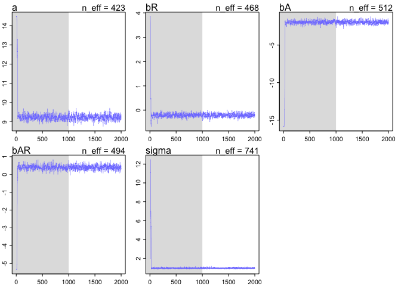

# Chapter 8 problems
Stacey Harmer  
June 17, 2016  

####8E1.  Required of simple Metropolis algorithm:  
3)  The proposal distribution must be symmetric.  (that is, probability of going A to B same as going B to A)

####8E2.  Gibbs sampling efficiency is greater than Metropolitan because it is more efficient at exploring the 
posterior disctribution; the parameter value at one moment helps adjust what the proopsed parameter values will
be.  (conjugate priors).  But maybe you don't want to use conjugate priors.  And Gibbs sampling becomes very 
inefficient when you have hundreds or thousands of parameters.

####8E3.  HMC can't handle discrete parameters.  this is because it 'glides' through possible parameter values 
and this isn't possible with discrete parameters. 

####8E4.  
The effective number of samples, n_eff, are the effectively independent samples. Markov chains tend to be   
autocorrelated, meaning subsequent samples are not truly independent.

####8E5.  
Rhat should approach 1.00.  This is a 'convergence diagnostic'.  If greater than 1.00, it indicates the chain
has not yet converged.

####8E6.  
I'm not going to try to sketch it out using R.  But good trace plots rapidly go up and down (good mixing) and 
has stationarity (path stays within posterior distribution).  A malfunctioning chain would show spiking and 
wouldn't converge to final values.

####8m1.  
RE-estimate ruggedness model, using uniform prior and exponential prior


```r
## original model
library(rethinking)
```

```
## Loading required package: rstan
```

```
## Loading required package: ggplot2
```

```
## Loading required package: StanHeaders
```

```
## rstan (Version 2.10.1, packaged: 2016-06-24 13:22:16 UTC, GitRev: 85f7a56811da)
```

```
## For execution on a local, multicore CPU with excess RAM we recommend calling
## rstan_options(auto_write = TRUE)
## options(mc.cores = parallel::detectCores())
```

```
## Loading required package: parallel
```

```
## rethinking (Version 1.58)
```

```r
data(rugged)
d <- rugged
d$log_gdp <- log(d$rgdppc_2000)
dd <- d[ complete.cases(d$rgdppc_2000) , ]
dd.trim <- dd[ , c("log_gdp","rugged","cont_africa") ] 

m8.1stan <- map2stan( 
                      alist(
                        log_gdp ~ dnorm( mu , sigma ) ,
                        mu <- a + bR*rugged + bA*cont_africa + bAR*rugged*cont_africa ,
                        a ~ dnorm(0,100),
                        bR ~ dnorm(0,10),
                        bA ~ dnorm(0,10),
                        bAR ~ dnorm(0,10),
                        sigma ~ dcauchy(0,2)
                      ) ,
                      data=dd.trim )
```

```
## 
## SAMPLING FOR MODEL 'log_gdp ~ dnorm(mu, sigma)' NOW (CHAIN 1).
## 
## Chain 1, Iteration:    1 / 2000 [  0%]  (Warmup)
## Chain 1, Iteration:  200 / 2000 [ 10%]  (Warmup)
## Chain 1, Iteration:  400 / 2000 [ 20%]  (Warmup)
## Chain 1, Iteration:  600 / 2000 [ 30%]  (Warmup)
## Chain 1, Iteration:  800 / 2000 [ 40%]  (Warmup)
## Chain 1, Iteration: 1000 / 2000 [ 50%]  (Warmup)
## Chain 1, Iteration: 1001 / 2000 [ 50%]  (Sampling)
## Chain 1, Iteration: 1200 / 2000 [ 60%]  (Sampling)
## Chain 1, Iteration: 1400 / 2000 [ 70%]  (Sampling)
## Chain 1, Iteration: 1600 / 2000 [ 80%]  (Sampling)
## Chain 1, Iteration: 1800 / 2000 [ 90%]  (Sampling)
## Chain 1, Iteration: 2000 / 2000 [100%]  (Sampling)
##  Elapsed Time: 0.160731 seconds (Warm-up)
##                0.139085 seconds (Sampling)
##                0.299816 seconds (Total)
## 
## 
## SAMPLING FOR MODEL 'log_gdp ~ dnorm(mu, sigma)' NOW (CHAIN 1).
## WARNING: No variance estimation is
##          performed for num_warmup < 20
## 
## 
## Chain 1, Iteration: 1 / 1 [100%]  (Sampling)
##  Elapsed Time: 4e-06 seconds (Warm-up)
##                5.3e-05 seconds (Sampling)
##                5.7e-05 seconds (Total)
```

```
## Computing WAIC
```

```
## Constructing posterior predictions
```

```
## [ 100 / 1000 ]
[ 200 / 1000 ]
[ 300 / 1000 ]
[ 400 / 1000 ]
[ 500 / 1000 ]
[ 600 / 1000 ]
[ 700 / 1000 ]
[ 800 / 1000 ]
[ 900 / 1000 ]
[ 1000 / 1000 ]
```

```r
precis(m8.1stan)
```

```
##        Mean StdDev lower 0.89 upper 0.89 n_eff Rhat
## a      9.22   0.14       9.01       9.46   486    1
## bR    -0.20   0.08      -0.33      -0.09   488    1
## bA    -1.94   0.23      -2.31      -1.60   456    1
## bAR    0.39   0.13       0.18       0.61   460    1
## sigma  0.95   0.05       0.87       1.03   801    1
```

```r
# now use uniform prior for sigma
m8.1stan.sig.uni <- map2stan( 
                      alist(
                        log_gdp ~ dnorm( mu , sigma ) ,
                        mu <- a + bR*rugged + bA*cont_africa + bAR*rugged*cont_africa ,
                        a ~ dnorm(0,100),
                        bR ~ dnorm(0,10),
                        bA ~ dnorm(0,10),
                        bAR ~ dnorm(0,10),
                        sigma ~ dunif(0,10)
                      ) ,
                      data=dd.trim )
```

```
## 
## SAMPLING FOR MODEL 'log_gdp ~ dnorm(mu, sigma)' NOW (CHAIN 1).
## 
## Chain 1, Iteration:    1 / 2000 [  0%]  (Warmup)
## Chain 1, Iteration:  200 / 2000 [ 10%]  (Warmup)
## Chain 1, Iteration:  400 / 2000 [ 20%]  (Warmup)
## Chain 1, Iteration:  600 / 2000 [ 30%]  (Warmup)
## Chain 1, Iteration:  800 / 2000 [ 40%]  (Warmup)
## Chain 1, Iteration: 1000 / 2000 [ 50%]  (Warmup)
## Chain 1, Iteration: 1001 / 2000 [ 50%]  (Sampling)
## Chain 1, Iteration: 1200 / 2000 [ 60%]  (Sampling)
## Chain 1, Iteration: 1400 / 2000 [ 70%]  (Sampling)
## Chain 1, Iteration: 1600 / 2000 [ 80%]  (Sampling)
## Chain 1, Iteration: 1800 / 2000 [ 90%]  (Sampling)
## Chain 1, Iteration: 2000 / 2000 [100%]  (Sampling)
##  Elapsed Time: 0.178841 seconds (Warm-up)
##                0.159803 seconds (Sampling)
##                0.338644 seconds (Total)
## 
## 
## SAMPLING FOR MODEL 'log_gdp ~ dnorm(mu, sigma)' NOW (CHAIN 1).
## WARNING: No variance estimation is
##          performed for num_warmup < 20
## 
## 
## Chain 1, Iteration: 1 / 1 [100%]  (Sampling)
##  Elapsed Time: 4e-06 seconds (Warm-up)
##                5.2e-05 seconds (Sampling)
##                5.6e-05 seconds (Total)
```

```
## Computing WAIC
## Constructing posterior predictions
```

```
## [ 100 / 1000 ]
[ 200 / 1000 ]
[ 300 / 1000 ]
[ 400 / 1000 ]
[ 500 / 1000 ]
[ 600 / 1000 ]
[ 700 / 1000 ]
[ 800 / 1000 ]
[ 900 / 1000 ]
[ 1000 / 1000 ]
```

```r
precis(m8.1stan.sig.uni) # this is pretty much same as above.  maybe because lots of data in dataset?
```

```
##        Mean StdDev lower 0.89 upper 0.89 n_eff Rhat
## a      9.23   0.14       8.99       9.43   294    1
## bR    -0.21   0.08      -0.33      -0.08   319    1
## bA    -1.95   0.22      -2.30      -1.60   334    1
## bAR    0.40   0.13       0.21       0.63   358    1
## sigma  0.95   0.05       0.87       1.03   605    1
```

```r
dim(dd.trim)
```

```
## [1] 170   3
```

```r
# now use exponential prior for sigma
m8.1stan.sig.exp <- map2stan( 
                      alist(
                        log_gdp ~ dnorm( mu , sigma ) ,
                        mu <- a + bR*rugged + bA*cont_africa + bAR*rugged*cont_africa ,
                        a ~ dnorm(0,100),
                        bR ~ dnorm(0,10),
                        bA ~ dnorm(0,10),
                        bAR ~ dnorm(0,10),
                        sigma ~ dexp(1)
                      ) ,
                      data=dd.trim )
```

```
## 
## SAMPLING FOR MODEL 'log_gdp ~ dnorm(mu, sigma)' NOW (CHAIN 1).
## 
## Chain 1, Iteration:    1 / 2000 [  0%]  (Warmup)
## Chain 1, Iteration:  200 / 2000 [ 10%]  (Warmup)
## Chain 1, Iteration:  400 / 2000 [ 20%]  (Warmup)
## Chain 1, Iteration:  600 / 2000 [ 30%]  (Warmup)
## Chain 1, Iteration:  800 / 2000 [ 40%]  (Warmup)
## Chain 1, Iteration: 1000 / 2000 [ 50%]  (Warmup)
## Chain 1, Iteration: 1001 / 2000 [ 50%]  (Sampling)
## Chain 1, Iteration: 1200 / 2000 [ 60%]  (Sampling)
## Chain 1, Iteration: 1400 / 2000 [ 70%]  (Sampling)
## Chain 1, Iteration: 1600 / 2000 [ 80%]  (Sampling)
## Chain 1, Iteration: 1800 / 2000 [ 90%]  (Sampling)
## Chain 1, Iteration: 2000 / 2000 [100%]  (Sampling)
##  Elapsed Time: 0.186155 seconds (Warm-up)
##                0.162161 seconds (Sampling)
##                0.348316 seconds (Total)
## 
## 
## SAMPLING FOR MODEL 'log_gdp ~ dnorm(mu, sigma)' NOW (CHAIN 1).
## WARNING: No variance estimation is
##          performed for num_warmup < 20
## 
## 
## Chain 1, Iteration: 1 / 1 [100%]  (Sampling)
##  Elapsed Time: 4e-06 seconds (Warm-up)
##                6e-05 seconds (Sampling)
##                6.4e-05 seconds (Total)
```

```
## Computing WAIC
## Constructing posterior predictions
```

```
## [ 100 / 1000 ]
[ 200 / 1000 ]
[ 300 / 1000 ]
[ 400 / 1000 ]
[ 500 / 1000 ]
[ 600 / 1000 ]
[ 700 / 1000 ]
[ 800 / 1000 ]
[ 900 / 1000 ]
[ 1000 / 1000 ]
```

```r
precis(m8.1stan.sig.exp) # also about the same; 
```

```
##        Mean StdDev lower 0.89 upper 0.89 n_eff Rhat
## a      9.24   0.14       9.00       9.45   308 1.01
## bR    -0.21   0.08      -0.32      -0.06   359 1.01
## bA    -1.97   0.22      -2.35      -1.64   291 1.01
## bAR    0.40   0.13       0.17       0.59   372 1.01
## sigma  0.95   0.05       0.87       1.02   411 1.00
```

```r
compare(m8.1stan, m8.1stan.sig.uni)
```

```
##                   WAIC pWAIC dWAIC weight    SE  dSE
## m8.1stan.sig.uni 468.9   4.9   0.0   0.52 14.78   NA
## m8.1stan         469.1   5.0   0.2   0.48 14.78 0.29
```

```r
compare(m8.1stan, m8.1stan.sig.exp) 
```

```
##                   WAIC pWAIC dWAIC weight    SE  dSE
## m8.1stan         469.1   5.0   0.0   0.52 14.78   NA
## m8.1stan.sig.exp 469.2   5.1   0.1   0.48 14.84 0.31
```

```r
compare(m8.1stan.sig.uni, m8.1stan.sig.exp)  
```

```
##                   WAIC pWAIC dWAIC weight    SE  dSE
## m8.1stan.sig.uni 468.9   4.9   0.0   0.54 14.78   NA
## m8.1stan.sig.exp 469.2   5.1   0.3   0.46 14.84 0.23
```

```r
# yes all very similar
```

####8m2.  
Reduce the scale of the Cauchy and exponential priors from terrain model to see how this influences posterior.


```r
## reduce scale Cauchy
m8.1stan.cauchy.scale <- map2stan( 
                      alist(
                        log_gdp ~ dnorm( mu , sigma ) ,
                        mu <- a + bR*rugged + bA*cont_africa + bAR*rugged*cont_africa ,
                        a ~ dnorm(0,100),
                        bR ~ dnorm(0,10),
                        bA ~ dnorm(0,10),
                        bAR ~ dnorm(0,10),
                        sigma ~ dcauchy(0,0.5)
                      ) ,
                      data=dd.trim )
```

```
## 
## SAMPLING FOR MODEL 'log_gdp ~ dnorm(mu, sigma)' NOW (CHAIN 1).
## 
## Chain 1, Iteration:    1 / 2000 [  0%]  (Warmup)
## Chain 1, Iteration:  200 / 2000 [ 10%]  (Warmup)
## Chain 1, Iteration:  400 / 2000 [ 20%]  (Warmup)
## Chain 1, Iteration:  600 / 2000 [ 30%]  (Warmup)
## Chain 1, Iteration:  800 / 2000 [ 40%]  (Warmup)
## Chain 1, Iteration: 1000 / 2000 [ 50%]  (Warmup)
## Chain 1, Iteration: 1001 / 2000 [ 50%]  (Sampling)
## Chain 1, Iteration: 1200 / 2000 [ 60%]  (Sampling)
## Chain 1, Iteration: 1400 / 2000 [ 70%]  (Sampling)
## Chain 1, Iteration: 1600 / 2000 [ 80%]  (Sampling)
## Chain 1, Iteration: 1800 / 2000 [ 90%]  (Sampling)
## Chain 1, Iteration: 2000 / 2000 [100%]  (Sampling)
##  Elapsed Time: 0.192024 seconds (Warm-up)
##                0.219552 seconds (Sampling)
##                0.411576 seconds (Total)
## 
## 
## SAMPLING FOR MODEL 'log_gdp ~ dnorm(mu, sigma)' NOW (CHAIN 1).
## WARNING: No variance estimation is
##          performed for num_warmup < 20
## 
## 
## Chain 1, Iteration: 1 / 1 [100%]  (Sampling)
##  Elapsed Time: 5e-06 seconds (Warm-up)
##                9.5e-05 seconds (Sampling)
##                0.0001 seconds (Total)
```

```
## Computing WAIC
```

```
## Constructing posterior predictions
```

```
## [ 100 / 1000 ]
[ 200 / 1000 ]
[ 300 / 1000 ]
[ 400 / 1000 ]
[ 500 / 1000 ]
[ 600 / 1000 ]
[ 700 / 1000 ]
[ 800 / 1000 ]
[ 900 / 1000 ]
[ 1000 / 1000 ]
```

```r
precis(m8.1stan.cauchy.scale)
```

```
##        Mean StdDev lower 0.89 upper 0.89 n_eff Rhat
## a      9.23   0.14       8.99       9.45   373    1
## bR    -0.21   0.08      -0.32      -0.08   399    1
## bA    -1.96   0.23      -2.28      -1.58   408    1
## bAR    0.40   0.13       0.20       0.62   422    1
## sigma  0.95   0.05       0.87       1.02   665    1
```

```r
# looks about the same
plot(m8.1stan.cauchy.scale)

# try with more reduction in scale
m8.1stan.cauchy.scale.less <- map2stan( 
                      alist(
                        log_gdp ~ dnorm( mu , sigma ) ,
                        mu <- a + bR*rugged + bA*cont_africa + bAR*rugged*cont_africa ,
                        a ~ dnorm(0,100),
                        bR ~ dnorm(0,10),
                        bA ~ dnorm(0,10),
                        bAR ~ dnorm(0,10),
                        sigma ~ dcauchy(0,0.05)
                      ) ,
                      data=dd.trim )
```

```
## 
## SAMPLING FOR MODEL 'log_gdp ~ dnorm(mu, sigma)' NOW (CHAIN 1).
## 
## Chain 1, Iteration:    1 / 2000 [  0%]  (Warmup)
## Chain 1, Iteration:  200 / 2000 [ 10%]  (Warmup)
## Chain 1, Iteration:  400 / 2000 [ 20%]  (Warmup)
## Chain 1, Iteration:  600 / 2000 [ 30%]  (Warmup)
## Chain 1, Iteration:  800 / 2000 [ 40%]  (Warmup)
## Chain 1, Iteration: 1000 / 2000 [ 50%]  (Warmup)
## Chain 1, Iteration: 1001 / 2000 [ 50%]  (Sampling)
## Chain 1, Iteration: 1200 / 2000 [ 60%]  (Sampling)
## Chain 1, Iteration: 1400 / 2000 [ 70%]  (Sampling)
## Chain 1, Iteration: 1600 / 2000 [ 80%]  (Sampling)
## Chain 1, Iteration: 1800 / 2000 [ 90%]  (Sampling)
## Chain 1, Iteration: 2000 / 2000 [100%]  (Sampling)
##  Elapsed Time: 0.145922 seconds (Warm-up)
##                0.147336 seconds (Sampling)
##                0.293258 seconds (Total)
## 
## 
## SAMPLING FOR MODEL 'log_gdp ~ dnorm(mu, sigma)' NOW (CHAIN 1).
## WARNING: No variance estimation is
##          performed for num_warmup < 20
## 
## 
## Chain 1, Iteration: 1 / 1 [100%]  (Sampling)
##  Elapsed Time: 3e-06 seconds (Warm-up)
##                5.3e-05 seconds (Sampling)
##                5.6e-05 seconds (Total)
```

```
## Computing WAIC
## Constructing posterior predictions
```

```
## [ 100 / 1000 ]
[ 200 / 1000 ]
[ 300 / 1000 ]
[ 400 / 1000 ]
[ 500 / 1000 ]
[ 600 / 1000 ]
[ 700 / 1000 ]
[ 800 / 1000 ]
[ 900 / 1000 ]
[ 1000 / 1000 ]
```

```r
precis(m8.1stan.cauchy.scale.less)
```

```
##        Mean StdDev lower 0.89 upper 0.89 n_eff Rhat
## a      9.23   0.13       9.03       9.43   389 1.01
## bR    -0.21   0.07      -0.33      -0.10   395 1.01
## bA    -1.95   0.23      -2.32      -1.60   373 1.01
## bAR    0.40   0.13       0.21       0.62   353 1.01
## sigma  0.94   0.05       0.88       1.02   573 1.00
```

```r
precis(m8.1stan)
```

```
##        Mean StdDev lower 0.89 upper 0.89 n_eff Rhat
## a      9.22   0.14       9.01       9.46   486    1
## bR    -0.20   0.08      -0.33      -0.09   488    1
## bA    -1.94   0.23      -2.31      -1.60   456    1
## bAR    0.39   0.13       0.18       0.61   460    1
## sigma  0.95   0.05       0.87       1.03   801    1
```

```r
# not much difference
plot(m8.1stan.cauchy.scale.less)
```

<!-- -->

```r
# now do same with dexp

m8.1stan.sig.exp.scale <- map2stan( 
                      alist(
                        log_gdp ~ dnorm( mu , sigma ) ,
                        mu <- a + bR*rugged + bA*cont_africa + bAR*rugged*cont_africa ,
                        a ~ dnorm(0,100),
                        bR ~ dnorm(0,10),
                        bA ~ dnorm(0,10),
                        bAR ~ dnorm(0,10),
                        sigma ~ dexp(0.1)
                      ) ,
                      data=dd.trim )
```

```
## 
## SAMPLING FOR MODEL 'log_gdp ~ dnorm(mu, sigma)' NOW (CHAIN 1).
## 
## Chain 1, Iteration:    1 / 2000 [  0%]  (Warmup)
## Chain 1, Iteration:  200 / 2000 [ 10%]  (Warmup)
## Chain 1, Iteration:  400 / 2000 [ 20%]  (Warmup)
## Chain 1, Iteration:  600 / 2000 [ 30%]  (Warmup)
## Chain 1, Iteration:  800 / 2000 [ 40%]  (Warmup)
## Chain 1, Iteration: 1000 / 2000 [ 50%]  (Warmup)
## Chain 1, Iteration: 1001 / 2000 [ 50%]  (Sampling)
## Chain 1, Iteration: 1200 / 2000 [ 60%]  (Sampling)
## Chain 1, Iteration: 1400 / 2000 [ 70%]  (Sampling)
## Chain 1, Iteration: 1600 / 2000 [ 80%]  (Sampling)
## Chain 1, Iteration: 1800 / 2000 [ 90%]  (Sampling)
## Chain 1, Iteration: 2000 / 2000 [100%]  (Sampling)
##  Elapsed Time: 0.160432 seconds (Warm-up)
##                0.160735 seconds (Sampling)
##                0.321167 seconds (Total)
## 
## 
## SAMPLING FOR MODEL 'log_gdp ~ dnorm(mu, sigma)' NOW (CHAIN 1).
## WARNING: No variance estimation is
##          performed for num_warmup < 20
## 
## 
## Chain 1, Iteration: 1 / 1 [100%]  (Sampling)
##  Elapsed Time: 3e-06 seconds (Warm-up)
##                5.2e-05 seconds (Sampling)
##                5.5e-05 seconds (Total)
```

```
## Computing WAIC
## Constructing posterior predictions
```

```
## [ 100 / 1000 ]
[ 200 / 1000 ]
[ 300 / 1000 ]
[ 400 / 1000 ]
[ 500 / 1000 ]
[ 600 / 1000 ]
[ 700 / 1000 ]
[ 800 / 1000 ]
[ 900 / 1000 ]
[ 1000 / 1000 ]
```

```r
precis(m8.1stan.sig.exp.scale) # note Rhat greater than 1 for bAR
```

```
##        Mean StdDev lower 0.89 upper 0.89 n_eff Rhat
## a      9.23   0.13       9.03       9.44   432    1
## bR    -0.20   0.07      -0.33      -0.10   438    1
## bA    -1.95   0.22      -2.31      -1.60   412    1
## bAR    0.40   0.13       0.18       0.59   383    1
## sigma  0.95   0.05       0.87       1.02   504    1
```

```r
plot(m8.1stan.sig.exp.scale) # but looks OK
```

<!-- -->

```r
precis(m8.1stan.sig.exp)
```

```
##        Mean StdDev lower 0.89 upper 0.89 n_eff Rhat
## a      9.24   0.14       9.00       9.45   308 1.01
## bR    -0.21   0.08      -0.32      -0.06   359 1.01
## bA    -1.97   0.22      -2.35      -1.64   291 1.01
## bAR    0.40   0.13       0.17       0.59   372 1.01
## sigma  0.95   0.05       0.87       1.02   411 1.00
```

```r
compare(m8.1stan.sig.exp, m8.1stan.sig.exp.scale) # not so diff
```

```
##                         WAIC pWAIC dWAIC weight    SE  dSE
## m8.1stan.sig.exp.scale 468.8   4.9   0.0   0.56 14.78   NA
## m8.1stan.sig.exp       469.2   5.1   0.5   0.44 14.84 0.21
```

```r
m8.1stan.sig.exp.scale.less <- map2stan( 
                      alist(
                        log_gdp ~ dnorm( mu , sigma ) ,
                        mu <- a + bR*rugged + bA*cont_africa + bAR*rugged*cont_africa ,
                        a ~ dnorm(0,100),
                        bR ~ dnorm(0,10),
                        bA ~ dnorm(0,10),
                        bAR ~ dnorm(0,10),
                        sigma ~ dexp(0.01)
                      ) ,
                      data=dd.trim )
```

```
## 
## SAMPLING FOR MODEL 'log_gdp ~ dnorm(mu, sigma)' NOW (CHAIN 1).
## 
## Chain 1, Iteration:    1 / 2000 [  0%]  (Warmup)
## Chain 1, Iteration:  200 / 2000 [ 10%]  (Warmup)
## Chain 1, Iteration:  400 / 2000 [ 20%]  (Warmup)
## Chain 1, Iteration:  600 / 2000 [ 30%]  (Warmup)
## Chain 1, Iteration:  800 / 2000 [ 40%]  (Warmup)
## Chain 1, Iteration: 1000 / 2000 [ 50%]  (Warmup)
## Chain 1, Iteration: 1001 / 2000 [ 50%]  (Sampling)
## Chain 1, Iteration: 1200 / 2000 [ 60%]  (Sampling)
## Chain 1, Iteration: 1400 / 2000 [ 70%]  (Sampling)
## Chain 1, Iteration: 1600 / 2000 [ 80%]  (Sampling)
## Chain 1, Iteration: 1800 / 2000 [ 90%]  (Sampling)
## Chain 1, Iteration: 2000 / 2000 [100%]  (Sampling)
##  Elapsed Time: 0.187409 seconds (Warm-up)
##                0.17877 seconds (Sampling)
##                0.366179 seconds (Total)
## 
## 
## SAMPLING FOR MODEL 'log_gdp ~ dnorm(mu, sigma)' NOW (CHAIN 1).
## WARNING: No variance estimation is
##          performed for num_warmup < 20
## 
## 
## Chain 1, Iteration: 1 / 1 [100%]  (Sampling)
##  Elapsed Time: 2e-06 seconds (Warm-up)
##                5.2e-05 seconds (Sampling)
##                5.4e-05 seconds (Total)
```

```
## Computing WAIC
## Constructing posterior predictions
```

```
## [ 100 / 1000 ]
[ 200 / 1000 ]
[ 300 / 1000 ]
[ 400 / 1000 ]
[ 500 / 1000 ]
[ 600 / 1000 ]
[ 700 / 1000 ]
[ 800 / 1000 ]
[ 900 / 1000 ]
[ 1000 / 1000 ]
```

```r
precis(m8.1stan.sig.exp.scale.less) #now Rhat greater than 1 for most
```

```
##        Mean StdDev lower 0.89 upper 0.89 n_eff Rhat
## a      9.23   0.14       9.03       9.47   364    1
## bR    -0.21   0.08      -0.33      -0.09   373    1
## bA    -1.97   0.23      -2.33      -1.64   362    1
## bAR    0.40   0.14       0.18       0.60   391    1
## sigma  0.95   0.05       0.86       1.03   683    1
```

```r
plot(m8.1stan.sig.exp.scale.less) # still looks ok
```

<!-- -->

```r
# reduce even more
m8.1stan.sig.exp.scale.lesser <- map2stan( 
                      alist(
                        log_gdp ~ dnorm( mu , sigma ) ,
                        mu <- a + bR*rugged + bA*cont_africa + bAR*rugged*cont_africa ,
                        a ~ dnorm(0,100),
                        bR ~ dnorm(0,10),
                        bA ~ dnorm(0,10),
                        bAR ~ dnorm(0,10),
                        sigma ~ dexp(0.001)
                      ) ,
                      data=dd.trim )
```

```
## 
## SAMPLING FOR MODEL 'log_gdp ~ dnorm(mu, sigma)' NOW (CHAIN 1).
## 
## Chain 1, Iteration:    1 / 2000 [  0%]  (Warmup)
## Chain 1, Iteration:  200 / 2000 [ 10%]  (Warmup)
## Chain 1, Iteration:  400 / 2000 [ 20%]  (Warmup)
## Chain 1, Iteration:  600 / 2000 [ 30%]  (Warmup)
## Chain 1, Iteration:  800 / 2000 [ 40%]  (Warmup)
## Chain 1, Iteration: 1000 / 2000 [ 50%]  (Warmup)
## Chain 1, Iteration: 1001 / 2000 [ 50%]  (Sampling)
## Chain 1, Iteration: 1200 / 2000 [ 60%]  (Sampling)
## Chain 1, Iteration: 1400 / 2000 [ 70%]  (Sampling)
## Chain 1, Iteration: 1600 / 2000 [ 80%]  (Sampling)
## Chain 1, Iteration: 1800 / 2000 [ 90%]  (Sampling)
## Chain 1, Iteration: 2000 / 2000 [100%]  (Sampling)
##  Elapsed Time: 0.181751 seconds (Warm-up)
##                0.15221 seconds (Sampling)
##                0.333961 seconds (Total)
```

```
## The following numerical problems occured the indicated number of times after warmup on chain 1
```

```
##                                                                                 count
## Exception thrown at line 24: normal_log: Scale parameter is 0, but must be > 0!     2
```

```
## When a numerical problem occurs, the Metropolis proposal gets rejected.
```

```
## However, by design Metropolis proposals sometimes get rejected even when there are no numerical problems.
```

```
## Thus, if the number in the 'count' column is small, do not ask about this message on stan-users.
```

```
## 
## SAMPLING FOR MODEL 'log_gdp ~ dnorm(mu, sigma)' NOW (CHAIN 1).
## WARNING: No variance estimation is
##          performed for num_warmup < 20
## 
## 
## Chain 1, Iteration: 1 / 1 [100%]  (Sampling)
##  Elapsed Time: 7e-06 seconds (Warm-up)
##                8.5e-05 seconds (Sampling)
##                9.2e-05 seconds (Total)
```

```
## Computing WAIC
```

```
## Constructing posterior predictions
```

```
## [ 100 / 1000 ]
[ 200 / 1000 ]
[ 300 / 1000 ]
[ 400 / 1000 ]
[ 500 / 1000 ]
[ 600 / 1000 ]
[ 700 / 1000 ]
[ 800 / 1000 ]
[ 900 / 1000 ]
[ 1000 / 1000 ]
```

```r
precis(m8.1stan.sig.exp.scale.lesser) #now Rhat greater than 1 for most
```

```
##        Mean StdDev lower 0.89 upper 0.89 n_eff Rhat
## a      9.22   0.14       8.98       9.43   357    1
## bR    -0.20   0.08      -0.32      -0.07   400    1
## bA    -1.94   0.23      -2.29      -1.56   388    1
## bAR    0.39   0.14       0.17       0.61   410    1
## sigma  0.95   0.05       0.87       1.03   855    1
```

```r
plot(m8.1stan.sig.exp.scale.lesser) # 
```

<!-- -->

```r
compare(m8.1stan.sig.exp.scale.lesser, m8.1stan.sig.exp) # pretty similar
```

```
##                                WAIC pWAIC dWAIC weight    SE  dSE
## m8.1stan.sig.exp.scale.lesser 469.1   5.0   0.0   0.52 14.77   NA
## m8.1stan.sig.exp              469.2   5.1   0.2   0.48 14.84 0.31
```

```r
# I guess in this case the choice of prior doesn't really matter that much
```

<!-- -->


####8M3  
Rerun a model with different numbers of warmup iterations


```r
test.1000 <- map2stan( 
                      alist(
                        log_gdp ~ dnorm( mu , sigma ) ,
                        mu <- a + bR*rugged + bA*cont_africa + bAR*rugged*cont_africa ,
                        a ~ dnorm(0,100),
                        bR ~ dnorm(0,10),
                        bA ~ dnorm(0,10),
                        bAR ~ dnorm(0,10),
                        sigma ~ dcauchy(0,2)
                      ) ,
                      data=dd.trim, chains=2 , iter=2000 , warmup=1000  )
```

```
## 
## SAMPLING FOR MODEL 'log_gdp ~ dnorm(mu, sigma)' NOW (CHAIN 1).
## 
## Chain 1, Iteration:    1 / 2000 [  0%]  (Warmup)
## Chain 1, Iteration:  200 / 2000 [ 10%]  (Warmup)
## Chain 1, Iteration:  400 / 2000 [ 20%]  (Warmup)
## Chain 1, Iteration:  600 / 2000 [ 30%]  (Warmup)
## Chain 1, Iteration:  800 / 2000 [ 40%]  (Warmup)
## Chain 1, Iteration: 1000 / 2000 [ 50%]  (Warmup)
## Chain 1, Iteration: 1001 / 2000 [ 50%]  (Sampling)
## Chain 1, Iteration: 1200 / 2000 [ 60%]  (Sampling)
## Chain 1, Iteration: 1400 / 2000 [ 70%]  (Sampling)
## Chain 1, Iteration: 1600 / 2000 [ 80%]  (Sampling)
## Chain 1, Iteration: 1800 / 2000 [ 90%]  (Sampling)
## Chain 1, Iteration: 2000 / 2000 [100%]  (Sampling)
##  Elapsed Time: 0.189915 seconds (Warm-up)
##                0.176217 seconds (Sampling)
##                0.366132 seconds (Total)
## 
## 
## SAMPLING FOR MODEL 'log_gdp ~ dnorm(mu, sigma)' NOW (CHAIN 2).
## 
## Chain 2, Iteration:    1 / 2000 [  0%]  (Warmup)
## Chain 2, Iteration:  200 / 2000 [ 10%]  (Warmup)
## Chain 2, Iteration:  400 / 2000 [ 20%]  (Warmup)
## Chain 2, Iteration:  600 / 2000 [ 30%]  (Warmup)
## Chain 2, Iteration:  800 / 2000 [ 40%]  (Warmup)
## Chain 2, Iteration: 1000 / 2000 [ 50%]  (Warmup)
## Chain 2, Iteration: 1001 / 2000 [ 50%]  (Sampling)
## Chain 2, Iteration: 1200 / 2000 [ 60%]  (Sampling)
## Chain 2, Iteration: 1400 / 2000 [ 70%]  (Sampling)
## Chain 2, Iteration: 1600 / 2000 [ 80%]  (Sampling)
## Chain 2, Iteration: 1800 / 2000 [ 90%]  (Sampling)
## Chain 2, Iteration: 2000 / 2000 [100%]  (Sampling)
##  Elapsed Time: 0.216576 seconds (Warm-up)
##                0.150239 seconds (Sampling)
##                0.366815 seconds (Total)
## 
## 
## SAMPLING FOR MODEL 'log_gdp ~ dnorm(mu, sigma)' NOW (CHAIN 1).
## WARNING: No variance estimation is
##          performed for num_warmup < 20
## 
## 
## Chain 1, Iteration: 1 / 1 [100%]  (Sampling)
##  Elapsed Time: 5e-06 seconds (Warm-up)
##                5.6e-05 seconds (Sampling)
##                6.1e-05 seconds (Total)
```

```
## Computing WAIC
```

```
## Constructing posterior predictions
```

```
## [ 200 / 2000 ]
[ 400 / 2000 ]
[ 600 / 2000 ]
[ 800 / 2000 ]
[ 1000 / 2000 ]
[ 1200 / 2000 ]
[ 1400 / 2000 ]
[ 1600 / 2000 ]
[ 1800 / 2000 ]
[ 2000 / 2000 ]
```

```r
precis(test.1000) # n_eff about 700
```

```
##        Mean StdDev lower 0.89 upper 0.89 n_eff Rhat
## a      9.22   0.15       9.00       9.47   688 1.00
## bR    -0.20   0.08      -0.34      -0.09   682 1.00
## bA    -1.94   0.23      -2.30      -1.59   630 1.01
## bAR    0.39   0.13       0.20       0.61   589 1.00
## sigma  0.95   0.05       0.87       1.03  1288 1.00
```

```r
plot(test.1000) # looks good

test.500 <- map2stan( 
                      alist(
                        log_gdp ~ dnorm( mu , sigma ) ,
                        mu <- a + bR*rugged + bA*cont_africa + bAR*rugged*cont_africa ,
                        a ~ dnorm(0,100),
                        bR ~ dnorm(0,10),
                        bA ~ dnorm(0,10),
                        bAR ~ dnorm(0,10),
                        sigma ~ dcauchy(0,2)
                      ) ,
                      data=dd.trim, chains=2 , iter=2000 , warmup=500  )
```

```
## 
## SAMPLING FOR MODEL 'log_gdp ~ dnorm(mu, sigma)' NOW (CHAIN 1).
## 
## Chain 1, Iteration:    1 / 2000 [  0%]  (Warmup)
## Chain 1, Iteration:  200 / 2000 [ 10%]  (Warmup)
## Chain 1, Iteration:  400 / 2000 [ 20%]  (Warmup)
## Chain 1, Iteration:  501 / 2000 [ 25%]  (Sampling)
## Chain 1, Iteration:  700 / 2000 [ 35%]  (Sampling)
## Chain 1, Iteration:  900 / 2000 [ 45%]  (Sampling)
## Chain 1, Iteration: 1100 / 2000 [ 55%]  (Sampling)
## Chain 1, Iteration: 1300 / 2000 [ 65%]  (Sampling)
## Chain 1, Iteration: 1500 / 2000 [ 75%]  (Sampling)
## Chain 1, Iteration: 1700 / 2000 [ 85%]  (Sampling)
## Chain 1, Iteration: 1900 / 2000 [ 95%]  (Sampling)
## Chain 1, Iteration: 2000 / 2000 [100%]  (Sampling)
##  Elapsed Time: 0.125296 seconds (Warm-up)
##                0.230427 seconds (Sampling)
##                0.355723 seconds (Total)
## 
## 
## SAMPLING FOR MODEL 'log_gdp ~ dnorm(mu, sigma)' NOW (CHAIN 2).
## 
## Chain 2, Iteration:    1 / 2000 [  0%]  (Warmup)
## Chain 2, Iteration:  200 / 2000 [ 10%]  (Warmup)
## Chain 2, Iteration:  400 / 2000 [ 20%]  (Warmup)
## Chain 2, Iteration:  501 / 2000 [ 25%]  (Sampling)
## Chain 2, Iteration:  700 / 2000 [ 35%]  (Sampling)
## Chain 2, Iteration:  900 / 2000 [ 45%]  (Sampling)
## Chain 2, Iteration: 1100 / 2000 [ 55%]  (Sampling)
## Chain 2, Iteration: 1300 / 2000 [ 65%]  (Sampling)
## Chain 2, Iteration: 1500 / 2000 [ 75%]  (Sampling)
## Chain 2, Iteration: 1700 / 2000 [ 85%]  (Sampling)
## Chain 2, Iteration: 1900 / 2000 [ 95%]  (Sampling)
## Chain 2, Iteration: 2000 / 2000 [100%]  (Sampling)
##  Elapsed Time: 0.085774 seconds (Warm-up)
##                0.246789 seconds (Sampling)
##                0.332563 seconds (Total)
## 
## 
## SAMPLING FOR MODEL 'log_gdp ~ dnorm(mu, sigma)' NOW (CHAIN 1).
## WARNING: No variance estimation is
##          performed for num_warmup < 20
## 
## 
## Chain 1, Iteration: 1 / 1 [100%]  (Sampling)
##  Elapsed Time: 3e-06 seconds (Warm-up)
##                5.8e-05 seconds (Sampling)
##                6.1e-05 seconds (Total)
```

```
## Computing WAIC
## Constructing posterior predictions
```

```
## [ 300 / 3000 ]
[ 600 / 3000 ]
[ 900 / 3000 ]
[ 1200 / 3000 ]
[ 1500 / 3000 ]
[ 1800 / 3000 ]
[ 2100 / 3000 ]
[ 2400 / 3000 ]
[ 2700 / 3000 ]
[ 3000 / 3000 ]
```

```r
precis(test.500) # n_eff good; about 900
```

```
##        Mean StdDev lower 0.89 upper 0.89 n_eff Rhat
## a      9.22   0.14       9.02       9.47  1047    1
## bR    -0.20   0.08      -0.33      -0.09  1062    1
## bA    -1.96   0.22      -2.31      -1.61   873    1
## bAR    0.40   0.13       0.19       0.60   983    1
## sigma  0.95   0.05       0.87       1.04  2162    1
```

```r
plot(test.500)
```

<!-- -->

```r
test.50 <- map2stan( 
                      alist(
                        log_gdp ~ dnorm( mu , sigma ) ,
                        mu <- a + bR*rugged + bA*cont_africa + bAR*rugged*cont_africa ,
                        a ~ dnorm(0,100),
                        bR ~ dnorm(0,10),
                        bA ~ dnorm(0,10),
                        bAR ~ dnorm(0,10),
                        sigma ~ dcauchy(0,2)
                      ) ,
                      data=dd.trim, chains=2 , iter=2000 , warmup=50  )
```

```
## 
## SAMPLING FOR MODEL 'log_gdp ~ dnorm(mu, sigma)' NOW (CHAIN 1).
## WARNING: The initial buffer, adaptation window, and terminal buffer
##          overflow the total number of warmup iterations.
##          Defaulting to a 15%/75%/10% partition,
##            init_buffer = 7
##            adapt_window = 38
##            term_buffer = 5
## 
## 
## Chain 1, Iteration:    1 / 2000 [  0%]  (Warmup)
## Chain 1, Iteration:   51 / 2000 [  2%]  (Sampling)
## Chain 1, Iteration:  250 / 2000 [ 12%]  (Sampling)
## Chain 1, Iteration:  450 / 2000 [ 22%]  (Sampling)
## Chain 1, Iteration:  650 / 2000 [ 32%]  (Sampling)
## Chain 1, Iteration:  850 / 2000 [ 42%]  (Sampling)
## Chain 1, Iteration: 1050 / 2000 [ 52%]  (Sampling)
## Chain 1, Iteration: 1250 / 2000 [ 62%]  (Sampling)
## Chain 1, Iteration: 1450 / 2000 [ 72%]  (Sampling)
## Chain 1, Iteration: 1650 / 2000 [ 82%]  (Sampling)
## Chain 1, Iteration: 1850 / 2000 [ 92%]  (Sampling)
## Chain 1, Iteration: 2000 / 2000 [100%]  (Sampling)
##  Elapsed Time: 0.009201 seconds (Warm-up)
##                0.289963 seconds (Sampling)
##                0.299164 seconds (Total)
## 
## 
## SAMPLING FOR MODEL 'log_gdp ~ dnorm(mu, sigma)' NOW (CHAIN 2).
## WARNING: The initial buffer, adaptation window, and terminal buffer
##          overflow the total number of warmup iterations.
##          Defaulting to a 15%/75%/10% partition,
##            init_buffer = 7
##            adapt_window = 38
##            term_buffer = 5
## 
## 
## Chain 2, Iteration:    1 / 2000 [  0%]  (Warmup)
## Chain 2, Iteration:   51 / 2000 [  2%]  (Sampling)
## Chain 2, Iteration:  250 / 2000 [ 12%]  (Sampling)
## Chain 2, Iteration:  450 / 2000 [ 22%]  (Sampling)
## Chain 2, Iteration:  650 / 2000 [ 32%]  (Sampling)
## Chain 2, Iteration:  850 / 2000 [ 42%]  (Sampling)
## Chain 2, Iteration: 1050 / 2000 [ 52%]  (Sampling)
## Chain 2, Iteration: 1250 / 2000 [ 62%]  (Sampling)
## Chain 2, Iteration: 1450 / 2000 [ 72%]  (Sampling)
## Chain 2, Iteration: 1650 / 2000 [ 82%]  (Sampling)
## Chain 2, Iteration: 1850 / 2000 [ 92%]  (Sampling)
## Chain 2, Iteration: 2000 / 2000 [100%]  (Sampling)
##  Elapsed Time: 0.059363 seconds (Warm-up)
##                0.265393 seconds (Sampling)
##                0.324756 seconds (Total)
## 
## 
## SAMPLING FOR MODEL 'log_gdp ~ dnorm(mu, sigma)' NOW (CHAIN 1).
## WARNING: No variance estimation is
##          performed for num_warmup < 20
## 
## 
## Chain 1, Iteration: 1 / 1 [100%]  (Sampling)
##  Elapsed Time: 6e-06 seconds (Warm-up)
##                6.4e-05 seconds (Sampling)
##                7e-05 seconds (Total)
```

```
## Computing WAIC
## Constructing posterior predictions
```

```
## [ 390 / 3900 ]
[ 780 / 3900 ]
[ 1170 / 3900 ]
[ 1560 / 3900 ]
[ 1950 / 3900 ]
[ 2340 / 3900 ]
[ 2730 / 3900 ]
[ 3120 / 3900 ]
[ 3510 / 3900 ]
[ 3900 / 3900 ]
```

```
## Warning in map2stan(alist(log_gdp ~ dnorm(mu, sigma), mu <- a + bR * rugged + : There were 1 divergent iterations during sampling.
## Check the chains (trace plots, n_eff, Rhat) carefully to ensure they are valid.
```

```r
precis(test.50) # about 600 to 1300 neff, still seems OK
```

```
## Warning in precis(test.50): There were 1 divergent iterations during sampling.
## Check the chains (trace plots, n_eff, Rhat) carefully to ensure they are valid.
```

```
##        Mean StdDev lower 0.89 upper 0.89 n_eff Rhat
## a      9.18   0.94       8.99       9.45   994 1.00
## bR    -0.18   0.46      -0.34      -0.08  1007 1.00
## bA    -1.88   1.08      -2.30      -1.56   252 1.01
## bAR    0.36   0.50       0.18       0.60   246 1.01
## sigma  0.98   0.48       0.87       1.04   336 1.00
```

```r
plot(test.50)
```

<!-- -->

```r
test.25 <- map2stan( 
                      alist(
                        log_gdp ~ dnorm( mu , sigma ) ,
                        mu <- a + bR*rugged + bA*cont_africa + bAR*rugged*cont_africa ,
                        a ~ dnorm(0,100),
                        bR ~ dnorm(0,10),
                        bA ~ dnorm(0,10),
                        bAR ~ dnorm(0,10),
                        sigma ~ dcauchy(0,2)
                      ) ,
                      data=dd.trim, chains=2 , iter=2000 , warmup=25  )
```

```
## 
## SAMPLING FOR MODEL 'log_gdp ~ dnorm(mu, sigma)' NOW (CHAIN 1).
## WARNING: The initial buffer, adaptation window, and terminal buffer
##          overflow the total number of warmup iterations.
##          Defaulting to a 15%/75%/10% partition,
##            init_buffer = 3
##            adapt_window = 20
##            term_buffer = 2
## 
## 
## Chain 1, Iteration:    1 / 2000 [  0%]  (Warmup)
## Chain 1, Iteration:   26 / 2000 [  1%]  (Sampling)
## Chain 1, Iteration:  225 / 2000 [ 11%]  (Sampling)
## Chain 1, Iteration:  425 / 2000 [ 21%]  (Sampling)
## Chain 1, Iteration:  625 / 2000 [ 31%]  (Sampling)
## Chain 1, Iteration:  825 / 2000 [ 41%]  (Sampling)
## Chain 1, Iteration: 1025 / 2000 [ 51%]  (Sampling)
## Chain 1, Iteration: 1225 / 2000 [ 61%]  (Sampling)
## Chain 1, Iteration: 1425 / 2000 [ 71%]  (Sampling)
## Chain 1, Iteration: 1625 / 2000 [ 81%]  (Sampling)
## Chain 1, Iteration: 1825 / 2000 [ 91%]  (Sampling)
## Chain 1, Iteration: 2000 / 2000 [100%]  (Sampling)
##  Elapsed Time: 0.018374 seconds (Warm-up)
##                0.234312 seconds (Sampling)
##                0.252686 seconds (Total)
## 
## 
## SAMPLING FOR MODEL 'log_gdp ~ dnorm(mu, sigma)' NOW (CHAIN 2).
## WARNING: The initial buffer, adaptation window, and terminal buffer
##          overflow the total number of warmup iterations.
##          Defaulting to a 15%/75%/10% partition,
##            init_buffer = 3
##            adapt_window = 20
##            term_buffer = 2
## 
## 
## Chain 2, Iteration:    1 / 2000 [  0%]  (Warmup)
## Chain 2, Iteration:   26 / 2000 [  1%]  (Sampling)
## Chain 2, Iteration:  225 / 2000 [ 11%]  (Sampling)
## Chain 2, Iteration:  425 / 2000 [ 21%]  (Sampling)
## Chain 2, Iteration:  625 / 2000 [ 31%]  (Sampling)
## Chain 2, Iteration:  825 / 2000 [ 41%]  (Sampling)
## Chain 2, Iteration: 1025 / 2000 [ 51%]  (Sampling)
## Chain 2, Iteration: 1225 / 2000 [ 61%]  (Sampling)
## Chain 2, Iteration: 1425 / 2000 [ 71%]  (Sampling)
## Chain 2, Iteration: 1625 / 2000 [ 81%]  (Sampling)
## Chain 2, Iteration: 1825 / 2000 [ 91%]  (Sampling)
## Chain 2, Iteration: 2000 / 2000 [100%]  (Sampling)
##  Elapsed Time: 0.009329 seconds (Warm-up)
##                0.217614 seconds (Sampling)
##                0.226943 seconds (Total)
## 
## 
## SAMPLING FOR MODEL 'log_gdp ~ dnorm(mu, sigma)' NOW (CHAIN 1).
## WARNING: No variance estimation is
##          performed for num_warmup < 20
## 
## 
## Chain 1, Iteration: 1 / 1 [100%]  (Sampling)
##  Elapsed Time: 3e-06 seconds (Warm-up)
##                5.6e-05 seconds (Sampling)
##                5.9e-05 seconds (Total)
```

```
## Computing WAIC
## Constructing posterior predictions
```

```
## [ 395 / 3950 ]
[ 790 / 3950 ]
[ 1185 / 3950 ]
[ 1580 / 3950 ]
[ 1975 / 3950 ]
[ 2370 / 3950 ]
[ 2765 / 3950 ]
[ 3160 / 3950 ]
[ 3555 / 3950 ]
[ 3950 / 3950 ]
```

```r
precis(test.25) # Rhat greater tahn 1 for 3 parameters; neff pretty low
```

```
##        Mean StdDev lower 0.89 upper 0.89 n_eff Rhat
## a      9.21   1.61       9.00       9.44  1536 1.00
## bR    -0.20   0.74      -0.33      -0.08  1616 1.00
## bA    -1.89   0.98      -2.34      -1.59   232 1.01
## bAR    0.38   0.27       0.19       0.62   282 1.01
## sigma  1.01   1.10       0.87       1.03   266 1.00
```

```r
plot(test.25)
```

<!-- -->

```r
compare(test.25, test.500) # big pWAIC differences
```

```
##           WAIC pWAIC dWAIC weight   SE  dSE
## test.500 469.3   5.1   0.0      1 14.8   NA
## test.25  482.4  10.9  13.1      0 14.5 0.66
```

```r
compare(test.50, test.500) # no pWAIC differences
```

```
##           WAIC pWAIC dWAIC weight    SE  dSE
## test.500 469.3   5.1   0.0   0.98 14.80   NA
## test.50  477.4   8.6   8.1   0.02 14.62 0.84
```

```r
## SO looks like 50 warmup iterations are enough, but 25 are not
```

<!-- -->
