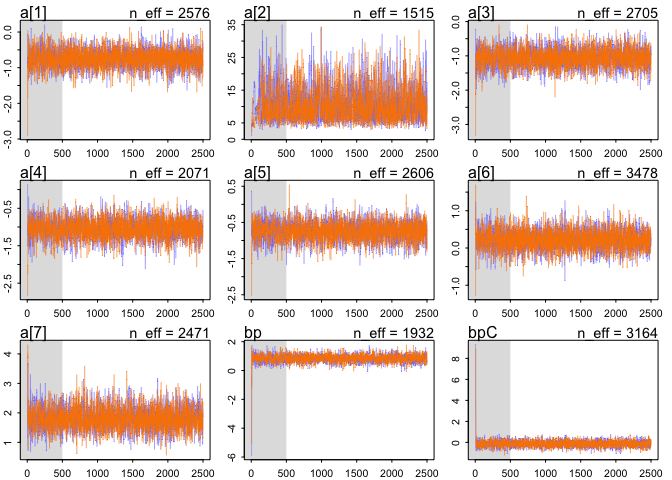
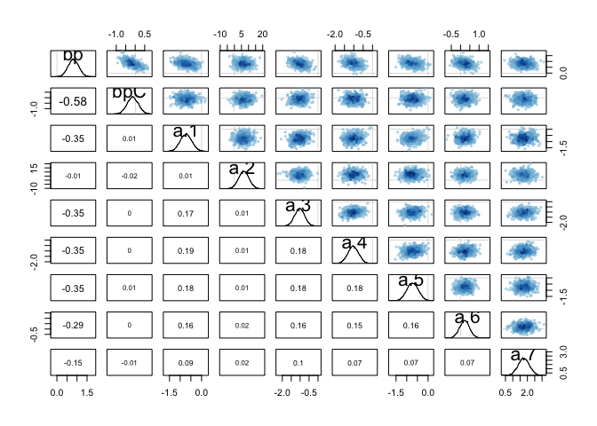
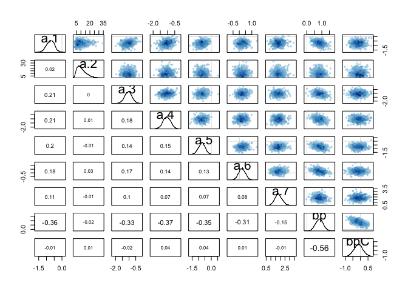
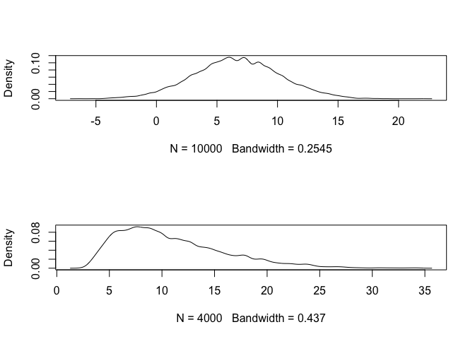
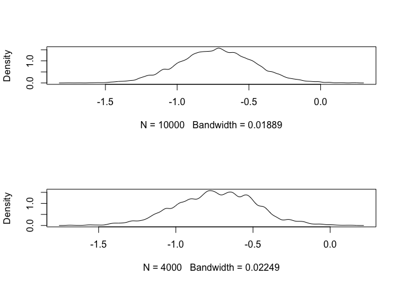
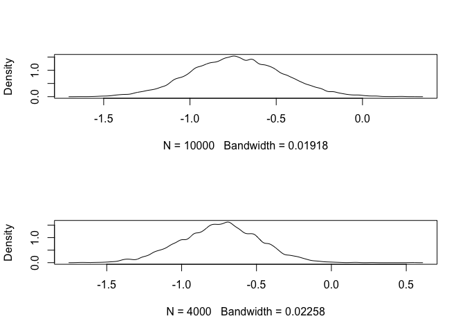
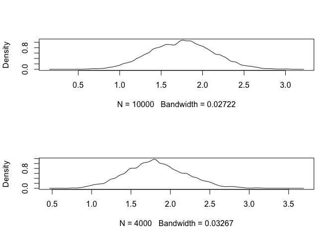
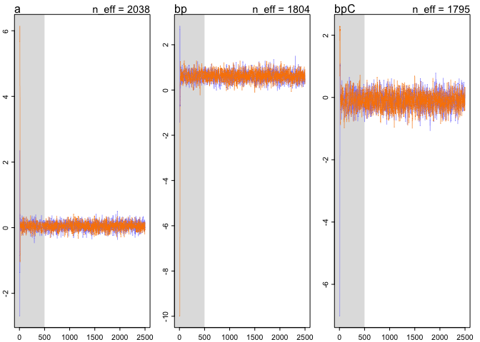
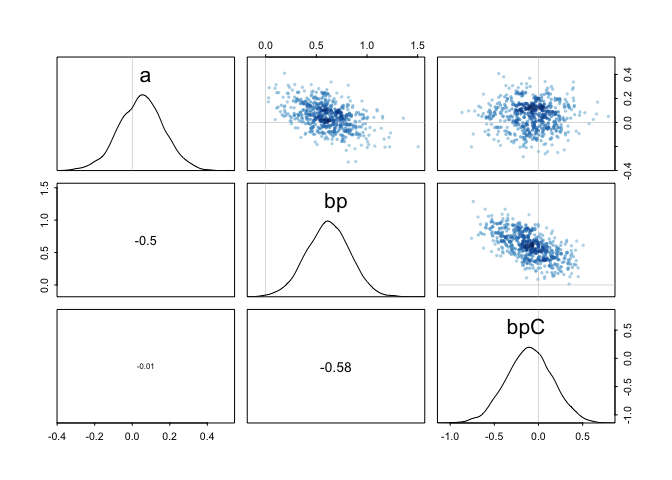

# Ch10_homework
Stacey Harmer  
September 5, 2016  
Chapter 10 problems
10E1, 10E2, 10E3
10M1
10H1, 10H2

##10E1 - If an event has probability of 0.35, whare are the log-odds of the event?


```r
library(rethinking)
```

```
## Loading required package: rstan
```

```
## Loading required package: ggplot2
```

```
## Loading required package: StanHeaders
```

```
## rstan (Version 2.10.1, packaged: 2016-06-24 13:22:16 UTC, GitRev: 85f7a56811da)
```

```
## For execution on a local, multicore CPU with excess RAM we recommend calling
## rstan_options(auto_write = TRUE)
## options(mc.cores = parallel::detectCores())
```

```
## Loading required package: parallel
```

```
## rethinking (Version 1.59)
```

```r
logit(.35)
```

```
## [1] -0.6190392
```
So the log-odds are -0.619

##10E2 - If an event has log-odds of 3.2, what is probability?

```r
logistic(3.2)
```

```
## [1] 0.9608343
```
That is 0.96

##10E3 - Suppose a coefficient in a logistic regression has value 1.7.  What does this imply about the proportional change in odds of the outcome?

Example would be something like: logit(p) <- a + b*condition
A value of 1.7 for b would mean that if the 'condition' is present, the measured outcome is more likely to happen.


##10M1 - Analysis of data in aggregated and disaggregated forms changes the likelihood of the data.  Why?

I think this is because the aggregated form suggests fewer trials were performed than when data analyzed in disaggregated form.  
Number of trials (experiments) carried out will affect likelihood.


##10H1 - Use map to construct quadratic approximate posterior distribution for chimp model m10.4.  compare to output from map2stan.  
Explain differences and similarities.

```r
library(rethinking)
library(rstan)
rstan_options(auto_write = TRUE)
options(mc.cores = parallel::detectCores())

data("chimpanzees")
d <- chimpanzees # remove NAs from data
d2 <- d
d2$recipient <- NULL
#  call from book ran fine until I tried to knit.  Now, simplify data and try again.
d2 <- d2[, c(1,2,5,7)]

m10.4.map <- map( 
                   alist(
                     pulled_left ~ dbinom( 1 , p ) ,
                     logit(p) <- a[actor] + (bp + bpC*condition)*prosoc_left ,
                     a[actor] ~ dnorm(0,10),
                     bp ~ dnorm(0,10),
                     bpC ~ dnorm(0,10)
                   ) ,
                   data=d2  )


m10.4.stan <- map2stan( 
                   alist(
                     pulled_left ~ dbinom( 1 , p ) ,
                     logit(p) <- a[actor] + (bp + bpC*condition)*prosoc_left ,
                     a[actor] ~ dnorm(0,10),
                     bp ~ dnorm(0,10),
                     bpC ~ dnorm(0,10)
                   ) ,
                   data=d2 , chains=2 , iter=2500 , warmup=500 )
```

```
## 
## SAMPLING FOR MODEL 'pulled_left ~ dbinom(1, p)' NOW (CHAIN 1).
## 
## Chain 1, Iteration:    1 / 2500 [  0%]  (Warmup)
## Chain 1, Iteration:  250 / 2500 [ 10%]  (Warmup)
## Chain 1, Iteration:  500 / 2500 [ 20%]  (Warmup)
## Chain 1, Iteration:  501 / 2500 [ 20%]  (Sampling)
## Chain 1, Iteration:  750 / 2500 [ 30%]  (Sampling)
## Chain 1, Iteration: 1000 / 2500 [ 40%]  (Sampling)
## Chain 1, Iteration: 1250 / 2500 [ 50%]  (Sampling)
## Chain 1, Iteration: 1500 / 2500 [ 60%]  (Sampling)
## Chain 1, Iteration: 1750 / 2500 [ 70%]  (Sampling)
## Chain 1, Iteration: 2000 / 2500 [ 80%]  (Sampling)
## Chain 1, Iteration: 2250 / 2500 [ 90%]  (Sampling)
## Chain 1, Iteration: 2500 / 2500 [100%]  (Sampling)
##  Elapsed Time: 0.444122 seconds (Warm-up)
##                1.44706 seconds (Sampling)
##                1.89119 seconds (Total)
## 
## 
## SAMPLING FOR MODEL 'pulled_left ~ dbinom(1, p)' NOW (CHAIN 2).
## 
## Chain 2, Iteration:    1 / 2500 [  0%]  (Warmup)
## Chain 2, Iteration:  250 / 2500 [ 10%]  (Warmup)
## Chain 2, Iteration:  500 / 2500 [ 20%]  (Warmup)
## Chain 2, Iteration:  501 / 2500 [ 20%]  (Sampling)
## Chain 2, Iteration:  750 / 2500 [ 30%]  (Sampling)
## Chain 2, Iteration: 1000 / 2500 [ 40%]  (Sampling)
## Chain 2, Iteration: 1250 / 2500 [ 50%]  (Sampling)
## Chain 2, Iteration: 1500 / 2500 [ 60%]  (Sampling)
## Chain 2, Iteration: 1750 / 2500 [ 70%]  (Sampling)
## Chain 2, Iteration: 2000 / 2500 [ 80%]  (Sampling)
## Chain 2, Iteration: 2250 / 2500 [ 90%]  (Sampling)
## Chain 2, Iteration: 2500 / 2500 [100%]  (Sampling)
##  Elapsed Time: 0.387303 seconds (Warm-up)
##                1.15774 seconds (Sampling)
##                1.54504 seconds (Total)
## 
## 
## SAMPLING FOR MODEL 'pulled_left ~ dbinom(1, p)' NOW (CHAIN 1).
## WARNING: No variance estimation is
##          performed for num_warmup < 20
## 
## 
## Chain 1, Iteration: 1 / 1 [100%]  (Sampling)
##  Elapsed Time: 3e-06 seconds (Warm-up)
##                0.00022 seconds (Sampling)
##                0.000223 seconds (Total)
```

```
## Computing WAIC
```

```
## Constructing posterior predictions
```

```
## [ 400 / 4000 ]
[ 800 / 4000 ]
[ 1200 / 4000 ]
[ 1600 / 4000 ]
[ 2000 / 4000 ]
[ 2400 / 4000 ]
[ 2800 / 4000 ]
[ 3200 / 4000 ]
[ 3600 / 4000 ]
[ 4000 / 4000 ]
```

```
## Warning in map2stan(alist(pulled_left ~ dbinom(1, p), logit(p) <- a[actor] + : There were 36 divergent iterations during sampling.
## Check the chains (trace plots, n_eff, Rhat) carefully to ensure they are valid.
```

```r
plot(m10.4.stan)
```

<!-- -->

```r
compare(m10.4.map, m10.4.stan) # not a valid comparison
```

```
## Warning in compare(m10.4.map, m10.4.stan): Not all model fits of same class.
## This is usually a bad idea, because it implies they were fit by different algorithms.
## Check yourself, before you wreck yourself.
```

```
##             WAIC pWAIC dWAIC weight    SE  dSE
## m10.4.stan 529.2   8.0   0.0      1 19.97   NA
## m10.4.map  545.1  13.4  15.9      0 18.90 1.83
```
Now compare the posterior distributions generated by the two models.

```r
post.map <- extract.samples(m10.4.map, n=1e4)

str(post.map)
```

```
## List of 3
##  $ bp : num [1:10000] 1.117 0.977 0.614 1.079 0.637 ...
##  $ bpC: num [1:10000] -0.32 -0.291 -0.29 -0.439 0.114 ...
##  $ a  : num [1:10000, 1:7] -0.934 -0.801 -0.553 -0.408 -0.666 ...
```

```r
str(post.map)
```

```
## List of 3
##  $ bp : num [1:10000] 1.117 0.977 0.614 1.079 0.637 ...
##  $ bpC: num [1:10000] -0.32 -0.291 -0.29 -0.439 0.114 ...
##  $ a  : num [1:10000, 1:7] -0.934 -0.801 -0.553 -0.408 -0.666 ...
```

```r
post.stan <- extract.samples(m10.4.stan)
pairs(m10.4.map) 
```

<!-- -->

```r
pairs(m10.4.stan)
```

<!-- -->
I'm sure there is a clever way to directly compare the posteriors to each other.  But just looking at the plotted posterior densities:

MAP function: all the estimates appear GAussian, even a.2.  Negative correlation between bp and bpC. Some of the 'actors'
are  mildly negatively correlated wiht bp. 

MCMC:  Still a negative correlation between bp an dbpC.  many distributions are now non-Gaussian.  Some of the 'actors'
are  mildly negatively correlated wiht bp.

```r
par(mfrow=c(2,1))
dens(post.map$a[,2]) # many positive and some negative values; 
# So model is not predicting anything consisten from chimp #2
dens(post.stan$a[,2]) # All positive
```

<!-- -->

```r
dens(post.map$a[,1]) # very similar
dens(post.stan$a[,1])
```

<!-- -->

```r
dens(post.map$a[,5]) # all negative
dens(post.stan$a[,5]) # similar
```

<!-- -->

```r
dens(post.map$a[,7]) # similar
dens(post.stan$a[,7]) #
```

<!-- -->


##10H2 - use WAIC to compare chimp modesl with unique intercepts (m10.4) to simpler models in same section.
I fit m10.4.stan already (above).  Now simpler model fits.  

```r
m10.4.simple <- map2stan( 
                   alist(
                     pulled_left ~ dbinom( 1 , p ) ,
                     logit(p) <- a + (bp + bpC*condition)*prosoc_left ,
                     a ~ dnorm(0,10),
                     bp ~ dnorm(0,10),
                     bpC ~ dnorm(0,10)
                   ) ,
                   data=d2 , chains=2 , iter=2500 , warmup=500 )
```

```
## 
## SAMPLING FOR MODEL 'pulled_left ~ dbinom(1, p)' NOW (CHAIN 1).
## 
## Chain 1, Iteration:    1 / 2500 [  0%]  (Warmup)
## Chain 1, Iteration:  250 / 2500 [ 10%]  (Warmup)
## Chain 1, Iteration:  500 / 2500 [ 20%]  (Warmup)
## Chain 1, Iteration:  501 / 2500 [ 20%]  (Sampling)
## Chain 1, Iteration:  750 / 2500 [ 30%]  (Sampling)
## Chain 1, Iteration: 1000 / 2500 [ 40%]  (Sampling)
## Chain 1, Iteration: 1250 / 2500 [ 50%]  (Sampling)
## Chain 1, Iteration: 1500 / 2500 [ 60%]  (Sampling)
## Chain 1, Iteration: 1750 / 2500 [ 70%]  (Sampling)
## Chain 1, Iteration: 2000 / 2500 [ 80%]  (Sampling)
## Chain 1, Iteration: 2250 / 2500 [ 90%]  (Sampling)
## Chain 1, Iteration: 2500 / 2500 [100%]  (Sampling)
##  Elapsed Time: 0.241825 seconds (Warm-up)
##                0.892569 seconds (Sampling)
##                1.13439 seconds (Total)
## 
## 
## SAMPLING FOR MODEL 'pulled_left ~ dbinom(1, p)' NOW (CHAIN 2).
## 
## Chain 2, Iteration:    1 / 2500 [  0%]  (Warmup)
## Chain 2, Iteration:  250 / 2500 [ 10%]  (Warmup)
## Chain 2, Iteration:  500 / 2500 [ 20%]  (Warmup)
## Chain 2, Iteration:  501 / 2500 [ 20%]  (Sampling)
## Chain 2, Iteration:  750 / 2500 [ 30%]  (Sampling)
## Chain 2, Iteration: 1000 / 2500 [ 40%]  (Sampling)
## Chain 2, Iteration: 1250 / 2500 [ 50%]  (Sampling)
## Chain 2, Iteration: 1500 / 2500 [ 60%]  (Sampling)
## Chain 2, Iteration: 1750 / 2500 [ 70%]  (Sampling)
## Chain 2, Iteration: 2000 / 2500 [ 80%]  (Sampling)
## Chain 2, Iteration: 2250 / 2500 [ 90%]  (Sampling)
## Chain 2, Iteration: 2500 / 2500 [100%]  (Sampling)
##  Elapsed Time: 0.239185 seconds (Warm-up)
##                0.965124 seconds (Sampling)
##                1.20431 seconds (Total)
## 
## 
## SAMPLING FOR MODEL 'pulled_left ~ dbinom(1, p)' NOW (CHAIN 1).
## WARNING: No variance estimation is
##          performed for num_warmup < 20
## 
## 
## Chain 1, Iteration: 1 / 1 [100%]  (Sampling)
##  Elapsed Time: 3e-06 seconds (Warm-up)
##                0.000237 seconds (Sampling)
##                0.00024 seconds (Total)
```

```
## Computing WAIC
```

```
## Constructing posterior predictions
```

```
## [ 400 / 4000 ]
[ 800 / 4000 ]
[ 1200 / 4000 ]
[ 1600 / 4000 ]
[ 2000 / 4000 ]
[ 2400 / 4000 ]
[ 2800 / 4000 ]
[ 3200 / 4000 ]
[ 3600 / 4000 ]
[ 4000 / 4000 ]
```

```r
plot(m10.4.simple)
```

<!-- -->

```r
pairs(m10.4.simple)
```

<!-- -->

```r
compare(m10.4.stan, m10.4.simple) 
```

```
##               WAIC pWAIC dWAIC weight    SE   dSE
## m10.4.stan   529.2     8   0.0      1 19.97    NA
## m10.4.simple 682.3     3 153.1      0  9.47 19.19
```
Very strong preference for the more complex model.
DIfference is so large that I think overfitting not a concern with more complex model.
