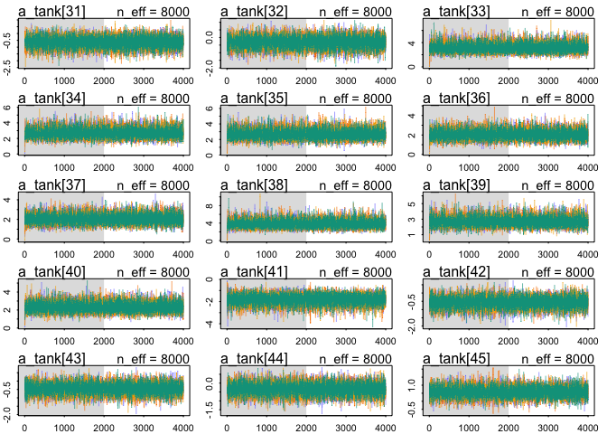
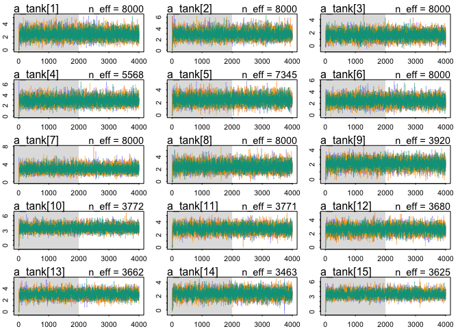

# Ch12_problems_2016-10-27.Rmd
Stacey Harmer  
October 27, 2016  


Problems
12E1 - Which of the following priors will produce more shrinkage in the estimates? alpha.tank ~ Normal(0,1) or alpha.tank ~ Normal(0,2)

b) has larger SD than a).  Stronger shrinkage (p 362) is a greater differnce between a population's empirical (real) proportion
and the global average (alpha).  I would think that A would have greater shrinkage, as there wouldn't be as much
variation allowed in the global average estimates as in case B.  (see figure 12.1; real data are blue)

12E2 - make the following a multilevel model:
 y ~ binomial(1, p)
 logit(p) = alpha.group[i] + beta*x
 alpha.group ~ normal(0, 10)
 beta ~ normal(0, 1)
 
 y ~ binomial(1, p)
 logit(p) = alpha.group[i] + beta*x
 alpha.group ~ normal(alpha, sigma)
 alpha ~ normal(0,10)
 sigma ~ HalfCauchy(0,1)
 beta ~ normal(0, 1)

12M1 - Reed frog data.  Add predation and size treatment variables to the varying intercepts model.
Consider models with etiher size or predation, both, and both with interaction
Focus on inferred variation across tanks, and why it changes with different models


```r
library(rethinking)
```

```
## Loading required package: rstan
```

```
## Loading required package: ggplot2
```

```
## Loading required package: StanHeaders
```

```
## rstan (Version 2.12.1, packaged: 2016-09-11 13:07:50 UTC, GitRev: 85f7a56811da)
```

```
## For execution on a local, multicore CPU with excess RAM we recommend calling
## rstan_options(auto_write = TRUE)
## options(mc.cores = parallel::detectCores())
```

```
## Loading required package: parallel
```

```
## rethinking (Version 1.59)
```

```r
# get map2stan up and ready
library(rstan)
rstan_options(auto_write = TRUE)
options(mc.cores = parallel::detectCores())

data("reedfrogs")
d <- reedfrogs
head(d)
```

```
##   density pred  size surv propsurv
## 1      10   no   big    9      0.9
## 2      10   no   big   10      1.0
## 3      10   no   big    7      0.7
## 4      10   no   big   10      1.0
## 5      10   no small    9      0.9
## 6      10   no small    9      0.9
```

```r
tail(d)
```

```
##    density pred  size surv  propsurv
## 43      35 pred   big   13 0.3714286
## 44      35 pred   big   14 0.4000000
## 45      35 pred small   22 0.6285714
## 46      35 pred small   12 0.3428571
## 47      35 pred small   31 0.8857143
## 48      35 pred small   17 0.4857143
```

```r
summary(d)
```

```
##     density        pred       size         surv          propsurv     
##  Min.   :10.00   no  :24   big  :24   Min.   : 4.00   Min.   :0.1143  
##  1st Qu.:10.00   pred:24   small:24   1st Qu.: 9.00   1st Qu.:0.4964  
##  Median :25.00                        Median :12.50   Median :0.8857  
##  Mean   :23.33                        Mean   :16.31   Mean   :0.7216  
##  3rd Qu.:35.00                        3rd Qu.:23.00   3rd Qu.:0.9200  
##  Max.   :35.00                        Max.   :35.00   Max.   :1.0000
```

I think I need to make dummy variables first.
For pred, set no = 0 and pred = 1
for size, set small = 0 and big = 1

```r
d$pred_d <- ifelse(d$pred == "pred", 1, 0)
d$size_d <- ifelse(d$size == "big", 1, 0)
```
A quick glance at the data

```r
library(ggplot2)
pl <- ggplot(d, aes(pred, propsurv))
pl + geom_boxplot() + facet_grid(. ~ size) + geom_jitter(width = 0.2)
```

<!-- -->
Hmm, seems like 'big' may be a disadvantage for frogs with predators around

To start, will re-run original model, and then start adding to it


```r
# make the tank cluster variable
d$tank <- 1:nrow(d)
head(d)
```

```
##   density pred  size surv propsurv pred_d size_d tank
## 1      10   no   big    9      0.9      0      1    1
## 2      10   no   big   10      1.0      0      1    2
## 3      10   no   big    7      0.7      0      1    3
## 4      10   no   big   10      1.0      0      1    4
## 5      10   no small    9      0.9      0      0    5
## 6      10   no small    9      0.9      0      0    6
```

```r
# fit intercept only model
m12M1.1 <- map2stan(
  alist(
    surv ~ dbinom( density , p ) ,
    logit(p) <- a_tank[tank] ,
    a_tank[tank] ~ dnorm( a , sigma ) ,
    a ~ dnorm(0,1) ,
    sigma ~ dcauchy(0, 1)
  ),
  data=d, iter = 4000, chains = 4 )
```

```
## Warning in FUN(X[[i]], ...): data with name pred is not numeric and not
## used
```

```
## Warning in FUN(X[[i]], ...): data with name size is not numeric and not
## used
```

```
## 
## SAMPLING FOR MODEL 'surv ~ dbinom(density, p)' NOW (CHAIN 1).
## 
## Chain 1, Iteration:    1 / 4000 [  0%]  (Warmup)
## Chain 1, Iteration:  400 / 4000 [ 10%]  (Warmup)
## Chain 1, Iteration:  800 / 4000 [ 20%]  (Warmup)
## Chain 1, Iteration: 1200 / 4000 [ 30%]  (Warmup)
## Chain 1, Iteration: 1600 / 4000 [ 40%]  (Warmup)
## Chain 1, Iteration: 2000 / 4000 [ 50%]  (Warmup)
## Chain 1, Iteration: 2001 / 4000 [ 50%]  (Sampling)
## Chain 1, Iteration: 2400 / 4000 [ 60%]  (Sampling)
## Chain 1, Iteration: 2800 / 4000 [ 70%]  (Sampling)
## Chain 1, Iteration: 3200 / 4000 [ 80%]  (Sampling)
## Chain 1, Iteration: 3600 / 4000 [ 90%]  (Sampling)
## Chain 1, Iteration: 4000 / 4000 [100%]  (Sampling)
##  Elapsed Time: 0.234941 seconds (Warm-up)
##                0.210608 seconds (Sampling)
##                0.445549 seconds (Total)
## 
## 
## SAMPLING FOR MODEL 'surv ~ dbinom(density, p)' NOW (CHAIN 2).
## 
## Chain 2, Iteration:    1 / 4000 [  0%]  (Warmup)
## Chain 2, Iteration:  400 / 4000 [ 10%]  (Warmup)
## Chain 2, Iteration:  800 / 4000 [ 20%]  (Warmup)
## Chain 2, Iteration: 1200 / 4000 [ 30%]  (Warmup)
## Chain 2, Iteration: 1600 / 4000 [ 40%]  (Warmup)
## Chain 2, Iteration: 2000 / 4000 [ 50%]  (Warmup)
## Chain 2, Iteration: 2001 / 4000 [ 50%]  (Sampling)
## Chain 2, Iteration: 2400 / 4000 [ 60%]  (Sampling)
## Chain 2, Iteration: 2800 / 4000 [ 70%]  (Sampling)
## Chain 2, Iteration: 3200 / 4000 [ 80%]  (Sampling)
## Chain 2, Iteration: 3600 / 4000 [ 90%]  (Sampling)
## Chain 2, Iteration: 4000 / 4000 [100%]  (Sampling)
##  Elapsed Time: 0.250926 seconds (Warm-up)
##                0.218783 seconds (Sampling)
##                0.469709 seconds (Total)
```

```
## The following numerical problems occured the indicated number of times after warmup on chain 2
```

```
##                                                                                 count
## Exception thrown at line 17: normal_log: Scale parameter is 0, but must be > 0!     1
```

```
## When a numerical problem occurs, the Hamiltonian proposal gets rejected.
```

```
## See http://mc-stan.org/misc/warnings.html#exception-hamiltonian-proposal-rejected
```

```
## If the number in the 'count' column is small, do not ask about this message on stan-users.
```

```
## 
## SAMPLING FOR MODEL 'surv ~ dbinom(density, p)' NOW (CHAIN 3).
## 
## Chain 3, Iteration:    1 / 4000 [  0%]  (Warmup)
## Chain 3, Iteration:  400 / 4000 [ 10%]  (Warmup)
## Chain 3, Iteration:  800 / 4000 [ 20%]  (Warmup)
## Chain 3, Iteration: 1200 / 4000 [ 30%]  (Warmup)
## Chain 3, Iteration: 1600 / 4000 [ 40%]  (Warmup)
## Chain 3, Iteration: 2000 / 4000 [ 50%]  (Warmup)
## Chain 3, Iteration: 2001 / 4000 [ 50%]  (Sampling)
## Chain 3, Iteration: 2400 / 4000 [ 60%]  (Sampling)
## Chain 3, Iteration: 2800 / 4000 [ 70%]  (Sampling)
## Chain 3, Iteration: 3200 / 4000 [ 80%]  (Sampling)
## Chain 3, Iteration: 3600 / 4000 [ 90%]  (Sampling)
## Chain 3, Iteration: 4000 / 4000 [100%]  (Sampling)
##  Elapsed Time: 0.247463 seconds (Warm-up)
##                0.213484 seconds (Sampling)
##                0.460947 seconds (Total)
```

```
## The following numerical problems occured the indicated number of times after warmup on chain 3
```

```
##                                                                                 count
## Exception thrown at line 17: normal_log: Scale parameter is 0, but must be > 0!     1
```

```
## When a numerical problem occurs, the Hamiltonian proposal gets rejected.
```

```
## See http://mc-stan.org/misc/warnings.html#exception-hamiltonian-proposal-rejected
```

```
## If the number in the 'count' column is small, do not ask about this message on stan-users.
```

```
## 
## SAMPLING FOR MODEL 'surv ~ dbinom(density, p)' NOW (CHAIN 4).
## 
## Chain 4, Iteration:    1 / 4000 [  0%]  (Warmup)
## Chain 4, Iteration:  400 / 4000 [ 10%]  (Warmup)
## Chain 4, Iteration:  800 / 4000 [ 20%]  (Warmup)
## Chain 4, Iteration: 1200 / 4000 [ 30%]  (Warmup)
## Chain 4, Iteration: 1600 / 4000 [ 40%]  (Warmup)
## Chain 4, Iteration: 2000 / 4000 [ 50%]  (Warmup)
## Chain 4, Iteration: 2001 / 4000 [ 50%]  (Sampling)
## Chain 4, Iteration: 2400 / 4000 [ 60%]  (Sampling)
## Chain 4, Iteration: 2800 / 4000 [ 70%]  (Sampling)
## Chain 4, Iteration: 3200 / 4000 [ 80%]  (Sampling)
## Chain 4, Iteration: 3600 / 4000 [ 90%]  (Sampling)
## Chain 4, Iteration: 4000 / 4000 [100%]  (Sampling)
##  Elapsed Time: 0.242474 seconds (Warm-up)
##                0.219485 seconds (Sampling)
##                0.461959 seconds (Total)
```

```
## The following numerical problems occured the indicated number of times after warmup on chain 4
```

```
##                                                                                 count
## Exception thrown at line 17: normal_log: Scale parameter is 0, but must be > 0!     2
```

```
## When a numerical problem occurs, the Hamiltonian proposal gets rejected.
```

```
## See http://mc-stan.org/misc/warnings.html#exception-hamiltonian-proposal-rejected
```

```
## If the number in the 'count' column is small, do not ask about this message on stan-users.
```

```
## Warning in FUN(X[[i]], ...): data with name pred is not numeric and not
## used

## Warning in FUN(X[[i]], ...): data with name size is not numeric and not
## used
```

```
## 
## SAMPLING FOR MODEL 'surv ~ dbinom(density, p)' NOW (CHAIN 1).
## WARNING: No variance estimation is
##          performed for num_warmup < 20
## 
## 
## Chain 1, Iteration: 1 / 1 [100%]  (Sampling)
##  Elapsed Time: 4e-06 seconds (Warm-up)
##                6.5e-05 seconds (Sampling)
##                6.9e-05 seconds (Total)
```

```
## Computing WAIC
```

```
## Constructing posterior predictions
```

```
## [ 800 / 8000 ]
[ 1600 / 8000 ]
[ 2400 / 8000 ]
[ 3200 / 8000 ]
[ 4000 / 8000 ]
[ 4800 / 8000 ]
[ 5600 / 8000 ]
[ 6400 / 8000 ]
[ 7200 / 8000 ]
[ 8000 / 8000 ]
```

```
## Aggregated binomial counts detected. Splitting to 0/1 outcome for WAIC calculation.
```

```r
plot(m12M1.1)
```

```
## Waiting to draw page 2 of 4
```

<!-- -->

```
## Waiting to draw page 3 of 4
```

<!-- -->

```
## Waiting to draw page 4 of 4
```

<!-- -->

```r
# intercept plus predation
m12M1.2 <- map2stan(
  alist(
    surv ~ dbinom( density , p ) ,
    logit(p) <- a_tank[tank] + b*pred_d,
    a_tank[tank] ~ dnorm( a , sigma ) ,
    a ~ dnorm(0,1) ,
    sigma ~ dcauchy(0, 1) ,
    b ~ dnorm(0,1)
  ),
  data=d, iter = 4000, chains = 4 )
```

```
## Warning in FUN(X[[i]], ...): data with name pred is not numeric and not
## used

## Warning in FUN(X[[i]], ...): data with name size is not numeric and not
## used
```

```
## 
## SAMPLING FOR MODEL 'surv ~ dbinom(density, p)' NOW (CHAIN 1).
## 
## Chain 1, Iteration:    1 / 4000 [  0%]  (Warmup)
## Chain 1, Iteration:  400 / 4000 [ 10%]  (Warmup)
## Chain 1, Iteration:  800 / 4000 [ 20%]  (Warmup)
## Chain 1, Iteration: 1200 / 4000 [ 30%]  (Warmup)
## Chain 1, Iteration: 1600 / 4000 [ 40%]  (Warmup)
## Chain 1, Iteration: 2000 / 4000 [ 50%]  (Warmup)
## Chain 1, Iteration: 2001 / 4000 [ 50%]  (Sampling)
## Chain 1, Iteration: 2400 / 4000 [ 60%]  (Sampling)
## Chain 1, Iteration: 2800 / 4000 [ 70%]  (Sampling)
## Chain 1, Iteration: 3200 / 4000 [ 80%]  (Sampling)
## Chain 1, Iteration: 3600 / 4000 [ 90%]  (Sampling)
## Chain 1, Iteration: 4000 / 4000 [100%]  (Sampling)
##  Elapsed Time: 0.32542 seconds (Warm-up)
##                0.371539 seconds (Sampling)
##                0.696959 seconds (Total)
```

```
## The following numerical problems occured the indicated number of times after warmup on chain 1
```

```
##                                                                                 count
## Exception thrown at line 20: normal_log: Scale parameter is 0, but must be > 0!     1
```

```
## When a numerical problem occurs, the Hamiltonian proposal gets rejected.
```

```
## See http://mc-stan.org/misc/warnings.html#exception-hamiltonian-proposal-rejected
```

```
## If the number in the 'count' column is small, do not ask about this message on stan-users.
```

```
## 
## SAMPLING FOR MODEL 'surv ~ dbinom(density, p)' NOW (CHAIN 2).
## 
## Chain 2, Iteration:    1 / 4000 [  0%]  (Warmup)
## Chain 2, Iteration:  400 / 4000 [ 10%]  (Warmup)
## Chain 2, Iteration:  800 / 4000 [ 20%]  (Warmup)
## Chain 2, Iteration: 1200 / 4000 [ 30%]  (Warmup)
## Chain 2, Iteration: 1600 / 4000 [ 40%]  (Warmup)
## Chain 2, Iteration: 2000 / 4000 [ 50%]  (Warmup)
## Chain 2, Iteration: 2001 / 4000 [ 50%]  (Sampling)
## Chain 2, Iteration: 2400 / 4000 [ 60%]  (Sampling)
## Chain 2, Iteration: 2800 / 4000 [ 70%]  (Sampling)
## Chain 2, Iteration: 3200 / 4000 [ 80%]  (Sampling)
## Chain 2, Iteration: 3600 / 4000 [ 90%]  (Sampling)
## Chain 2, Iteration: 4000 / 4000 [100%]  (Sampling)
##  Elapsed Time: 0.351346 seconds (Warm-up)
##                0.387731 seconds (Sampling)
##                0.739077 seconds (Total)
```

```
## The following numerical problems occured the indicated number of times after warmup on chain 2
```

```
##                                                                                 count
## Exception thrown at line 20: normal_log: Scale parameter is 0, but must be > 0!     1
```

```
## When a numerical problem occurs, the Hamiltonian proposal gets rejected.
```

```
## See http://mc-stan.org/misc/warnings.html#exception-hamiltonian-proposal-rejected
```

```
## If the number in the 'count' column is small, do not ask about this message on stan-users.
```

```
## 
## SAMPLING FOR MODEL 'surv ~ dbinom(density, p)' NOW (CHAIN 3).
## 
## Chain 3, Iteration:    1 / 4000 [  0%]  (Warmup)
## Chain 3, Iteration:  400 / 4000 [ 10%]  (Warmup)
## Chain 3, Iteration:  800 / 4000 [ 20%]  (Warmup)
## Chain 3, Iteration: 1200 / 4000 [ 30%]  (Warmup)
## Chain 3, Iteration: 1600 / 4000 [ 40%]  (Warmup)
## Chain 3, Iteration: 2000 / 4000 [ 50%]  (Warmup)
## Chain 3, Iteration: 2001 / 4000 [ 50%]  (Sampling)
## Chain 3, Iteration: 2400 / 4000 [ 60%]  (Sampling)
## Chain 3, Iteration: 2800 / 4000 [ 70%]  (Sampling)
## Chain 3, Iteration: 3200 / 4000 [ 80%]  (Sampling)
## Chain 3, Iteration: 3600 / 4000 [ 90%]  (Sampling)
## Chain 3, Iteration: 4000 / 4000 [100%]  (Sampling)
##  Elapsed Time: 0.33214 seconds (Warm-up)
##                0.375223 seconds (Sampling)
##                0.707363 seconds (Total)
```

```
## The following numerical problems occured the indicated number of times after warmup on chain 3
```

```
##                                                                                 count
## Exception thrown at line 20: normal_log: Scale parameter is 0, but must be > 0!     1
```

```
## When a numerical problem occurs, the Hamiltonian proposal gets rejected.
```

```
## See http://mc-stan.org/misc/warnings.html#exception-hamiltonian-proposal-rejected
```

```
## If the number in the 'count' column is small, do not ask about this message on stan-users.
```

```
## 
## SAMPLING FOR MODEL 'surv ~ dbinom(density, p)' NOW (CHAIN 4).
## 
## Chain 4, Iteration:    1 / 4000 [  0%]  (Warmup)
## Chain 4, Iteration:  400 / 4000 [ 10%]  (Warmup)
## Chain 4, Iteration:  800 / 4000 [ 20%]  (Warmup)
## Chain 4, Iteration: 1200 / 4000 [ 30%]  (Warmup)
## Chain 4, Iteration: 1600 / 4000 [ 40%]  (Warmup)
## Chain 4, Iteration: 2000 / 4000 [ 50%]  (Warmup)
## Chain 4, Iteration: 2001 / 4000 [ 50%]  (Sampling)
## Chain 4, Iteration: 2400 / 4000 [ 60%]  (Sampling)
## Chain 4, Iteration: 2800 / 4000 [ 70%]  (Sampling)
## Chain 4, Iteration: 3200 / 4000 [ 80%]  (Sampling)
## Chain 4, Iteration: 3600 / 4000 [ 90%]  (Sampling)
## Chain 4, Iteration: 4000 / 4000 [100%]  (Sampling)
##  Elapsed Time: 0.339782 seconds (Warm-up)
##                0.376372 seconds (Sampling)
##                0.716154 seconds (Total)
```

```
## Warning in FUN(X[[i]], ...): data with name pred is not numeric and not
## used

## Warning in FUN(X[[i]], ...): data with name size is not numeric and not
## used
```

```
## 
## SAMPLING FOR MODEL 'surv ~ dbinom(density, p)' NOW (CHAIN 1).
## WARNING: No variance estimation is
##          performed for num_warmup < 20
## 
## 
## Chain 1, Iteration: 1 / 1 [100%]  (Sampling)
##  Elapsed Time: 4e-06 seconds (Warm-up)
##                6.4e-05 seconds (Sampling)
##                6.8e-05 seconds (Total)
```

```
## Computing WAIC
```

```
## Constructing posterior predictions
```

```
## [ 800 / 8000 ]
[ 1600 / 8000 ]
[ 2400 / 8000 ]
[ 3200 / 8000 ]
[ 4000 / 8000 ]
[ 4800 / 8000 ]
[ 5600 / 8000 ]
[ 6400 / 8000 ]
[ 7200 / 8000 ]
[ 8000 / 8000 ]
```

```
## Aggregated binomial counts detected. Splitting to 0/1 outcome for WAIC calculation.
```

```r
plot(m12M1.2)
```

<!-- -->

```
## Waiting to draw page 2 of 4
```

<!-- -->

```
## Waiting to draw page 3 of 4
```

<!-- -->

```
## Waiting to draw page 4 of 4
```

<!-- -->

```r
# intercept plus size
m12M1.3 <- map2stan(
  alist(
    surv ~ dbinom( density , p ) ,
    logit(p) <- a_tank[tank] + b*size_d,
    a_tank[tank] ~ dnorm( a , sigma ) ,
    a ~ dnorm(0,1) ,
    sigma ~ dcauchy(0, 1) ,
    b ~ dnorm(0,1)
  ),
  data=d, iter = 4000, chains = 4 )
```

```
## Warning in FUN(X[[i]], ...): data with name pred is not numeric and not
## used

## Warning in FUN(X[[i]], ...): data with name size is not numeric and not
## used
```

```
## 
## SAMPLING FOR MODEL 'surv ~ dbinom(density, p)' NOW (CHAIN 1).
## 
## Chain 1, Iteration:    1 / 4000 [  0%]  (Warmup)
## Chain 1, Iteration:  400 / 4000 [ 10%]  (Warmup)
## Chain 1, Iteration:  800 / 4000 [ 20%]  (Warmup)
## Chain 1, Iteration: 1200 / 4000 [ 30%]  (Warmup)
## Chain 1, Iteration: 1600 / 4000 [ 40%]  (Warmup)
## Chain 1, Iteration: 2000 / 4000 [ 50%]  (Warmup)
## Chain 1, Iteration: 2001 / 4000 [ 50%]  (Sampling)
## Chain 1, Iteration: 2400 / 4000 [ 60%]  (Sampling)
## Chain 1, Iteration: 2800 / 4000 [ 70%]  (Sampling)
## Chain 1, Iteration: 3200 / 4000 [ 80%]  (Sampling)
## Chain 1, Iteration: 3600 / 4000 [ 90%]  (Sampling)
## Chain 1, Iteration: 4000 / 4000 [100%]  (Sampling)
##  Elapsed Time: 0.349444 seconds (Warm-up)
##                0.381603 seconds (Sampling)
##                0.731047 seconds (Total)
## 
## 
## SAMPLING FOR MODEL 'surv ~ dbinom(density, p)' NOW (CHAIN 2).
## 
## Chain 2, Iteration:    1 / 4000 [  0%]  (Warmup)
## Chain 2, Iteration:  400 / 4000 [ 10%]  (Warmup)
## Chain 2, Iteration:  800 / 4000 [ 20%]  (Warmup)
## Chain 2, Iteration: 1200 / 4000 [ 30%]  (Warmup)
## Chain 2, Iteration: 1600 / 4000 [ 40%]  (Warmup)
## Chain 2, Iteration: 2000 / 4000 [ 50%]  (Warmup)
## Chain 2, Iteration: 2001 / 4000 [ 50%]  (Sampling)
## Chain 2, Iteration: 2400 / 4000 [ 60%]  (Sampling)
## Chain 2, Iteration: 2800 / 4000 [ 70%]  (Sampling)
## Chain 2, Iteration: 3200 / 4000 [ 80%]  (Sampling)
## Chain 2, Iteration: 3600 / 4000 [ 90%]  (Sampling)
## Chain 2, Iteration: 4000 / 4000 [100%]  (Sampling)
##  Elapsed Time: 0.369967 seconds (Warm-up)
##                0.373205 seconds (Sampling)
##                0.743172 seconds (Total)
## 
## 
## SAMPLING FOR MODEL 'surv ~ dbinom(density, p)' NOW (CHAIN 3).
## 
## Chain 3, Iteration:    1 / 4000 [  0%]  (Warmup)
## Chain 3, Iteration:  400 / 4000 [ 10%]  (Warmup)
## Chain 3, Iteration:  800 / 4000 [ 20%]  (Warmup)
## Chain 3, Iteration: 1200 / 4000 [ 30%]  (Warmup)
## Chain 3, Iteration: 1600 / 4000 [ 40%]  (Warmup)
## Chain 3, Iteration: 2000 / 4000 [ 50%]  (Warmup)
## Chain 3, Iteration: 2001 / 4000 [ 50%]  (Sampling)
## Chain 3, Iteration: 2400 / 4000 [ 60%]  (Sampling)
## Chain 3, Iteration: 2800 / 4000 [ 70%]  (Sampling)
## Chain 3, Iteration: 3200 / 4000 [ 80%]  (Sampling)
## Chain 3, Iteration: 3600 / 4000 [ 90%]  (Sampling)
## Chain 3, Iteration: 4000 / 4000 [100%]  (Sampling)
##  Elapsed Time: 0.358504 seconds (Warm-up)
##                0.387293 seconds (Sampling)
##                0.745797 seconds (Total)
## 
## 
## SAMPLING FOR MODEL 'surv ~ dbinom(density, p)' NOW (CHAIN 4).
## 
## Chain 4, Iteration:    1 / 4000 [  0%]  (Warmup)
## Chain 4, Iteration:  400 / 4000 [ 10%]  (Warmup)
## Chain 4, Iteration:  800 / 4000 [ 20%]  (Warmup)
## Chain 4, Iteration: 1200 / 4000 [ 30%]  (Warmup)
## Chain 4, Iteration: 1600 / 4000 [ 40%]  (Warmup)
## Chain 4, Iteration: 2000 / 4000 [ 50%]  (Warmup)
## Chain 4, Iteration: 2001 / 4000 [ 50%]  (Sampling)
## Chain 4, Iteration: 2400 / 4000 [ 60%]  (Sampling)
## Chain 4, Iteration: 2800 / 4000 [ 70%]  (Sampling)
## Chain 4, Iteration: 3200 / 4000 [ 80%]  (Sampling)
## Chain 4, Iteration: 3600 / 4000 [ 90%]  (Sampling)
## Chain 4, Iteration: 4000 / 4000 [100%]  (Sampling)
##  Elapsed Time: 0.385951 seconds (Warm-up)
##                0.3934 seconds (Sampling)
##                0.779351 seconds (Total)
```

```
## The following numerical problems occured the indicated number of times after warmup on chain 4
```

```
##                                                                                 count
## Exception thrown at line 20: normal_log: Scale parameter is 0, but must be > 0!     1
```

```
## When a numerical problem occurs, the Hamiltonian proposal gets rejected.
```

```
## See http://mc-stan.org/misc/warnings.html#exception-hamiltonian-proposal-rejected
```

```
## If the number in the 'count' column is small, do not ask about this message on stan-users.
```

```
## Warning in FUN(X[[i]], ...): data with name pred is not numeric and not
## used

## Warning in FUN(X[[i]], ...): data with name size is not numeric and not
## used
```

```
## 
## SAMPLING FOR MODEL 'surv ~ dbinom(density, p)' NOW (CHAIN 1).
## WARNING: No variance estimation is
##          performed for num_warmup < 20
## 
## 
## Chain 1, Iteration: 1 / 1 [100%]  (Sampling)
##  Elapsed Time: 3e-06 seconds (Warm-up)
##                6.5e-05 seconds (Sampling)
##                6.8e-05 seconds (Total)
```

```
## Computing WAIC
```

```
## Constructing posterior predictions
```

```
## [ 800 / 8000 ]
[ 1600 / 8000 ]
[ 2400 / 8000 ]
[ 3200 / 8000 ]
[ 4000 / 8000 ]
[ 4800 / 8000 ]
[ 5600 / 8000 ]
[ 6400 / 8000 ]
[ 7200 / 8000 ]
[ 8000 / 8000 ]
```

```
## Aggregated binomial counts detected. Splitting to 0/1 outcome for WAIC calculation.
```

```r
plot(m12M1.3)
```

<!-- -->

```
## Waiting to draw page 2 of 4
```

<!-- -->

```
## Waiting to draw page 3 of 4
```

<!-- -->

```
## Waiting to draw page 4 of 4
```

<!-- -->

```r
# intercept plus size and predation 
m12M1.4 <- map2stan(
  alist(
    surv ~ dbinom( density , p ) ,
    logit(p) <- a_tank[tank] + b_p*pred_d + b_s*size_d ,
    a_tank[tank] ~ dnorm( a , sigma ) ,
    a ~ dnorm(0,1) ,
    sigma ~ dcauchy(0, 1) ,
    c(b_p, b_s) ~ dnorm(0,1)
  ),
  data=d, iter = 4000, chains = 4 )
```

```
## Warning in FUN(X[[i]], ...): data with name pred is not numeric and not
## used

## Warning in FUN(X[[i]], ...): data with name size is not numeric and not
## used
```

```
## 
## SAMPLING FOR MODEL 'surv ~ dbinom(density, p)' NOW (CHAIN 1).
## 
## Chain 1, Iteration:    1 / 4000 [  0%]  (Warmup)
## Chain 1, Iteration:  400 / 4000 [ 10%]  (Warmup)
## Chain 1, Iteration:  800 / 4000 [ 20%]  (Warmup)
## Chain 1, Iteration: 1200 / 4000 [ 30%]  (Warmup)
## Chain 1, Iteration: 1600 / 4000 [ 40%]  (Warmup)
## Chain 1, Iteration: 2000 / 4000 [ 50%]  (Warmup)
## Chain 1, Iteration: 2001 / 4000 [ 50%]  (Sampling)
## Chain 1, Iteration: 2400 / 4000 [ 60%]  (Sampling)
## Chain 1, Iteration: 2800 / 4000 [ 70%]  (Sampling)
## Chain 1, Iteration: 3200 / 4000 [ 80%]  (Sampling)
## Chain 1, Iteration: 3600 / 4000 [ 90%]  (Sampling)
## Chain 1, Iteration: 4000 / 4000 [100%]  (Sampling)
##  Elapsed Time: 0.389761 seconds (Warm-up)
##                0.403 seconds (Sampling)
##                0.792761 seconds (Total)
```

```
## The following numerical problems occured the indicated number of times after warmup on chain 1
```

```
##                                                                                 count
## Exception thrown at line 23: normal_log: Scale parameter is 0, but must be > 0!     2
```

```
## When a numerical problem occurs, the Hamiltonian proposal gets rejected.
```

```
## See http://mc-stan.org/misc/warnings.html#exception-hamiltonian-proposal-rejected
```

```
## If the number in the 'count' column is small, do not ask about this message on stan-users.
```

```
## 
## SAMPLING FOR MODEL 'surv ~ dbinom(density, p)' NOW (CHAIN 2).
## 
## Chain 2, Iteration:    1 / 4000 [  0%]  (Warmup)
## Chain 2, Iteration:  400 / 4000 [ 10%]  (Warmup)
## Chain 2, Iteration:  800 / 4000 [ 20%]  (Warmup)
## Chain 2, Iteration: 1200 / 4000 [ 30%]  (Warmup)
## Chain 2, Iteration: 1600 / 4000 [ 40%]  (Warmup)
## Chain 2, Iteration: 2000 / 4000 [ 50%]  (Warmup)
## Chain 2, Iteration: 2001 / 4000 [ 50%]  (Sampling)
## Chain 2, Iteration: 2400 / 4000 [ 60%]  (Sampling)
## Chain 2, Iteration: 2800 / 4000 [ 70%]  (Sampling)
## Chain 2, Iteration: 3200 / 4000 [ 80%]  (Sampling)
## Chain 2, Iteration: 3600 / 4000 [ 90%]  (Sampling)
## Chain 2, Iteration: 4000 / 4000 [100%]  (Sampling)
##  Elapsed Time: 0.394492 seconds (Warm-up)
##                0.402482 seconds (Sampling)
##                0.796974 seconds (Total)
```

```
## The following numerical problems occured the indicated number of times after warmup on chain 2
```

```
##                                                                                 count
## Exception thrown at line 23: normal_log: Scale parameter is 0, but must be > 0!     2
```

```
## When a numerical problem occurs, the Hamiltonian proposal gets rejected.
```

```
## See http://mc-stan.org/misc/warnings.html#exception-hamiltonian-proposal-rejected
```

```
## If the number in the 'count' column is small, do not ask about this message on stan-users.
```

```
## 
## SAMPLING FOR MODEL 'surv ~ dbinom(density, p)' NOW (CHAIN 3).
## 
## Chain 3, Iteration:    1 / 4000 [  0%]  (Warmup)
## Chain 3, Iteration:  400 / 4000 [ 10%]  (Warmup)
## Chain 3, Iteration:  800 / 4000 [ 20%]  (Warmup)
## Chain 3, Iteration: 1200 / 4000 [ 30%]  (Warmup)
## Chain 3, Iteration: 1600 / 4000 [ 40%]  (Warmup)
## Chain 3, Iteration: 2000 / 4000 [ 50%]  (Warmup)
## Chain 3, Iteration: 2001 / 4000 [ 50%]  (Sampling)
## Chain 3, Iteration: 2400 / 4000 [ 60%]  (Sampling)
## Chain 3, Iteration: 2800 / 4000 [ 70%]  (Sampling)
## Chain 3, Iteration: 3200 / 4000 [ 80%]  (Sampling)
## Chain 3, Iteration: 3600 / 4000 [ 90%]  (Sampling)
## Chain 3, Iteration: 4000 / 4000 [100%]  (Sampling)
##  Elapsed Time: 0.395936 seconds (Warm-up)
##                0.426692 seconds (Sampling)
##                0.822628 seconds (Total)
```

```
## The following numerical problems occured the indicated number of times after warmup on chain 3
```

```
##                                                                                 count
## Exception thrown at line 23: normal_log: Scale parameter is 0, but must be > 0!     2
```

```
## When a numerical problem occurs, the Hamiltonian proposal gets rejected.
```

```
## See http://mc-stan.org/misc/warnings.html#exception-hamiltonian-proposal-rejected
```

```
## If the number in the 'count' column is small, do not ask about this message on stan-users.
```

```
## 
## SAMPLING FOR MODEL 'surv ~ dbinom(density, p)' NOW (CHAIN 4).
## 
## Chain 4, Iteration:    1 / 4000 [  0%]  (Warmup)
## Chain 4, Iteration:  400 / 4000 [ 10%]  (Warmup)
## Chain 4, Iteration:  800 / 4000 [ 20%]  (Warmup)
## Chain 4, Iteration: 1200 / 4000 [ 30%]  (Warmup)
## Chain 4, Iteration: 1600 / 4000 [ 40%]  (Warmup)
## Chain 4, Iteration: 2000 / 4000 [ 50%]  (Warmup)
## Chain 4, Iteration: 2001 / 4000 [ 50%]  (Sampling)
## Chain 4, Iteration: 2400 / 4000 [ 60%]  (Sampling)
## Chain 4, Iteration: 2800 / 4000 [ 70%]  (Sampling)
## Chain 4, Iteration: 3200 / 4000 [ 80%]  (Sampling)
## Chain 4, Iteration: 3600 / 4000 [ 90%]  (Sampling)
## Chain 4, Iteration: 4000 / 4000 [100%]  (Sampling)
##  Elapsed Time: 0.395491 seconds (Warm-up)
##                0.408653 seconds (Sampling)
##                0.804144 seconds (Total)
```

```
## The following numerical problems occured the indicated number of times after warmup on chain 4
```

```
##                                                                                 count
## Exception thrown at line 23: normal_log: Scale parameter is 0, but must be > 0!     1
```

```
## When a numerical problem occurs, the Hamiltonian proposal gets rejected.
```

```
## See http://mc-stan.org/misc/warnings.html#exception-hamiltonian-proposal-rejected
```

```
## If the number in the 'count' column is small, do not ask about this message on stan-users.
```

```
## Warning in FUN(X[[i]], ...): data with name pred is not numeric and not
## used

## Warning in FUN(X[[i]], ...): data with name size is not numeric and not
## used
```

```
## 
## SAMPLING FOR MODEL 'surv ~ dbinom(density, p)' NOW (CHAIN 1).
## WARNING: No variance estimation is
##          performed for num_warmup < 20
## 
## 
## Chain 1, Iteration: 1 / 1 [100%]  (Sampling)
##  Elapsed Time: 4e-06 seconds (Warm-up)
##                6.7e-05 seconds (Sampling)
##                7.1e-05 seconds (Total)
```

```
## Computing WAIC
```

```
## Constructing posterior predictions
```

```
## [ 800 / 8000 ]
[ 1600 / 8000 ]
[ 2400 / 8000 ]
[ 3200 / 8000 ]
[ 4000 / 8000 ]
[ 4800 / 8000 ]
[ 5600 / 8000 ]
[ 6400 / 8000 ]
[ 7200 / 8000 ]
[ 8000 / 8000 ]
```

```
## Aggregated binomial counts detected. Splitting to 0/1 outcome for WAIC calculation.
```

```r
plot(m12M1.4)
```

<!-- -->

```
## Waiting to draw page 2 of 4
```

<!-- -->

```
## Waiting to draw page 3 of 4
```

<!-- -->

```
## Waiting to draw page 4 of 4
```

<!-- -->

```r
# intercept plus size and predation and their interaction
m12M1.5 <- map2stan(
  alist(
    surv ~ dbinom( density , p ) ,
    logit(p) <- a_tank[tank] + b_p*pred_d + b_s*size_d + b_ps*pred_d*size_d,
    a_tank[tank] ~ dnorm( a , sigma ) ,
    a ~ dnorm(0,1) ,
    sigma ~ dcauchy(0, 1) ,
    c(b_p, b_s, b_ps) ~ dnorm(0,1)
  ),
  data=d, iter = 4000, chains = 4 )
```

```
## Warning in FUN(X[[i]], ...): data with name pred is not numeric and not
## used

## Warning in FUN(X[[i]], ...): data with name size is not numeric and not
## used
```

```
## 
## SAMPLING FOR MODEL 'surv ~ dbinom(density, p)' NOW (CHAIN 1).
## 
## Chain 1, Iteration:    1 / 4000 [  0%]  (Warmup)
## Chain 1, Iteration:  400 / 4000 [ 10%]  (Warmup)
## Chain 1, Iteration:  800 / 4000 [ 20%]  (Warmup)
## Chain 1, Iteration: 1200 / 4000 [ 30%]  (Warmup)
## Chain 1, Iteration: 1600 / 4000 [ 40%]  (Warmup)
## Chain 1, Iteration: 2000 / 4000 [ 50%]  (Warmup)
## Chain 1, Iteration: 2001 / 4000 [ 50%]  (Sampling)
## Chain 1, Iteration: 2400 / 4000 [ 60%]  (Sampling)
## Chain 1, Iteration: 2800 / 4000 [ 70%]  (Sampling)
## Chain 1, Iteration: 3200 / 4000 [ 80%]  (Sampling)
## Chain 1, Iteration: 3600 / 4000 [ 90%]  (Sampling)
## Chain 1, Iteration: 4000 / 4000 [100%]  (Sampling)
##  Elapsed Time: 0.538459 seconds (Warm-up)
##                0.460399 seconds (Sampling)
##                0.998858 seconds (Total)
```

```
## The following numerical problems occured the indicated number of times after warmup on chain 1
```

```
##                                                                                 count
## Exception thrown at line 25: normal_log: Scale parameter is 0, but must be > 0!     2
```

```
## When a numerical problem occurs, the Hamiltonian proposal gets rejected.
```

```
## See http://mc-stan.org/misc/warnings.html#exception-hamiltonian-proposal-rejected
```

```
## If the number in the 'count' column is small, do not ask about this message on stan-users.
```

```
## 
## SAMPLING FOR MODEL 'surv ~ dbinom(density, p)' NOW (CHAIN 2).
## 
## Chain 2, Iteration:    1 / 4000 [  0%]  (Warmup)
## Chain 2, Iteration:  400 / 4000 [ 10%]  (Warmup)
## Chain 2, Iteration:  800 / 4000 [ 20%]  (Warmup)
## Chain 2, Iteration: 1200 / 4000 [ 30%]  (Warmup)
## Chain 2, Iteration: 1600 / 4000 [ 40%]  (Warmup)
## Chain 2, Iteration: 2000 / 4000 [ 50%]  (Warmup)
## Chain 2, Iteration: 2001 / 4000 [ 50%]  (Sampling)
## Chain 2, Iteration: 2400 / 4000 [ 60%]  (Sampling)
## Chain 2, Iteration: 2800 / 4000 [ 70%]  (Sampling)
## Chain 2, Iteration: 3200 / 4000 [ 80%]  (Sampling)
## Chain 2, Iteration: 3600 / 4000 [ 90%]  (Sampling)
## Chain 2, Iteration: 4000 / 4000 [100%]  (Sampling)
##  Elapsed Time: 0.520555 seconds (Warm-up)
##                0.483014 seconds (Sampling)
##                1.00357 seconds (Total)
```

```
## The following numerical problems occured the indicated number of times after warmup on chain 2
```

```
##                                                                                 count
## Exception thrown at line 25: normal_log: Scale parameter is 0, but must be > 0!     1
```

```
## When a numerical problem occurs, the Hamiltonian proposal gets rejected.
```

```
## See http://mc-stan.org/misc/warnings.html#exception-hamiltonian-proposal-rejected
```

```
## If the number in the 'count' column is small, do not ask about this message on stan-users.
```

```
## 
## SAMPLING FOR MODEL 'surv ~ dbinom(density, p)' NOW (CHAIN 3).
## 
## Chain 3, Iteration:    1 / 4000 [  0%]  (Warmup)
## Chain 3, Iteration:  400 / 4000 [ 10%]  (Warmup)
## Chain 3, Iteration:  800 / 4000 [ 20%]  (Warmup)
## Chain 3, Iteration: 1200 / 4000 [ 30%]  (Warmup)
## Chain 3, Iteration: 1600 / 4000 [ 40%]  (Warmup)
## Chain 3, Iteration: 2000 / 4000 [ 50%]  (Warmup)
## Chain 3, Iteration: 2001 / 4000 [ 50%]  (Sampling)
## Chain 3, Iteration: 2400 / 4000 [ 60%]  (Sampling)
## Chain 3, Iteration: 2800 / 4000 [ 70%]  (Sampling)
## Chain 3, Iteration: 3200 / 4000 [ 80%]  (Sampling)
## Chain 3, Iteration: 3600 / 4000 [ 90%]  (Sampling)
## Chain 3, Iteration: 4000 / 4000 [100%]  (Sampling)
##  Elapsed Time: 0.516698 seconds (Warm-up)
##                0.652248 seconds (Sampling)
##                1.16895 seconds (Total)
```

```
## The following numerical problems occured the indicated number of times after warmup on chain 3
```

```
##                                                                                 count
## Exception thrown at line 25: normal_log: Scale parameter is 0, but must be > 0!     2
```

```
## When a numerical problem occurs, the Hamiltonian proposal gets rejected.
```

```
## See http://mc-stan.org/misc/warnings.html#exception-hamiltonian-proposal-rejected
```

```
## If the number in the 'count' column is small, do not ask about this message on stan-users.
```

```
## 
## SAMPLING FOR MODEL 'surv ~ dbinom(density, p)' NOW (CHAIN 4).
## 
## Chain 4, Iteration:    1 / 4000 [  0%]  (Warmup)
## Chain 4, Iteration:  400 / 4000 [ 10%]  (Warmup)
## Chain 4, Iteration:  800 / 4000 [ 20%]  (Warmup)
## Chain 4, Iteration: 1200 / 4000 [ 30%]  (Warmup)
## Chain 4, Iteration: 1600 / 4000 [ 40%]  (Warmup)
## Chain 4, Iteration: 2000 / 4000 [ 50%]  (Warmup)
## Chain 4, Iteration: 2001 / 4000 [ 50%]  (Sampling)
## Chain 4, Iteration: 2400 / 4000 [ 60%]  (Sampling)
## Chain 4, Iteration: 2800 / 4000 [ 70%]  (Sampling)
## Chain 4, Iteration: 3200 / 4000 [ 80%]  (Sampling)
## Chain 4, Iteration: 3600 / 4000 [ 90%]  (Sampling)
## Chain 4, Iteration: 4000 / 4000 [100%]  (Sampling)
##  Elapsed Time: 0.517056 seconds (Warm-up)
##                0.644481 seconds (Sampling)
##                1.16154 seconds (Total)
```

```
## The following numerical problems occured the indicated number of times after warmup on chain 4
```

```
##                                                                                 count
## Exception thrown at line 25: normal_log: Scale parameter is 0, but must be > 0!     2
```

```
## When a numerical problem occurs, the Hamiltonian proposal gets rejected.
```

```
## See http://mc-stan.org/misc/warnings.html#exception-hamiltonian-proposal-rejected
```

```
## If the number in the 'count' column is small, do not ask about this message on stan-users.
```

```
## Warning in FUN(X[[i]], ...): data with name pred is not numeric and not
## used

## Warning in FUN(X[[i]], ...): data with name size is not numeric and not
## used
```

```
## 
## SAMPLING FOR MODEL 'surv ~ dbinom(density, p)' NOW (CHAIN 1).
## WARNING: No variance estimation is
##          performed for num_warmup < 20
## 
## 
## Chain 1, Iteration: 1 / 1 [100%]  (Sampling)
##  Elapsed Time: 3e-06 seconds (Warm-up)
##                7e-05 seconds (Sampling)
##                7.3e-05 seconds (Total)
```

```
## Computing WAIC
```

```
## Constructing posterior predictions
```

```
## [ 800 / 8000 ]
[ 1600 / 8000 ]
[ 2400 / 8000 ]
[ 3200 / 8000 ]
[ 4000 / 8000 ]
[ 4800 / 8000 ]
[ 5600 / 8000 ]
[ 6400 / 8000 ]
[ 7200 / 8000 ]
[ 8000 / 8000 ]
```

```
## Aggregated binomial counts detected. Splitting to 0/1 outcome for WAIC calculation.
```

```r
plot(m12M1.5)
```

<!-- -->

```
## Waiting to draw page 2 of 4
```

<!-- -->

```
## Waiting to draw page 3 of 4
```

<!-- -->

```
## Waiting to draw page 4 of 4
```

<!-- --><!-- -->
OK, those seemed to run OK.  
Now how to focus on inferred variation across tanks?
I think that would be the 'sigma' value for the global intercept (?)


```r
#  precis(m12M1.1, depth  =2)[sigma] # fails - object not subsettable

precis(m12M1.1, depth  =2) # sigma is 1.62  (intercept only)
```

```
##             Mean StdDev lower 0.89 upper 0.89 n_eff Rhat
## a_tank[1]   2.12   0.87       0.76       3.45  8000    1
## a_tank[2]   3.05   1.11       1.31       4.76  8000    1
## a_tank[3]   1.00   0.67      -0.03       2.06  8000    1
## a_tank[4]   3.06   1.11       1.27       4.73  8000    1
## a_tank[5]   2.13   0.87       0.77       3.46  8000    1
## a_tank[6]   2.11   0.87       0.81       3.55  8000    1
## a_tank[7]   3.05   1.12       1.25       4.74  8000    1
## a_tank[8]   2.12   0.88       0.70       3.45  8000    1
## a_tank[9]  -0.17   0.61      -1.12       0.82  8000    1
## a_tank[10]  2.12   0.86       0.72       3.38  8000    1
## a_tank[11]  1.00   0.65      -0.05       2.01  8000    1
## a_tank[12]  0.57   0.65      -0.47       1.58  8000    1
## a_tank[13]  1.00   0.69      -0.11       2.04  8000    1
## a_tank[14]  0.20   0.62      -0.77       1.19  8000    1
## a_tank[15]  2.13   0.89       0.84       3.62  8000    1
## a_tank[16]  2.13   0.87       0.77       3.51  8000    1
## a_tank[17]  2.90   0.79       1.69       4.11  8000    1
## a_tank[18]  2.40   0.68       1.33       3.47  8000    1
## a_tank[19]  2.01   0.59       1.10       2.92  8000    1
## a_tank[20]  3.65   1.02       2.10       5.26  8000    1
## a_tank[21]  2.40   0.67       1.34       3.47  8000    1
## a_tank[22]  2.39   0.65       1.38       3.40  8000    1
## a_tank[23]  2.39   0.66       1.33       3.41  8000    1
## a_tank[24]  1.70   0.54       0.83       2.54  8000    1
## a_tank[25] -1.01   0.44      -1.71      -0.30  8000    1
## a_tank[26]  0.16   0.39      -0.47       0.77  8000    1
## a_tank[27] -1.44   0.49      -2.21      -0.66  8000    1
## a_tank[28] -0.47   0.40      -1.13       0.16  8000    1
## a_tank[29]  0.16   0.39      -0.49       0.78  8000    1
## a_tank[30]  1.44   0.49       0.63       2.17  8000    1
## a_tank[31] -0.64   0.43      -1.33       0.03  8000    1
## a_tank[32] -0.32   0.40      -0.96       0.32  8000    1
## a_tank[33]  3.19   0.77       2.03       4.44  8000    1
## a_tank[34]  2.72   0.66       1.65       3.70  8000    1
## a_tank[35]  2.71   0.65       1.67       3.69  8000    1
## a_tank[36]  2.06   0.51       1.23       2.83  8000    1
## a_tank[37]  2.06   0.51       1.27       2.88  8000    1
## a_tank[38]  3.89   0.97       2.38       5.36  8000    1
## a_tank[39]  2.70   0.64       1.69       3.66  8000    1
## a_tank[40]  2.34   0.56       1.49       3.23  8000    1
## a_tank[41] -1.82   0.48      -2.55      -1.07  8000    1
## a_tank[42] -0.57   0.34      -1.12      -0.03  8000    1
## a_tank[43] -0.46   0.34      -1.00       0.09  8000    1
## a_tank[44] -0.34   0.34      -0.88       0.21  8000    1
## a_tank[45]  0.58   0.34       0.05       1.12  8000    1
## a_tank[46] -0.58   0.34      -1.10      -0.01  8000    1
## a_tank[47]  2.06   0.51       1.21       2.84  8000    1
## a_tank[48]  0.00   0.34      -0.53       0.52  8000    1
## a           1.30   0.25       0.90       1.69  8000    1
## sigma       1.62   0.21       1.29       1.96  5199    1
```

```r
precis(m12M1.2, depth  =2) # sigma is 0.85  (plus predation)
```

```
##             Mean StdDev lower 0.89 upper 0.89 n_eff Rhat
## a_tank[1]   2.41   0.67       1.33       3.50  8000    1
## a_tank[2]   2.92   0.75       1.72       4.08  8000    1
## a_tank[3]   1.62   0.61       0.61       2.55  8000    1
## a_tank[4]   2.92   0.73       1.73       4.02  5568    1
## a_tank[5]   2.42   0.68       1.29       3.44  7345    1
## a_tank[6]   2.42   0.70       1.26       3.50  8000    1
## a_tank[7]   2.92   0.74       1.73       4.07  8000    1
## a_tank[8]   2.42   0.68       1.27       3.45  8000    1
## a_tank[9]   2.11   0.57       1.20       2.99  3920    1
## a_tank[10]  3.52   0.62       2.52       4.49  3772    1
## a_tank[11]  2.91   0.58       1.99       3.84  3771    1
## a_tank[12]  2.64   0.57       1.70       3.51  3680    1
## a_tank[13]  2.92   0.58       1.98       3.80  3662    1
## a_tank[14]  2.38   0.58       1.43       3.27  3463    1
## a_tank[15]  3.51   0.62       2.55       4.50  3625    1
## a_tank[16]  3.52   0.63       2.48       4.47  4103    1
## a_tank[17]  2.86   0.61       1.90       3.84  8000    1
## a_tank[18]  2.52   0.57       1.70       3.48  8000    1
## a_tank[19]  2.23   0.53       1.41       3.08  6918    1
## a_tank[20]  3.26   0.67       2.16       4.29  5961    1
## a_tank[21]  2.54   0.57       1.58       3.38  7147    1
## a_tank[22]  2.52   0.57       1.62       3.41  6557    1
## a_tank[23]  2.51   0.55       1.59       3.35  8000    1
## a_tank[24]  1.97   0.49       1.20       2.75  8000    1
## a_tank[25]  1.45   0.48       0.67       2.19  2230    1
## a_tank[26]  2.42   0.45       1.73       3.14  2227    1
## a_tank[27]  1.11   0.51       0.33       1.94  2297    1
## a_tank[28]  1.88   0.46       1.12       2.59  2315    1
## a_tank[29]  2.42   0.45       1.73       3.14  2094    1
## a_tank[30]  3.44   0.49       2.69       4.26  2724    1
## a_tank[31]  1.74   0.47       1.04       2.51  2144    1
## a_tank[32]  2.02   0.46       1.33       2.78  2051    1
## a_tank[33]  3.04   0.59       2.09       3.95  8000    1
## a_tank[34]  2.72   0.54       1.86       3.57  8000    1
## a_tank[35]  2.74   0.55       1.86       3.62  8000    1
## a_tank[36]  2.23   0.47       1.47       2.96  7464    1
## a_tank[37]  2.23   0.48       1.48       2.98  6459    1
## a_tank[38]  3.42   0.67       2.32       4.43  6125    1
## a_tank[39]  2.73   0.55       1.89       3.62  8000    1
## a_tank[40]  2.46   0.50       1.67       3.25  8000    1
## a_tank[41]  0.78   0.50      -0.02       1.56  2204    1
## a_tank[42]  1.79   0.42       1.11       2.45  1978    1
## a_tank[43]  1.89   0.43       1.22       2.57  2059    1
## a_tank[44]  2.00   0.42       1.34       2.67  1825    1
## a_tank[45]  2.81   0.42       2.15       3.50  2094    1
## a_tank[46]  1.79   0.43       1.11       2.47  2041    1
## a_tank[47]  3.93   0.49       3.15       4.69  2667    1
## a_tank[48]  2.30   0.42       1.63       2.97  2063    1
## a           2.45   0.22       2.12       2.83  1393    1
## sigma       0.84   0.14       0.62       1.06  2291    1
## b          -2.33   0.29      -2.80      -1.89  1064    1
```

```r
precis(m12M1.3, depth  =2) # sigma is 1.62  (plus size)
```

```
##             Mean StdDev lower 0.89 upper 0.89 n_eff Rhat
## a_tank[1]   2.31   0.95       0.79       3.79  8000    1
## a_tank[2]   3.23   1.15       1.43       5.03  8000    1
## a_tank[3]   1.20   0.78      -0.04       2.43  8000    1
## a_tank[4]   3.25   1.16       1.38       5.00  8000    1
## a_tank[5]   2.17   0.88       0.79       3.53  8000    1
## a_tank[6]   2.16   0.86       0.80       3.50  8000    1
## a_tank[7]   3.13   1.12       1.30       4.76  8000    1
## a_tank[8]   2.17   0.87       0.76       3.50  8000    1
## a_tank[9]   0.01   0.74      -1.13       1.23  2488    1
## a_tank[10]  2.31   0.93       0.80       3.73  8000    1
## a_tank[11]  1.19   0.78       0.01       2.51  8000    1
## a_tank[12]  0.76   0.75      -0.46       1.92  2901    1
## a_tank[13]  1.01   0.66      -0.02       2.10  8000    1
## a_tank[14]  0.20   0.62      -0.78       1.18  8000    1
## a_tank[15]  2.15   0.86       0.75       3.44  8000    1
## a_tank[16]  2.18   0.87       0.82       3.58  8000    1
## a_tank[17]  3.10   0.86       1.68       4.39  8000    1
## a_tank[18]  2.59   0.77       1.36       3.80  2920    1
## a_tank[19]  2.21   0.72       0.99       3.29  2367    1
## a_tank[20]  3.85   1.05       2.21       5.46  8000    1
## a_tank[21]  2.41   0.67       1.35       3.44  8000    1
## a_tank[22]  2.42   0.67       1.32       3.41  8000    1
## a_tank[23]  2.42   0.69       1.37       3.52  8000    1
## a_tank[24]  1.72   0.52       0.90       2.54  8000    1
## a_tank[25] -0.80   0.63      -1.75       0.23  1851    1
## a_tank[26]  0.36   0.59      -0.61       1.26  1611    1
## a_tank[27] -1.24   0.66      -2.28      -0.20  1953    1
## a_tank[28] -0.27   0.60      -1.20       0.72  1699    1
## a_tank[29]  0.17   0.40      -0.48       0.78  8000    1
## a_tank[30]  1.45   0.48       0.70       2.22  8000    1
## a_tank[31] -0.63   0.41      -1.29       0.02  8000    1
## a_tank[32] -0.30   0.40      -0.96       0.32  8000    1
## a_tank[33]  3.38   0.84       2.02       4.66  8000    1
## a_tank[34]  2.91   0.75       1.70       4.09  2678    1
## a_tank[35]  2.91   0.75       1.73       4.09  2671    1
## a_tank[36]  2.26   0.66       1.22       3.32  2140    1
## a_tank[37]  2.07   0.50       1.24       2.82  8000    1
## a_tank[38]  3.94   1.00       2.34       5.40  8000    1
## a_tank[39]  2.73   0.65       1.72       3.73  8000    1
## a_tank[40]  2.36   0.57       1.43       3.22  8000    1
## a_tank[41] -1.61   0.65      -2.66      -0.59  1856    1
## a_tank[42] -0.36   0.56      -1.20       0.60  1520    1
## a_tank[43] -0.25   0.56      -1.13       0.65  1523    1
## a_tank[44] -0.13   0.55      -1.03       0.76  1448    1
## a_tank[45]  0.58   0.34       0.05       1.13  8000    1
## a_tank[46] -0.57   0.35      -1.13      -0.02  8000    1
## a_tank[47]  2.07   0.50       1.25       2.84  8000    1
## a_tank[48]  0.00   0.34      -0.54       0.53  8000    1
## a           1.40   0.32       0.87       1.90  1772    1
## sigma       1.63   0.22       1.28       1.94  6148    1
## b          -0.21   0.45      -0.91       0.50  1041    1
```

```r
precis(m12M1.4, depth  =2) # sigma is 0.79  (plus size plus predation)
```

```
##             Mean StdDev lower 0.89 upper 0.89 n_eff Rhat
## a_tank[1]   2.65   0.67       1.58       3.71  8000    1
## a_tank[2]   3.09   0.71       1.95       4.20  8000    1
## a_tank[3]   1.91   0.63       0.91       2.93  8000    1
## a_tank[4]   3.09   0.73       1.92       4.23  8000    1
## a_tank[5]   2.53   0.66       1.45       3.56  8000    1
## a_tank[6]   2.53   0.65       1.44       3.53  8000    1
## a_tank[7]   2.99   0.72       1.79       4.05  8000    1
## a_tank[8]   2.53   0.68       1.46       3.61  8000    1
## a_tank[9]   2.39   0.61       1.43       3.37  2293    1
## a_tank[10]  3.70   0.64       2.69       4.72  2883    1
## a_tank[11]  3.15   0.60       2.19       4.11  2287    1
## a_tank[12]  2.89   0.60       1.91       3.81  2242    1
## a_tank[13]  2.95   0.57       2.02       3.85  8000    1
## a_tank[14]  2.44   0.56       1.57       3.35  8000    1
## a_tank[15]  3.52   0.61       2.51       4.44  8000    1
## a_tank[16]  3.51   0.61       2.54       4.44  8000    1
## a_tank[17]  3.08   0.62       2.05       4.03  8000    1
## a_tank[18]  2.78   0.58       1.89       3.74  8000    1
## a_tank[19]  2.50   0.56       1.62       3.41  8000    1
## a_tank[20]  3.44   0.66       2.37       4.47  8000    1
## a_tank[21]  2.59   0.55       1.68       3.43  8000    1
## a_tank[22]  2.60   0.54       1.72       3.43  8000    1
## a_tank[23]  2.59   0.55       1.74       3.46  8000    1
## a_tank[24]  2.05   0.50       1.22       2.82  8000    1
## a_tank[25]  1.77   0.55       0.88       2.62  1480    1
## a_tank[26]  2.72   0.52       1.92       3.58  1388    1
## a_tank[27]  1.44   0.58       0.58       2.43  1439    1
## a_tank[28]  2.20   0.53       1.35       3.04  1467    1
## a_tank[29]  2.45   0.45       1.77       3.18  2101    1
## a_tank[30]  3.43   0.48       2.63       4.14  2869    1
## a_tank[31]  1.79   0.47       1.03       2.53  2036    1
## a_tank[32]  2.05   0.45       1.37       2.78  2149    1
## a_tank[33]  3.27   0.60       2.28       4.18  8000    1
## a_tank[34]  2.99   0.56       2.13       3.89  8000    1
## a_tank[35]  2.98   0.56       2.12       3.89  8000    1
## a_tank[36]  2.52   0.52       1.66       3.30  3609    1
## a_tank[37]  2.29   0.47       1.56       3.06  8000    1
## a_tank[38]  3.42   0.64       2.39       4.40  8000    1
## a_tank[39]  2.78   0.54       1.91       3.64  8000    1
## a_tank[40]  2.52   0.50       1.71       3.28  8000    1
## a_tank[41]  1.12   0.57       0.26       2.07  1420    1
## a_tank[42]  2.11   0.50       1.35       2.93  1248    1
## a_tank[43]  2.21   0.50       1.42       3.00  1254    1
## a_tank[44]  2.31   0.50       1.53       3.11  1230    1
## a_tank[45]  2.82   0.42       2.14       3.47  2082    1
## a_tank[46]  1.82   0.43       1.17       2.52  1736    1
## a_tank[47]  3.91   0.47       3.12       4.62  2923    1
## a_tank[48]  2.32   0.42       1.65       2.97  1886    1
## a           2.61   0.26       2.20       3.04   972    1
## sigma       0.80   0.15       0.55       1.01  1563    1
## b_p        -2.32   0.29      -2.77      -1.87  1074    1
## b_s        -0.35   0.28      -0.81       0.09  1779    1
```

```r
precis(m12M1.5, depth  =2) # sigma is 0.74 (plus predation and size and interaction)
```

```
##             Mean StdDev lower 0.89 upper 0.89 n_eff Rhat
## a_tank[1]   2.27   0.69       1.21       3.38  3200    1
## a_tank[2]   2.68   0.72       1.57       3.80  3376    1
## a_tank[3]   1.55   0.65       0.49       2.56  2258    1
## a_tank[4]   2.68   0.72       1.57       3.86  3152    1
## a_tank[5]   2.36   0.63       1.36       3.33  4091    1
## a_tank[6]   2.34   0.64       1.34       3.37  3975    1
## a_tank[7]   2.75   0.68       1.68       3.83  3411    1
## a_tank[8]   2.36   0.65       1.30       3.32  4488    1
## a_tank[9]   2.31   0.57       1.37       3.17  1807    1
## a_tank[10]  3.51   0.64       2.50       4.52  2136    1
## a_tank[11]  3.02   0.59       2.06       3.92  1964    1
## a_tank[12]  2.78   0.58       1.81       3.64  1942    1
## a_tank[13]  2.53   0.57       1.59       3.42  2083    1
## a_tank[14]  2.04   0.57       1.14       2.95  1812    1
## a_tank[15]  3.08   0.61       2.07       3.99  2195    1
## a_tank[16]  3.07   0.61       2.07       4.01  2359    1
## a_tank[17]  2.62   0.63       1.61       3.62  2510    1
## a_tank[18]  2.32   0.60       1.34       3.25  2777    1
## a_tank[19]  2.05   0.58       1.15       2.98  2261    1
## a_tank[20]  2.96   0.68       1.88       4.01  2802    1
## a_tank[21]  2.46   0.54       1.57       3.27  5237    1
## a_tank[22]  2.45   0.53       1.59       3.26  5129    1
## a_tank[23]  2.46   0.53       1.57       3.25  4540    1
## a_tank[24]  1.97   0.48       1.22       2.71  5393    1
## a_tank[25]  1.76   0.52       0.92       2.57  1391    1
## a_tank[26]  2.68   0.48       1.88       3.41  1234    1
## a_tank[27]  1.44   0.55       0.58       2.31  1473    1
## a_tank[28]  2.17   0.50       1.39       2.99  1359    1
## a_tank[29]  2.01   0.47       1.26       2.75  1485    1
## a_tank[30]  2.97   0.50       2.18       3.75  1613    1
## a_tank[31]  1.37   0.49       0.59       2.15  1390    1
## a_tank[32]  1.63   0.47       0.88       2.36  1354    1
## a_tank[33]  2.79   0.63       1.81       3.78  2523    1
## a_tank[34]  2.50   0.59       1.59       3.46  2432    1
## a_tank[35]  2.50   0.58       1.51       3.36  2220    1
## a_tank[36]  2.04   0.55       1.16       2.91  2209    1
## a_tank[37]  2.20   0.45       1.48       2.90  5033    1
## a_tank[38]  3.22   0.62       2.23       4.15  3033    1
## a_tank[39]  2.65   0.51       1.81       3.42  5165    1
## a_tank[40]  2.42   0.48       1.62       3.12  5323    1
## a_tank[41]  1.14   0.54       0.28       1.99  1374    1
## a_tank[42]  2.10   0.47       1.37       2.86  1213    1
## a_tank[43]  2.20   0.47       1.47       2.94  1198    1
## a_tank[44]  2.31   0.46       1.53       3.02  1205    1
## a_tank[45]  2.35   0.43       1.65       3.05  1321    1
## a_tank[46]  1.38   0.46       0.64       2.10  1243    1
## a_tank[47]  3.42   0.48       2.65       4.17  1703    1
## a_tank[48]  1.86   0.44       1.15       2.58  1278    1
## a           2.34   0.27       1.91       2.76   699    1
## sigma       0.74   0.15       0.50       0.97  1514    1
## b_p        -1.82   0.34      -2.36      -1.29   811    1
## b_s         0.27   0.37      -0.32       0.84  1244    1
## b_ps       -1.16   0.45      -1.83      -0.38  1970    1
```
I believe this tells me that +/- predation explains a great deal of the variation between tanks.


12M2 - now, compare the models above using WAIC
Can you reconcile the differences in WAIC  with posterior distributions of model?


```r
compare(m12M1.1, m12M1.2, m12M1.3, m12M1.4, m12M1.5)
```

```
##           WAIC pWAIC dWAIC weight    SE  dSE
## m12M1.2  999.9  28.7   0.0   0.36 36.94   NA
## m12M1.4 1000.1  27.8   0.2   0.32 36.82 1.42
## m12M1.5 1000.2  27.4   0.3   0.31 37.08 2.70
## m12M1.3 1009.5  37.8   9.5   0.00 38.09 6.05
## m12M1.1 1010.0  37.9  10.1   0.00 38.03 6.03
```

```r
# models 2, 4, 5 seem pretty close (model 2 a bit better; since it is simpler, we should favor it)
# while models 1 and 3 are negligible

precis(m12M1.1)
```

```
## 48 vector or matrix parameters omitted in display. Use depth=2 to show them.
```

```
##       Mean StdDev lower 0.89 upper 0.89 n_eff Rhat
## a     1.30   0.25       0.90       1.69  8000    1
## sigma 1.62   0.21       1.29       1.96  5199    1
```

```r
precis(m12M1.2)
```

```
## 48 vector or matrix parameters omitted in display. Use depth=2 to show them.
```

```
##        Mean StdDev lower 0.89 upper 0.89 n_eff Rhat
## a      2.45   0.22       2.12       2.83  1393    1
## sigma  0.84   0.14       0.62       1.06  2291    1
## b     -2.33   0.29      -2.80      -1.89  1064    1
```

```r
precis(m12M1.3)
```

```
## 48 vector or matrix parameters omitted in display. Use depth=2 to show them.
```

```
##        Mean StdDev lower 0.89 upper 0.89 n_eff Rhat
## a      1.40   0.32       0.87       1.90  1772    1
## sigma  1.63   0.22       1.28       1.94  6148    1
## b     -0.21   0.45      -0.91       0.50  1041    1
```

```r
precis(m12M1.4)
```

```
## 48 vector or matrix parameters omitted in display. Use depth=2 to show them.
```

```
##        Mean StdDev lower 0.89 upper 0.89 n_eff Rhat
## a      2.61   0.26       2.20       3.04   972    1
## sigma  0.80   0.15       0.55       1.01  1563    1
## b_p   -2.32   0.29      -2.77      -1.87  1074    1
## b_s   -0.35   0.28      -0.81       0.09  1779    1
```

```r
precis(m12M1.5)
```

```
## 48 vector or matrix parameters omitted in display. Use depth=2 to show them.
```

```
##        Mean StdDev lower 0.89 upper 0.89 n_eff Rhat
## a      2.34   0.27       1.91       2.76   699    1
## sigma  0.74   0.15       0.50       0.97  1514    1
## b_p   -1.82   0.34      -2.36      -1.29   811    1
## b_s    0.27   0.37      -0.32       0.84  1244    1
## b_ps  -1.16   0.45      -1.83      -0.38  1970    1
```

```r
# comparing models 2,4 and 5, stdev for a is lowest for model 2

# compare WAIC
(m12M1.models <- compare(m12M1.1, m12M1.2, m12M1.3, m12M1.4, m12M1.5))
```

```
##           WAIC pWAIC dWAIC weight    SE  dSE
## m12M1.2  999.9  28.7   0.0   0.36 36.94   NA
## m12M1.4 1000.1  27.8   0.2   0.32 36.82 1.42
## m12M1.5 1000.2  27.4   0.3   0.31 37.08 2.70
## m12M1.3 1009.5  37.8   9.5   0.00 38.09 6.05
## m12M1.1 1010.0  37.9  10.1   0.00 38.03 6.03
```

```r
par(mfrow=c(1,1))
plot(m12M1.models, SE = T, dSE = T) 
```

<!-- -->

What if I wanted to draw samples from the posteriors and compare to real data?

```r
pred.m12M1.1 <- link(m12M1.1, data = d)
```

```
## [ 100 / 1000 ]
[ 200 / 1000 ]
[ 300 / 1000 ]
[ 400 / 1000 ]
[ 500 / 1000 ]
[ 600 / 1000 ]
[ 700 / 1000 ]
[ 800 / 1000 ]
[ 900 / 1000 ]
[ 1000 / 1000 ]
```

```r
dim(pred.m12M1.1) #1000 rows, 48 colums
```

```
## [1] 1000   48
```

```r
head(pred.m12M1.1)
```

```
##           [,1]      [,2]      [,3]      [,4]      [,5]      [,6]      [,7]
## [1,] 0.8448983 0.9559562 0.9459885 0.9482553 0.9356297 0.9049687 0.9242922
## [2,] 0.8455434 0.9624293 0.7643330 0.9885878 0.9260084 0.9582333 0.8612846
## [3,] 0.9012107 0.9843748 0.7313963 0.9478497 0.7027983 0.9538063 0.9599676
## [4,] 0.7274919 0.8200756 0.8054131 0.9605188 0.8260859 0.9258447 0.9201727
## [5,] 0.9168248 0.9346801 0.6360003 0.8955037 0.8138467 0.8258768 0.8683401
## [6,] 0.8963578 0.9140166 0.8440238 0.9967732 0.8553697 0.9638124 0.9972692
##           [,8]      [,9]     [,10]     [,11]     [,12]     [,13]     [,14]
## [1,] 0.9839596 0.5916414 0.7980766 0.6179342 0.8352257 0.5919006 0.6908127
## [2,] 0.8666607 0.6323671 0.6745310 0.4885480 0.8464043 0.5657920 0.4096482
## [3,] 0.9374623 0.4912644 0.9077716 0.7511592 0.6068841 0.7966866 0.2847266
## [4,] 0.6683562 0.3735416 0.9546435 0.8198313 0.6435508 0.7875839 0.6514959
## [5,] 0.9274274 0.7155250 0.5207900 0.8210990 0.6003975 0.5847267 0.6270694
## [6,] 0.9800867 0.4245011 0.9042387 0.7753956 0.5813240 0.5266697 0.7773261
##          [,15]     [,16]     [,17]     [,18]     [,19]     [,20]     [,21]
## [1,] 0.8953767 0.9197314 0.9433921 0.9396865 0.8055134 0.9160750 0.7855899
## [2,] 0.8687567 0.8143318 0.9603921 0.7977769 0.7672227 0.9827796 0.8617488
## [3,] 0.6066262 0.8711840 0.8988888 0.9465422 0.8671739 0.9865958 0.9280590
## [4,] 0.9387806 0.7372836 0.9218171 0.9157191 0.8310229 0.9600137 0.8959499
## [5,] 0.9632750 0.7738138 0.8758067 0.9009367 0.9058914 0.9519998 0.9185446
## [6,] 0.8169056 0.8285028 0.9217909 0.9774324 0.8430324 0.9834830 0.9152703
##          [,22]     [,23]     [,24]     [,25]     [,26]      [,27]
## [1,] 0.8738447 0.9594478 0.8130582 0.2316183 0.6557073 0.12407566
## [2,] 0.9231797 0.9723915 0.7979503 0.4019541 0.5256207 0.21311205
## [3,] 0.9402267 0.9342098 0.8686546 0.2907828 0.4672791 0.13061061
## [4,] 0.9542156 0.9144796 0.8405151 0.1871069 0.4176059 0.14519011
## [5,] 0.9407815 0.9570908 0.7181072 0.2395658 0.6571748 0.09589649
## [6,] 0.9875006 0.9071265 0.8723712 0.2277043 0.5476151 0.14638031
##          [,28]     [,29]     [,30]     [,31]     [,32]     [,33]     [,34]
## [1,] 0.3881463 0.3781543 0.9247163 0.2785732 0.4455449 0.8866670 0.9365815
## [2,] 0.3952011 0.5962836 0.7123407 0.4473930 0.3713959 0.9594344 0.9064512
## [3,] 0.3078800 0.4964160 0.7380003 0.4723484 0.2759981 0.9836792 0.9182145
## [4,] 0.3344912 0.4871621 0.7213566 0.4139113 0.3981416 0.9903792 0.9321591
## [5,] 0.4568278 0.5851182 0.7962456 0.1877634 0.4730546 0.9625860 0.8997627
## [6,] 0.4860010 0.5404718 0.7584920 0.2648797 0.4884611 0.9615555 0.8032363
##          [,35]     [,36]     [,37]     [,38]     [,39]     [,40]     [,41]
## [1,] 0.9025539 0.7796881 0.9638156 0.9659737 0.9489893 0.8762647 0.1137139
## [2,] 0.9794387 0.8744515 0.8690912 0.9625022 0.9765698 0.9204662 0.1601243
## [3,] 0.9571188 0.9284515 0.8751003 0.9992607 0.9203326 0.9530337 0.1209037
## [4,] 0.8997852 0.8820482 0.9290437 0.9760173 0.9874809 0.8246924 0.2425445
## [5,] 0.9392388 0.7556747 0.9423811 0.9352514 0.9572074 0.9353143 0.2281744
## [6,] 0.9120618 0.8308864 0.9413199 0.9818603 0.9065996 0.9612945 0.1239155
##          [,42]     [,43]     [,44]     [,45]     [,46]     [,47]     [,48]
## [1,] 0.4447532 0.4222675 0.4475923 0.6617787 0.3111154 0.8845263 0.6059567
## [2,] 0.2732497 0.4379712 0.3754623 0.7126835 0.3917282 0.8972553 0.3640742
## [3,] 0.3397338 0.4469267 0.5849775 0.4521125 0.2683447 0.8952260 0.4724105
## [4,] 0.3754814 0.4509177 0.4901827 0.5241348 0.3518451 0.9002671 0.3249252
## [5,] 0.2453426 0.4346202 0.4575939 0.5128064 0.3316128 0.8450695 0.4232597
## [6,] 0.2841958 0.2544765 0.4884890 0.6501517 0.1934096 0.8466486 0.4581185
```

```r
# compute median intercept per tank
d$propsurv_est1 <- apply(pred.m12M1.1, 2, median)

pred.m12M1.2 <- link(m12M1.2, data = d)
```

```
## [ 100 / 1000 ]
[ 200 / 1000 ]
[ 300 / 1000 ]
[ 400 / 1000 ]
[ 500 / 1000 ]
[ 600 / 1000 ]
[ 700 / 1000 ]
[ 800 / 1000 ]
[ 900 / 1000 ]
[ 1000 / 1000 ]
```

```r
# compute median intercept per tank
d$propsurv_est2 <- apply(pred.m12M1.2, 2, median)

pred.m12M1.3 <- link(m12M1.3, data = d)
```

```
## [ 100 / 1000 ]
[ 200 / 1000 ]
[ 300 / 1000 ]
[ 400 / 1000 ]
[ 500 / 1000 ]
[ 600 / 1000 ]
[ 700 / 1000 ]
[ 800 / 1000 ]
[ 900 / 1000 ]
[ 1000 / 1000 ]
```

```r
# compute median intercept per tank
d$propsurv_est3 <- apply(pred.m12M1.3, 2, median)

pred.m12M1.4 <- link(m12M1.4, data = d)
```

```
## [ 100 / 1000 ]
[ 200 / 1000 ]
[ 300 / 1000 ]
[ 400 / 1000 ]
[ 500 / 1000 ]
[ 600 / 1000 ]
[ 700 / 1000 ]
[ 800 / 1000 ]
[ 900 / 1000 ]
[ 1000 / 1000 ]
```

```r
# compute median intercept per tank
d$propsurv_est4 <- apply(pred.m12M1.4, 2, median)

pred.m12M1.5 <- link(m12M1.5, data = d)
```

```
## [ 100 / 1000 ]
[ 200 / 1000 ]
[ 300 / 1000 ]
[ 400 / 1000 ]
[ 500 / 1000 ]
[ 600 / 1000 ]
[ 700 / 1000 ]
[ 800 / 1000 ]
[ 900 / 1000 ]
[ 1000 / 1000 ]
```

```r
# compute median intercept per tank
d$propsurv_est5 <- apply(pred.m12M1.5, 2, median)
```
OK, now how to easily plot the real data by model?
what if I use ggplot and I facet by predation?
I will need to put plot over plot


```r
library(ggplot2)
# first, the actual data
pl.real <- ggplot(d, aes(tank, propsurv))
pl.real <- pl.real + geom_point(size=2, colour="blue") 

# for model 1 (intercept only; not plotted exactly as in book due to predation facet grid)
p.real.mod1 <- ggplot() + 
  geom_point(data = d, colour = "blue", aes(x =tank, y =propsurv )) +  #blue for real data
  geom_point(data = d, colour = "red", aes(x =tank, y =propsurv_est1)) + # red for model
  facet_grid(.~pred)
p.real.mod1
```

<!-- -->

```r
p.real.mod2 <- ggplot() + 
  geom_point(data = d, colour = "blue", aes(x =tank, y =propsurv )) +  #blue for real data
  geom_point(data = d, colour = "red", aes(x =tank, y =propsurv_est2)) + # red for model
  facet_grid(.~pred)
p.real.mod2
```

<!-- -->

```r
# looks better

p.real.mod3 <- ggplot() + 
  geom_point(data = d, colour = "blue", aes(x =tank, y =propsurv )) +  #blue for real data
  geom_point(data = d, colour = "red", aes(x =tank, y =propsurv_est3)) + # red for model
  facet_grid(.~pred)
p.real.mod3
```

<!-- -->

```r
# not great; about like #1

p.real.mod4 <- ggplot() + 
  geom_point(data = d, colour = "blue", aes(x =tank, y =propsurv )) +  #blue for real data
  geom_point(data = d, colour = "red", aes(x =tank, y =propsurv_est4)) + # red for model
  facet_grid(.~pred)
p.real.mod4
```

<!-- -->

```r
# pretty good

p.real.mod2and4 <- ggplot() + 
  geom_jitter(data = d, colour = "blue", aes(x =tank, y =propsurv )) +  #blue for real data
  geom_jitter(data = d, colour = "red", aes(x =tank, y =propsurv_est2)) + # red for model 2
  geom_jitter(data = d, colour = "green", aes(x =tank, y =propsurv_est4)) + # green for model 4
  facet_grid(.~pred) 
p.real.mod2and4
```

<!-- -->

```r
# can see models 2 and 4 are quite similar
```
