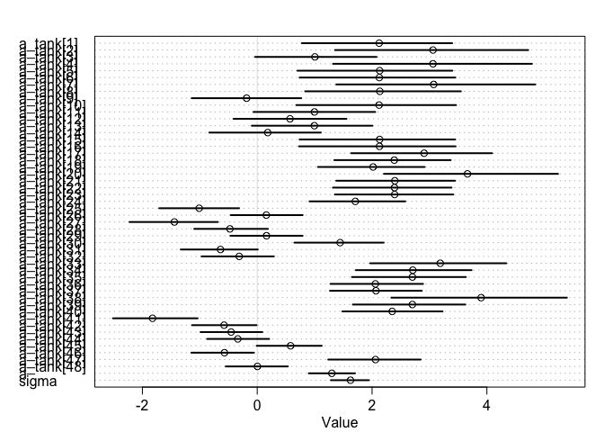
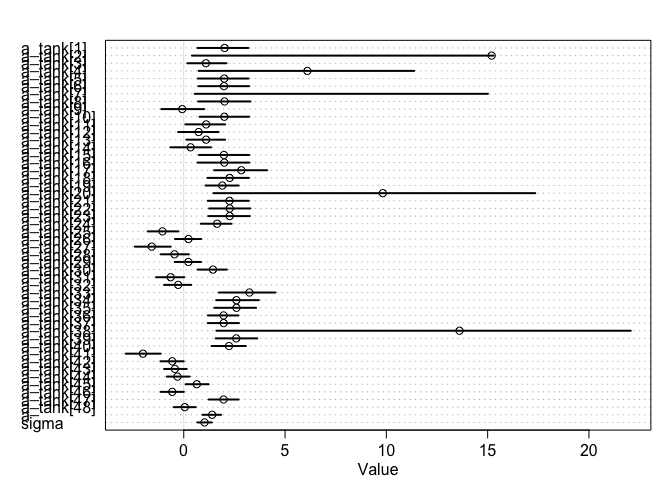
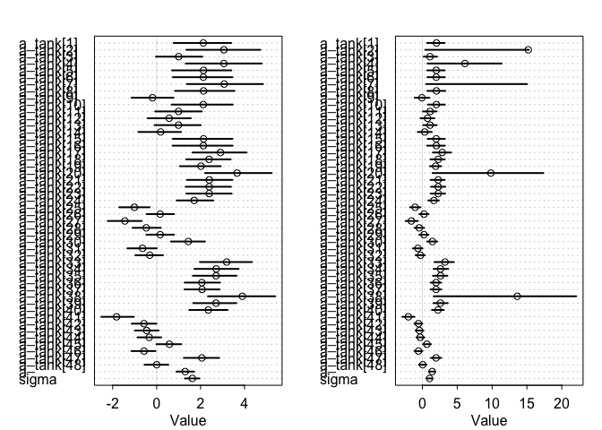

# Ch12_problems_2016-11-11.Rd
Stacey Harmer  
November 11, 2016  


## Question 12.M3
Frog survival model; comparing Gaussian and Cauchy distributions for the varying intercepts

First, the model from the book with Gaussian distributions for intercepts


```r
library(rethinking)
```

```
## Loading required package: rstan
```

```
## Loading required package: ggplot2
```

```
## Loading required package: StanHeaders
```

```
## rstan (Version 2.12.1, packaged: 2016-09-11 13:07:50 UTC, GitRev: 85f7a56811da)
```

```
## For execution on a local, multicore CPU with excess RAM we recommend calling
## rstan_options(auto_write = TRUE)
## options(mc.cores = parallel::detectCores())
```

```
## Loading required package: parallel
```

```
## rethinking (Version 1.59)
```

```r
data("reedfrogs")
??reedfrogs
d <- reedfrogs
str(d)

# get map2stan up and ready
library(rstan)
rstan_options(auto_write = TRUE)
options(mc.cores = parallel::detectCores())

# make the tank cluster variable
d$tank <- 1:nrow(d)
head(d)


m12.M3.1 <- map2stan( 
  alist(
    surv ~ dbinom( density , p ) ,
    logit(p) <- a_tank[tank] ,
    a_tank[tank] ~ dnorm( a , sigma ) ,
    a ~ dnorm(0,1) ,
    sigma ~ dcauchy(0,1)
  ), data=d , iter=4000 , chains=4 )
```

```
## Warning in FUN(X[[i]], ...): data with name pred is not numeric and not
## used
```

```
## Warning in FUN(X[[i]], ...): data with name size is not numeric and not
## used
```

```
## The following numerical problems occured the indicated number of times after warmup on chain 1
```

```
##                                                                                 count
## Exception thrown at line 17: normal_log: Scale parameter is 0, but must be > 0!     2
```

```
## When a numerical problem occurs, the Hamiltonian proposal gets rejected.
```

```
## See http://mc-stan.org/misc/warnings.html#exception-hamiltonian-proposal-rejected
```

```
## If the number in the 'count' column is small, do not ask about this message on stan-users.
```

```
## The following numerical problems occured the indicated number of times after warmup on chain 2
```

```
##                                                                                 count
## Exception thrown at line 17: normal_log: Scale parameter is 0, but must be > 0!     2
```

```
## When a numerical problem occurs, the Hamiltonian proposal gets rejected.
```

```
## See http://mc-stan.org/misc/warnings.html#exception-hamiltonian-proposal-rejected
```

```
## If the number in the 'count' column is small, do not ask about this message on stan-users.
```

```
## The following numerical problems occured the indicated number of times after warmup on chain 3
```

```
##                                                                                 count
## Exception thrown at line 17: normal_log: Scale parameter is 0, but must be > 0!     1
```

```
## When a numerical problem occurs, the Hamiltonian proposal gets rejected.
```

```
## See http://mc-stan.org/misc/warnings.html#exception-hamiltonian-proposal-rejected
```

```
## If the number in the 'count' column is small, do not ask about this message on stan-users.
```

```
## The following numerical problems occured the indicated number of times after warmup on chain 4
```

```
##                                                                                 count
## Exception thrown at line 17: normal_log: Scale parameter is 0, but must be > 0!     2
```

```
## When a numerical problem occurs, the Hamiltonian proposal gets rejected.
```

```
## See http://mc-stan.org/misc/warnings.html#exception-hamiltonian-proposal-rejected
```

```
## If the number in the 'count' column is small, do not ask about this message on stan-users.
```

```
## Warning in FUN(X[[i]], ...): data with name pred is not numeric and not
## used

## Warning in FUN(X[[i]], ...): data with name size is not numeric and not
## used
```

```
## Computing WAIC
```

```
## Constructing posterior predictions
```

```
## Aggregated binomial counts detected. Splitting to 0/1 outcome for WAIC calculation.
```

Next, the same but Cauchy intstead of normal

p 260: The Cauchy distributions in the model definitions are implicitly half-Cauchy, a Cauchy defined over
the positive reals only. This is because they are applied to a parameter, usually sigma , that is strictly positive.
Stan figures out that you meant for it to be half-Cauchy.  SO I guess I just won't specify??

```r
m12.M3.2 <- map2stan( 
  alist(
    surv ~ dbinom( density , p ) ,
    logit(p) <- a_tank[tank] ,
    a_tank[tank] ~ dcauchy( a , sigma ) ,
    a ~ dnorm(0,1) ,
    sigma ~ dcauchy(0,1)
  ), data=d , iter=4000 , chains=4 )
```

```
## Warning in FUN(X[[i]], ...): data with name pred is not numeric and not
## used
```

```
## Warning in FUN(X[[i]], ...): data with name size is not numeric and not
## used
```

```
## The following numerical problems occured the indicated number of times after warmup on chain 4
```

```
##                                                                                 count
## Exception thrown at line 17: cauchy_log: Scale parameter is 0, but must be > 0!     1
```

```
## When a numerical problem occurs, the Hamiltonian proposal gets rejected.
```

```
## See http://mc-stan.org/misc/warnings.html#exception-hamiltonian-proposal-rejected
```

```
## If the number in the 'count' column is small, do not ask about this message on stan-users.
```

```
## Warning in FUN(X[[i]], ...): data with name pred is not numeric and not
## used

## Warning in FUN(X[[i]], ...): data with name size is not numeric and not
## used
```

```
## Computing WAIC
```

```
## Constructing posterior predictions
```

```
## Aggregated binomial counts detected. Splitting to 0/1 outcome for WAIC calculation.
```

Compare the posterior means of the intercepts, a-tank, to the posterior means produced in the chapter,
using the customary Gaussian prior. Can you explain the pattern of differences?

```r
precis(m12.M3.2,depth=2) # depth=2 displays varying effects
```

```
##             Mean StdDev lower 0.89 upper 0.89 n_eff Rhat
## a_tank[1]   2.02   0.86       0.67       3.19  4236 1.00
## a_tank[2]  15.20  47.03       0.41      15.30    49 1.08
## a_tank[3]   1.09   0.60       0.18       2.10  6918 1.00
## a_tank[4]   6.10   9.52       0.74      11.37   527 1.01
## a_tank[5]   2.00   0.86       0.69       3.20  3006 1.00
## a_tank[6]   1.99   0.83       0.72       3.22  5473 1.00
## a_tank[7]  25.66  94.45       0.54      15.01    24 1.22
## a_tank[8]   2.01   0.88       0.71       3.29  4084 1.00
## a_tank[9]  -0.08   0.67      -1.11       1.01  6969 1.00
## a_tank[10]  2.00   0.84       0.78       3.23  3621 1.00
## a_tank[11]  1.11   0.62       0.08       2.04  5782 1.00
## a_tank[12]  0.74   0.63      -0.28       1.72  7017 1.00
## a_tank[13]  1.10   0.60       0.13       2.04  6416 1.00
## a_tank[14]  0.34   0.63      -0.66       1.35  6198 1.00
## a_tank[15]  1.98   0.82       0.75       3.24  5067 1.00
## a_tank[16]  2.00   0.85       0.68       3.24  5549 1.00
## a_tank[17]  2.84   0.90       1.50       4.12  3999 1.00
## a_tank[18]  2.27   0.67       1.17       3.22  5552 1.00
## a_tank[19]  1.91   0.53       1.08       2.71  5830 1.00
## a_tank[20]  9.83  18.21       1.46      17.35  1019 1.01
## a_tank[21]  2.26   0.65       1.19       3.21  5635 1.00
## a_tank[22]  2.27   0.66       1.25       3.29  5731 1.00
## a_tank[23]  2.27   0.67       1.21       3.26  5073 1.00
## a_tank[24]  1.65   0.48       0.84       2.36  6450 1.00
## a_tank[25] -1.05   0.48      -1.78      -0.27  6458 1.00
## a_tank[26]  0.23   0.40      -0.43       0.86  6583 1.00
## a_tank[27] -1.58   0.56      -2.42      -0.64  6570 1.00
## a_tank[28] -0.46   0.43      -1.13       0.25  8000 1.00
## a_tank[29]  0.23   0.41      -0.45       0.85  6305 1.00
## a_tank[30]  1.44   0.45       0.69       2.13  8000 1.00
## a_tank[31] -0.65   0.44      -1.37       0.02  7055 1.00
## a_tank[32] -0.28   0.43      -0.97       0.37  6055 1.00
## a_tank[33]  3.24   0.97       1.73       4.52  3954 1.00
## a_tank[34]  2.60   0.68       1.60       3.71  5318 1.00
## a_tank[35]  2.60   0.68       1.51       3.57  5015 1.00
## a_tank[36]  1.96   0.48       1.19       2.70  6343 1.00
## a_tank[37]  1.97   0.49       1.19       2.72  8000 1.00
## a_tank[38] 13.61  31.34       1.61      22.06   356 1.01
## a_tank[39]  2.59   0.68       1.58       3.63  5347 1.00
## a_tank[40]  2.23   0.55       1.37       3.07  5258 1.00
## a_tank[41] -2.01   0.55      -2.87      -1.14  6173 1.00
## a_tank[42] -0.57   0.36      -1.15       0.00  5929 1.00
## a_tank[43] -0.44   0.35      -0.97       0.15  8000 1.00
## a_tank[44] -0.31   0.35      -0.83       0.29  6528 1.00
## a_tank[45]  0.65   0.36       0.09       1.23  6764 1.00
## a_tank[46] -0.57   0.36      -1.14       0.00  6533 1.00
## a_tank[47]  1.97   0.48       1.23       2.71  6258 1.00
## a_tank[48]  0.05   0.35      -0.50       0.59  7179 1.00
## a           1.40   0.29       0.92       1.85  4015 1.00
## sigma       1.03   0.23       0.67       1.39  3928 1.00
```

```r
plot(precis(m12.M3.1, depth =2))
```

<!-- -->

```r
plot(precis(m12.M3.2,depth=2)) # also plot
```

<!-- -->

```r
par(mfrow = c(1,2))
plot(precis(m12.M3.1, depth =2)) # gaussian 
plot(precis(m12.M3.2,depth=2)) # Cauchy
```

<!-- -->

 Overall, much lower SD with cauchy (although some are really off, like 2, 7, 20, 38)
These large SD tanks had 100% survival.  
"at any moment in a Cauchy sampling process, you are able to draw an extreme value that overwhelms all the previous draws "
I guess that is what is going on - with a high prop survival, can get very wrong estimate.


## Question 12.H1
Fr
