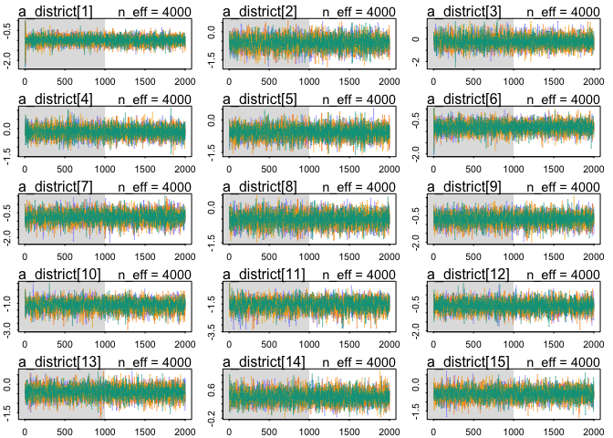

# Ch12_problems_2016-12-01.Rmd
Stacey Harmer  


#Problems

###12M1 - Reed frog data.  Add predation and size treatment variables to the varying intercepts model.
Consider models with either size or predation, both, and both with interaction
Focus on inferred variation across tanks, and why it changes with different models


```r
# include the 'hide' for the code blocks where you don't want to print results
library(rethinking)
```

```
## Loading required package: rstan
```

```
## Loading required package: ggplot2
```

```
## Loading required package: StanHeaders
```

```
## rstan (Version 2.12.1, packaged: 2016-09-11 13:07:50 UTC, GitRev: 85f7a56811da)
```

```
## For execution on a local, multicore CPU with excess RAM we recommend calling
## rstan_options(auto_write = TRUE)
## options(mc.cores = parallel::detectCores())
```

```
## Loading required package: parallel
```

```
## rethinking (Version 1.59)
```

```r
# get map2stan up and ready
library(rstan)
rstan_options(auto_write = TRUE)
options(mc.cores = parallel::detectCores())

data("reedfrogs")
d <- reedfrogs
head(d)
tail(d)
summary(d)
```

I think I need to make dummy variables first.
For pred, set no = 0 and pred = 1
for size, set small = 0 and big = 1

```r
d$pred_d <- ifelse(d$pred == "pred", 1, 0)
d$size_d <- ifelse(d$size == "big", 1, 0)
```
A quick glance at the data

```r
library(ggplot2)
pl <- ggplot(d, aes(pred, propsurv))
pl + geom_boxplot() + facet_grid(. ~ size) + geom_jitter(width = 0.2)
```

<!-- -->
Hmm, seems like 'big' may be a disadvantage for frogs with predators around

To start, will re-run original model, and then start adding to it


```r
# make the tank cluster variable
d$tank <- 1:nrow(d)
head(d)
# fit intercept only model
m12M1.1 <- map2stan(
  alist(
    surv ~ dbinom( density , p ) ,
    logit(p) <- a_tank[tank] ,
    a_tank[tank] ~ dnorm( a , sigma ) ,
    a ~ dnorm(0,1) ,
    sigma ~ dcauchy(0, 1)
  ),
  data=d, iter = 4000, chains = 4 )
```

```
## Warning in FUN(X[[i]], ...): data with name pred is not numeric and not
## used
```

```
## Warning in FUN(X[[i]], ...): data with name size is not numeric and not
## used
```

```
## The following numerical problems occured the indicated number of times after warmup on chain 2
```

```
##                                                                                 count
## Exception thrown at line 17: normal_log: Scale parameter is 0, but must be > 0!     1
```

```
## When a numerical problem occurs, the Hamiltonian proposal gets rejected.
```

```
## See http://mc-stan.org/misc/warnings.html#exception-hamiltonian-proposal-rejected
```

```
## If the number in the 'count' column is small, do not ask about this message on stan-users.
```

```
## The following numerical problems occured the indicated number of times after warmup on chain 3
```

```
##                                                                                 count
## Exception thrown at line 17: normal_log: Scale parameter is 0, but must be > 0!     1
```

```
## When a numerical problem occurs, the Hamiltonian proposal gets rejected.
```

```
## See http://mc-stan.org/misc/warnings.html#exception-hamiltonian-proposal-rejected
```

```
## If the number in the 'count' column is small, do not ask about this message on stan-users.
```

```
## The following numerical problems occured the indicated number of times after warmup on chain 4
```

```
##                                                                                 count
## Exception thrown at line 17: normal_log: Scale parameter is 0, but must be > 0!     1
```

```
## When a numerical problem occurs, the Hamiltonian proposal gets rejected.
```

```
## See http://mc-stan.org/misc/warnings.html#exception-hamiltonian-proposal-rejected
```

```
## If the number in the 'count' column is small, do not ask about this message on stan-users.
```

```
## Warning in FUN(X[[i]], ...): data with name pred is not numeric and not
## used

## Warning in FUN(X[[i]], ...): data with name size is not numeric and not
## used
```

```
## Computing WAIC
```

```
## Constructing posterior predictions
```

```
## Aggregated binomial counts detected. Splitting to 0/1 outcome for WAIC calculation.
```

```r
plot(m12M1.1)
```

```
## Waiting to draw page 2 of 4
```

<!-- -->

```
## Waiting to draw page 3 of 4
```

<!-- -->

```
## Waiting to draw page 4 of 4
```

<!-- -->

```r
# intercept plus predation
m12M1.2 <- map2stan(
  alist(
    surv ~ dbinom( density , p ) ,
    logit(p) <- a_tank[tank] + b*pred_d,
    a_tank[tank] ~ dnorm( a , sigma ) ,
    a ~ dnorm(0,1) ,
    sigma ~ dcauchy(0, 1) ,
    b ~ dnorm(0,1)
  ),
  data=d, iter = 4000, chains = 4 )
```

```
## Warning in FUN(X[[i]], ...): data with name pred is not numeric and not
## used

## Warning in FUN(X[[i]], ...): data with name size is not numeric and not
## used
```

```
## The following numerical problems occured the indicated number of times after warmup on chain 1
```

```
##                                                                                 count
## Exception thrown at line 20: normal_log: Scale parameter is 0, but must be > 0!     1
```

```
## When a numerical problem occurs, the Hamiltonian proposal gets rejected.
```

```
## See http://mc-stan.org/misc/warnings.html#exception-hamiltonian-proposal-rejected
```

```
## If the number in the 'count' column is small, do not ask about this message on stan-users.
```

```
## The following numerical problems occured the indicated number of times after warmup on chain 2
```

```
##                                                                                 count
## Exception thrown at line 20: normal_log: Scale parameter is 0, but must be > 0!     1
```

```
## When a numerical problem occurs, the Hamiltonian proposal gets rejected.
```

```
## See http://mc-stan.org/misc/warnings.html#exception-hamiltonian-proposal-rejected
```

```
## If the number in the 'count' column is small, do not ask about this message on stan-users.
```

```
## Warning in FUN(X[[i]], ...): data with name pred is not numeric and not
## used

## Warning in FUN(X[[i]], ...): data with name size is not numeric and not
## used
```

```
## Computing WAIC
```

```
## Constructing posterior predictions
```

```
## Aggregated binomial counts detected. Splitting to 0/1 outcome for WAIC calculation.
```

```r
plot(m12M1.2)
```

<!-- -->

```
## Waiting to draw page 2 of 4
```

<!-- -->

```
## Waiting to draw page 3 of 4
```

<!-- -->

```
## Waiting to draw page 4 of 4
```

<!-- -->

```r
# intercept plus size
m12M1.3 <- map2stan(
  alist(
    surv ~ dbinom( density , p ) ,
    logit(p) <- a_tank[tank] + b*size_d,
    a_tank[tank] ~ dnorm( a , sigma ) ,
    a ~ dnorm(0,1) ,
    sigma ~ dcauchy(0, 1) ,
    b ~ dnorm(0,1)
  ),
  data=d, iter = 4000, chains = 4 )
```

```
## Warning in FUN(X[[i]], ...): data with name pred is not numeric and not
## used

## Warning in FUN(X[[i]], ...): data with name size is not numeric and not
## used
```

```
## The following numerical problems occured the indicated number of times after warmup on chain 1
```

```
##                                                                                 count
## Exception thrown at line 20: normal_log: Scale parameter is 0, but must be > 0!     1
```

```
## When a numerical problem occurs, the Hamiltonian proposal gets rejected.
```

```
## See http://mc-stan.org/misc/warnings.html#exception-hamiltonian-proposal-rejected
```

```
## If the number in the 'count' column is small, do not ask about this message on stan-users.
```

```
## The following numerical problems occured the indicated number of times after warmup on chain 2
```

```
##                                                                                 count
## Exception thrown at line 20: normal_log: Scale parameter is 0, but must be > 0!     1
```

```
## When a numerical problem occurs, the Hamiltonian proposal gets rejected.
```

```
## See http://mc-stan.org/misc/warnings.html#exception-hamiltonian-proposal-rejected
```

```
## If the number in the 'count' column is small, do not ask about this message on stan-users.
```

```
## Warning in FUN(X[[i]], ...): data with name pred is not numeric and not
## used

## Warning in FUN(X[[i]], ...): data with name size is not numeric and not
## used
```

```
## Computing WAIC
```

```
## Constructing posterior predictions
```

```
## Aggregated binomial counts detected. Splitting to 0/1 outcome for WAIC calculation.
```

```r
plot(m12M1.3)
```

<!-- -->

```
## Waiting to draw page 2 of 4
```

<!-- -->

```
## Waiting to draw page 3 of 4
```

<!-- -->

```
## Waiting to draw page 4 of 4
```

<!-- -->

```r
# intercept plus size and predation 
m12M1.4 <- map2stan(
  alist(
    surv ~ dbinom( density , p ) ,
    logit(p) <- a_tank[tank] + b_p*pred_d + b_s*size_d ,
    a_tank[tank] ~ dnorm( a , sigma ) ,
    a ~ dnorm(0,1) ,
    sigma ~ dcauchy(0, 1) ,
    c(b_p, b_s) ~ dnorm(0,1)
  ),
  data=d, iter = 4000, chains = 4 )
```

```
## Warning in FUN(X[[i]], ...): data with name pred is not numeric and not
## used

## Warning in FUN(X[[i]], ...): data with name size is not numeric and not
## used
```

```
## The following numerical problems occured the indicated number of times after warmup on chain 1
```

```
##                                                                                 count
## Exception thrown at line 23: normal_log: Scale parameter is 0, but must be > 0!     2
```

```
## When a numerical problem occurs, the Hamiltonian proposal gets rejected.
```

```
## See http://mc-stan.org/misc/warnings.html#exception-hamiltonian-proposal-rejected
```

```
## If the number in the 'count' column is small, do not ask about this message on stan-users.
```

```
## The following numerical problems occured the indicated number of times after warmup on chain 3
```

```
##                                                                                 count
## Exception thrown at line 23: normal_log: Scale parameter is 0, but must be > 0!     2
```

```
## When a numerical problem occurs, the Hamiltonian proposal gets rejected.
```

```
## See http://mc-stan.org/misc/warnings.html#exception-hamiltonian-proposal-rejected
```

```
## If the number in the 'count' column is small, do not ask about this message on stan-users.
```

```
## The following numerical problems occured the indicated number of times after warmup on chain 4
```

```
##                                                                                 count
## Exception thrown at line 23: normal_log: Scale parameter is 0, but must be > 0!     2
```

```
## When a numerical problem occurs, the Hamiltonian proposal gets rejected.
```

```
## See http://mc-stan.org/misc/warnings.html#exception-hamiltonian-proposal-rejected
```

```
## If the number in the 'count' column is small, do not ask about this message on stan-users.
```

```
## Warning in FUN(X[[i]], ...): data with name pred is not numeric and not
## used

## Warning in FUN(X[[i]], ...): data with name size is not numeric and not
## used
```

```
## Computing WAIC
```

```
## Constructing posterior predictions
```

```
## Aggregated binomial counts detected. Splitting to 0/1 outcome for WAIC calculation.
```

```r
plot(m12M1.4)
```

<!-- -->

```
## Waiting to draw page 2 of 4
```

<!-- -->

```
## Waiting to draw page 3 of 4
```

<!-- -->

```
## Waiting to draw page 4 of 4
```

<!-- -->

```r
# intercept plus size and predation and their interaction
m12M1.5 <- map2stan(
  alist(
    surv ~ dbinom( density , p ) ,
    logit(p) <- a_tank[tank] + b_p*pred_d + b_s*size_d + b_ps*pred_d*size_d,
    a_tank[tank] ~ dnorm( a , sigma ) ,
    a ~ dnorm(0,1) ,
    sigma ~ dcauchy(0, 1) ,
    c(b_p, b_s, b_ps) ~ dnorm(0,1)
  ),
  data=d, iter = 4000, chains = 4 )
```

```
## Warning in FUN(X[[i]], ...): data with name pred is not numeric and not
## used

## Warning in FUN(X[[i]], ...): data with name size is not numeric and not
## used
```

```
## The following numerical problems occured the indicated number of times after warmup on chain 1
```

```
##                                                                                 count
## Exception thrown at line 25: normal_log: Scale parameter is 0, but must be > 0!     1
```

```
## When a numerical problem occurs, the Hamiltonian proposal gets rejected.
```

```
## See http://mc-stan.org/misc/warnings.html#exception-hamiltonian-proposal-rejected
```

```
## If the number in the 'count' column is small, do not ask about this message on stan-users.
```

```
## The following numerical problems occured the indicated number of times after warmup on chain 4
```

```
##                                                                                 count
## Exception thrown at line 25: normal_log: Scale parameter is 0, but must be > 0!     1
```

```
## When a numerical problem occurs, the Hamiltonian proposal gets rejected.
```

```
## See http://mc-stan.org/misc/warnings.html#exception-hamiltonian-proposal-rejected
```

```
## If the number in the 'count' column is small, do not ask about this message on stan-users.
```

```
## Warning in FUN(X[[i]], ...): data with name pred is not numeric and not
## used

## Warning in FUN(X[[i]], ...): data with name size is not numeric and not
## used
```

```
## Computing WAIC
```

```
## Constructing posterior predictions
```

```
## Aggregated binomial counts detected. Splitting to 0/1 outcome for WAIC calculation.
```

```r
plot(m12M1.5)
```

<!-- -->

```
## Waiting to draw page 2 of 4
```

<!-- -->

```
## Waiting to draw page 3 of 4
```

<!-- -->

```
## Waiting to draw page 4 of 4
```

<!-- --><!-- -->
OK, those seemed to run OK.  
Now how to focus on inferred variation across tanks?
I think that would be the 'sigma' value for the global intercept (?)


```r
#  precis(m12M1.1, depth  =2)[sigma] # fails - object not subsettable

precis(m12M1.1, depth  =1) # sigma is 1.62  (intercept only)
```

```
## 48 vector or matrix parameters omitted in display. Use depth=2 to show them.
```

```
##       Mean StdDev lower 0.89 upper 0.89 n_eff Rhat
## a     1.30   0.25       0.90       1.68  8000    1
## sigma 1.62   0.22       1.26       1.94  4996    1
```

```r
precis(m12M1.2, depth  =1) # sigma is 0.85  (plus predation)
```

```
## 48 vector or matrix parameters omitted in display. Use depth=2 to show them.
```

```
##        Mean StdDev lower 0.89 upper 0.89 n_eff Rhat
## a      2.43   0.22       2.07       2.79  1485 1.00
## sigma  0.84   0.15       0.61       1.06  2647 1.00
## b     -2.31   0.29      -2.74      -1.82   945 1.01
```

```r
precis(m12M1.3, depth  =1) # sigma is 1.62  (plus size)
```

```
## 48 vector or matrix parameters omitted in display. Use depth=2 to show them.
```

```
##        Mean StdDev lower 0.89 upper 0.89 n_eff Rhat
## a      1.41   0.33       0.87       1.91  1804 1.00
## sigma  1.62   0.22       1.28       1.96  5051 1.00
## b     -0.23   0.45      -0.98       0.48   817 1.01
```

```r
precis(m12M1.4, depth  =1) # sigma is 0.79  (plus size plus predation)
```

```
## 48 vector or matrix parameters omitted in display. Use depth=2 to show them.
```

```
##        Mean StdDev lower 0.89 upper 0.89 n_eff Rhat
## a      2.61   0.26       2.18       3.01  1131    1
## sigma  0.80   0.14       0.59       1.03  2638    1
## b_p   -2.33   0.29      -2.76      -1.84  1263    1
## b_s   -0.35   0.28      -0.82       0.08  1978    1
```

```r
precis(m12M1.5, depth  =1) # sigma is 0.74 (plus predation and size and interaction)
```

```
## 48 vector or matrix parameters omitted in display. Use depth=2 to show them.
```

```
##        Mean StdDev lower 0.89 upper 0.89 n_eff Rhat
## a      2.32   0.27       1.88       2.74   775 1.01
## sigma  0.74   0.15       0.51       0.96  1735 1.00
## b_p   -1.80   0.34      -2.35      -1.26   849 1.01
## b_s    0.29   0.38      -0.31       0.89  1226 1.00
## b_ps  -1.18   0.47      -1.97      -0.45  1642 1.00
```
I believe this tells me that +/- predation explains a great deal of the variation between tanks.


###12M2 - now, compare the models above using WAIC
Can you reconcile the differences in WAIC  with posterior distributions of model?


```r
compare(m12M1.1, m12M1.2, m12M1.3, m12M1.4, m12M1.5)
```

```
##           WAIC pWAIC dWAIC weight    SE  dSE
## m12M1.2 1000.0  28.6   0.0   0.39 36.84   NA
## m12M1.4 1000.2  28.2   0.2   0.34 36.92 1.42
## m12M1.5 1000.8  27.5   0.8   0.26 37.02 2.76
## m12M1.1 1009.2  37.6   9.3   0.00 37.96 6.02
## m12M1.3 1009.7  37.8   9.7   0.00 38.03 6.13
```

```r
# models 2, 4, 5 seem pretty close (model 2 a bit better; since it is simpler, we should favor it)
# while models 1 and 3 are negligible

precis(m12M1.1)
```

```
## 48 vector or matrix parameters omitted in display. Use depth=2 to show them.
```

```
##       Mean StdDev lower 0.89 upper 0.89 n_eff Rhat
## a     1.30   0.25       0.90       1.68  8000    1
## sigma 1.62   0.22       1.26       1.94  4996    1
```

```r
precis(m12M1.2)
```

```
## 48 vector or matrix parameters omitted in display. Use depth=2 to show them.
```

```
##        Mean StdDev lower 0.89 upper 0.89 n_eff Rhat
## a      2.43   0.22       2.07       2.79  1485 1.00
## sigma  0.84   0.15       0.61       1.06  2647 1.00
## b     -2.31   0.29      -2.74      -1.82   945 1.01
```

```r
precis(m12M1.3)
```

```
## 48 vector or matrix parameters omitted in display. Use depth=2 to show them.
```

```
##        Mean StdDev lower 0.89 upper 0.89 n_eff Rhat
## a      1.41   0.33       0.87       1.91  1804 1.00
## sigma  1.62   0.22       1.28       1.96  5051 1.00
## b     -0.23   0.45      -0.98       0.48   817 1.01
```

```r
precis(m12M1.4)
```

```
## 48 vector or matrix parameters omitted in display. Use depth=2 to show them.
```

```
##        Mean StdDev lower 0.89 upper 0.89 n_eff Rhat
## a      2.61   0.26       2.18       3.01  1131    1
## sigma  0.80   0.14       0.59       1.03  2638    1
## b_p   -2.33   0.29      -2.76      -1.84  1263    1
## b_s   -0.35   0.28      -0.82       0.08  1978    1
```

```r
precis(m12M1.5)
```

```
## 48 vector or matrix parameters omitted in display. Use depth=2 to show them.
```

```
##        Mean StdDev lower 0.89 upper 0.89 n_eff Rhat
## a      2.32   0.27       1.88       2.74   775 1.01
## sigma  0.74   0.15       0.51       0.96  1735 1.00
## b_p   -1.80   0.34      -2.35      -1.26   849 1.01
## b_s    0.29   0.38      -0.31       0.89  1226 1.00
## b_ps  -1.18   0.47      -1.97      -0.45  1642 1.00
```

```r
# comparing models 2,4 and 5, stdev for a is lowest for model 2

# compare WAIC
(m12M1.models <- compare(m12M1.1, m12M1.2, m12M1.3, m12M1.4, m12M1.5))
```

```
##           WAIC pWAIC dWAIC weight    SE  dSE
## m12M1.2 1000.0  28.6   0.0   0.39 36.84   NA
## m12M1.4 1000.2  28.2   0.2   0.34 36.92 1.42
## m12M1.5 1000.8  27.5   0.8   0.26 37.02 2.76
## m12M1.1 1009.2  37.6   9.3   0.00 37.96 6.02
## m12M1.3 1009.7  37.8   9.7   0.00 38.03 6.13
```

```r
par(mfrow=c(1,1))
plot(m12M1.models, SE = T, dSE = T) 
```

<!-- -->

What if I wanted to draw samples from the posteriors and compare to real data?

```r
pred.m12M1.1 <- link(m12M1.1, data = d)
dim(pred.m12M1.1) #1000 rows, 48 colums
head(pred.m12M1.1)

# compute median intercept per tank
d$propsurv_est1 <- apply(pred.m12M1.1, 2, median)

pred.m12M1.2 <- link(m12M1.2, data = d)
# compute median intercept per tank
d$propsurv_est2 <- apply(pred.m12M1.2, 2, median)

pred.m12M1.3 <- link(m12M1.3, data = d)
# compute median intercept per tank
d$propsurv_est3 <- apply(pred.m12M1.3, 2, median)

pred.m12M1.4 <- link(m12M1.4, data = d)
# compute median intercept per tank
d$propsurv_est4 <- apply(pred.m12M1.4, 2, median)

pred.m12M1.5 <- link(m12M1.5, data = d)
# compute median intercept per tank
d$propsurv_est5 <- apply(pred.m12M1.5, 2, median)
```
OK, now how to easily plot the real data by model?
what if I use ggplot and I facet by predation?
I will need to put plot over plot


```r
library(ggplot2)
# first, the actual data
pl.real <- ggplot(d, aes(tank, propsurv))
pl.real <- pl.real + geom_point(size=2, colour="blue") 

# for model 1 (intercept only; not plotted exactly as in book due to predation facet grid)
p.real.mod1 <- ggplot() + 
  geom_point(data = d, colour = "blue", aes(x =tank, y =propsurv )) +  #blue for real data
  geom_point(data = d, colour = "red", aes(x =tank, y =propsurv_est1)) + # red for model
  facet_grid(.~pred)
p.real.mod1
```

<!-- -->

```r
p.real.mod2 <- ggplot() + 
  geom_point(data = d, colour = "blue", aes(x =tank, y =propsurv )) +  #blue for real data
  geom_point(data = d, colour = "red", aes(x =tank, y =propsurv_est2)) + # red for model
  facet_grid(.~pred)
p.real.mod2
```

<!-- -->

```r
# looks better

p.real.mod3 <- ggplot() + 
  geom_point(data = d, colour = "blue", aes(x =tank, y =propsurv )) +  #blue for real data
  geom_point(data = d, colour = "red", aes(x =tank, y =propsurv_est3)) + # red for model
  facet_grid(.~pred)
p.real.mod3
```

<!-- -->

```r
# not great; about like #1

p.real.mod4 <- ggplot() + 
  geom_point(data = d, colour = "blue", aes(x =tank, y =propsurv )) +  #blue for real data
  geom_point(data = d, colour = "red", aes(x =tank, y =propsurv_est4)) + # red for model
  facet_grid(.~pred)
p.real.mod4
```

<!-- -->

```r
# pretty good

p.real.mod2and4 <- ggplot() + 
  geom_jitter(data = d, colour = "blue", aes(x =tank, y =propsurv )) +  #blue for real data
  geom_jitter(data = d, colour = "red", aes(x =tank, y =propsurv_est2)) + # red for model 2
  geom_jitter(data = d, colour = "green", aes(x =tank, y =propsurv_est4)) + # green for model 4
  facet_grid(.~pred) 
p.real.mod2and4
```

<!-- -->

```r
# can see models 2 and 4 are quite similar

p.real.mod1and2 <- ggplot() + 
  geom_jitter(data = d, colour = "blue", aes(x =tank, y =propsurv )) +  #blue for real data
  geom_jitter(data = d, colour = "red", aes(x =tank, y =propsurv_est1)) + # red for model 1
  geom_jitter(data = d, colour = "green", aes(x =tank, y =propsurv_est2)) + # green for model 2
  facet_grid(.~pred) 
p.real.mod1and2
```

<!-- -->

## Question 12.M3
Frog survival model; comparing Gaussian and Cauchy distributions for the varying intercepts

First, the model from the book with Gaussian distributions for intercepts


```r
library(rethinking)
data("reedfrogs")
??reedfrogs
d <- reedfrogs
str(d)

# get map2stan up and ready
library(rstan)
rstan_options(auto_write = TRUE)
options(mc.cores = parallel::detectCores())

# make the tank cluster variable
d$tank <- 1:nrow(d)
head(d)


m12.M3.1 <- map2stan( 
  alist(
    surv ~ dbinom( density , p ) ,
    logit(p) <- a_tank[tank] ,
    a_tank[tank] ~ dnorm( a , sigma ) ,
    a ~ dnorm(0,1) ,
    sigma ~ dcauchy(0,1)
  ), data=d , iter=4000 , chains=4 )
```

```
## Warning in FUN(X[[i]], ...): data with name pred is not numeric and not
## used
```

```
## Warning in FUN(X[[i]], ...): data with name size is not numeric and not
## used
```

```
## The following numerical problems occured the indicated number of times after warmup on chain 2
```

```
##                                                                                 count
## Exception thrown at line 17: normal_log: Scale parameter is 0, but must be > 0!     1
```

```
## When a numerical problem occurs, the Hamiltonian proposal gets rejected.
```

```
## See http://mc-stan.org/misc/warnings.html#exception-hamiltonian-proposal-rejected
```

```
## If the number in the 'count' column is small, do not ask about this message on stan-users.
```

```
## Warning in FUN(X[[i]], ...): data with name pred is not numeric and not
## used

## Warning in FUN(X[[i]], ...): data with name size is not numeric and not
## used
```

```
## Computing WAIC
```

```
## Constructing posterior predictions
```

```
## Aggregated binomial counts detected. Splitting to 0/1 outcome for WAIC calculation.
```

Next, the same but Cauchy intstead of normal

p 260: The Cauchy distributions in the model definitions are implicitly half-Cauchy, a Cauchy defined over
the positive reals only. This is because they are applied to a parameter, usually sigma , that is strictly positive.
Stan figures out that you meant for it to be half-Cauchy.  SO I guess I just won't specify??

```r
m12.M3.2 <- map2stan( 
  alist(
    surv ~ dbinom( density , p ) ,
    logit(p) <- a_tank[tank] ,
    a_tank[tank] ~ dcauchy( a , sigma ) ,
    a ~ dnorm(0,1) ,
    sigma ~ dcauchy(0,1)
  ), data=d , iter=4000 , chains=4 )
```

```
## Warning in FUN(X[[i]], ...): data with name pred is not numeric and not
## used
```

```
## Warning in FUN(X[[i]], ...): data with name size is not numeric and not
## used
```

```
## Warning in FUN(X[[i]], ...): data with name pred is not numeric and not
## used
```

```
## Warning in FUN(X[[i]], ...): data with name size is not numeric and not
## used
```

```
## Computing WAIC
```

```
## Constructing posterior predictions
```

```
## Aggregated binomial counts detected. Splitting to 0/1 outcome for WAIC calculation.
```

Compare the posterior means of the intercepts, a-tank, to the posterior means produced in the chapter,
using the customary Gaussian prior. Can you explain the pattern of differences?

```r
precis(m12.M3.2,depth=2) # depth=2 displays varying effects
```

```
##             Mean StdDev lower 0.89 upper 0.89 n_eff Rhat
## a_tank[1]   2.02   0.86       0.69       3.26  8000 1.00
## a_tank[2]   6.45  11.93       0.47      11.33   700 1.00
## a_tank[3]   1.09   0.61       0.11       2.04  8000 1.00
## a_tank[4]  13.68  37.63       0.64      15.87    51 1.08
## a_tank[5]   1.99   0.83       0.72       3.21  8000 1.00
## a_tank[6]   2.01   0.85       0.75       3.24  4249 1.00
## a_tank[7]   6.39  10.36       0.78      11.39   407 1.01
## a_tank[8]   2.01   0.85       0.75       3.31  8000 1.00
## a_tank[9]  -0.08   0.66      -1.11       0.99  8000 1.00
## a_tank[10]  2.02   0.87       0.67       3.23  4921 1.00
## a_tank[11]  1.10   0.63       0.06       2.07  8000 1.00
## a_tank[12]  0.74   0.61      -0.18       1.73  8000 1.00
## a_tank[13]  1.10   0.62       0.09       2.07  8000 1.00
## a_tank[14]  0.34   0.64      -0.68       1.35  8000 1.00
## a_tank[15]  2.03   0.88       0.74       3.34  5499 1.00
## a_tank[16]  2.02   0.85       0.68       3.23  5399 1.00
## a_tank[17]  2.85   0.93       1.53       4.23  5400 1.00
## a_tank[18]  2.27   0.66       1.23       3.26  8000 1.00
## a_tank[19]  1.92   0.55       1.05       2.74  8000 1.00
## a_tank[20] 35.11 126.02       1.23      37.32    63 1.03
## a_tank[21]  2.27   0.66       1.25       3.24  8000 1.00
## a_tank[22]  2.27   0.67       1.27       3.28  8000 1.00
## a_tank[23]  2.26   0.65       1.24       3.23  8000 1.00
## a_tank[24]  1.66   0.49       0.85       2.41  8000 1.00
## a_tank[25] -1.06   0.48      -1.79      -0.26  8000 1.00
## a_tank[26]  0.24   0.40      -0.39       0.89  8000 1.00
## a_tank[27] -1.59   0.55      -2.44      -0.72  8000 1.00
## a_tank[28] -0.45   0.42      -1.11       0.23  8000 1.00
## a_tank[29]  0.23   0.42      -0.46       0.88  8000 1.00
## a_tank[30]  1.44   0.45       0.70       2.11  8000 1.00
## a_tank[31] -0.64   0.44      -1.32       0.07  8000 1.00
## a_tank[32] -0.28   0.42      -0.95       0.38  8000 1.00
## a_tank[33]  3.26   0.99       1.80       4.70  5295 1.00
## a_tank[34]  2.60   0.67       1.57       3.63  8000 1.00
## a_tank[35]  2.60   0.67       1.54       3.58  8000 1.00
## a_tank[36]  1.98   0.49       1.21       2.73  8000 1.00
## a_tank[37]  1.97   0.48       1.19       2.67  8000 1.00
## a_tank[38] 15.03  35.52       1.33      24.22    80 1.05
## a_tank[39]  2.60   0.68       1.52       3.61  8000 1.00
## a_tank[40]  2.24   0.56       1.39       3.12  8000 1.00
## a_tank[41] -2.00   0.53      -2.81      -1.15  8000 1.00
## a_tank[42] -0.57   0.36      -1.14       0.02  8000 1.00
## a_tank[43] -0.44   0.36      -1.02       0.13  8000 1.00
## a_tank[44] -0.31   0.35      -0.86       0.25  8000 1.00
## a_tank[45]  0.64   0.35       0.10       1.20  8000 1.00
## a_tank[46] -0.57   0.36      -1.15       0.01  8000 1.00
## a_tank[47]  1.97   0.48       1.19       2.71  8000 1.00
## a_tank[48]  0.04   0.34      -0.51       0.59  8000 1.00
## a           1.40   0.29       0.96       1.90  5275 1.00
## sigma       1.03   0.24       0.64       1.38  5077 1.00
```

```r
plot(precis(m12.M3.1, depth =2))
```

<!-- -->

```r
plot(precis(m12.M3.2,depth=2)) # also plot
```

<!-- -->

```r
par(mfrow = c(1,2))
plot(precis(m12.M3.1, depth =2)) # gaussian 
plot(precis(m12.M3.2,depth=2)) # Cauchy
```

<!-- -->

 Overall, much lower SD with cauchy (although some are really uncertain, like 2, 7, 20, 38)
These large SD tanks had 100% survival.  
"at any moment in a Cauchy sampling process, you are able to draw an extreme value that overwhelms all the previous draws "
I guess that is what is going on - with a high prop survival, can get very wrong estimate.

Julin: used extract.samples to get posterior estimates and then plotted. Better, I think.


## Question 12.M4
Fit multilevel model to the chimp data


```r
library(rethinking)
data(chimpanzees)
d <- chimpanzees
d$recipient <- NULL  # this gets rid of NA
head(d)

m12M4.ch <- map2stan(
  alist(
    pulled_left ~ dbinom(1, p) ,
    logit(p) <- a + a_actor[actor] + (bp + bpC*condition)*prosoc_left ,
    a_actor[actor] ~ dnorm(0, sigma_actor) ,
    a ~ dnorm(0,10) ,
    bp ~ dnorm(0,10) ,
    bpC ~ dnorm(0,10),
    sigma_actor ~ dcauchy(0, 1)
  ),
  data = d, warmup = 1000, iter = 5000, chains = 4, cores = 3)
```

```
## Computing WAIC
```

```
## Constructing posterior predictions
```

```r
precis(m12M4.ch)
```

```
## 7 vector or matrix parameters omitted in display. Use depth=2 to show them.
```

```r
# similar to above, but block now added
# prep data, as block is reserved by Stan
d$block_id <- d$block # name 'block' is reserved by Stan
head(d)
m12M4.block <- map2stan(
  alist(
    pulled_left ~ dbinom(1, p) ,
    logit(p) <- a_actor[actor] + a_block[block_id] + (bp + bpC*condition)*prosoc_left ,
    a_actor[actor] ~ dnorm(alpha, sigma_actor) ,
    a_block[block_id] ~ dnorm(gamma, sigma_block) ,
    c(alpha,gamma,bp, bpC) ~ dnorm(0,10) ,
    c(sigma_actor, sigma_block) ~ dcauchy(0, 1)
  ),
  data = d, warmup = 1000, iter = 5000, chains = 4, cores = 3)
```

```
## Warning: There were 4128 divergent transitions after warmup. Increasing adapt_delta above 0.8 may help. See
## http://mc-stan.org/misc/warnings.html#divergent-transitions-after-warmup
```

```
## Warning: Examine the pairs() plot to diagnose sampling problems
```

```
## Computing WAIC
## Constructing posterior predictions
```

```
## Warning in map2stan(alist(pulled_left ~ dbinom(1, p), logit(p) <- a_actor[actor] + : There were 4128 divergent iterations during sampling.
## Check the chains (trace plots, n_eff, Rhat) carefully to ensure they are valid.
```
really didn' tlike the above model
compare the posterior distributions of the above

```r
precis(m12M4.block) # Rhat values not 1! n_eff low for alpha and gamma
```

```
## Warning in precis(m12M4.block): There were 4128 divergent iterations during sampling.
## Check the chains (trace plots, n_eff, Rhat) carefully to ensure they are valid.
```

```
## 13 vector or matrix parameters omitted in display. Use depth=2 to show them.
```

```
##              Mean StdDev lower 0.89 upper 0.89 n_eff Rhat
## alpha        0.18   6.92     -10.37      11.47   444 1.00
## gamma        0.18   6.88     -10.92      10.89   494 1.01
## bp           0.81   0.26       0.41       1.22   158 1.01
## bpC         -0.10   0.30      -0.57       0.35    74 1.04
## sigma_actor  2.27   1.05       1.07       3.39   146 1.02
## sigma_block  0.29   0.17       0.10       0.48   124 1.04
```

```r
# and look at those huge intervals for alpha and gamma
precis(m12M4.ch)
```

```
## 7 vector or matrix parameters omitted in display. Use depth=2 to show them.
```

```
##              Mean StdDev lower 0.89 upper 0.89 n_eff Rhat
## a            0.44   0.93      -0.98       1.90  2372    1
## bp           0.82   0.25       0.42       1.23  8174    1
## bpC         -0.13   0.29      -0.59       0.34  8170    1
## sigma_actor  2.26   0.90       1.10       3.41  3768    1
```

```r
compare(m12M4.ch, m12M4.block)
```

```
##              WAIC pWAIC dWAIC weight    SE  dSE
## m12M4.ch    531.0   7.9   0.0   0.67 19.46   NA
## m12M4.block 532.4  10.7   1.4   0.33 19.68 2.36
```
I think problem has to do with the fact that htere is not a grand mean a parameter (p 373)
in my second model.  

## Question 12.H1
Bengali women, in district, use.contraception, and urban

```r
# get data, sort out district variable
library(rethinking)
data("bangladesh")
d <- bangladesh
head(d)
```

```
##   woman district use.contraception living.children age.centered urban
## 1     1        1                 0               4      18.4400     1
## 2     2        1                 0               1      -5.5599     1
## 3     3        1                 0               3       1.4400     1
## 4     4        1                 0               4       8.4400     1
## 5     5        1                 0               1     -13.5590     1
## 6     6        1                 0               1     -11.5600     1
```

```r
sort(unique(d$district))  # need to make ths good index varaible (continuous)
```

```
##  [1]  1  2  3  4  5  6  7  8  9 10 11 12 13 14 15 16 17 18 19 20 21 22 23
## [24] 24 25 26 27 28 29 30 31 32 33 34 35 36 37 38 39 40 41 42 43 44 45 46
## [47] 47 48 49 50 51 52 53 55 56 57 58 59 60 61
```

```r
d$district_id <- as.integer(as.factor(d$district))
sort(unique(d$district_id))  # ok
```

```
##  [1]  1  2  3  4  5  6  7  8  9 10 11 12 13 14 15 16 17 18 19 20 21 22 23
## [24] 24 25 26 27 28 29 30 31 32 33 34 35 36 37 38 39 40 41 42 43 44 45 46
## [47] 47 48 49 50 51 52 53 54 55 56 57 58 59 60
```

```r
# and get ride of . in the colnames

colnames(d) <- sub(".","_",colnames(d),fixed=TRUE)
```

Now I want to predict contraception use clstered by district_id  

traditional fixed-effect model using dummy variables for district first


```r
m12H1.1 <- map2stan(alist(
  use_contraception ~ dbinom(1,p),
  logit(p) <- a[district_id],
  a[district_id] ~ dnorm(0,5)),
  data=d,
  chains = 4)
```

```
## 
## SAMPLING FOR MODEL 'use_contraception ~ dbinom(1, p)' NOW (CHAIN 1).
## 
## Chain 1, Iteration:    1 / 2000 [  0%]  (Warmup)
## Chain 1, Iteration:  200 / 2000 [ 10%]  (Warmup)
## Chain 1, Iteration:  400 / 2000 [ 20%]  (Warmup)
## Chain 1, Iteration:  600 / 2000 [ 30%]  (Warmup)
## Chain 1, Iteration:  800 / 2000 [ 40%]  (Warmup)
## Chain 1, Iteration: 1000 / 2000 [ 50%]  (Warmup)
## Chain 1, Iteration: 1001 / 2000 [ 50%]  (Sampling)
## Chain 1, Iteration: 1200 / 2000 [ 60%]  (Sampling)
## Chain 1, Iteration: 1400 / 2000 [ 70%]  (Sampling)
## Chain 1, Iteration: 1600 / 2000 [ 80%]  (Sampling)
## Chain 1, Iteration: 1800 / 2000 [ 90%]  (Sampling)
## Chain 1, Iteration: 2000 / 2000 [100%]  (Sampling)
##  Elapsed Time: 1.90859 seconds (Warm-up)
##                1.70597 seconds (Sampling)
##                3.61456 seconds (Total)
## 
## 
## SAMPLING FOR MODEL 'use_contraception ~ dbinom(1, p)' NOW (CHAIN 2).
## 
## Chain 2, Iteration:    1 / 2000 [  0%]  (Warmup)
## Chain 2, Iteration:  200 / 2000 [ 10%]  (Warmup)
## Chain 2, Iteration:  400 / 2000 [ 20%]  (Warmup)
## Chain 2, Iteration:  600 / 2000 [ 30%]  (Warmup)
## Chain 2, Iteration:  800 / 2000 [ 40%]  (Warmup)
## Chain 2, Iteration: 1000 / 2000 [ 50%]  (Warmup)
## Chain 2, Iteration: 1001 / 2000 [ 50%]  (Sampling)
## Chain 2, Iteration: 1200 / 2000 [ 60%]  (Sampling)
## Chain 2, Iteration: 1400 / 2000 [ 70%]  (Sampling)
## Chain 2, Iteration: 1600 / 2000 [ 80%]  (Sampling)
## Chain 2, Iteration: 1800 / 2000 [ 90%]  (Sampling)
## Chain 2, Iteration: 2000 / 2000 [100%]  (Sampling)
##  Elapsed Time: 1.90374 seconds (Warm-up)
##                1.41727 seconds (Sampling)
##                3.32101 seconds (Total)
## 
## 
## SAMPLING FOR MODEL 'use_contraception ~ dbinom(1, p)' NOW (CHAIN 3).
## 
## Chain 3, Iteration:    1 / 2000 [  0%]  (Warmup)
## Chain 3, Iteration:  200 / 2000 [ 10%]  (Warmup)
## Chain 3, Iteration:  400 / 2000 [ 20%]  (Warmup)
## Chain 3, Iteration:  600 / 2000 [ 30%]  (Warmup)
## Chain 3, Iteration:  800 / 2000 [ 40%]  (Warmup)
## Chain 3, Iteration: 1000 / 2000 [ 50%]  (Warmup)
## Chain 3, Iteration: 1001 / 2000 [ 50%]  (Sampling)
## Chain 3, Iteration: 1200 / 2000 [ 60%]  (Sampling)
## Chain 3, Iteration: 1400 / 2000 [ 70%]  (Sampling)
## Chain 3, Iteration: 1600 / 2000 [ 80%]  (Sampling)
## Chain 3, Iteration: 1800 / 2000 [ 90%]  (Sampling)
## Chain 3, Iteration: 2000 / 2000 [100%]  (Sampling)
##  Elapsed Time: 1.96567 seconds (Warm-up)
##                1.92117 seconds (Sampling)
##                3.88684 seconds (Total)
## 
## 
## SAMPLING FOR MODEL 'use_contraception ~ dbinom(1, p)' NOW (CHAIN 4).
## 
## Chain 4, Iteration:    1 / 2000 [  0%]  (Warmup)
## Chain 4, Iteration:  200 / 2000 [ 10%]  (Warmup)
## Chain 4, Iteration:  400 / 2000 [ 20%]  (Warmup)
## Chain 4, Iteration:  600 / 2000 [ 30%]  (Warmup)
## Chain 4, Iteration:  800 / 2000 [ 40%]  (Warmup)
## Chain 4, Iteration: 1000 / 2000 [ 50%]  (Warmup)
## Chain 4, Iteration: 1001 / 2000 [ 50%]  (Sampling)
## Chain 4, Iteration: 1200 / 2000 [ 60%]  (Sampling)
## Chain 4, Iteration: 1400 / 2000 [ 70%]  (Sampling)
## Chain 4, Iteration: 1600 / 2000 [ 80%]  (Sampling)
## Chain 4, Iteration: 1800 / 2000 [ 90%]  (Sampling)
## Chain 4, Iteration: 2000 / 2000 [100%]  (Sampling)
##  Elapsed Time: 2.04219 seconds (Warm-up)
##                1.51078 seconds (Sampling)
##                3.55297 seconds (Total)
## 
## 
## SAMPLING FOR MODEL 'use_contraception ~ dbinom(1, p)' NOW (CHAIN 1).
## WARNING: No variance estimation is
##          performed for num_warmup < 20
## 
## 
## Chain 1, Iteration: 1 / 1 [100%]  (Sampling)
##  Elapsed Time: 3e-06 seconds (Warm-up)
##                0.000569 seconds (Sampling)
##                0.000572 seconds (Total)
```

```
## Computing WAIC
```

```
## Constructing posterior predictions
```

```
## [ 400 / 4000 ]
[ 800 / 4000 ]
[ 1200 / 4000 ]
[ 1600 / 4000 ]
[ 2000 / 4000 ]
[ 2400 / 4000 ]
[ 2800 / 4000 ]
[ 3200 / 4000 ]
[ 3600 / 4000 ]
[ 4000 / 4000 ]
```

```r
plot(m12H1.1)
```

```
## Waiting to draw page 2 of 4
```

<!-- -->

```
## Waiting to draw page 3 of 4
```

<!-- -->

```
## Waiting to draw page 4 of 4
```

<!-- --><!-- -->

```r
precis(m12H1.1, depth=2)
```

```
##        Mean StdDev lower 0.89 upper 0.89 n_eff Rhat
## a[1]  -1.08   0.21      -1.39      -0.72  4000    1
## a[2]  -0.63   0.46      -1.38       0.08  4000    1
## a[3]   4.38   3.01       0.21       9.21  2724    1
## a[4]   0.00   0.37      -0.58       0.60  4000    1
## a[5]  -0.59   0.34      -1.17      -0.09  4000    1
## a[6]  -0.90   0.27      -1.33      -0.47  4000    1
## a[7]  -1.00   0.54      -1.87      -0.17  4000    1
## a[8]  -0.50   0.34      -1.03       0.06  4000    1
## a[9]  -0.87   0.48      -1.65      -0.10  4000    1
## a[10] -2.83   1.17      -4.68      -1.13  4000    1
## a[11] -6.19   2.56      -9.76      -2.36  2468    1
## a[12] -0.66   0.40      -1.25      -0.03  4000    1
## a[13] -0.35   0.41      -1.02       0.28  4000    1
## a[14]  0.52   0.19       0.23       0.84  4000    1
## a[15] -0.59   0.45      -1.28       0.13  4000    1
## a[16]  0.21   0.45      -0.47       0.96  4000    1
## a[17] -0.92   0.47      -1.62      -0.15  4000    1
## a[18] -0.67   0.31      -1.14      -0.18  4000    1
## a[19] -0.49   0.42      -1.14       0.21  4000    1
## a[20] -0.43   0.54      -1.32       0.38  4000    1
## a[21] -0.47   0.50      -1.27       0.32  4000    1
## a[22] -1.45   0.56      -2.28      -0.52  4000    1
## a[23] -1.07   0.61      -2.07      -0.16  4000    1
## a[24] -2.86   1.11      -4.35      -1.01  3308    1
## a[25] -0.21   0.25      -0.61       0.19  4000    1
## a[26] -0.51   0.59      -1.48       0.40  4000    1
## a[27] -1.55   0.39      -2.17      -0.93  4000    1
## a[28] -1.15   0.34      -1.68      -0.61  4000    1
## a[29] -0.96   0.40      -1.59      -0.32  4000    1
## a[30] -0.03   0.25      -0.45       0.36  4000    1
## a[31] -0.18   0.35      -0.72       0.39  4000    1
## a[32] -1.39   0.52      -2.20      -0.57  4000    1
## a[33] -0.31   0.56      -1.24       0.56  4000    1
## a[34]  0.67   0.36       0.12       1.25  4000    1
## a[35]  0.00   0.29      -0.44       0.45  4000    1
## a[36] -0.64   0.55      -1.50       0.24  4000    1
## a[37]  0.16   0.58      -0.79       1.05  4000    1
## a[38] -1.00   0.64      -2.01       0.00  4000    1
## a[39]  0.00   0.40      -0.63       0.63  4000    1
## a[40] -0.15   0.31      -0.62       0.39  4000    1
## a[41]  0.00   0.40      -0.64       0.63  4000    1
## a[42]  0.19   0.63      -0.87       1.10  4000    1
## a[43]  0.14   0.30      -0.35       0.61  4000    1
## a[44] -1.31   0.49      -2.13      -0.59  4000    1
## a[45] -0.71   0.34      -1.23      -0.14  4000    1
## a[46]  0.09   0.22      -0.26       0.45  4000    1
## a[47] -0.14   0.53      -0.96       0.73  4000    1
## a[48]  0.09   0.31      -0.38       0.60  4000    1
## a[49] -5.02   2.89      -9.20      -0.77  2925    1
## a[50] -0.11   0.48      -0.89       0.64  4000    1
## a[51] -0.17   0.33      -0.74       0.32  4000    1
## a[52] -0.23   0.26      -0.65       0.17  4000    1
## a[53] -0.33   0.48      -1.10       0.39  4000    1
## a[54] -1.90   1.22      -3.74       0.00  4000    1
## a[55]  0.32   0.31      -0.15       0.82  4000    1
## a[56] -1.55   0.53      -2.39      -0.75  4000    1
## a[57] -0.19   0.35      -0.76       0.34  4000    1
## a[58] -2.51   1.16      -4.24      -0.73  2972    1
## a[59] -1.31   0.45      -2.04      -0.63  4000    1
## a[60] -1.33   0.38      -1.90      -0.72  4000    1
```

And now multilevel model with varying intercepts for district


```r
m12H1.2 <- map2stan(alist(
  use_contraception ~ dbinom(1,p),
  logit(p) <- a_district[district_id],
  a_district[district_id] ~ dnorm(a,sigma_d),
  a ~ dnorm(0,5) ,
  sigma_d ~ dcauchy(0, 1)),
  data=d,
  chains = 4)
```

```
## 
## SAMPLING FOR MODEL 'use_contraception ~ dbinom(1, p)' NOW (CHAIN 1).
## 
## Chain 1, Iteration:    1 / 2000 [  0%]  (Warmup)
## Chain 1, Iteration:  200 / 2000 [ 10%]  (Warmup)
## Chain 1, Iteration:  400 / 2000 [ 20%]  (Warmup)
## Chain 1, Iteration:  600 / 2000 [ 30%]  (Warmup)
## Chain 1, Iteration:  800 / 2000 [ 40%]  (Warmup)
## Chain 1, Iteration: 1000 / 2000 [ 50%]  (Warmup)
## Chain 1, Iteration: 1001 / 2000 [ 50%]  (Sampling)
## Chain 1, Iteration: 1200 / 2000 [ 60%]  (Sampling)
## Chain 1, Iteration: 1400 / 2000 [ 70%]  (Sampling)
## Chain 1, Iteration: 1600 / 2000 [ 80%]  (Sampling)
## Chain 1, Iteration: 1800 / 2000 [ 90%]  (Sampling)
## Chain 1, Iteration: 2000 / 2000 [100%]  (Sampling)
##  Elapsed Time: 1.9619 seconds (Warm-up)
##                1.54993 seconds (Sampling)
##                3.51183 seconds (Total)
```

```
## The following numerical problems occured the indicated number of times after warmup on chain 1
```

```
##                                                                                 count
## Exception thrown at line 16: normal_log: Scale parameter is 0, but must be > 0!     1
```

```
## When a numerical problem occurs, the Hamiltonian proposal gets rejected.
```

```
## See http://mc-stan.org/misc/warnings.html#exception-hamiltonian-proposal-rejected
```

```
## If the number in the 'count' column is small, do not ask about this message on stan-users.
```

```
## 
## SAMPLING FOR MODEL 'use_contraception ~ dbinom(1, p)' NOW (CHAIN 2).
## 
## Chain 2, Iteration:    1 / 2000 [  0%]  (Warmup)
## Chain 2, Iteration:  200 / 2000 [ 10%]  (Warmup)
## Chain 2, Iteration:  400 / 2000 [ 20%]  (Warmup)
## Chain 2, Iteration:  600 / 2000 [ 30%]  (Warmup)
## Chain 2, Iteration:  800 / 2000 [ 40%]  (Warmup)
## Chain 2, Iteration: 1000 / 2000 [ 50%]  (Warmup)
## Chain 2, Iteration: 1001 / 2000 [ 50%]  (Sampling)
## Chain 2, Iteration: 1200 / 2000 [ 60%]  (Sampling)
## Chain 2, Iteration: 1400 / 2000 [ 70%]  (Sampling)
## Chain 2, Iteration: 1600 / 2000 [ 80%]  (Sampling)
## Chain 2, Iteration: 1800 / 2000 [ 90%]  (Sampling)
## Chain 2, Iteration: 2000 / 2000 [100%]  (Sampling)
##  Elapsed Time: 1.99334 seconds (Warm-up)
##                1.46799 seconds (Sampling)
##                3.46133 seconds (Total)
## 
## 
## SAMPLING FOR MODEL 'use_contraception ~ dbinom(1, p)' NOW (CHAIN 3).
## 
## Chain 3, Iteration:    1 / 2000 [  0%]  (Warmup)
## Chain 3, Iteration:  200 / 2000 [ 10%]  (Warmup)
## Chain 3, Iteration:  400 / 2000 [ 20%]  (Warmup)
## Chain 3, Iteration:  600 / 2000 [ 30%]  (Warmup)
## Chain 3, Iteration:  800 / 2000 [ 40%]  (Warmup)
## Chain 3, Iteration: 1000 / 2000 [ 50%]  (Warmup)
## Chain 3, Iteration: 1001 / 2000 [ 50%]  (Sampling)
## Chain 3, Iteration: 1200 / 2000 [ 60%]  (Sampling)
## Chain 3, Iteration: 1400 / 2000 [ 70%]  (Sampling)
## Chain 3, Iteration: 1600 / 2000 [ 80%]  (Sampling)
## Chain 3, Iteration: 1800 / 2000 [ 90%]  (Sampling)
## Chain 3, Iteration: 2000 / 2000 [100%]  (Sampling)
##  Elapsed Time: 2.05063 seconds (Warm-up)
##                1.6079 seconds (Sampling)
##                3.65853 seconds (Total)
## 
## 
## SAMPLING FOR MODEL 'use_contraception ~ dbinom(1, p)' NOW (CHAIN 4).
## 
## Chain 4, Iteration:    1 / 2000 [  0%]  (Warmup)
## Chain 4, Iteration:  200 / 2000 [ 10%]  (Warmup)
## Chain 4, Iteration:  400 / 2000 [ 20%]  (Warmup)
## Chain 4, Iteration:  600 / 2000 [ 30%]  (Warmup)
## Chain 4, Iteration:  800 / 2000 [ 40%]  (Warmup)
## Chain 4, Iteration: 1000 / 2000 [ 50%]  (Warmup)
## Chain 4, Iteration: 1001 / 2000 [ 50%]  (Sampling)
## Chain 4, Iteration: 1200 / 2000 [ 60%]  (Sampling)
## Chain 4, Iteration: 1400 / 2000 [ 70%]  (Sampling)
## Chain 4, Iteration: 1600 / 2000 [ 80%]  (Sampling)
## Chain 4, Iteration: 1800 / 2000 [ 90%]  (Sampling)
## Chain 4, Iteration: 2000 / 2000 [100%]  (Sampling)
##  Elapsed Time: 2.07131 seconds (Warm-up)
##                1.57381 seconds (Sampling)
##                3.64512 seconds (Total)
## 
## 
## SAMPLING FOR MODEL 'use_contraception ~ dbinom(1, p)' NOW (CHAIN 1).
## WARNING: No variance estimation is
##          performed for num_warmup < 20
## 
## 
## Chain 1, Iteration: 1 / 1 [100%]  (Sampling)
##  Elapsed Time: 7e-06 seconds (Warm-up)
##                0.000736 seconds (Sampling)
##                0.000743 seconds (Total)
```

```
## Computing WAIC
```

```
## Constructing posterior predictions
```

```
## [ 400 / 4000 ]
[ 800 / 4000 ]
[ 1200 / 4000 ]
[ 1600 / 4000 ]
[ 2000 / 4000 ]
[ 2400 / 4000 ]
[ 2800 / 4000 ]
[ 3200 / 4000 ]
[ 3600 / 4000 ]
[ 4000 / 4000 ]
```

```r
plot(m12H1.2)
```

```
## Waiting to draw page 2 of 5
```

<!-- -->

```
## Waiting to draw page 3 of 5
```

<!-- -->

```
## Waiting to draw page 4 of 5
```

<!-- -->

```
## Waiting to draw page 5 of 5
```

<!-- -->

```r
precis(m12H1.2, depth=2)
```

```
##                 Mean StdDev lower 0.89 upper 0.89 n_eff Rhat
## a_district[1]  -1.00   0.20      -1.32      -0.68  4000    1
## a_district[2]  -0.58   0.35      -1.12       0.00  4000    1
## a_district[3]  -0.24   0.50      -1.06       0.53  4000    1
## a_district[4]  -0.18   0.30      -0.65       0.31  4000    1
## a_district[5]  -0.57   0.29      -1.02      -0.12  4000    1
## a_district[6]  -0.81   0.24      -1.19      -0.44  4000    1
## a_district[7]  -0.77   0.37      -1.38      -0.20  4000    1
## a_district[8]  -0.51   0.28      -0.96      -0.05  4000    1
## a_district[9]  -0.71   0.34      -1.25      -0.17  4000    1
## a_district[10] -1.15   0.43      -1.83      -0.47  4000    1
## a_district[11] -1.55   0.45      -2.24      -0.84  4000    1
## a_district[12] -0.62   0.32      -1.12      -0.10  4000    1
## a_district[13] -0.43   0.33      -0.93       0.10  4000    1
## a_district[14]  0.39   0.18       0.10       0.67  4000    1
## a_district[15] -0.56   0.34      -1.08      -0.03  4000    1
## a_district[16] -0.12   0.36      -0.75       0.38  4000    1
## a_district[17] -0.75   0.35      -1.31      -0.20  4000    1
## a_district[18] -0.63   0.27      -1.08      -0.20  4000    1
## a_district[19] -0.50   0.33      -1.00       0.03  4000    1
## a_district[20] -0.48   0.38      -1.07       0.14  4000    1
## a_district[21] -0.51   0.36      -1.08       0.06  4000    1
## a_district[22] -0.97   0.38      -1.56      -0.38  4000    1
## a_district[23] -0.76   0.38      -1.33      -0.12  4000    1
## a_district[24] -1.18   0.43      -1.84      -0.49  4000    1
## a_district[25] -0.28   0.22      -0.62       0.08  4000    1
## a_district[26] -0.52   0.39      -1.19       0.07  4000    1
## a_district[27] -1.19   0.31      -1.65      -0.69  4000    1
## a_district[28] -0.97   0.27      -1.43      -0.56  4000    1
## a_district[29] -0.80   0.31      -1.31      -0.33  4000    1
## a_district[30] -0.13   0.23      -0.48       0.25  4000    1
## a_district[31] -0.29   0.28      -0.75       0.17  4000    1
## a_district[32] -0.97   0.35      -1.54      -0.43  4000    1
## a_district[33] -0.42   0.38      -1.05       0.16  4000    1
## a_district[34]  0.28   0.30      -0.19       0.75  4000    1
## a_district[35] -0.13   0.26      -0.56       0.26  4000    1
## a_district[36] -0.59   0.36      -1.17      -0.04  4000    1
## a_district[37] -0.22   0.39      -0.87       0.38  4000    1
## a_district[38] -0.72   0.39      -1.32      -0.09  4000    1
## a_district[39] -0.20   0.31      -0.71       0.30  4000    1
## a_district[40] -0.26   0.27      -0.70       0.14  4000    1
## a_district[41] -0.21   0.32      -0.71       0.31  4000    1
## a_district[42] -0.23   0.41      -0.91       0.38  4000    1
## a_district[43] -0.04   0.26      -0.47       0.37  4000    1
## a_district[44] -0.96   0.33      -1.50      -0.45  4000    1
## a_district[45] -0.65   0.29      -1.13      -0.19  4000    1
## a_district[46] -0.01   0.19      -0.32       0.30  4000    1
## a_district[47] -0.34   0.37      -0.99       0.20  4000    1
## a_district[48] -0.07   0.27      -0.49       0.37  4000    1
## a_district[49] -0.87   0.49      -1.65      -0.10  4000    1
## a_district[50] -0.31   0.34      -0.85       0.24  4000    1
## a_district[51] -0.29   0.29      -0.73       0.19  4000    1
## a_district[52] -0.30   0.23      -0.67       0.09  4000    1
## a_district[53] -0.42   0.36      -0.95       0.16  4000    1
## a_district[54] -0.78   0.45      -1.49      -0.06  4000    1
## a_district[55]  0.10   0.27      -0.34       0.53  4000    1
## a_district[56] -1.07   0.34      -1.59      -0.50  4000    1
## a_district[57] -0.30   0.29      -0.76       0.17  4000    1
## a_district[58] -1.01   0.43      -1.69      -0.30  4000    1
## a_district[59] -1.00   0.31      -1.47      -0.48  4000    1
## a_district[60] -1.05   0.30      -1.50      -0.56  4000    1
## a              -0.54   0.09      -0.68      -0.41  2415    1
## sigma_d         0.52   0.08       0.39       0.65   759    1
```

<!-- -->

Now plot district ID vs proportion using contraception on vertical


```r
library(reshape2)

pred.df <- data.frame(district_id= unique(d$district_id))
link.vary <- link(m12H1.2, data = pred.df, n= 4000)
```

```
## [ 400 / 4000 ]
[ 800 / 4000 ]
[ 1200 / 4000 ]
[ 1600 / 4000 ]
[ 2000 / 4000 ]
[ 2400 / 4000 ]
[ 2800 / 4000 ]
[ 3200 / 4000 ]
[ 3600 / 4000 ]
[ 4000 / 4000 ]
```

```r
pred.df$est.vary.link <- apply(link.vary, 2, mean)
pred.df$est.vary.coef <- logistic(coef(m12H1.2)[1:60])

post.vary <- extract.samples(m12H1.2)$a_district

pred.df$est.vary.extract.samples <- logistic(apply(post.vary, 2, mean))
cor(pred.df[, 2:4])
```

```
##                          est.vary.link est.vary.coef
## est.vary.link                 1.000000      0.999883
## est.vary.coef                 0.999883      1.000000
## est.vary.extract.samples      0.999883      1.000000
##                          est.vary.extract.samples
## est.vary.link                            0.999883
## est.vary.coef                            1.000000
## est.vary.extract.samples                 1.000000
```

not clear why we did this 3 differnet ways


```r
plot.df <- data.frame(
  district_id=1:60,
  fixed=logistic(coef(m12H1.1)),
  varying=logistic(coef(m12H1.2)[1:60]),
  observed=tapply(d$use_contraception,d$district_id,function(x) sum(x)/length(x)))
plot.df.m <- melt(plot.df,id.var="district_id")
```

```
## Warning: attributes are not identical across measure variables; they will
## be dropped
```


```r
pl <- ggplot(plot.df.m,aes(x=district_id,y=value,color=variable,shape=variable))
pl+geom_point(size=3)+geom_hline(yintercept = logistic(coef(m12H1.2)["a"]))
```

<!-- -->
Shrinkage with the varying intercept model.  In all cases the fixed model
fits data better than varying model.  

## Question 12.H2
Trolley data

```r
data("Trolley")
d <- Trolley
head(d)
```

```
##    case response order     id age male           edu action intention
## 1 cfaqu        4     2 96;434  14    0 Middle School      0         0
## 2 cfbur        3    31 96;434  14    0 Middle School      0         0
## 3 cfrub        4    16 96;434  14    0 Middle School      0         0
## 4 cibox        3    32 96;434  14    0 Middle School      0         1
## 5 cibur        3     4 96;434  14    0 Middle School      0         1
## 6 cispe        3     9 96;434  14    0 Middle School      0         1
##   contact story action2
## 1       1   aqu       1
## 2       1   bur       1
## 3       1   rub       1
## 4       1   box       1
## 5       1   bur       1
## 6       1   spe       1
```

```r
summary(d)
```

```
##       case         response         order            id      
##  cfaqu  : 331   Min.   :1.000   Min.   : 1.0   96;434 :  30  
##  cfbur  : 331   1st Qu.:3.000   1st Qu.: 9.0   96;445 :  30  
##  cfrub  : 331   Median :4.000   Median :16.5   96;451 :  30  
##  cibox  : 331   Mean   :4.199   Mean   :16.5   96;456 :  30  
##  cibur  : 331   3rd Qu.:6.000   3rd Qu.:24.0   96;458 :  30  
##  cispe  : 331   Max.   :7.000   Max.   :32.0   96;466 :  30  
##  (Other):7944                                  (Other):9750  
##       age             male                         edu      
##  Min.   :10.00   Min.   :0.000   Bachelor's Degree   :3540  
##  1st Qu.:26.00   1st Qu.:0.000   Some College        :2460  
##  Median :36.00   Median :1.000   Master's Degree     :1410  
##  Mean   :37.49   Mean   :0.574   Graduate Degree     :1050  
##  3rd Qu.:48.00   3rd Qu.:1.000   High School Graduate: 870  
##  Max.   :72.00   Max.   :1.000   Some High School    : 420  
##                                  (Other)             : 180  
##      action         intention         contact        story     
##  Min.   :0.0000   Min.   :0.0000   Min.   :0.0   box    :1324  
##  1st Qu.:0.0000   1st Qu.:0.0000   1st Qu.:0.0   bur    :1324  
##  Median :0.0000   Median :0.0000   Median :0.0   spe    : 993  
##  Mean   :0.4333   Mean   :0.4667   Mean   :0.2   swi    : 993  
##  3rd Qu.:1.0000   3rd Qu.:1.0000   3rd Qu.:0.0   aqu    : 662  
##  Max.   :1.0000   Max.   :1.0000   Max.   :1.0   boa    : 662  
##                                                  (Other):3972  
##     action2      
##  Min.   :0.0000  
##  1st Qu.:0.0000  
##  Median :1.0000  
##  Mean   :0.6333  
##  3rd Qu.:1.0000  
##  Max.   :1.0000  
## 
```
Define and fit varying intercepts model for these data; cluster by id
include action, intention, contact as ordinary terms
This is an ordered categorical outcome; see p 339 for more help


```r
#first, get rid of name 'case'
colnames(d)[1] <- "case_id"
```


