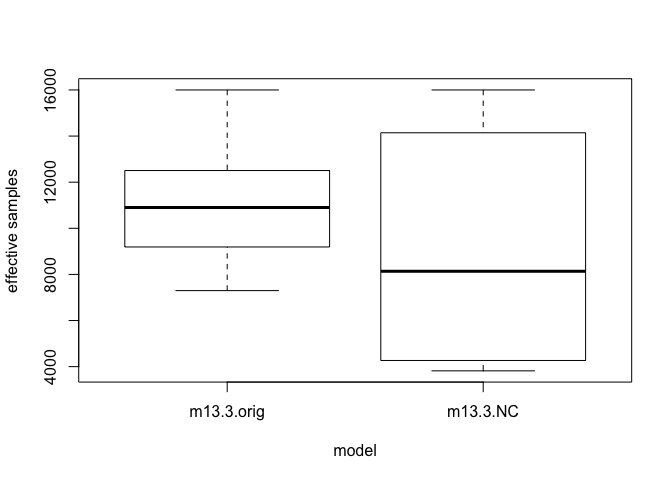

# Ch13, homework 2
Stacey Harmer  
February 2, 2017  

Problems 13E3 and 13M3

# 13 E3
When can a varying slopes model have fewer effective parameters than the corresponding model with unpooled slopes?

see page 406-407.  when the mean slopes are small, this indicates aggressive shrinkage.  In other words, in such models, outliers are being pulled in towards the intercept pretty strongly.  Then these outliers are modeled as not being as different from intercepts.

# 13 M3
revisit varying slopes model for UCBadmit data, using NC parameterizaiton this time


```r
# get map2stan up and ready
library(rstan)
```

```
## Loading required package: ggplot2
```

```
## Loading required package: StanHeaders
```

```
## rstan (Version 2.14.1, packaged: 2016-12-28 14:55:41 UTC, GitRev: 5fa1e80eb817)
```

```
## For execution on a local, multicore CPU with excess RAM we recommend calling
## rstan_options(auto_write = TRUE)
## options(mc.cores = parallel::detectCores())
```

```r
rstan_options(auto_write = TRUE)
options(mc.cores = parallel::detectCores())
```


```r
library(rethinking)
```

```
## Loading required package: parallel
```

```
## rethinking (Version 1.59)
```

```r
data("UCBadmit")
d <- UCBadmit
d$male <- ifelse(d$applicant.gender == "male", 1, 0)
d$dept_id <- coerce_index(d$dept)
head(d)
```

```
##   dept applicant.gender admit reject applications male dept_id
## 1    A             male   512    313          825    1       1
## 2    A           female    89     19          108    0       1
## 3    B             male   353    207          560    1       2
## 4    B           female    17      8           25    0       2
## 5    C             male   120    205          325    1       3
## 6    C           female   202    391          593    0       3
```

```r
#  Varying slopes model
m13.3 <- map2stan(
  alist(
    admit ~ dbinom( applications , p ),
    logit(p) <- a_dept[dept_id] +
      bm_dept[dept_id]*male,
    c(a_dept,bm_dept)[dept_id] ~ dmvnorm2( c(a,bm) , sigma_dept , Rho ),
    a ~ dnorm(0,10),
    bm ~ dnorm(0,1),
    sigma_dept ~ dcauchy(0,2),
    Rho ~ dlkjcorr(2)
  ) ,
  data=d , warmup=1000 , iter=5000 , chains=4 , cores=3 )
```

```
## Warning: Variable 'applicant.gender' contains dots '.'.
## Will attempt to remove dots internally.
```

```
## In file included from file8a6d073391.cpp:8:
## In file included from /Library/Frameworks/R.framework/Versions/3.3/Resources/library/StanHeaders/include/src/stan/model/model_header.hpp:4:
## In file included from /Library/Frameworks/R.framework/Versions/3.3/Resources/library/StanHeaders/include/stan/math.hpp:4:
## In file included from /Library/Frameworks/R.framework/Versions/3.3/Resources/library/StanHeaders/include/stan/math/rev/mat.hpp:4:
## In file included from /Library/Frameworks/R.framework/Versions/3.3/Resources/library/StanHeaders/include/stan/math/rev/core.hpp:12:
## In file included from /Library/Frameworks/R.framework/Versions/3.3/Resources/library/StanHeaders/include/stan/math/rev/core/gevv_vvv_vari.hpp:5:
## In file included from /Library/Frameworks/R.framework/Versions/3.3/Resources/library/StanHeaders/include/stan/math/rev/core/var.hpp:7:
## In file included from /Library/Frameworks/R.framework/Versions/3.3/Resources/library/BH/include/boost/math/tools/config.hpp:13:
## In file included from /Library/Frameworks/R.framework/Versions/3.3/Resources/library/BH/include/boost/config.hpp:39:
## /Library/Frameworks/R.framework/Versions/3.3/Resources/library/BH/include/boost/config/compiler/clang.hpp:196:11: warning: 'BOOST_NO_CXX11_RVALUE_REFERENCES' macro redefined [-Wmacro-redefined]
## #  define BOOST_NO_CXX11_RVALUE_REFERENCES
##           ^
## <command line>:6:9: note: previous definition is here
## #define BOOST_NO_CXX11_RVALUE_REFERENCES 1
##         ^
## 1 warning generated.
```

```
## Warning: There were 16 divergent transitions after warmup. Increasing adapt_delta above 0.8 may help. See
## http://mc-stan.org/misc/warnings.html#divergent-transitions-after-warmup
```

```
## Warning: Examine the pairs() plot to diagnose sampling problems
```

```
## 
## SAMPLING FOR MODEL 'admit ~ dbinom(applications, p)' NOW (CHAIN 1).
## WARNING: No variance estimation is
##          performed for num_warmup < 20
## 
## 
## Chain 1, Iteration: 1 / 1 [100%]  (Sampling)
##  Elapsed Time: 6e-06 seconds (Warm-up)
##                7.9e-05 seconds (Sampling)
##                8.5e-05 seconds (Total)
```

```
## Computing WAIC
```

```
## Constructing posterior predictions
```

```
## [ 1600 / 16000 ]
[ 3200 / 16000 ]
[ 4800 / 16000 ]
[ 6400 / 16000 ]
[ 8000 / 16000 ]
[ 9600 / 16000 ]
[ 11200 / 16000 ]
[ 12800 / 16000 ]
[ 14400 / 16000 ]
[ 16000 / 16000 ]
```

```
## Aggregated binomial counts detected. Splitting to 0/1 outcome for WAIC calculation.
```

```
## Warning in map2stan(alist(admit ~ dbinom(applications, p), logit(p) <- a_dept[dept_id] + : There were 16 divergent iterations during sampling.
## Check the chains (trace plots, n_eff, Rhat) carefully to ensure they are valid.
```

```r
precis(m13.3, depth=2)
```

```
## Warning in precis(m13.3, depth = 2): There were 16 divergent iterations during sampling.
## Check the chains (trace plots, n_eff, Rhat) carefully to ensure they are valid.
```

```
##                Mean StdDev lower 0.89 upper 0.89 n_eff Rhat
## bm_dept[1]    -0.79   0.27      -1.20      -0.35  7310    1
## bm_dept[2]    -0.21   0.33      -0.74       0.31  9393    1
## bm_dept[3]     0.08   0.14      -0.15       0.30 12603    1
## bm_dept[4]    -0.09   0.14      -0.32       0.12 12406    1
## bm_dept[5]     0.12   0.19      -0.18       0.41 12179    1
## bm_dept[6]    -0.12   0.27      -0.55       0.31 11659    1
## a_dept[1]      1.31   0.25       0.89       1.69  7489    1
## a_dept[2]      0.74   0.33       0.21       1.25  9508    1
## a_dept[3]     -0.65   0.09      -0.78      -0.51 13802    1
## a_dept[4]     -0.62   0.10      -0.78      -0.44 12323    1
## a_dept[5]     -1.13   0.12      -1.31      -0.94 16000    1
## a_dept[6]     -2.60   0.20      -2.92      -2.28 12038    1
## a             -0.51   0.72      -1.65       0.56  9719    1
## bm            -0.16   0.24      -0.55       0.18  8262    1
## sigma_dept[1]  1.67   0.62       0.84       2.44  8987    1
## sigma_dept[2]  0.50   0.26       0.16       0.83  7298    1
## Rho[1,1]       1.00   0.00       1.00       1.00 16000  NaN
## Rho[1,2]      -0.32   0.35      -0.89       0.19 10145    1
## Rho[2,1]      -0.32   0.35      -0.89       0.19 10145    1
## Rho[2,2]       1.00   0.00       1.00       1.00 15307    1
```
Now repeat, but with non-centered parametrization.
And move the means into the linear models (not inside the prior)


```r
m13.3NC <- map2stan(
  alist(
    admit ~ dbinom( applications , p ),
    logit(p) <- a + a_dept[dept_id] +
      bm + bm_dept[dept_id]*male,
    c(a_dept,bm_dept)[dept_id] ~ dmvnormNC( sigma_dept , Rho ),
    a ~ dnorm(0,10),
    bm ~ dnorm(0,1),
    sigma_dept ~ dcauchy(0,2),
    Rho ~ dlkjcorr(2)
  ) ,
  data=d , warmup=1000 , iter=5000 , chains=4 , cores=3 )
```

```
## Warning: Variable 'applicant.gender' contains dots '.'.
## Will attempt to remove dots internally.
```

```
## In file included from file8a62d36b976.cpp:8:
## In file included from /Library/Frameworks/R.framework/Versions/3.3/Resources/library/StanHeaders/include/src/stan/model/model_header.hpp:4:
## In file included from /Library/Frameworks/R.framework/Versions/3.3/Resources/library/StanHeaders/include/stan/math.hpp:4:
## In file included from /Library/Frameworks/R.framework/Versions/3.3/Resources/library/StanHeaders/include/stan/math/rev/mat.hpp:4:
## In file included from /Library/Frameworks/R.framework/Versions/3.3/Resources/library/StanHeaders/include/stan/math/rev/core.hpp:12:
## In file included from /Library/Frameworks/R.framework/Versions/3.3/Resources/library/StanHeaders/include/stan/math/rev/core/gevv_vvv_vari.hpp:5:
## In file included from /Library/Frameworks/R.framework/Versions/3.3/Resources/library/StanHeaders/include/stan/math/rev/core/var.hpp:7:
## In file included from /Library/Frameworks/R.framework/Versions/3.3/Resources/library/BH/include/boost/math/tools/config.hpp:13:
## In file included from /Library/Frameworks/R.framework/Versions/3.3/Resources/library/BH/include/boost/config.hpp:39:
## /Library/Frameworks/R.framework/Versions/3.3/Resources/library/BH/include/boost/config/compiler/clang.hpp:196:11: warning: 'BOOST_NO_CXX11_RVALUE_REFERENCES' macro redefined [-Wmacro-redefined]
## #  define BOOST_NO_CXX11_RVALUE_REFERENCES
##           ^
## <command line>:6:9: note: previous definition is here
## #define BOOST_NO_CXX11_RVALUE_REFERENCES 1
##         ^
## 1 warning generated.
## 
## SAMPLING FOR MODEL 'admit ~ dbinom(applications, p)' NOW (CHAIN 1).
## WARNING: No variance estimation is
##          performed for num_warmup < 20
## 
## 
## Chain 1, Iteration: 1 / 1 [100%]  (Sampling)
##  Elapsed Time: 4e-06 seconds (Warm-up)
##                5.3e-05 seconds (Sampling)
##                5.7e-05 seconds (Total)
```

```
## Computing WAIC
```

```
## Constructing posterior predictions
```

```
## [ 1600 / 16000 ]
[ 3200 / 16000 ]
[ 4800 / 16000 ]
[ 6400 / 16000 ]
[ 8000 / 16000 ]
[ 9600 / 16000 ]
[ 11200 / 16000 ]
[ 12800 / 16000 ]
[ 14400 / 16000 ]
[ 16000 / 16000 ]
```

```
## Aggregated binomial counts detected. Splitting to 0/1 outcome for WAIC calculation.
```

```r
precis(m13.3NC, depth=2)
```

```
##                   Mean StdDev lower 0.89 upper 0.89 n_eff Rhat
## z_N_dept_id[1,1]  1.28   0.56       0.35       2.13  4537    1
## z_N_dept_id[1,2]  0.89   0.51       0.12       1.74  4472    1
## z_N_dept_id[1,3]  0.01   0.39      -0.59       0.65  3954    1
## z_N_dept_id[1,4]  0.03   0.39      -0.59       0.65  3953    1
## z_N_dept_id[1,5] -0.32   0.41      -0.96       0.34  3984    1
## z_N_dept_id[1,6] -1.32   0.59      -2.25      -0.40  4322    1
## z_N_dept_id[2,1] -1.44   0.76      -2.65      -0.25 10078    1
## z_N_dept_id[2,2]  0.03   0.78      -1.18       1.30 12849    1
## z_N_dept_id[2,3]  0.33   0.47      -0.35       1.11 10191    1
## z_N_dept_id[2,4] -0.15   0.46      -0.89       0.57 10257    1
## z_N_dept_id[2,5]  0.34   0.57      -0.51       1.26 10520    1
## z_N_dept_id[2,6] -0.61   0.76      -1.82       0.57 11375    1
## L_Rho[1,1]        1.00   0.00       1.00       1.00 16000  NaN
## L_Rho[1,2]        0.00   0.00       0.00       0.00 16000  NaN
## L_Rho[2,1]       -0.31   0.36      -0.88       0.22  8136    1
## L_Rho[2,2]        0.87   0.14       0.68       1.00  8433    1
## a                -0.67   1.20      -2.59       1.23  5999    1
## bm               -0.01   0.99      -1.62       1.52 10436    1
## sigma_dept[1]     1.66   0.63       0.82       2.46  4993    1
## sigma_dept[2]     0.45   0.23       0.13       0.77  5096    1
## a_dept[1]         1.91   0.73       0.78       3.02  3945    1
## a_dept[2]         1.34   0.76       0.16       2.51  4213    1
## a_dept[3]         0.02   0.68      -1.02       1.08  3824    1
## a_dept[4]         0.05   0.69      -0.97       1.14  3818    1
## a_dept[5]        -0.47   0.69      -1.49       0.60  3831    1
## a_dept[6]        -1.96   0.69      -3.00      -0.88  4034    1
## bm_dept[1]       -0.72   0.28      -1.17      -0.27  7567    1
## bm_dept[2]       -0.13   0.31      -0.61       0.36 16000    1
## bm_dept[3]        0.10   0.13      -0.11       0.31 16000    1
## bm_dept[4]       -0.07   0.14      -0.29       0.16 16000    1
## bm_dept[5]        0.15   0.17      -0.14       0.41 16000    1
## bm_dept[6]       -0.06   0.26      -0.47       0.36 16000    1
## Rho[1,1]          1.00   0.00       1.00       1.00 16000  NaN
## Rho[1,2]         -0.31   0.36      -0.88       0.22  8136    1
## Rho[2,1]         -0.31   0.36      -0.88       0.22  8136    1
## Rho[2,2]          1.00   0.00       1.00       1.00 15436    1
```

And now let's systematically compare the n_eff


```r
# extract n_eff for each model
neff_orig <- precis(m13.3, 2)@output$n_eff
```

```
## Warning in precis(m13.3, 2): There were 16 divergent iterations during sampling.
## Check the chains (trace plots, n_eff, Rhat) carefully to ensure they are valid.
```

```r
neff_NC <- precis(m13.3NC, 2)@output$n_eff
```
And now plot them

```r
boxplot(list('m13.3.orig' = neff_orig, 'm13.3.NC' = neff_NC),
        ylab = "effective samples", xlab = "model")
```

<!-- -->
Surprise!   NC is not better and in fact may be worse.  Certainly more variable

