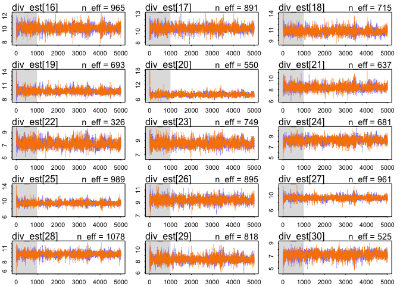

# Ch14_homework
Stacey Harmer  
March 9, 2017  

```r
library(rethinking) 
```

```
## Loading required package: rstan
```

```
## Loading required package: ggplot2
```

```
## Loading required package: StanHeaders
```

```
## rstan (Version 2.14.1, packaged: 2016-12-28 14:55:41 UTC, GitRev: 5fa1e80eb817)
```

```
## For execution on a local, multicore CPU with excess RAM we recommend calling
## rstan_options(auto_write = TRUE)
## options(mc.cores = parallel::detectCores())
```

```
## Loading required package: parallel
```

```
## rethinking (Version 1.62)
```

```r
# get map2stan up and ready
library(rstan)
rstan_options(auto_write = TRUE)
options(mc.cores = parallel::detectCores())
```

### 14E1. Rewrite the Oceanic tools model (from Chapter 10) below so that it assumes measured error
on the log population sizes of each society.

given model:

total_tools ~ dpois( lambda ),
log(lambda) <- a + bp*log_pop,
a ~ dnorm(0,10),
bp ~ dnorm( 0 , 1 )

revised model:

total_tools ~ dpois( lambda ),
log(lambda) <- a + bp*log_pop_est,
log_pop_obs ~ dnorm(log_pop_est, pop_sd)
a ~ dnorm(0,10),
bp ~ dnorm( 0 , 1 )

(I don't list a prior for pop_sd, but I don't think I have to . . .)

### 14E2. Rewrite the same model so that it allows imputation of missing values for log population.

given model:

total_tools ~ dpois( lambda ),
log(lambda) <- a + bp*log_pop,
a ~ dnorm(0,10),
bp ~ dnorm( 0 , 1 )

new model:

total_tools ~ dpois( lambda ),
log(lambda) <- a + bp*log_pop,
log_pop ~ dnorm(mu, sigma_pop)
a ~ dnorm(0,10),
bp ~ dnorm( 0 , 1 )
mu ~ dnorm(10, 2)
sigma_pop ~ dcauchy(0,1)

try to decide on good prior for log_pop

```r
library(rethinking) 
data(Kline)
Oc <- Kline
Oc
```

```
##       culture population contact total_tools mean_TU
## 1    Malekula       1100     low          13     3.2
## 2     Tikopia       1500     low          22     4.7
## 3  Santa Cruz       3600     low          24     4.0
## 4         Yap       4791    high          43     5.0
## 5    Lau Fiji       7400    high          33     5.0
## 6   Trobriand       8000    high          19     4.0
## 7       Chuuk       9200    high          40     3.8
## 8       Manus      13000     low          28     6.6
## 9       Tonga      17500    high          55     5.4
## 10     Hawaii     275000     low          71     6.6
```

```r
Oc$log_pop <- log(Oc$population)
mean(Oc$log_pop) # 9
```

```
## [1] 8.977005
```
Try to update the package


```r
library(devtools)
install_github("rmcelreath/rethinking",ref="Experimental")
```

```
## Skipping install of 'rethinking' from a github remote, the SHA1 (e4826f1f) has not changed since last install.
##   Use `force = TRUE` to force installation
```


#14M1.  Using the mathematical form of the imputation model in the chapter, explain what is being
assumed about how the missing values were generated

In section 14.2.1 (p 432 - ), teh missing value is for neocortex.  It is assumed that these missing values are random relative to the reported values.  They are modeled as being from a normal distribution, with a SD drawn from half Cauchy.  so we are assuming Gaussian uncertainty for each missing value.  

# 14M2.  Primate milk data.  Use imputation on neocortex data so all data are included.  compare to model where we threw out data

Chapter 6 model:


```r
library(rethinking) 
data(milk)
milk <- milk
milk$neocortex_prop <- milk$neocortex.perc / 100
milk$logmass <- log(milk$mass)
head(milk)
```

```
##              clade            species kcal.per.g perc.fat perc.protein
## 1    Strepsirrhine     Eulemur fulvus       0.49    16.60        15.42
## 2    Strepsirrhine           E macaco       0.51    19.27        16.91
## 3    Strepsirrhine           E mongoz       0.46    14.11        16.85
## 4    Strepsirrhine      E rubriventer       0.48    14.91        13.18
## 5    Strepsirrhine        Lemur catta       0.60    27.28        19.50
## 6 New World Monkey Alouatta seniculus       0.47    21.22        23.58
##   perc.lactose mass neocortex.perc neocortex_prop   logmass
## 1        67.98 1.95          55.16         0.5516 0.6678294
## 2        63.82 2.09             NA             NA 0.7371641
## 3        69.04 2.51             NA             NA 0.9202828
## 4        71.91 1.62             NA             NA 0.4824261
## 5        53.22 2.19             NA             NA 0.7839015
## 6        55.20 5.25          64.54         0.6454 1.6582281
```

And make a version with complete cases only (as done in chapter 6)


```r
milk.cc <- milk[ complete.cases(milk$neocortex_prop) , ]
```

Chapter 6, WAIC omodel comparisons; see models on page 197
Guess I'll do these using map2stan

First, simplify dataframe.  only need kcal.per.g,  neocortex_prop, logmass

```r
head(milk.cc)
```

```
##               clade            species kcal.per.g perc.fat perc.protein
## 1     Strepsirrhine     Eulemur fulvus       0.49    16.60        15.42
## 6  New World Monkey Alouatta seniculus       0.47    21.22        23.58
## 7  New World Monkey         A palliata       0.56    29.66        23.46
## 8  New World Monkey       Cebus apella       0.89    53.41        15.80
## 10 New World Monkey         S sciureus       0.92    50.58        22.33
## 11 New World Monkey   Cebuella pygmaea       0.80    41.35        20.85
##    perc.lactose mass neocortex.perc neocortex_prop    logmass
## 1         67.98 1.95          55.16         0.5516  0.6678294
## 6         55.20 5.25          64.54         0.6454  1.6582281
## 7         46.88 5.37          64.54         0.6454  1.6808279
## 8         30.79 2.51          67.64         0.6764  0.9202828
## 10        27.09 0.68          68.85         0.6885 -0.3856625
## 11        37.80 0.12          58.85         0.5885 -2.1202635
```

```r
milk.cc.simple <- milk.cc[, c(1:3,9,10)]
colnames(milk.cc.simple)[3] <- "kcal_per_g"
summary(milk.cc.simple)
```

```
##               clade                 species     kcal_per_g    
##  Ape             :6   A palliata        : 1   Min.   :0.4600  
##  New World Monkey:7   Alouatta seniculus: 1   1st Qu.:0.4900  
##  Old World Monkey:3   Callimico goeldii : 1   Median :0.6200  
##  Strepsirrhine   :1   Callithrix jacchus: 1   Mean   :0.6576  
##                       Cebuella pygmaea  : 1   3rd Qu.:0.8000  
##                       Cebus apella      : 1   Max.   :0.9700  
##                       (Other)           :11                   
##  neocortex_prop      logmass       
##  Min.   :0.5516   Min.   :-2.1203  
##  1st Qu.:0.6454   1st Qu.: 0.4383  
##  Median :0.6885   Median : 1.6582  
##  Mean   :0.6758   Mean   : 1.4993  
##  3rd Qu.:0.7126   3rd Qu.: 3.4998  
##  Max.   :0.7630   Max.   : 4.3749  
## 
```


```r
a.start <- mean(milk.cc.simple$kcal_per_g)
sigma.start <- log(sd(milk.cc.simple$kcal_per_g))
head(milk.cc.simple )
```

```
##               clade            species kcal_per_g neocortex_prop
## 1     Strepsirrhine     Eulemur fulvus       0.49         0.5516
## 6  New World Monkey Alouatta seniculus       0.47         0.6454
## 7  New World Monkey         A palliata       0.56         0.6454
## 8  New World Monkey       Cebus apella       0.89         0.6764
## 10 New World Monkey         S sciureus       0.92         0.6885
## 11 New World Monkey   Cebuella pygmaea       0.80         0.5885
##       logmass
## 1   0.6678294
## 6   1.6582281
## 7   1.6808279
## 8   0.9202828
## 10 -0.3856625
## 11 -2.1202635
```

```r
# model - intercept only
m6.11 <- map2stan(
  alist(
    kcal_per_g ~ dnorm( mu, sigma),
    mu <- a,
    a ~ dnorm(0,10),
    sigma ~ dcauchy(0, 1) 
) ,
  data=milk.cc.simple, iter = 1e4, chains =2 )
```

```
## In file included from file48d3bffc4a0.cpp:8:
## In file included from /Library/Frameworks/R.framework/Versions/3.3/Resources/library/StanHeaders/include/src/stan/model/model_header.hpp:4:
## In file included from /Library/Frameworks/R.framework/Versions/3.3/Resources/library/StanHeaders/include/stan/math.hpp:4:
## In file included from /Library/Frameworks/R.framework/Versions/3.3/Resources/library/StanHeaders/include/stan/math/rev/mat.hpp:4:
## In file included from /Library/Frameworks/R.framework/Versions/3.3/Resources/library/StanHeaders/include/stan/math/rev/core.hpp:12:
## In file included from /Library/Frameworks/R.framework/Versions/3.3/Resources/library/StanHeaders/include/stan/math/rev/core/gevv_vvv_vari.hpp:5:
## In file included from /Library/Frameworks/R.framework/Versions/3.3/Resources/library/StanHeaders/include/stan/math/rev/core/var.hpp:7:
## In file included from /Library/Frameworks/R.framework/Versions/3.3/Resources/library/BH/include/boost/math/tools/config.hpp:13:
## In file included from /Library/Frameworks/R.framework/Versions/3.3/Resources/library/BH/include/boost/config.hpp:39:
## /Library/Frameworks/R.framework/Versions/3.3/Resources/library/BH/include/boost/config/compiler/clang.hpp:196:11: warning: 'BOOST_NO_CXX11_RVALUE_REFERENCES' macro redefined [-Wmacro-redefined]
## #  define BOOST_NO_CXX11_RVALUE_REFERENCES
##           ^
## <command line>:6:9: note: previous definition is here
## #define BOOST_NO_CXX11_RVALUE_REFERENCES 1
##         ^
## 1 warning generated.
## 
## SAMPLING FOR MODEL '4baa659e9c0fad196c5ae3fd7e246860' NOW (CHAIN 1).
## 
## Chain 1, Iteration:    1 / 10000 [  0%]  (Warmup)
## Chain 1, Iteration: 1000 / 10000 [ 10%]  (Warmup)
## Chain 1, Iteration: 2000 / 10000 [ 20%]  (Warmup)
## Chain 1, Iteration: 3000 / 10000 [ 30%]  (Warmup)
## Chain 1, Iteration: 4000 / 10000 [ 40%]  (Warmup)
## Chain 1, Iteration: 5000 / 10000 [ 50%]  (Warmup)
## Chain 1, Iteration: 5001 / 10000 [ 50%]  (Sampling)
## Chain 1, Iteration: 6000 / 10000 [ 60%]  (Sampling)
## Chain 1, Iteration: 7000 / 10000 [ 70%]  (Sampling)
## Chain 1, Iteration: 8000 / 10000 [ 80%]  (Sampling)
## Chain 1, Iteration: 9000 / 10000 [ 90%]  (Sampling)
## Chain 1, Iteration: 10000 / 10000 [100%]  (Sampling)
##  Elapsed Time: 0.059829 seconds (Warm-up)
##                0.055377 seconds (Sampling)
##                0.115206 seconds (Total)
```

```
## The following numerical problems occured the indicated number of times on chain 1
```

```
##                                                                                 count
## Exception thrown at line 17: normal_log: Scale parameter is 0, but must be > 0!     1
```

```
## When a numerical problem occurs, the Hamiltonian proposal gets rejected.
```

```
## See http://mc-stan.org/misc/warnings.html#exception-hamiltonian-proposal-rejected
```

```
## If the number in the 'count' column is small, do not ask about this message on stan-users.
```

```
## 
## SAMPLING FOR MODEL '4baa659e9c0fad196c5ae3fd7e246860' NOW (CHAIN 2).
## 
## Chain 2, Iteration:    1 / 10000 [  0%]  (Warmup)
## Chain 2, Iteration: 1000 / 10000 [ 10%]  (Warmup)
## Chain 2, Iteration: 2000 / 10000 [ 20%]  (Warmup)
## Chain 2, Iteration: 3000 / 10000 [ 30%]  (Warmup)
## Chain 2, Iteration: 4000 / 10000 [ 40%]  (Warmup)
## Chain 2, Iteration: 5000 / 10000 [ 50%]  (Warmup)
## Chain 2, Iteration: 5001 / 10000 [ 50%]  (Sampling)
## Chain 2, Iteration: 6000 / 10000 [ 60%]  (Sampling)
## Chain 2, Iteration: 7000 / 10000 [ 70%]  (Sampling)
## Chain 2, Iteration: 8000 / 10000 [ 80%]  (Sampling)
## Chain 2, Iteration: 9000 / 10000 [ 90%]  (Sampling)
## Chain 2, Iteration: 10000 / 10000 [100%]  (Sampling)
##  Elapsed Time: 0.065004 seconds (Warm-up)
##                0.053154 seconds (Sampling)
##                0.118158 seconds (Total)
## 
## 
## SAMPLING FOR MODEL '4baa659e9c0fad196c5ae3fd7e246860' NOW (CHAIN 1).
## WARNING: No variance estimation is
##          performed for num_warmup < 20
## 
## 
## Chain 1, Iteration: 1 / 1 [100%]  (Sampling)
##  Elapsed Time: 3e-06 seconds (Warm-up)
##                1.7e-05 seconds (Sampling)
##                2e-05 seconds (Total)
```

```
## Computing WAIC
```

```
## Constructing posterior predictions
```

```
## [ 1000 / 10000 ]
[ 2000 / 10000 ]
[ 3000 / 10000 ]
[ 4000 / 10000 ]
[ 5000 / 10000 ]
[ 6000 / 10000 ]
[ 7000 / 10000 ]
[ 8000 / 10000 ]
[ 9000 / 10000 ]
[ 10000 / 10000 ]
```

```r
precis(m6.11)
```

```
##       Mean StdDev lower 0.89 upper 0.89 n_eff Rhat
## a     0.66   0.05       0.58       0.73  7100    1
## sigma 0.19   0.04       0.13       0.24  7511    1
```
 next, intercept and slope*neocortex

```r
m6.12 <- map2stan(
  alist(
    kcal_per_g ~ dnorm( mu, sigma),
    mu <- a + bn*neocortex_prop,
    a ~ dnorm(0,10),
    sigma ~ dcauchy(0, 1),
    bn ~ dnorm(0,10)
) ,
  data=milk.cc.simple, iter = 1e4, chains =2 )
```

```
## In file included from file48d18d13f2a.cpp:8:
## In file included from /Library/Frameworks/R.framework/Versions/3.3/Resources/library/StanHeaders/include/src/stan/model/model_header.hpp:4:
## In file included from /Library/Frameworks/R.framework/Versions/3.3/Resources/library/StanHeaders/include/stan/math.hpp:4:
## In file included from /Library/Frameworks/R.framework/Versions/3.3/Resources/library/StanHeaders/include/stan/math/rev/mat.hpp:4:
## In file included from /Library/Frameworks/R.framework/Versions/3.3/Resources/library/StanHeaders/include/stan/math/rev/core.hpp:12:
## In file included from /Library/Frameworks/R.framework/Versions/3.3/Resources/library/StanHeaders/include/stan/math/rev/core/gevv_vvv_vari.hpp:5:
## In file included from /Library/Frameworks/R.framework/Versions/3.3/Resources/library/StanHeaders/include/stan/math/rev/core/var.hpp:7:
## In file included from /Library/Frameworks/R.framework/Versions/3.3/Resources/library/BH/include/boost/math/tools/config.hpp:13:
## In file included from /Library/Frameworks/R.framework/Versions/3.3/Resources/library/BH/include/boost/config.hpp:39:
## /Library/Frameworks/R.framework/Versions/3.3/Resources/library/BH/include/boost/config/compiler/clang.hpp:196:11: warning: 'BOOST_NO_CXX11_RVALUE_REFERENCES' macro redefined [-Wmacro-redefined]
## #  define BOOST_NO_CXX11_RVALUE_REFERENCES
##           ^
## <command line>:6:9: note: previous definition is here
## #define BOOST_NO_CXX11_RVALUE_REFERENCES 1
##         ^
## 1 warning generated.
## 
## SAMPLING FOR MODEL '6f8077fa542c6f373c0c89acf589d6ba' NOW (CHAIN 1).
## 
## Chain 1, Iteration:    1 / 10000 [  0%]  (Warmup)
## Chain 1, Iteration: 1000 / 10000 [ 10%]  (Warmup)
## Chain 1, Iteration: 2000 / 10000 [ 20%]  (Warmup)
## Chain 1, Iteration: 3000 / 10000 [ 30%]  (Warmup)
## Chain 1, Iteration: 4000 / 10000 [ 40%]  (Warmup)
## Chain 1, Iteration: 5000 / 10000 [ 50%]  (Warmup)
## Chain 1, Iteration: 5001 / 10000 [ 50%]  (Sampling)
## Chain 1, Iteration: 6000 / 10000 [ 60%]  (Sampling)
## Chain 1, Iteration: 7000 / 10000 [ 70%]  (Sampling)
## Chain 1, Iteration: 8000 / 10000 [ 80%]  (Sampling)
## Chain 1, Iteration: 9000 / 10000 [ 90%]  (Sampling)
## Chain 1, Iteration: 10000 / 10000 [100%]  (Sampling)
##  Elapsed Time: 0.483133 seconds (Warm-up)
##                0.575279 seconds (Sampling)
##                1.05841 seconds (Total)
## 
## 
## SAMPLING FOR MODEL '6f8077fa542c6f373c0c89acf589d6ba' NOW (CHAIN 2).
## 
## Chain 2, Iteration:    1 / 10000 [  0%]  (Warmup)
## Chain 2, Iteration: 1000 / 10000 [ 10%]  (Warmup)
## Chain 2, Iteration: 2000 / 10000 [ 20%]  (Warmup)
## Chain 2, Iteration: 3000 / 10000 [ 30%]  (Warmup)
## Chain 2, Iteration: 4000 / 10000 [ 40%]  (Warmup)
## Chain 2, Iteration: 5000 / 10000 [ 50%]  (Warmup)
## Chain 2, Iteration: 5001 / 10000 [ 50%]  (Sampling)
## Chain 2, Iteration: 6000 / 10000 [ 60%]  (Sampling)
## Chain 2, Iteration: 7000 / 10000 [ 70%]  (Sampling)
## Chain 2, Iteration: 8000 / 10000 [ 80%]  (Sampling)
## Chain 2, Iteration: 9000 / 10000 [ 90%]  (Sampling)
## Chain 2, Iteration: 10000 / 10000 [100%]  (Sampling)
##  Elapsed Time: 0.592719 seconds (Warm-up)
##                0.55926 seconds (Sampling)
##                1.15198 seconds (Total)
```

```
## Warning: There were 1 divergent transitions after warmup. Increasing adapt_delta above 0.8 may help. See
## http://mc-stan.org/misc/warnings.html#divergent-transitions-after-warmup
```

```
## Warning: Examine the pairs() plot to diagnose sampling problems
```

```
## 
## SAMPLING FOR MODEL '6f8077fa542c6f373c0c89acf589d6ba' NOW (CHAIN 1).
## WARNING: No variance estimation is
##          performed for num_warmup < 20
## 
## 
## Chain 1, Iteration: 1 / 1 [100%]  (Sampling)
##  Elapsed Time: 2e-06 seconds (Warm-up)
##                2.1e-05 seconds (Sampling)
##                2.3e-05 seconds (Total)
```

```
## Computing WAIC
```

```
## Constructing posterior predictions
```

```
## [ 1000 / 10000 ]
[ 2000 / 10000 ]
[ 3000 / 10000 ]
[ 4000 / 10000 ]
[ 5000 / 10000 ]
[ 6000 / 10000 ]
[ 7000 / 10000 ]
[ 8000 / 10000 ]
[ 9000 / 10000 ]
[ 10000 / 10000 ]
```

```
## Warning in map2stan(alist(kcal_per_g ~ dnorm(mu, sigma), mu <- a + bn * : There were 1 divergent iterations during sampling.
## Check the chains (trace plots, n_eff, Rhat) carefully to ensure they are valid.
```

```r
precis(m6.12)
```

```
## Warning in precis(m6.12): There were 1 divergent iterations during sampling.
## Check the chains (trace plots, n_eff, Rhat) carefully to ensure they are valid.
```

```
##       Mean StdDev lower 0.89 upper 0.89 n_eff Rhat
## a     0.35   0.55      -0.57       1.19  2993    1
## sigma 0.19   0.04       0.13       0.25  3168    1
## bn    0.46   0.82      -0.79       1.81  3007    1
```

Next, add loggmass to equation

```r
m6.13 <- map2stan(
  alist(
    kcal_per_g ~ dnorm( mu, sigma),
    mu <- a + bm*logmass,
    a ~ dnorm(0,10),
    sigma ~ dcauchy(0, 1),
    bm ~ dnorm(0,10)
) ,
  data=milk.cc.simple, iter = 1e4, chains =2 )
```

```
## In file included from file48d3a937a44.cpp:8:
## In file included from /Library/Frameworks/R.framework/Versions/3.3/Resources/library/StanHeaders/include/src/stan/model/model_header.hpp:4:
## In file included from /Library/Frameworks/R.framework/Versions/3.3/Resources/library/StanHeaders/include/stan/math.hpp:4:
## In file included from /Library/Frameworks/R.framework/Versions/3.3/Resources/library/StanHeaders/include/stan/math/rev/mat.hpp:4:
## In file included from /Library/Frameworks/R.framework/Versions/3.3/Resources/library/StanHeaders/include/stan/math/rev/core.hpp:12:
## In file included from /Library/Frameworks/R.framework/Versions/3.3/Resources/library/StanHeaders/include/stan/math/rev/core/gevv_vvv_vari.hpp:5:
## In file included from /Library/Frameworks/R.framework/Versions/3.3/Resources/library/StanHeaders/include/stan/math/rev/core/var.hpp:7:
## In file included from /Library/Frameworks/R.framework/Versions/3.3/Resources/library/BH/include/boost/math/tools/config.hpp:13:
## In file included from /Library/Frameworks/R.framework/Versions/3.3/Resources/library/BH/include/boost/config.hpp:39:
## /Library/Frameworks/R.framework/Versions/3.3/Resources/library/BH/include/boost/config/compiler/clang.hpp:196:11: warning: 'BOOST_NO_CXX11_RVALUE_REFERENCES' macro redefined [-Wmacro-redefined]
## #  define BOOST_NO_CXX11_RVALUE_REFERENCES
##           ^
## <command line>:6:9: note: previous definition is here
## #define BOOST_NO_CXX11_RVALUE_REFERENCES 1
##         ^
## 1 warning generated.
## 
## SAMPLING FOR MODEL 'e37bfd13168c7259cc0e18484951d54a' NOW (CHAIN 1).
## 
## Chain 1, Iteration:    1 / 10000 [  0%]  (Warmup)
## Chain 1, Iteration: 1000 / 10000 [ 10%]  (Warmup)
## Chain 1, Iteration: 2000 / 10000 [ 20%]  (Warmup)
## Chain 1, Iteration: 3000 / 10000 [ 30%]  (Warmup)
## Chain 1, Iteration: 4000 / 10000 [ 40%]  (Warmup)
## Chain 1, Iteration: 5000 / 10000 [ 50%]  (Warmup)
## Chain 1, Iteration: 5001 / 10000 [ 50%]  (Sampling)
## Chain 1, Iteration: 6000 / 10000 [ 60%]  (Sampling)
## Chain 1, Iteration: 7000 / 10000 [ 70%]  (Sampling)
## Chain 1, Iteration: 8000 / 10000 [ 80%]  (Sampling)
## Chain 1, Iteration: 9000 / 10000 [ 90%]  (Sampling)
## Chain 1, Iteration: 10000 / 10000 [100%]  (Sampling)
##  Elapsed Time: 0.107816 seconds (Warm-up)
##                0.110284 seconds (Sampling)
##                0.2181 seconds (Total)
## 
## 
## SAMPLING FOR MODEL 'e37bfd13168c7259cc0e18484951d54a' NOW (CHAIN 2).
## 
## Chain 2, Iteration:    1 / 10000 [  0%]  (Warmup)
## Chain 2, Iteration: 1000 / 10000 [ 10%]  (Warmup)
## Chain 2, Iteration: 2000 / 10000 [ 20%]  (Warmup)
## Chain 2, Iteration: 3000 / 10000 [ 30%]  (Warmup)
## Chain 2, Iteration: 4000 / 10000 [ 40%]  (Warmup)
## Chain 2, Iteration: 5000 / 10000 [ 50%]  (Warmup)
## Chain 2, Iteration: 5001 / 10000 [ 50%]  (Sampling)
## Chain 2, Iteration: 6000 / 10000 [ 60%]  (Sampling)
## Chain 2, Iteration: 7000 / 10000 [ 70%]  (Sampling)
## Chain 2, Iteration: 8000 / 10000 [ 80%]  (Sampling)
## Chain 2, Iteration: 9000 / 10000 [ 90%]  (Sampling)
## Chain 2, Iteration: 10000 / 10000 [100%]  (Sampling)
##  Elapsed Time: 0.107923 seconds (Warm-up)
##                0.127345 seconds (Sampling)
##                0.235268 seconds (Total)
## 
## 
## SAMPLING FOR MODEL 'e37bfd13168c7259cc0e18484951d54a' NOW (CHAIN 1).
## WARNING: No variance estimation is
##          performed for num_warmup < 20
## 
## 
## Chain 1, Iteration: 1 / 1 [100%]  (Sampling)
##  Elapsed Time: 3e-06 seconds (Warm-up)
##                3e-05 seconds (Sampling)
##                3.3e-05 seconds (Total)
```

```
## Computing WAIC
```

```
## Constructing posterior predictions
```

```
## [ 1000 / 10000 ]
[ 2000 / 10000 ]
[ 3000 / 10000 ]
[ 4000 / 10000 ]
[ 5000 / 10000 ]
[ 6000 / 10000 ]
[ 7000 / 10000 ]
[ 8000 / 10000 ]
[ 9000 / 10000 ]
[ 10000 / 10000 ]
```

```r
precis(m6.13)
```

```
##        Mean StdDev lower 0.89 upper 0.89 n_eff Rhat
## a      0.71   0.06       0.61       0.80  5072    1
## sigma  0.18   0.04       0.12       0.23  5445    1
## bm    -0.03   0.02      -0.07       0.01  5040    1
```

Last, model with both neocortex and mass

```r
m6.14 <- map2stan(
  alist(
    kcal_per_g ~ dnorm( mu, sigma),
    mu <- a + bm*logmass + bn*neocortex_prop,
    a ~ dnorm(0,10),
    sigma ~ dcauchy(0, 1),
    bm ~ dnorm(0,10),
    bn ~ dnorm(0,10)
) ,
  data=milk.cc.simple, iter = 1e4, chains =2 )
```

```
## In file included from file48d3856563c.cpp:8:
## In file included from /Library/Frameworks/R.framework/Versions/3.3/Resources/library/StanHeaders/include/src/stan/model/model_header.hpp:4:
## In file included from /Library/Frameworks/R.framework/Versions/3.3/Resources/library/StanHeaders/include/stan/math.hpp:4:
## In file included from /Library/Frameworks/R.framework/Versions/3.3/Resources/library/StanHeaders/include/stan/math/rev/mat.hpp:4:
## In file included from /Library/Frameworks/R.framework/Versions/3.3/Resources/library/StanHeaders/include/stan/math/rev/core.hpp:12:
## In file included from /Library/Frameworks/R.framework/Versions/3.3/Resources/library/StanHeaders/include/stan/math/rev/core/gevv_vvv_vari.hpp:5:
## In file included from /Library/Frameworks/R.framework/Versions/3.3/Resources/library/StanHeaders/include/stan/math/rev/core/var.hpp:7:
## In file included from /Library/Frameworks/R.framework/Versions/3.3/Resources/library/BH/include/boost/math/tools/config.hpp:13:
## In file included from /Library/Frameworks/R.framework/Versions/3.3/Resources/library/BH/include/boost/config.hpp:39:
## /Library/Frameworks/R.framework/Versions/3.3/Resources/library/BH/include/boost/config/compiler/clang.hpp:196:11: warning: 'BOOST_NO_CXX11_RVALUE_REFERENCES' macro redefined [-Wmacro-redefined]
## #  define BOOST_NO_CXX11_RVALUE_REFERENCES
##           ^
## <command line>:6:9: note: previous definition is here
## #define BOOST_NO_CXX11_RVALUE_REFERENCES 1
##         ^
## 1 warning generated.
## 
## SAMPLING FOR MODEL 'df2fc04048a6fa27c559387e92c5cd87' NOW (CHAIN 1).
## 
## Chain 1, Iteration:    1 / 10000 [  0%]  (Warmup)
## Chain 1, Iteration: 1000 / 10000 [ 10%]  (Warmup)
## Chain 1, Iteration: 2000 / 10000 [ 20%]  (Warmup)
## Chain 1, Iteration: 3000 / 10000 [ 30%]  (Warmup)
## Chain 1, Iteration: 4000 / 10000 [ 40%]  (Warmup)
## Chain 1, Iteration: 5000 / 10000 [ 50%]  (Warmup)
## Chain 1, Iteration: 5001 / 10000 [ 50%]  (Sampling)
## Chain 1, Iteration: 6000 / 10000 [ 60%]  (Sampling)
## Chain 1, Iteration: 7000 / 10000 [ 70%]  (Sampling)
## Chain 1, Iteration: 8000 / 10000 [ 80%]  (Sampling)
## Chain 1, Iteration: 9000 / 10000 [ 90%]  (Sampling)
## Chain 1, Iteration: 10000 / 10000 [100%]  (Sampling)
##  Elapsed Time: 0.860204 seconds (Warm-up)
##                1.2132 seconds (Sampling)
##                2.0734 seconds (Total)
## 
## 
## SAMPLING FOR MODEL 'df2fc04048a6fa27c559387e92c5cd87' NOW (CHAIN 2).
## 
## Chain 2, Iteration:    1 / 10000 [  0%]  (Warmup)
## Chain 2, Iteration: 1000 / 10000 [ 10%]  (Warmup)
## Chain 2, Iteration: 2000 / 10000 [ 20%]  (Warmup)
## Chain 2, Iteration: 3000 / 10000 [ 30%]  (Warmup)
## Chain 2, Iteration: 4000 / 10000 [ 40%]  (Warmup)
## Chain 2, Iteration: 5000 / 10000 [ 50%]  (Warmup)
## Chain 2, Iteration: 5001 / 10000 [ 50%]  (Sampling)
## Chain 2, Iteration: 6000 / 10000 [ 60%]  (Sampling)
## Chain 2, Iteration: 7000 / 10000 [ 70%]  (Sampling)
## Chain 2, Iteration: 8000 / 10000 [ 80%]  (Sampling)
## Chain 2, Iteration: 9000 / 10000 [ 90%]  (Sampling)
## Chain 2, Iteration: 10000 / 10000 [100%]  (Sampling)
##  Elapsed Time: 0.844834 seconds (Warm-up)
##                1.083 seconds (Sampling)
##                1.92783 seconds (Total)
## 
## 
## SAMPLING FOR MODEL 'df2fc04048a6fa27c559387e92c5cd87' NOW (CHAIN 1).
## WARNING: No variance estimation is
##          performed for num_warmup < 20
## 
## 
## Chain 1, Iteration: 1 / 1 [100%]  (Sampling)
##  Elapsed Time: 4e-06 seconds (Warm-up)
##                3.8e-05 seconds (Sampling)
##                4.2e-05 seconds (Total)
```

```
## Computing WAIC
```

```
## Constructing posterior predictions
```

```
## [ 1000 / 10000 ]
[ 2000 / 10000 ]
[ 3000 / 10000 ]
[ 4000 / 10000 ]
[ 5000 / 10000 ]
[ 6000 / 10000 ]
[ 7000 / 10000 ]
[ 8000 / 10000 ]
[ 9000 / 10000 ]
[ 10000 / 10000 ]
```

```r
precis(m6.14)
```

```
##        Mean StdDev lower 0.89 upper 0.89 n_eff Rhat
## a     -1.06   0.57      -2.03      -0.20  2687    1
## sigma  0.14   0.03       0.10       0.18  3085    1
## bm    -0.10   0.03      -0.14      -0.05  3224    1
## bn     2.75   0.89       1.34       4.19  2639    1
```

And then compare all to each other using WAIC

```r
(milk.models <- compare(m6.11, m6.12, m6.13, m6.14))
```

```
##        WAIC pWAIC dWAIC weight   SE  dSE
## m6.14 -16.9   3.1   0.0   0.96 5.01   NA
## m6.13  -8.9   2.1   8.0   0.02 4.13 3.49
## m6.11  -8.8   1.3   8.1   0.02 3.66 4.95
## m6.12  -7.2   1.9   9.7   0.01 3.16 5.05
```
The last model is hte clear winner, just as in chapter 6

OK, now repeat but this time impute the neocortext data

First, simplify dataframe.  only need kcal.per.g,  neocortex_prop, logmass

```r
head(milk)
```

```
##              clade            species kcal.per.g perc.fat perc.protein
## 1    Strepsirrhine     Eulemur fulvus       0.49    16.60        15.42
## 2    Strepsirrhine           E macaco       0.51    19.27        16.91
## 3    Strepsirrhine           E mongoz       0.46    14.11        16.85
## 4    Strepsirrhine      E rubriventer       0.48    14.91        13.18
## 5    Strepsirrhine        Lemur catta       0.60    27.28        19.50
## 6 New World Monkey Alouatta seniculus       0.47    21.22        23.58
##   perc.lactose mass neocortex.perc neocortex_prop   logmass
## 1        67.98 1.95          55.16         0.5516 0.6678294
## 2        63.82 2.09             NA             NA 0.7371641
## 3        69.04 2.51             NA             NA 0.9202828
## 4        71.91 1.62             NA             NA 0.4824261
## 5        53.22 2.19             NA             NA 0.7839015
## 6        55.20 5.25          64.54         0.6454 1.6582281
```

```r
milk.simple <- milk[, c(1:3,9,10)]
colnames(milk.simple)[3] <- "kcal_per_g"
summary(milk.simple)
```

```
##               clade                 species     kcal_per_g    
##  Ape             :9   A palliata        : 1   Min.   :0.4600  
##  New World Monkey:9   Alouatta seniculus: 1   1st Qu.:0.4900  
##  Old World Monkey:6   Callimico goeldii : 1   Median :0.6000  
##  Strepsirrhine   :5   Callithrix jacchus: 1   Mean   :0.6417  
##                       Cebuella pygmaea  : 1   3rd Qu.:0.7300  
##                       Cebus apella      : 1   Max.   :0.9700  
##                       (Other)           :23                   
##  neocortex_prop      logmass       
##  Min.   :0.5516   Min.   :-2.1203  
##  1st Qu.:0.6454   1st Qu.: 0.4824  
##  Median :0.6885   Median : 1.2442  
##  Mean   :0.6758   Mean   : 1.4418  
##  3rd Qu.:0.7126   3rd Qu.: 2.3721  
##  Max.   :0.7630   Max.   : 4.5821  
##  NA's   :12
```

Next, run models with imputed data


```r
# model - intercept only; expect it to be same as above
m14M2.1 <- map2stan(
  alist(
    kcal_per_g ~ dnorm( mu, sigma),
    mu <- a,
    a ~ dnorm(0,10),
    sigma ~ dcauchy(0, 1) 
) ,
  data=milk.simple, iter = 1e4, chains =2 )
```

```
## In file included from file48d41a6a059.cpp:8:
## In file included from /Library/Frameworks/R.framework/Versions/3.3/Resources/library/StanHeaders/include/src/stan/model/model_header.hpp:4:
## In file included from /Library/Frameworks/R.framework/Versions/3.3/Resources/library/StanHeaders/include/stan/math.hpp:4:
## In file included from /Library/Frameworks/R.framework/Versions/3.3/Resources/library/StanHeaders/include/stan/math/rev/mat.hpp:4:
## In file included from /Library/Frameworks/R.framework/Versions/3.3/Resources/library/StanHeaders/include/stan/math/rev/core.hpp:12:
## In file included from /Library/Frameworks/R.framework/Versions/3.3/Resources/library/StanHeaders/include/stan/math/rev/core/gevv_vvv_vari.hpp:5:
## In file included from /Library/Frameworks/R.framework/Versions/3.3/Resources/library/StanHeaders/include/stan/math/rev/core/var.hpp:7:
## In file included from /Library/Frameworks/R.framework/Versions/3.3/Resources/library/BH/include/boost/math/tools/config.hpp:13:
## In file included from /Library/Frameworks/R.framework/Versions/3.3/Resources/library/BH/include/boost/config.hpp:39:
## /Library/Frameworks/R.framework/Versions/3.3/Resources/library/BH/include/boost/config/compiler/clang.hpp:196:11: warning: 'BOOST_NO_CXX11_RVALUE_REFERENCES' macro redefined [-Wmacro-redefined]
## #  define BOOST_NO_CXX11_RVALUE_REFERENCES
##           ^
## <command line>:6:9: note: previous definition is here
## #define BOOST_NO_CXX11_RVALUE_REFERENCES 1
##         ^
## 1 warning generated.
## 
## SAMPLING FOR MODEL '64c4f99b97b9e102a57a81729f772867' NOW (CHAIN 1).
## 
## Chain 1, Iteration:    1 / 10000 [  0%]  (Warmup)
## Chain 1, Iteration: 1000 / 10000 [ 10%]  (Warmup)
## Chain 1, Iteration: 2000 / 10000 [ 20%]  (Warmup)
## Chain 1, Iteration: 3000 / 10000 [ 30%]  (Warmup)
## Chain 1, Iteration: 4000 / 10000 [ 40%]  (Warmup)
## Chain 1, Iteration: 5000 / 10000 [ 50%]  (Warmup)
## Chain 1, Iteration: 5001 / 10000 [ 50%]  (Sampling)
## Chain 1, Iteration: 6000 / 10000 [ 60%]  (Sampling)
## Chain 1, Iteration: 7000 / 10000 [ 70%]  (Sampling)
## Chain 1, Iteration: 8000 / 10000 [ 80%]  (Sampling)
## Chain 1, Iteration: 9000 / 10000 [ 90%]  (Sampling)
## Chain 1, Iteration: 10000 / 10000 [100%]  (Sampling)
##  Elapsed Time: 0.072261 seconds (Warm-up)
##                0.069431 seconds (Sampling)
##                0.141692 seconds (Total)
## 
## 
## SAMPLING FOR MODEL '64c4f99b97b9e102a57a81729f772867' NOW (CHAIN 2).
## 
## Chain 2, Iteration:    1 / 10000 [  0%]  (Warmup)
## Chain 2, Iteration: 1000 / 10000 [ 10%]  (Warmup)
## Chain 2, Iteration: 2000 / 10000 [ 20%]  (Warmup)
## Chain 2, Iteration: 3000 / 10000 [ 30%]  (Warmup)
## Chain 2, Iteration: 4000 / 10000 [ 40%]  (Warmup)
## Chain 2, Iteration: 5000 / 10000 [ 50%]  (Warmup)
## Chain 2, Iteration: 5001 / 10000 [ 50%]  (Sampling)
## Chain 2, Iteration: 6000 / 10000 [ 60%]  (Sampling)
## Chain 2, Iteration: 7000 / 10000 [ 70%]  (Sampling)
## Chain 2, Iteration: 8000 / 10000 [ 80%]  (Sampling)
## Chain 2, Iteration: 9000 / 10000 [ 90%]  (Sampling)
## Chain 2, Iteration: 10000 / 10000 [100%]  (Sampling)
##  Elapsed Time: 0.074261 seconds (Warm-up)
##                0.062679 seconds (Sampling)
##                0.13694 seconds (Total)
## 
## 
## SAMPLING FOR MODEL '64c4f99b97b9e102a57a81729f772867' NOW (CHAIN 1).
## WARNING: No variance estimation is
##          performed for num_warmup < 20
## 
## 
## Chain 1, Iteration: 1 / 1 [100%]  (Sampling)
##  Elapsed Time: 2e-06 seconds (Warm-up)
##                2.2e-05 seconds (Sampling)
##                2.4e-05 seconds (Total)
```

```
## Computing WAIC
```

```
## Constructing posterior predictions
```

```
## [ 1000 / 10000 ]
[ 2000 / 10000 ]
[ 3000 / 10000 ]
[ 4000 / 10000 ]
[ 5000 / 10000 ]
[ 6000 / 10000 ]
[ 7000 / 10000 ]
[ 8000 / 10000 ]
[ 9000 / 10000 ]
[ 10000 / 10000 ]
```

```r
precis(m14M2.1)
```

```
##       Mean StdDev lower 0.89 upper 0.89 n_eff Rhat
## a     0.64   0.03       0.59        0.7  7944    1
## sigma 0.17   0.02       0.13        0.2  7321    1
```

```r
m6.12 <- map2stan(
  alist(
    kcal_per_g ~ dnorm( mu, sigma),
    mu <- a + bn*neocortex_prop,
    a ~ dnorm(0,10),
    sigma ~ dcauchy(0, 1),
    bn ~ dnorm(0,10)
) ,
  data=milk.cc.simple, iter = 1e4, chains =2 )
```

```
## In file included from file48dc5c5262.cpp:8:
## In file included from /Library/Frameworks/R.framework/Versions/3.3/Resources/library/StanHeaders/include/src/stan/model/model_header.hpp:4:
## In file included from /Library/Frameworks/R.framework/Versions/3.3/Resources/library/StanHeaders/include/stan/math.hpp:4:
## In file included from /Library/Frameworks/R.framework/Versions/3.3/Resources/library/StanHeaders/include/stan/math/rev/mat.hpp:4:
## In file included from /Library/Frameworks/R.framework/Versions/3.3/Resources/library/StanHeaders/include/stan/math/rev/core.hpp:12:
## In file included from /Library/Frameworks/R.framework/Versions/3.3/Resources/library/StanHeaders/include/stan/math/rev/core/gevv_vvv_vari.hpp:5:
## In file included from /Library/Frameworks/R.framework/Versions/3.3/Resources/library/StanHeaders/include/stan/math/rev/core/var.hpp:7:
## In file included from /Library/Frameworks/R.framework/Versions/3.3/Resources/library/BH/include/boost/math/tools/config.hpp:13:
## In file included from /Library/Frameworks/R.framework/Versions/3.3/Resources/library/BH/include/boost/config.hpp:39:
## /Library/Frameworks/R.framework/Versions/3.3/Resources/library/BH/include/boost/config/compiler/clang.hpp:196:11: warning: 'BOOST_NO_CXX11_RVALUE_REFERENCES' macro redefined [-Wmacro-redefined]
## #  define BOOST_NO_CXX11_RVALUE_REFERENCES
##           ^
## <command line>:6:9: note: previous definition is here
## #define BOOST_NO_CXX11_RVALUE_REFERENCES 1
##         ^
## 1 warning generated.
## 
## SAMPLING FOR MODEL '8eab72e3ebb30736248b3c598602322a' NOW (CHAIN 1).
## 
## Chain 1, Iteration:    1 / 10000 [  0%]  (Warmup)
## Chain 1, Iteration: 1000 / 10000 [ 10%]  (Warmup)
## Chain 1, Iteration: 2000 / 10000 [ 20%]  (Warmup)
## Chain 1, Iteration: 3000 / 10000 [ 30%]  (Warmup)
## Chain 1, Iteration: 4000 / 10000 [ 40%]  (Warmup)
## Chain 1, Iteration: 5000 / 10000 [ 50%]  (Warmup)
## Chain 1, Iteration: 5001 / 10000 [ 50%]  (Sampling)
## Chain 1, Iteration: 6000 / 10000 [ 60%]  (Sampling)
## Chain 1, Iteration: 7000 / 10000 [ 70%]  (Sampling)
## Chain 1, Iteration: 8000 / 10000 [ 80%]  (Sampling)
## Chain 1, Iteration: 9000 / 10000 [ 90%]  (Sampling)
## Chain 1, Iteration: 10000 / 10000 [100%]  (Sampling)
##  Elapsed Time: 0.524892 seconds (Warm-up)
##                0.523899 seconds (Sampling)
##                1.04879 seconds (Total)
## 
## 
## SAMPLING FOR MODEL '8eab72e3ebb30736248b3c598602322a' NOW (CHAIN 2).
## 
## Chain 2, Iteration:    1 / 10000 [  0%]  (Warmup)
## Chain 2, Iteration: 1000 / 10000 [ 10%]  (Warmup)
## Chain 2, Iteration: 2000 / 10000 [ 20%]  (Warmup)
## Chain 2, Iteration: 3000 / 10000 [ 30%]  (Warmup)
## Chain 2, Iteration: 4000 / 10000 [ 40%]  (Warmup)
## Chain 2, Iteration: 5000 / 10000 [ 50%]  (Warmup)
## Chain 2, Iteration: 5001 / 10000 [ 50%]  (Sampling)
## Chain 2, Iteration: 6000 / 10000 [ 60%]  (Sampling)
## Chain 2, Iteration: 7000 / 10000 [ 70%]  (Sampling)
## Chain 2, Iteration: 8000 / 10000 [ 80%]  (Sampling)
## Chain 2, Iteration: 9000 / 10000 [ 90%]  (Sampling)
## Chain 2, Iteration: 10000 / 10000 [100%]  (Sampling)
##  Elapsed Time: 0.541543 seconds (Warm-up)
##                0.56297 seconds (Sampling)
##                1.10451 seconds (Total)
```

```
## Warning: There were 20 divergent transitions after warmup. Increasing adapt_delta above 0.8 may help. See
## http://mc-stan.org/misc/warnings.html#divergent-transitions-after-warmup
```

```
## Warning: Examine the pairs() plot to diagnose sampling problems
```

```
## 
## SAMPLING FOR MODEL '8eab72e3ebb30736248b3c598602322a' NOW (CHAIN 1).
## WARNING: No variance estimation is
##          performed for num_warmup < 20
## 
## 
## Chain 1, Iteration: 1 / 1 [100%]  (Sampling)
##  Elapsed Time: 2e-06 seconds (Warm-up)
##                2.8e-05 seconds (Sampling)
##                3e-05 seconds (Total)
```

```
## Computing WAIC
```

```
## Constructing posterior predictions
```

```
## [ 1000 / 10000 ]
[ 2000 / 10000 ]
[ 3000 / 10000 ]
[ 4000 / 10000 ]
[ 5000 / 10000 ]
[ 6000 / 10000 ]
[ 7000 / 10000 ]
[ 8000 / 10000 ]
[ 9000 / 10000 ]
[ 10000 / 10000 ]
```

```
## Warning in map2stan(alist(kcal_per_g ~ dnorm(mu, sigma), mu <- a + bn * : There were 20 divergent iterations during sampling.
## Check the chains (trace plots, n_eff, Rhat) carefully to ensure they are valid.
```

```r
precis(m6.12)
```

```
## Warning in precis(m6.12): There were 20 divergent iterations during sampling.
## Check the chains (trace plots, n_eff, Rhat) carefully to ensure they are valid.
```

```
##       Mean StdDev lower 0.89 upper 0.89 n_eff Rhat
## a     0.34   0.54      -0.51       1.18  2637    1
## sigma 0.19   0.04       0.13       0.24  2533    1
## bn    0.47   0.79      -0.76       1.73  2635    1
```

Next, add loggmass to equation

```r
m6.13 <- map2stan(
  alist(
    kcal_per_g ~ dnorm( mu, sigma),
    mu <- a + bm*logmass,
    a ~ dnorm(0,10),
    sigma ~ dcauchy(0, 1),
    bm ~ dnorm(0,10)
) ,
  data=milk.cc.simple, iter = 1e4, chains =2 )
```

```
## In file included from file48dc16bbf3.cpp:8:
## In file included from /Library/Frameworks/R.framework/Versions/3.3/Resources/library/StanHeaders/include/src/stan/model/model_header.hpp:4:
## In file included from /Library/Frameworks/R.framework/Versions/3.3/Resources/library/StanHeaders/include/stan/math.hpp:4:
## In file included from /Library/Frameworks/R.framework/Versions/3.3/Resources/library/StanHeaders/include/stan/math/rev/mat.hpp:4:
## In file included from /Library/Frameworks/R.framework/Versions/3.3/Resources/library/StanHeaders/include/stan/math/rev/core.hpp:12:
## In file included from /Library/Frameworks/R.framework/Versions/3.3/Resources/library/StanHeaders/include/stan/math/rev/core/gevv_vvv_vari.hpp:5:
## In file included from /Library/Frameworks/R.framework/Versions/3.3/Resources/library/StanHeaders/include/stan/math/rev/core/var.hpp:7:
## In file included from /Library/Frameworks/R.framework/Versions/3.3/Resources/library/BH/include/boost/math/tools/config.hpp:13:
## In file included from /Library/Frameworks/R.framework/Versions/3.3/Resources/library/BH/include/boost/config.hpp:39:
## /Library/Frameworks/R.framework/Versions/3.3/Resources/library/BH/include/boost/config/compiler/clang.hpp:196:11: warning: 'BOOST_NO_CXX11_RVALUE_REFERENCES' macro redefined [-Wmacro-redefined]
## #  define BOOST_NO_CXX11_RVALUE_REFERENCES
##           ^
## <command line>:6:9: note: previous definition is here
## #define BOOST_NO_CXX11_RVALUE_REFERENCES 1
##         ^
## 1 warning generated.
## 
## SAMPLING FOR MODEL 'e52f2b247388f561c019e8a65cfd25ce' NOW (CHAIN 1).
## 
## Chain 1, Iteration:    1 / 10000 [  0%]  (Warmup)
## Chain 1, Iteration: 1000 / 10000 [ 10%]  (Warmup)
## Chain 1, Iteration: 2000 / 10000 [ 20%]  (Warmup)
## Chain 1, Iteration: 3000 / 10000 [ 30%]  (Warmup)
## Chain 1, Iteration: 4000 / 10000 [ 40%]  (Warmup)
## Chain 1, Iteration: 5000 / 10000 [ 50%]  (Warmup)
## Chain 1, Iteration: 5001 / 10000 [ 50%]  (Sampling)
## Chain 1, Iteration: 6000 / 10000 [ 60%]  (Sampling)
## Chain 1, Iteration: 7000 / 10000 [ 70%]  (Sampling)
## Chain 1, Iteration: 8000 / 10000 [ 80%]  (Sampling)
## Chain 1, Iteration: 9000 / 10000 [ 90%]  (Sampling)
## Chain 1, Iteration: 10000 / 10000 [100%]  (Sampling)
##  Elapsed Time: 0.114045 seconds (Warm-up)
##                0.111048 seconds (Sampling)
##                0.225093 seconds (Total)
## 
## 
## SAMPLING FOR MODEL 'e52f2b247388f561c019e8a65cfd25ce' NOW (CHAIN 2).
## 
## Chain 2, Iteration:    1 / 10000 [  0%]  (Warmup)
## Chain 2, Iteration: 1000 / 10000 [ 10%]  (Warmup)
## Chain 2, Iteration: 2000 / 10000 [ 20%]  (Warmup)
## Chain 2, Iteration: 3000 / 10000 [ 30%]  (Warmup)
## Chain 2, Iteration: 4000 / 10000 [ 40%]  (Warmup)
## Chain 2, Iteration: 5000 / 10000 [ 50%]  (Warmup)
## Chain 2, Iteration: 5001 / 10000 [ 50%]  (Sampling)
## Chain 2, Iteration: 6000 / 10000 [ 60%]  (Sampling)
## Chain 2, Iteration: 7000 / 10000 [ 70%]  (Sampling)
## Chain 2, Iteration: 8000 / 10000 [ 80%]  (Sampling)
## Chain 2, Iteration: 9000 / 10000 [ 90%]  (Sampling)
## Chain 2, Iteration: 10000 / 10000 [100%]  (Sampling)
##  Elapsed Time: 0.108617 seconds (Warm-up)
##                0.115356 seconds (Sampling)
##                0.223973 seconds (Total)
## 
## 
## SAMPLING FOR MODEL 'e52f2b247388f561c019e8a65cfd25ce' NOW (CHAIN 1).
## WARNING: No variance estimation is
##          performed for num_warmup < 20
## 
## 
## Chain 1, Iteration: 1 / 1 [100%]  (Sampling)
##  Elapsed Time: 3e-06 seconds (Warm-up)
##                2.1e-05 seconds (Sampling)
##                2.4e-05 seconds (Total)
```

```
## Computing WAIC
```

```
## Constructing posterior predictions
```

```
## [ 1000 / 10000 ]
[ 2000 / 10000 ]
[ 3000 / 10000 ]
[ 4000 / 10000 ]
[ 5000 / 10000 ]
[ 6000 / 10000 ]
[ 7000 / 10000 ]
[ 8000 / 10000 ]
[ 9000 / 10000 ]
[ 10000 / 10000 ]
```

```r
precis(m6.13)
```

```
##        Mean StdDev lower 0.89 upper 0.89 n_eff Rhat
## a      0.71   0.06       0.62       0.80  5692    1
## sigma  0.18   0.04       0.13       0.24  5304    1
## bm    -0.03   0.02      -0.07       0.01  5639    1
```

Last, model with both neocortex and mass

```r
m6.14 <- map2stan(
  alist(
    kcal_per_g ~ dnorm( mu, sigma),
    mu <- a + bm*logmass + bn*neocortex_prop,
    a ~ dnorm(0,10),
    sigma ~ dcauchy(0, 1),
    bm ~ dnorm(0,10),
    bn ~ dnorm(0,10)
) ,
  data=milk.cc.simple, iter = 1e4, chains =2 )
```

```
## In file included from file48d2dbff638.cpp:8:
## In file included from /Library/Frameworks/R.framework/Versions/3.3/Resources/library/StanHeaders/include/src/stan/model/model_header.hpp:4:
## In file included from /Library/Frameworks/R.framework/Versions/3.3/Resources/library/StanHeaders/include/stan/math.hpp:4:
## In file included from /Library/Frameworks/R.framework/Versions/3.3/Resources/library/StanHeaders/include/stan/math/rev/mat.hpp:4:
## In file included from /Library/Frameworks/R.framework/Versions/3.3/Resources/library/StanHeaders/include/stan/math/rev/core.hpp:12:
## In file included from /Library/Frameworks/R.framework/Versions/3.3/Resources/library/StanHeaders/include/stan/math/rev/core/gevv_vvv_vari.hpp:5:
## In file included from /Library/Frameworks/R.framework/Versions/3.3/Resources/library/StanHeaders/include/stan/math/rev/core/var.hpp:7:
## In file included from /Library/Frameworks/R.framework/Versions/3.3/Resources/library/BH/include/boost/math/tools/config.hpp:13:
## In file included from /Library/Frameworks/R.framework/Versions/3.3/Resources/library/BH/include/boost/config.hpp:39:
## /Library/Frameworks/R.framework/Versions/3.3/Resources/library/BH/include/boost/config/compiler/clang.hpp:196:11: warning: 'BOOST_NO_CXX11_RVALUE_REFERENCES' macro redefined [-Wmacro-redefined]
## #  define BOOST_NO_CXX11_RVALUE_REFERENCES
##           ^
## <command line>:6:9: note: previous definition is here
## #define BOOST_NO_CXX11_RVALUE_REFERENCES 1
##         ^
## 1 warning generated.
## 
## SAMPLING FOR MODEL 'a5711775d45660577dc0bcb0eaf7859e' NOW (CHAIN 1).
## 
## Chain 1, Iteration:    1 / 10000 [  0%]  (Warmup)
## Chain 1, Iteration: 1000 / 10000 [ 10%]  (Warmup)
## Chain 1, Iteration: 2000 / 10000 [ 20%]  (Warmup)
## Chain 1, Iteration: 3000 / 10000 [ 30%]  (Warmup)
## Chain 1, Iteration: 4000 / 10000 [ 40%]  (Warmup)
## Chain 1, Iteration: 5000 / 10000 [ 50%]  (Warmup)
## Chain 1, Iteration: 5001 / 10000 [ 50%]  (Sampling)
## Chain 1, Iteration: 6000 / 10000 [ 60%]  (Sampling)
## Chain 1, Iteration: 7000 / 10000 [ 70%]  (Sampling)
## Chain 1, Iteration: 8000 / 10000 [ 80%]  (Sampling)
## Chain 1, Iteration: 9000 / 10000 [ 90%]  (Sampling)
## Chain 1, Iteration: 10000 / 10000 [100%]  (Sampling)
##  Elapsed Time: 0.842215 seconds (Warm-up)
##                1.07317 seconds (Sampling)
##                1.91539 seconds (Total)
## 
## 
## SAMPLING FOR MODEL 'a5711775d45660577dc0bcb0eaf7859e' NOW (CHAIN 2).
## 
## Chain 2, Iteration:    1 / 10000 [  0%]  (Warmup)
## Chain 2, Iteration: 1000 / 10000 [ 10%]  (Warmup)
## Chain 2, Iteration: 2000 / 10000 [ 20%]  (Warmup)
## Chain 2, Iteration: 3000 / 10000 [ 30%]  (Warmup)
## Chain 2, Iteration: 4000 / 10000 [ 40%]  (Warmup)
## Chain 2, Iteration: 5000 / 10000 [ 50%]  (Warmup)
## Chain 2, Iteration: 5001 / 10000 [ 50%]  (Sampling)
## Chain 2, Iteration: 6000 / 10000 [ 60%]  (Sampling)
## Chain 2, Iteration: 7000 / 10000 [ 70%]  (Sampling)
## Chain 2, Iteration: 8000 / 10000 [ 80%]  (Sampling)
## Chain 2, Iteration: 9000 / 10000 [ 90%]  (Sampling)
## Chain 2, Iteration: 10000 / 10000 [100%]  (Sampling)
##  Elapsed Time: 0.854882 seconds (Warm-up)
##                1.08661 seconds (Sampling)
##                1.9415 seconds (Total)
## 
## 
## SAMPLING FOR MODEL 'a5711775d45660577dc0bcb0eaf7859e' NOW (CHAIN 1).
## WARNING: No variance estimation is
##          performed for num_warmup < 20
## 
## 
## Chain 1, Iteration: 1 / 1 [100%]  (Sampling)
##  Elapsed Time: 3e-06 seconds (Warm-up)
##                8.6e-05 seconds (Sampling)
##                8.9e-05 seconds (Total)
```

```
## Computing WAIC
```

```
## Constructing posterior predictions
```

```
## [ 1000 / 10000 ]
[ 2000 / 10000 ]
[ 3000 / 10000 ]
[ 4000 / 10000 ]
[ 5000 / 10000 ]
[ 6000 / 10000 ]
[ 7000 / 10000 ]
[ 8000 / 10000 ]
[ 9000 / 10000 ]
[ 10000 / 10000 ]
```

```r
precis(m6.14)
```

```
##        Mean StdDev lower 0.89 upper 0.89 n_eff Rhat
## a     -1.07   0.59      -1.96      -0.12  2440    1
## sigma  0.14   0.03       0.09       0.18  3218    1
## bm    -0.10   0.03      -0.14      -0.05  2659    1
## bn     2.76   0.91       1.33       4.17  2398    1
```

And then compare all to each other using WAIC

```r
(milk.models <- compare(m6.11, m6.12, m6.13, m6.14))
```

```
##        WAIC pWAIC dWAIC weight   SE  dSE
## m6.14 -16.7   3.2   0.0   0.95 5.01   NA
## m6.13  -9.0   2.0   7.7   0.02 4.10 3.49
## m6.11  -8.8   1.3   7.9   0.02 3.66 4.94
## m6.12  -7.5   1.8   9.1   0.01 3.16 5.06
```
The last model is hte clear winner, just as in chapter 6

OK, now repeat but this time impute the neocortext data

First, simplify dataframe.  only need kcal.per.g,  neocortex_prop, logmass

```r
head(milk)
```

```
##              clade            species kcal.per.g perc.fat perc.protein
## 1    Strepsirrhine     Eulemur fulvus       0.49    16.60        15.42
## 2    Strepsirrhine           E macaco       0.51    19.27        16.91
## 3    Strepsirrhine           E mongoz       0.46    14.11        16.85
## 4    Strepsirrhine      E rubriventer       0.48    14.91        13.18
## 5    Strepsirrhine        Lemur catta       0.60    27.28        19.50
## 6 New World Monkey Alouatta seniculus       0.47    21.22        23.58
##   perc.lactose mass neocortex.perc neocortex_prop   logmass
## 1        67.98 1.95          55.16         0.5516 0.6678294
## 2        63.82 2.09             NA             NA 0.7371641
## 3        69.04 2.51             NA             NA 0.9202828
## 4        71.91 1.62             NA             NA 0.4824261
## 5        53.22 2.19             NA             NA 0.7839015
## 6        55.20 5.25          64.54         0.6454 1.6582281
```

```r
milk.simple <- milk[, c(1:3,9,10)]
colnames(milk.simple)[3] <- "kcal_per_g"
summary(milk.simple)
```

```
##               clade                 species     kcal_per_g    
##  Ape             :9   A palliata        : 1   Min.   :0.4600  
##  New World Monkey:9   Alouatta seniculus: 1   1st Qu.:0.4900  
##  Old World Monkey:6   Callimico goeldii : 1   Median :0.6000  
##  Strepsirrhine   :5   Callithrix jacchus: 1   Mean   :0.6417  
##                       Cebuella pygmaea  : 1   3rd Qu.:0.7300  
##                       Cebus apella      : 1   Max.   :0.9700  
##                       (Other)           :23                   
##  neocortex_prop      logmass       
##  Min.   :0.5516   Min.   :-2.1203  
##  1st Qu.:0.6454   1st Qu.: 0.4824  
##  Median :0.6885   Median : 1.2442  
##  Mean   :0.6758   Mean   : 1.4418  
##  3rd Qu.:0.7126   3rd Qu.: 2.3721  
##  Max.   :0.7630   Max.   : 4.5821  
##  NA's   :12
```

Next, run models with imputed data


```r
# model - intercept only; expect it to be same as above
m14M2.1 <- map2stan(
  alist(
    kcal_per_g ~ dnorm( mu, sigma),
    mu <- a,
    a ~ dnorm(0,10),
    sigma ~ dcauchy(0, 1) 
) ,
  data=milk.cc.simple, iter = 1e4, chains =2 )
```

```
## In file included from file48d5dad9d67.cpp:8:
## In file included from /Library/Frameworks/R.framework/Versions/3.3/Resources/library/StanHeaders/include/src/stan/model/model_header.hpp:4:
## In file included from /Library/Frameworks/R.framework/Versions/3.3/Resources/library/StanHeaders/include/stan/math.hpp:4:
## In file included from /Library/Frameworks/R.framework/Versions/3.3/Resources/library/StanHeaders/include/stan/math/rev/mat.hpp:4:
## In file included from /Library/Frameworks/R.framework/Versions/3.3/Resources/library/StanHeaders/include/stan/math/rev/core.hpp:12:
## In file included from /Library/Frameworks/R.framework/Versions/3.3/Resources/library/StanHeaders/include/stan/math/rev/core/gevv_vvv_vari.hpp:5:
## In file included from /Library/Frameworks/R.framework/Versions/3.3/Resources/library/StanHeaders/include/stan/math/rev/core/var.hpp:7:
## In file included from /Library/Frameworks/R.framework/Versions/3.3/Resources/library/BH/include/boost/math/tools/config.hpp:13:
## In file included from /Library/Frameworks/R.framework/Versions/3.3/Resources/library/BH/include/boost/config.hpp:39:
## /Library/Frameworks/R.framework/Versions/3.3/Resources/library/BH/include/boost/config/compiler/clang.hpp:196:11: warning: 'BOOST_NO_CXX11_RVALUE_REFERENCES' macro redefined [-Wmacro-redefined]
## #  define BOOST_NO_CXX11_RVALUE_REFERENCES
##           ^
## <command line>:6:9: note: previous definition is here
## #define BOOST_NO_CXX11_RVALUE_REFERENCES 1
##         ^
## 1 warning generated.
## 
## SAMPLING FOR MODEL '403a8eaf35de466588f3e061c4212b1d' NOW (CHAIN 1).
## 
## Chain 1, Iteration:    1 / 10000 [  0%]  (Warmup)
## Chain 1, Iteration: 1000 / 10000 [ 10%]  (Warmup)
## Chain 1, Iteration: 2000 / 10000 [ 20%]  (Warmup)
## Chain 1, Iteration: 3000 / 10000 [ 30%]  (Warmup)
## Chain 1, Iteration: 4000 / 10000 [ 40%]  (Warmup)
## Chain 1, Iteration: 5000 / 10000 [ 50%]  (Warmup)
## Chain 1, Iteration: 5001 / 10000 [ 50%]  (Sampling)
## Chain 1, Iteration: 6000 / 10000 [ 60%]  (Sampling)
## Chain 1, Iteration: 7000 / 10000 [ 70%]  (Sampling)
## Chain 1, Iteration: 8000 / 10000 [ 80%]  (Sampling)
## Chain 1, Iteration: 9000 / 10000 [ 90%]  (Sampling)
## Chain 1, Iteration: 10000 / 10000 [100%]  (Sampling)
##  Elapsed Time: 0.060559 seconds (Warm-up)
##                0.057912 seconds (Sampling)
##                0.118471 seconds (Total)
## 
## 
## SAMPLING FOR MODEL '403a8eaf35de466588f3e061c4212b1d' NOW (CHAIN 2).
## 
## Chain 2, Iteration:    1 / 10000 [  0%]  (Warmup)
## Chain 2, Iteration: 1000 / 10000 [ 10%]  (Warmup)
## Chain 2, Iteration: 2000 / 10000 [ 20%]  (Warmup)
## Chain 2, Iteration: 3000 / 10000 [ 30%]  (Warmup)
## Chain 2, Iteration: 4000 / 10000 [ 40%]  (Warmup)
## Chain 2, Iteration: 5000 / 10000 [ 50%]  (Warmup)
## Chain 2, Iteration: 5001 / 10000 [ 50%]  (Sampling)
## Chain 2, Iteration: 6000 / 10000 [ 60%]  (Sampling)
## Chain 2, Iteration: 7000 / 10000 [ 70%]  (Sampling)
## Chain 2, Iteration: 8000 / 10000 [ 80%]  (Sampling)
## Chain 2, Iteration: 9000 / 10000 [ 90%]  (Sampling)
## Chain 2, Iteration: 10000 / 10000 [100%]  (Sampling)
##  Elapsed Time: 0.067968 seconds (Warm-up)
##                0.064742 seconds (Sampling)
##                0.13271 seconds (Total)
## 
## 
## SAMPLING FOR MODEL '403a8eaf35de466588f3e061c4212b1d' NOW (CHAIN 1).
## WARNING: No variance estimation is
##          performed for num_warmup < 20
## 
## 
## Chain 1, Iteration: 1 / 1 [100%]  (Sampling)
##  Elapsed Time: 5e-06 seconds (Warm-up)
##                3.4e-05 seconds (Sampling)
##                3.9e-05 seconds (Total)
```

```
## Computing WAIC
```

```
## Constructing posterior predictions
```

```
## [ 1000 / 10000 ]
[ 2000 / 10000 ]
[ 3000 / 10000 ]
[ 4000 / 10000 ]
[ 5000 / 10000 ]
[ 6000 / 10000 ]
[ 7000 / 10000 ]
[ 8000 / 10000 ]
[ 9000 / 10000 ]
[ 10000 / 10000 ]
```

```r
precis(m14M2.1)
```

```
##       Mean StdDev lower 0.89 upper 0.89 n_eff Rhat
## a     0.66   0.05       0.59       0.73  7335    1
## sigma 0.19   0.04       0.13       0.24  7025    1
```

next, imputation needed

```r
m14M2.2 <- map2stan(
  alist(
    kcal_per_g ~ dnorm( mu, sigma),
    mu <- a + bn*neocortex_prop,
    neocortex_prop ~ dnorm(nu, sigma_N),
    a ~ dnorm(0,10),
    bn ~ dnorm(0,10),
    nu ~ dnorm(0.5, 1),
    sigma ~ dcauchy(0, 1),
    sigma_N ~ dcauchy(0,1)
) ,
  data=milk.simple, iter = 1e4, chains =2 )
```

```
## Imputing 12 missing values (NA) in variable 'neocortex_prop'.
```

```
## In file included from file48d5937259b.cpp:8:
## In file included from /Library/Frameworks/R.framework/Versions/3.3/Resources/library/StanHeaders/include/src/stan/model/model_header.hpp:4:
## In file included from /Library/Frameworks/R.framework/Versions/3.3/Resources/library/StanHeaders/include/stan/math.hpp:4:
## In file included from /Library/Frameworks/R.framework/Versions/3.3/Resources/library/StanHeaders/include/stan/math/rev/mat.hpp:4:
## In file included from /Library/Frameworks/R.framework/Versions/3.3/Resources/library/StanHeaders/include/stan/math/rev/core.hpp:12:
## In file included from /Library/Frameworks/R.framework/Versions/3.3/Resources/library/StanHeaders/include/stan/math/rev/core/gevv_vvv_vari.hpp:5:
## In file included from /Library/Frameworks/R.framework/Versions/3.3/Resources/library/StanHeaders/include/stan/math/rev/core/var.hpp:7:
## In file included from /Library/Frameworks/R.framework/Versions/3.3/Resources/library/BH/include/boost/math/tools/config.hpp:13:
## In file included from /Library/Frameworks/R.framework/Versions/3.3/Resources/library/BH/include/boost/config.hpp:39:
## /Library/Frameworks/R.framework/Versions/3.3/Resources/library/BH/include/boost/config/compiler/clang.hpp:196:11: warning: 'BOOST_NO_CXX11_RVALUE_REFERENCES' macro redefined [-Wmacro-redefined]
## #  define BOOST_NO_CXX11_RVALUE_REFERENCES
##           ^
## <command line>:6:9: note: previous definition is here
## #define BOOST_NO_CXX11_RVALUE_REFERENCES 1
##         ^
## 1 warning generated.
## 
## SAMPLING FOR MODEL '9bb84f0f4611cce2788dabfe16d9863c' NOW (CHAIN 1).
## 
## Chain 1, Iteration:    1 / 10000 [  0%]  (Warmup)
## Chain 1, Iteration: 1000 / 10000 [ 10%]  (Warmup)
## Chain 1, Iteration: 2000 / 10000 [ 20%]  (Warmup)
## Chain 1, Iteration: 3000 / 10000 [ 30%]  (Warmup)
## Chain 1, Iteration: 4000 / 10000 [ 40%]  (Warmup)
## Chain 1, Iteration: 5000 / 10000 [ 50%]  (Warmup)
## Chain 1, Iteration: 5001 / 10000 [ 50%]  (Sampling)
## Chain 1, Iteration: 6000 / 10000 [ 60%]  (Sampling)
## Chain 1, Iteration: 7000 / 10000 [ 70%]  (Sampling)
## Chain 1, Iteration: 8000 / 10000 [ 80%]  (Sampling)
## Chain 1, Iteration: 9000 / 10000 [ 90%]  (Sampling)
## Chain 1, Iteration: 10000 / 10000 [100%]  (Sampling)
##  Elapsed Time: 1.38153 seconds (Warm-up)
##                1.49019 seconds (Sampling)
##                2.87172 seconds (Total)
## 
## 
## SAMPLING FOR MODEL '9bb84f0f4611cce2788dabfe16d9863c' NOW (CHAIN 2).
## 
## Chain 2, Iteration:    1 / 10000 [  0%]  (Warmup)
## Chain 2, Iteration: 1000 / 10000 [ 10%]  (Warmup)
## Chain 2, Iteration: 2000 / 10000 [ 20%]  (Warmup)
## Chain 2, Iteration: 3000 / 10000 [ 30%]  (Warmup)
## Chain 2, Iteration: 4000 / 10000 [ 40%]  (Warmup)
## Chain 2, Iteration: 5000 / 10000 [ 50%]  (Warmup)
## Chain 2, Iteration: 5001 / 10000 [ 50%]  (Sampling)
## Chain 2, Iteration: 6000 / 10000 [ 60%]  (Sampling)
## Chain 2, Iteration: 7000 / 10000 [ 70%]  (Sampling)
## Chain 2, Iteration: 8000 / 10000 [ 80%]  (Sampling)
## Chain 2, Iteration: 9000 / 10000 [ 90%]  (Sampling)
## Chain 2, Iteration: 10000 / 10000 [100%]  (Sampling)
##  Elapsed Time: 1.37419 seconds (Warm-up)
##                1.49825 seconds (Sampling)
##                2.87244 seconds (Total)
```

```
## The following numerical problems occured the indicated number of times on chain 2
```

```
##                                                                                 count
## Exception thrown at line 29: normal_log: Scale parameter is 0, but must be > 0!     2
```

```
## When a numerical problem occurs, the Hamiltonian proposal gets rejected.
```

```
## See http://mc-stan.org/misc/warnings.html#exception-hamiltonian-proposal-rejected
```

```
## If the number in the 'count' column is small, do not ask about this message on stan-users.
```

```
## 
## SAMPLING FOR MODEL '9bb84f0f4611cce2788dabfe16d9863c' NOW (CHAIN 1).
## WARNING: No variance estimation is
##          performed for num_warmup < 20
## 
## 
## Chain 1, Iteration: 1 / 1 [100%]  (Sampling)
##  Elapsed Time: 3e-06 seconds (Warm-up)
##                3.1e-05 seconds (Sampling)
##                3.4e-05 seconds (Total)
```

```
## Computing WAIC
```

```
## Constructing posterior predictions
```

```
## [ 1000 / 10000 ]
[ 2000 / 10000 ]
[ 3000 / 10000 ]
[ 4000 / 10000 ]
[ 5000 / 10000 ]
[ 6000 / 10000 ]
[ 7000 / 10000 ]
[ 8000 / 10000 ]
[ 9000 / 10000 ]
[ 10000 / 10000 ]
```

```r
precis(m14M2.2)
```

```
## 12 vector or matrix parameters omitted in display. Use depth=2 to show them.
```

```
##         Mean StdDev lower 0.89 upper 0.89 n_eff Rhat
## a       0.40   0.42      -0.28       1.05  4124    1
## bn      0.36   0.62      -0.61       1.37  4116    1
## nu      0.67   0.02       0.65       0.70  6253    1
## sigma   0.17   0.02       0.13       0.20 10000    1
## sigma_N 0.06   0.01       0.05       0.08  3471    1
```

Next, add loggmass to equation

```r
m14M2.3 <- map2stan(
  alist(
    kcal_per_g ~ dnorm( mu, sigma),
    mu <- a + bm*logmass,
    a ~ dnorm(0,10),
    sigma ~ dcauchy(0, 1),
    bm ~ dnorm(0,10)
) ,
  data=milk.simple, iter = 1e4, chains =2 )
```

```
## In file included from file48d3f9d2a42.cpp:8:
## In file included from /Library/Frameworks/R.framework/Versions/3.3/Resources/library/StanHeaders/include/src/stan/model/model_header.hpp:4:
## In file included from /Library/Frameworks/R.framework/Versions/3.3/Resources/library/StanHeaders/include/stan/math.hpp:4:
## In file included from /Library/Frameworks/R.framework/Versions/3.3/Resources/library/StanHeaders/include/stan/math/rev/mat.hpp:4:
## In file included from /Library/Frameworks/R.framework/Versions/3.3/Resources/library/StanHeaders/include/stan/math/rev/core.hpp:12:
## In file included from /Library/Frameworks/R.framework/Versions/3.3/Resources/library/StanHeaders/include/stan/math/rev/core/gevv_vvv_vari.hpp:5:
## In file included from /Library/Frameworks/R.framework/Versions/3.3/Resources/library/StanHeaders/include/stan/math/rev/core/var.hpp:7:
## In file included from /Library/Frameworks/R.framework/Versions/3.3/Resources/library/BH/include/boost/math/tools/config.hpp:13:
## In file included from /Library/Frameworks/R.framework/Versions/3.3/Resources/library/BH/include/boost/config.hpp:39:
## /Library/Frameworks/R.framework/Versions/3.3/Resources/library/BH/include/boost/config/compiler/clang.hpp:196:11: warning: 'BOOST_NO_CXX11_RVALUE_REFERENCES' macro redefined [-Wmacro-redefined]
## #  define BOOST_NO_CXX11_RVALUE_REFERENCES
##           ^
## <command line>:6:9: note: previous definition is here
## #define BOOST_NO_CXX11_RVALUE_REFERENCES 1
##         ^
## 1 warning generated.
## 
## SAMPLING FOR MODEL '26f93e69db43a073fd929396c634587e' NOW (CHAIN 1).
## 
## Chain 1, Iteration:    1 / 10000 [  0%]  (Warmup)
## Chain 1, Iteration: 1000 / 10000 [ 10%]  (Warmup)
## Chain 1, Iteration: 2000 / 10000 [ 20%]  (Warmup)
## Chain 1, Iteration: 3000 / 10000 [ 30%]  (Warmup)
## Chain 1, Iteration: 4000 / 10000 [ 40%]  (Warmup)
## Chain 1, Iteration: 5000 / 10000 [ 50%]  (Warmup)
## Chain 1, Iteration: 5001 / 10000 [ 50%]  (Sampling)
## Chain 1, Iteration: 6000 / 10000 [ 60%]  (Sampling)
## Chain 1, Iteration: 7000 / 10000 [ 70%]  (Sampling)
## Chain 1, Iteration: 8000 / 10000 [ 80%]  (Sampling)
## Chain 1, Iteration: 9000 / 10000 [ 90%]  (Sampling)
## Chain 1, Iteration: 10000 / 10000 [100%]  (Sampling)
##  Elapsed Time: 0.106854 seconds (Warm-up)
##                0.118958 seconds (Sampling)
##                0.225812 seconds (Total)
## 
## 
## SAMPLING FOR MODEL '26f93e69db43a073fd929396c634587e' NOW (CHAIN 2).
## 
## Chain 2, Iteration:    1 / 10000 [  0%]  (Warmup)
## Chain 2, Iteration: 1000 / 10000 [ 10%]  (Warmup)
## Chain 2, Iteration: 2000 / 10000 [ 20%]  (Warmup)
## Chain 2, Iteration: 3000 / 10000 [ 30%]  (Warmup)
## Chain 2, Iteration: 4000 / 10000 [ 40%]  (Warmup)
## Chain 2, Iteration: 5000 / 10000 [ 50%]  (Warmup)
## Chain 2, Iteration: 5001 / 10000 [ 50%]  (Sampling)
## Chain 2, Iteration: 6000 / 10000 [ 60%]  (Sampling)
## Chain 2, Iteration: 7000 / 10000 [ 70%]  (Sampling)
## Chain 2, Iteration: 8000 / 10000 [ 80%]  (Sampling)
## Chain 2, Iteration: 9000 / 10000 [ 90%]  (Sampling)
## Chain 2, Iteration: 10000 / 10000 [100%]  (Sampling)
##  Elapsed Time: 0.116367 seconds (Warm-up)
##                0.105124 seconds (Sampling)
##                0.221491 seconds (Total)
## 
## 
## SAMPLING FOR MODEL '26f93e69db43a073fd929396c634587e' NOW (CHAIN 1).
## WARNING: No variance estimation is
##          performed for num_warmup < 20
## 
## 
## Chain 1, Iteration: 1 / 1 [100%]  (Sampling)
##  Elapsed Time: 4e-06 seconds (Warm-up)
##                2.4e-05 seconds (Sampling)
##                2.8e-05 seconds (Total)
```

```
## Computing WAIC
```

```
## Constructing posterior predictions
```

```
## [ 1000 / 10000 ]
[ 2000 / 10000 ]
[ 3000 / 10000 ]
[ 4000 / 10000 ]
[ 5000 / 10000 ]
[ 6000 / 10000 ]
[ 7000 / 10000 ]
[ 8000 / 10000 ]
[ 9000 / 10000 ]
[ 10000 / 10000 ]
```

```r
precis(m14M2.3)
```

```
##        Mean StdDev lower 0.89 upper 0.89 n_eff Rhat
## a      0.69   0.04       0.62       0.75  5770    1
## sigma  0.16   0.02       0.13       0.20  5875    1
## bm    -0.03   0.02      -0.06       0.00  5786    1
```

Last, model with both neocortex and mass

```r
m14M2.4 <- map2stan(
  alist(
    kcal_per_g ~ dnorm( mu, sigma),
    mu <- a + bm*logmass + bn*neocortex_prop,
    neocortex_prop ~ dnorm(nu, sigma_N),
    a ~ dnorm(0,10),
    sigma ~ dcauchy(0, 1),
    bm ~ dnorm(0,10),
    bn ~ dnorm(0,10),
    nu ~ dnorm(0.5, 1),
    sigma_N ~ dcauchy(0,1)
) ,
  data=milk.simple, iter = 1e4, chains =2 )
```

```
## Imputing 12 missing values (NA) in variable 'neocortex_prop'.
```

```
## In file included from file48d3c5464cc.cpp:8:
## In file included from /Library/Frameworks/R.framework/Versions/3.3/Resources/library/StanHeaders/include/src/stan/model/model_header.hpp:4:
## In file included from /Library/Frameworks/R.framework/Versions/3.3/Resources/library/StanHeaders/include/stan/math.hpp:4:
## In file included from /Library/Frameworks/R.framework/Versions/3.3/Resources/library/StanHeaders/include/stan/math/rev/mat.hpp:4:
## In file included from /Library/Frameworks/R.framework/Versions/3.3/Resources/library/StanHeaders/include/stan/math/rev/core.hpp:12:
## In file included from /Library/Frameworks/R.framework/Versions/3.3/Resources/library/StanHeaders/include/stan/math/rev/core/gevv_vvv_vari.hpp:5:
## In file included from /Library/Frameworks/R.framework/Versions/3.3/Resources/library/StanHeaders/include/stan/math/rev/core/var.hpp:7:
## In file included from /Library/Frameworks/R.framework/Versions/3.3/Resources/library/BH/include/boost/math/tools/config.hpp:13:
## In file included from /Library/Frameworks/R.framework/Versions/3.3/Resources/library/BH/include/boost/config.hpp:39:
## /Library/Frameworks/R.framework/Versions/3.3/Resources/library/BH/include/boost/config/compiler/clang.hpp:196:11: warning: 'BOOST_NO_CXX11_RVALUE_REFERENCES' macro redefined [-Wmacro-redefined]
## #  define BOOST_NO_CXX11_RVALUE_REFERENCES
##           ^
## <command line>:6:9: note: previous definition is here
## #define BOOST_NO_CXX11_RVALUE_REFERENCES 1
##         ^
## 1 warning generated.
## 
## SAMPLING FOR MODEL '83d20975347318279a335a3537ffe2cf' NOW (CHAIN 1).
## 
## Chain 1, Iteration:    1 / 10000 [  0%]  (Warmup)
## Chain 1, Iteration: 1000 / 10000 [ 10%]  (Warmup)
## Chain 1, Iteration: 2000 / 10000 [ 20%]  (Warmup)
## Chain 1, Iteration: 3000 / 10000 [ 30%]  (Warmup)
## Chain 1, Iteration: 4000 / 10000 [ 40%]  (Warmup)
## Chain 1, Iteration: 5000 / 10000 [ 50%]  (Warmup)
## Chain 1, Iteration: 5001 / 10000 [ 50%]  (Sampling)
## Chain 1, Iteration: 6000 / 10000 [ 60%]  (Sampling)
## Chain 1, Iteration: 7000 / 10000 [ 70%]  (Sampling)
## Chain 1, Iteration: 8000 / 10000 [ 80%]  (Sampling)
## Chain 1, Iteration: 9000 / 10000 [ 90%]  (Sampling)
## Chain 1, Iteration: 10000 / 10000 [100%]  (Sampling)
##  Elapsed Time: 2.21767 seconds (Warm-up)
##                3.15724 seconds (Sampling)
##                5.3749 seconds (Total)
```

```
## The following numerical problems occured the indicated number of times on chain 1
```

```
##                                                                                 count
## Exception thrown at line 32: normal_log: Scale parameter is 0, but must be > 0!     2
```

```
## When a numerical problem occurs, the Hamiltonian proposal gets rejected.
```

```
## See http://mc-stan.org/misc/warnings.html#exception-hamiltonian-proposal-rejected
```

```
## If the number in the 'count' column is small, do not ask about this message on stan-users.
```

```
## 
## SAMPLING FOR MODEL '83d20975347318279a335a3537ffe2cf' NOW (CHAIN 2).
## 
## Chain 2, Iteration:    1 / 10000 [  0%]  (Warmup)
## Chain 2, Iteration: 1000 / 10000 [ 10%]  (Warmup)
## Chain 2, Iteration: 2000 / 10000 [ 20%]  (Warmup)
## Chain 2, Iteration: 3000 / 10000 [ 30%]  (Warmup)
## Chain 2, Iteration: 4000 / 10000 [ 40%]  (Warmup)
## Chain 2, Iteration: 5000 / 10000 [ 50%]  (Warmup)
## Chain 2, Iteration: 5001 / 10000 [ 50%]  (Sampling)
## Chain 2, Iteration: 6000 / 10000 [ 60%]  (Sampling)
## Chain 2, Iteration: 7000 / 10000 [ 70%]  (Sampling)
## Chain 2, Iteration: 8000 / 10000 [ 80%]  (Sampling)
## Chain 2, Iteration: 9000 / 10000 [ 90%]  (Sampling)
## Chain 2, Iteration: 10000 / 10000 [100%]  (Sampling)
##  Elapsed Time: 2.11686 seconds (Warm-up)
##                2.87628 seconds (Sampling)
##                4.99315 seconds (Total)
## 
## 
## SAMPLING FOR MODEL '83d20975347318279a335a3537ffe2cf' NOW (CHAIN 1).
## WARNING: No variance estimation is
##          performed for num_warmup < 20
## 
## 
## Chain 1, Iteration: 1 / 1 [100%]  (Sampling)
##  Elapsed Time: 4e-06 seconds (Warm-up)
##                3.3e-05 seconds (Sampling)
##                3.7e-05 seconds (Total)
```

```
## Computing WAIC
```

```
## Constructing posterior predictions
```

```
## [ 1000 / 10000 ]
[ 2000 / 10000 ]
[ 3000 / 10000 ]
[ 4000 / 10000 ]
[ 5000 / 10000 ]
[ 6000 / 10000 ]
[ 7000 / 10000 ]
[ 8000 / 10000 ]
[ 9000 / 10000 ]
[ 10000 / 10000 ]
```

```r
precis(m14M2.4)
```

```
## 12 vector or matrix parameters omitted in display. Use depth=2 to show them.
```

```
##          Mean StdDev lower 0.89 upper 0.89 n_eff Rhat
## a       -0.54   0.46      -1.29       0.18  2575    1
## sigma    0.13   0.02       0.10       0.17  4526    1
## bm      -0.07   0.02      -0.11      -0.04  3569    1
## bn       1.91   0.72       0.74       3.03  2525    1
## nu       0.67   0.01       0.65       0.69  6567    1
## sigma_N  0.06   0.01       0.05       0.08  4410    1
```

Now compare models


```r
(milk.models <- compare(m6.11, m6.12, m6.13, m6.14))
```

```
##        WAIC pWAIC dWAIC weight   SE  dSE
## m6.14 -16.7   3.2   0.0   0.95 5.01   NA
## m6.13  -9.0   2.0   7.7   0.02 4.10 3.49
## m6.11  -8.8   1.3   7.9   0.02 3.66 4.94
## m6.12  -7.5   1.8   9.1   0.01 3.16 5.06
```

```r
(milk.models.2 <- compare(m14M2.1, m14M2.2, m14M2.3, m14M2.4))
```

```
## Warning in compare(m14M2.1, m14M2.2, m14M2.3, m14M2.4): Different numbers of observations found for at least two models.
## Information criteria only valid for comparing models fit to exactly same observations.
## Number of observations for each model:
## m14M2.1 17 
## m14M2.2 29 
## m14M2.3 29 
## m14M2.4 29
```

```
## Warning in waic_ptw1 - waic_ptw2: longer object length is not a multiple of
## shorter object length

## Warning in waic_ptw1 - waic_ptw2: longer object length is not a multiple of
## shorter object length

## Warning in waic_ptw1 - waic_ptw2: longer object length is not a multiple of
## shorter object length
```

```
##          WAIC pWAIC dWAIC weight   SE  dSE
## m14M2.4 -29.7   6.0   0.0   0.97 5.54   NA
## m14M2.3 -22.4   2.1   7.3   0.03 5.69 3.04
## m14M2.2 -19.6   2.5  10.1   0.01 5.01 4.77
## m14M2.1  -8.8   1.3  20.9   0.00 3.63 6.47
```

In both cases, model 4 much preferred.  
Was there another point to this?

##12M3  Repeat the divorce measurement error models, but double the SE


```r
library(rethinking) 
data(WaffleDivorce)
div <- WaffleDivorce
```
Now make a new column with double the SE

```r
div$Div_2xSE <- div$Divorce.SE*2
```
Now make a list that includes dta so I can run the model with SE and 2xSE


```r
divlist <- list(
  div_obs=div$Divorce,
  div_sd=div$Divorce.SE,
  div_2xsd = div$Div_2xSE,
  R=div$Marriage,
  A=div$MedianAgeMarriage
)
```

First, run the model from the book

```r
m14M3.SE <- map2stan(
  alist(
    div_est ~ dnorm(mu,sigma),
    mu <- a + bA*A + bR*R,
    div_obs ~ dnorm(div_est,div_sd),
    a ~ dnorm(0,10),
    bA ~ dnorm(0,10),
    bR ~ dnorm(0,10),
    sigma ~ dcauchy(0,2.5)
) ,
  data=divlist ,
  start=list(div_est=divlist$div_obs) ,
  WAIC=FALSE , iter=5000 , warmup=1000 , chains=2 , cores=2 ,
  control=list(adapt_delta=0.95) )
```

```
## In file included from file48d3a9fee23.cpp:8:
## In file included from /Library/Frameworks/R.framework/Versions/3.3/Resources/library/StanHeaders/include/src/stan/model/model_header.hpp:4:
## In file included from /Library/Frameworks/R.framework/Versions/3.3/Resources/library/StanHeaders/include/stan/math.hpp:4:
## In file included from /Library/Frameworks/R.framework/Versions/3.3/Resources/library/StanHeaders/include/stan/math/rev/mat.hpp:4:
## In file included from /Library/Frameworks/R.framework/Versions/3.3/Resources/library/StanHeaders/include/stan/math/rev/core.hpp:12:
## In file included from /Library/Frameworks/R.framework/Versions/3.3/Resources/library/StanHeaders/include/stan/math/rev/core/gevv_vvv_vari.hpp:5:
## In file included from /Library/Frameworks/R.framework/Versions/3.3/Resources/library/StanHeaders/include/stan/math/rev/core/var.hpp:7:
## In file included from /Library/Frameworks/R.framework/Versions/3.3/Resources/library/BH/include/boost/math/tools/config.hpp:13:
## In file included from /Library/Frameworks/R.framework/Versions/3.3/Resources/library/BH/include/boost/config.hpp:39:
## /Library/Frameworks/R.framework/Versions/3.3/Resources/library/BH/include/boost/config/compiler/clang.hpp:196:11: warning: 'BOOST_NO_CXX11_RVALUE_REFERENCES' macro redefined [-Wmacro-redefined]
## #  define BOOST_NO_CXX11_RVALUE_REFERENCES
##           ^
## <command line>:6:9: note: previous definition is here
## #define BOOST_NO_CXX11_RVALUE_REFERENCES 1
##         ^
## 1 warning generated.
## 
## SAMPLING FOR MODEL '75cd23895317d90f960c71927c7adba4' NOW (CHAIN 1).
## WARNING: No variance estimation is
##          performed for num_warmup < 20
## 
## 
## Chain 1, Iteration: 1 / 1 [100%]  (Sampling)
##  Elapsed Time: 4e-06 seconds (Warm-up)
##                4.7e-05 seconds (Sampling)
##                5.1e-05 seconds (Total)
```

```r
precis(m14M3.SE, depth = 2)
```

```
##              Mean StdDev lower 0.89 upper 0.89 n_eff Rhat
## div_est[1]  11.78   0.68      10.64      12.81  8000    1
## div_est[2]  11.19   1.06       9.55      12.91  8000    1
## div_est[3]  10.46   0.62       9.48      11.47  8000    1
## div_est[4]  12.34   0.87      10.90      13.70  8000    1
## div_est[5]   8.05   0.24       7.66       8.40  8000    1
## div_est[6]  11.00   0.74       9.84      12.18  8000    1
## div_est[7]   7.24   0.64       6.25       8.27  8000    1
## div_est[8]   9.35   0.90       7.89      10.77  8000    1
## div_est[9]   7.02   1.08       5.25       8.68  8000    1
## div_est[10]  8.54   0.31       8.04       9.03  8000    1
## div_est[11] 11.14   0.53      10.29      11.98  8000    1
## div_est[12]  9.11   0.90       7.67      10.51  8000    1
## div_est[13]  9.69   0.92       8.17      11.08  8000    1
## div_est[14]  8.12   0.42       7.50       8.85  8000    1
## div_est[15] 10.68   0.56       9.77      11.54  8000    1
## div_est[16] 10.16   0.71       9.05      11.28  8000    1
## div_est[17] 10.52   0.78       9.25      11.74  8000    1
## div_est[18] 11.95   0.65      10.93      12.97  8000    1
## div_est[19] 10.49   0.72       9.34      11.63  8000    1
## div_est[20] 10.16   1.02       8.60      11.83  8000    1
## div_est[21]  8.77   0.59       7.84       9.74  8000    1
## div_est[22]  7.78   0.48       7.03       8.53  8000    1
## div_est[23]  9.15   0.49       8.33       9.89  8000    1
## div_est[24]  7.74   0.55       6.88       8.63  8000    1
## div_est[25] 10.43   0.76       9.15      11.58  8000    1
## div_est[26]  9.55   0.57       8.62      10.44  8000    1
## div_est[27]  9.44   0.96       7.98      11.01  8000    1
## div_est[28]  9.26   0.72       8.08      10.37  8000    1
## div_est[29]  9.18   0.94       7.71      10.74  8000    1
## div_est[30]  6.39   0.43       5.70       7.08  8000    1
## div_est[31]  9.98   0.79       8.70      11.21  8000    1
## div_est[32]  6.70   0.30       6.22       7.17  8000    1
## div_est[33]  9.89   0.44       9.19      10.59  8000    1
## div_est[34]  9.77   0.98       8.21      11.32  8000    1
## div_est[35]  9.43   0.42       8.75      10.10  8000    1
## div_est[36] 11.97   0.77      10.69      13.15  8000    1
## div_est[37] 10.07   0.65       9.03      11.08  8000    1
## div_est[38]  7.79   0.40       7.15       8.41  8000    1
## div_est[39]  8.21   1.01       6.62       9.82  8000    1
## div_est[40]  8.40   0.60       7.45       9.35  8000    1
## div_est[41] 10.00   1.03       8.39      11.67  8000    1
## div_est[42] 10.94   0.63       9.95      11.95  8000    1
## div_est[43] 10.03   0.34       9.50      10.57  8000    1
## div_est[44] 11.10   0.79       9.88      12.42  8000    1
## div_est[45]  8.90   0.99       7.32      10.47  8000    1
## div_est[46]  9.00   0.47       8.27       9.76  8000    1
## div_est[47]  9.96   0.56       9.07      10.86  8000    1
## div_est[48] 10.61   0.87       9.22      11.99  8000    1
## div_est[49]  8.47   0.50       7.64       9.24  8000    1
## div_est[50] 11.51   1.10       9.80      13.27  8000    1
## a           21.29   6.61      10.81      31.93  2606    1
## bA          -0.55   0.21      -0.88      -0.20  2740    1
## bR           0.13   0.08       0.00       0.25  2910    1
## sigma        1.12   0.21       0.81       1.45  2569    1
```

Now do the same, but with 2x SE


```r
m14M3.2xSE <- map2stan(
  alist(
    div_est ~ dnorm(mu,sigma),
    mu <- a + bA*A + bR*R,
    div_obs ~ dnorm(div_est,div_2xsd),
    a ~ dnorm(0,10),
    bA ~ dnorm(0,10),
    bR ~ dnorm(0,10),
    sigma ~ dcauchy(0,2.5)
) ,
  data=divlist ,
  start=list(div_est=divlist$div_obs) ,
  WAIC=FALSE , iter=5000 , warmup=1000 , chains=2 , cores=2 ,
  control=list(adapt_delta=0.95) )
```

```
## In file included from file48d1860ae8e.cpp:8:
## In file included from /Library/Frameworks/R.framework/Versions/3.3/Resources/library/StanHeaders/include/src/stan/model/model_header.hpp:4:
## In file included from /Library/Frameworks/R.framework/Versions/3.3/Resources/library/StanHeaders/include/stan/math.hpp:4:
## In file included from /Library/Frameworks/R.framework/Versions/3.3/Resources/library/StanHeaders/include/stan/math/rev/mat.hpp:4:
## In file included from /Library/Frameworks/R.framework/Versions/3.3/Resources/library/StanHeaders/include/stan/math/rev/core.hpp:12:
## In file included from /Library/Frameworks/R.framework/Versions/3.3/Resources/library/StanHeaders/include/stan/math/rev/core/gevv_vvv_vari.hpp:5:
## In file included from /Library/Frameworks/R.framework/Versions/3.3/Resources/library/StanHeaders/include/stan/math/rev/core/var.hpp:7:
## In file included from /Library/Frameworks/R.framework/Versions/3.3/Resources/library/BH/include/boost/math/tools/config.hpp:13:
## In file included from /Library/Frameworks/R.framework/Versions/3.3/Resources/library/BH/include/boost/config.hpp:39:
## /Library/Frameworks/R.framework/Versions/3.3/Resources/library/BH/include/boost/config/compiler/clang.hpp:196:11: warning: 'BOOST_NO_CXX11_RVALUE_REFERENCES' macro redefined [-Wmacro-redefined]
## #  define BOOST_NO_CXX11_RVALUE_REFERENCES
##           ^
## <command line>:6:9: note: previous definition is here
## #define BOOST_NO_CXX11_RVALUE_REFERENCES 1
##         ^
## 1 warning generated.
```

```
## Warning: There were 183 divergent transitions after warmup. Increasing adapt_delta above 0.95 may help. See
## http://mc-stan.org/misc/warnings.html#divergent-transitions-after-warmup
```

```
## Warning: There were 2 chains where the estimated Bayesian Fraction of Missing Information was low. See
## http://mc-stan.org/misc/warnings.html#bfmi-low
```

```
## Warning: Examine the pairs() plot to diagnose sampling problems
```

```
## 
## SAMPLING FOR MODEL '349a3cfea6be7f130cc590918d3b8079' NOW (CHAIN 1).
## WARNING: No variance estimation is
##          performed for num_warmup < 20
## 
## 
## Chain 1, Iteration: 1 / 1 [100%]  (Sampling)
##  Elapsed Time: 3e-06 seconds (Warm-up)
##                4.4e-05 seconds (Sampling)
##                4.7e-05 seconds (Total)
```

```
## Warning in map2stan(alist(div_est ~ dnorm(mu, sigma), mu <- a + bA * A + : There were 183 divergent iterations during sampling.
## Check the chains (trace plots, n_eff, Rhat) carefully to ensure they are valid.
```

```r
precis(m14M3.2xSE, depth = 2)
```

```
## Warning in precis(m14M3.2xSE, depth = 2): There were 183 divergent iterations during sampling.
## Check the chains (trace plots, n_eff, Rhat) carefully to ensure they are valid.
```

```
##              Mean StdDev lower 0.89 upper 0.89 n_eff Rhat
## div_est[1]  10.07   0.49       9.29      10.78   689 1.00
## div_est[2]  11.17   0.68      10.16      12.25   523 1.01
## div_est[3]   9.70   0.45       8.95      10.33   988 1.00
## div_est[4]  11.82   0.67      10.80      12.92   518 1.01
## div_est[5]   8.51   0.35       7.95       9.03   532 1.01
## div_est[6]  10.41   0.54       9.62      11.28   611 1.01
## div_est[7]   7.85   0.49       7.11       8.61   966 1.00
## div_est[8]   9.74   0.59       8.83      10.65   660 1.00
## div_est[9]   6.83   0.82       5.60       8.19   330 1.00
## div_est[10]  8.57   0.37       7.97       9.13  1064 1.00
## div_est[11] 10.11   0.49       9.32      10.84   395 1.00
## div_est[12]  9.91   0.74       8.79      11.06   523 1.01
## div_est[13] 12.11   0.75      10.93      13.27   461 1.00
## div_est[14]  8.35   0.40       7.70       8.96   955 1.00
## div_est[15]  9.71   0.44       9.00      10.36   790 1.00
## div_est[16] 10.11   0.47       9.41      10.86   965 1.00
## div_est[17] 10.48   0.51       9.72      11.27   891 1.00
## div_est[18] 10.75   0.51       9.92      11.49   715 1.00
## div_est[19]  9.72   0.46       9.07      10.45   693 1.00
## div_est[20]  7.97   0.67       6.92       8.97   550 1.00
## div_est[21]  8.38   0.46       7.65       9.06   637 1.00
## div_est[22]  7.20   0.54       6.35       8.05   326 1.00
## div_est[23]  8.57   0.45       7.86       9.27   749 1.00
## div_est[24]  8.22   0.52       7.44       9.05   681 1.00
## div_est[25]  9.50   0.46       8.81      10.23   989 1.00
## div_est[26]  9.40   0.45       8.73      10.15   895 1.00
## div_est[27]  9.31   0.49       8.59      10.08   961 1.00
## div_est[28]  9.67   0.49       8.88      10.39  1078 1.00
## div_est[29]  8.34   0.50       7.56       9.05   818 1.00
## div_est[30]  7.19   0.48       6.44       7.92   525 1.00
## div_est[31]  9.68   0.45       8.98      10.39  1077 1.00
## div_est[32]  7.17   0.44       6.48       7.87   712 1.00
## div_est[33]  9.74   0.41       9.09      10.36   925 1.00
## div_est[34] 11.20   0.72      10.10      12.34   514 1.00
## div_est[35]  8.76   0.44       8.04       9.43   632 1.00
## div_est[36] 11.24   0.56      10.40      12.14   513 1.00
## div_est[37]  9.29   0.44       8.65      10.01  1076 1.00
## div_est[38]  7.84   0.43       7.17       8.53   911 1.00
## div_est[39]  7.17   0.58       6.22       8.00   413 1.00
## div_est[40]  8.76   0.42       8.12       9.42  1417 1.00
## div_est[41]  9.70   0.47       8.98      10.43  1222 1.00
## div_est[42]  9.89   0.48       9.16      10.66   841 1.00
## div_est[43] 10.19   0.39       9.60      10.85   526 1.01
## div_est[44] 12.89   0.85      11.53      14.20   320 1.01
## div_est[45]  8.20   0.50       7.43       8.96   774 1.00
## div_est[46]  9.26   0.42       8.66       9.95  1027 1.00
## div_est[47]  9.81   0.44       9.15      10.52   801 1.00
## div_est[48] 10.50   0.51       9.66      11.24   852 1.00
## div_est[49]  8.66   0.43       7.96       9.32   954 1.00
## div_est[50] 12.70   0.94      11.18      14.16   449 1.01
## a           20.29   6.90       8.97      30.60   420 1.00
## bA          -0.58   0.22      -0.92      -0.23   422 1.00
## bR           0.21   0.09       0.07       0.35   393 1.01
## sigma        0.37   0.20       0.07       0.63   111 1.01
```

Now compare the models


```r
precis(m14M3.SE, depth = 1)
```

```
## 50 vector or matrix parameters omitted in display. Use depth=2 to show them.
```

```
##        Mean StdDev lower 0.89 upper 0.89 n_eff Rhat
## a     21.29   6.61      10.81      31.93  2606    1
## bA    -0.55   0.21      -0.88      -0.20  2740    1
## bR     0.13   0.08       0.00       0.25  2910    1
## sigma  1.12   0.21       0.81       1.45  2569    1
```

```r
precis(m14M3.2xSE, depth = 1)
```

```
## Warning in precis(m14M3.2xSE, depth = 1): There were 183 divergent iterations during sampling.
## Check the chains (trace plots, n_eff, Rhat) carefully to ensure they are valid.
```

```
## 50 vector or matrix parameters omitted in display. Use depth=2 to show them.
```

```
##        Mean StdDev lower 0.89 upper 0.89 n_eff Rhat
## a     20.29   6.90       8.97      30.60   420 1.00
## bA    -0.58   0.22      -0.92      -0.23   422 1.00
## bR     0.21   0.09       0.07       0.35   393 1.01
## sigma  0.37   0.20       0.07       0.63   111 1.01
```
Note that the model with 2xSE has Rhat greater than 1.  and VERY LOW n_eff

```r
plot(m14M3.2xSE)
```

```
## Waiting to draw page 2 of 4
```

<!-- -->

```
## Waiting to draw page 3 of 4
```

<!-- -->

```
## Waiting to draw page 4 of 4
```

<!-- --><!-- -->
the chains don't look crazy, but overall I don't trust the 2xSE model.   
